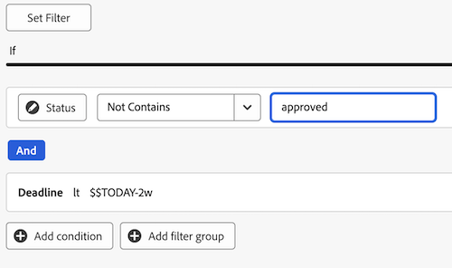

# 创建用于审阅和审批的报告仪表板

您可以在“画布功能板”区域中创建报告功能板，以显示有关具有统一审批功能的审阅和审批的高级信息和详细信息。

>[!IMPORTANT]
>
>此功能仅适用于使用统一审批服务并注册了画布功能板测试版的客户。 有关详细信息，请参阅[画布功能板测试版信息](/help/quicksilver/product-announcements/betas/canvas-dashboards-beta/canvas-dashboards-beta-information.md)。

## 创建功能板

{{step1-to-dashboards}}

1. 在左侧面板中，单击&#x200B;**画布功能板**。
1. 单击&#x200B;**新仪表板**。
1. 命名您的仪表板。
1. （可选）添加说明。
1. 单击&#x200B;**创建**。
   

创建功能板后，即可开始添加KPI、图表和表格。 有关更多信息，请参阅以下部分：

* [使用KPI和图表添加高级审阅和批准信息](#add-high-level-review-and-approval-information-with-kpis-and-charts)
* [使用表格添加详细的审阅和批准信息](#add-detailed-review-and-approval-information-with-tables)

## 使用KPI和图表添加高级审阅和批准信息

您可以通过KPI和图表查看有关文档审批的高级信息。

有关详细信息，请参阅[生成KPI报告](/help/quicksilver/reports-and-dashboards/canvas-dashboards/add-reports/build-kpi-report.md)和[生成图表报告](/help/quicksilver/reports-and-dashboards/canvas-dashboards/add-reports/build-chart-report.md)。

### KPI

#### 待处理审批

1. [创建仪表板](#create-a-dashboard)，如上节所述。
1. 在仪表板详细信息页面的右上角，单击&#x200B;**添加报告**。

1. 在&#x200B;**添加报告**&#x200B;框中，选择&#x200B;**创建报告**。

1. 在左侧，选择&#x200B;**KPI**。

1. 单击右上角的&#x200B;**创建报告**。

1. 按照以下步骤配置&#x200B;**详细信息**&#x200B;部分：

   1. 在&#x200B;*名称*&#x200B;字段中键入&#x200B;**Pending**。
   1. 在&#x200B;*描述*&#x200B;字段中键入&#x200B;**待处理审批**。 这会在KPI值下方显示为描述。

1. 按照以下步骤配置&#x200B;**生成KPI**&#x200B;部分：

   1. 在左侧面板中，单击&#x200B;**生成KPI** 。

   1. 单击&#x200B;**选择字段**。

   1. 找到并选择&#x200B;**文档审批**&#x200B;文件夹。

   1. 选择&#x200B;**状态**。

   1. 在&#x200B;**聚合类型**&#x200B;下拉列表中，选择&#x200B;**计数**。

1. 按照以下步骤配置&#x200B;**筛选器**&#x200B;部分：

   1. 在左侧面板中，单击&#x200B;**筛选器** 图标。

   1. 选择&#x200B;**编辑筛选器**。

   1. 单击&#x200B;**添加条件**。

   1. 单击进入空条件筛选器，单击&#x200B;**选择字段**，然后选择&#x200B;**状态**。
   1. 将运算符保留为&#x200B;**Equal**，然后在文本框中键入&#x200B;_等待审阅_。

      
1. 单击屏幕右上角的&#x200B;**保存**。

#### 逾期审批

1. [创建仪表板](#create-a-dashboard)，如上节所述。
1. 在仪表板详细信息页面的右上角，单击&#x200B;**添加报告**。

1. 在&#x200B;**添加报告**&#x200B;框中，选择&#x200B;**创建报告**。

1. 在左侧，选择&#x200B;**KPI**。

1. 单击右上角的&#x200B;**创建报告**。

1. 按照以下步骤配置&#x200B;**详细信息**&#x200B;部分：

   1. 在&#x200B;_名称_&#x200B;字段中键入&#x200B;**过期**。
   1. 在&#x200B;_Description_&#x200B;字段中键入&#x200B;**过去**&#x200B;内的审批阶段截止日期。 此描述在KPI值下方显示为描述。

1. 按照以下步骤配置&#x200B;**生成KPI**&#x200B;部分：

   1. 在左侧面板中，单击&#x200B;**生成KPI** 。

   1. 单击&#x200B;**选择字段**。

   1. 找到并选择&#x200B;**文档审批**&#x200B;文件夹。

   1. 选择&#x200B;**状态**。

   1. 在&#x200B;**聚合类型**&#x200B;下拉列表中，选择&#x200B;**计数**。

1. 按照以下步骤配置&#x200B;**筛选器**&#x200B;部分：

   1. 在左侧面板中，单击&#x200B;**筛选器** 图标。

   1. 选择&#x200B;**编辑筛选器**。

   1. 单击&#x200B;**添加条件**。

   1. 单击空条件筛选器，然后单击&#x200B;**选取字段**。

   1. 选择&#x200B;**审批阶段** > **截止日期**。
   1. 将运算符更改为&#x200B;**小于**。
   1. 将&#x200B;**将相对日期**&#x200B;设置为&#x200B;**ON**，然后在文本框中键入&#x200B;_$$TODAY_。

      
   1. 单击&#x200B;**添加条件**。
   1. 单击空条件筛选器，然后单击&#x200B;**选取字段**。
   1. 选择&#x200B;**状态**。
   1. 将运算符更改为&#x200B;**Not Contains**，然后在文本框中键入&#x200B;_approved_。

      
1. 单击屏幕右上角的&#x200B;**保存**。

#### 已完成的审批

1. [创建仪表板](#create-a-dashboard)，如上节所述。
1. 在仪表板详细信息页面的右上角，单击&#x200B;**添加报告**。

1. 在&#x200B;**添加报告**&#x200B;框中，选择&#x200B;**创建报告**。

1. 在左侧，选择&#x200B;**KPI**。

1. 单击右上角的&#x200B;**创建报告**。

1. 按照以下步骤配置&#x200B;**详细信息**&#x200B;部分：

   1. 在&#x200B;_名称_&#x200B;字段中键入&#x200B;**Completed**。
   1. 在&#x200B;_描述_&#x200B;字段中键入&#x200B;**审批状态计数**。 此描述在KPI值下方显示为描述。

1. 按照以下步骤配置&#x200B;**生成KPI**&#x200B;部分：

   1. 在左侧面板中，单击&#x200B;**生成KPI** 。

   1. 单击&#x200B;**选择字段**。

   1. 找到并选择&#x200B;**文档审批**&#x200B;文件夹。

   1. 选择&#x200B;**状态**。

   1. 在&#x200B;**聚合类型**&#x200B;下拉列表中，选择&#x200B;**计数**。

1. 按照以下步骤配置&#x200B;**筛选器**&#x200B;部分：

   1. 在左侧面板中，单击&#x200B;**筛选器** 图标。

   1. 选择&#x200B;**编辑筛选器**。

   1. 单击&#x200B;**添加条件**。

   1. 单击空条件筛选器，然后单击&#x200B;**选取字段**。

   1. 选择&#x200B;**状态**。

   1. 将运算符更改为&#x200B;**包含**，并在文本框中键入&#x200B;_approved_。

      
   1. 单击&#x200B;**添加条件**。
   1. 单击&#x200B;**和**&#x200B;将其更改为&#x200B;**或**。
   1. 单击空条件筛选器，然后单击&#x200B;**选取字段**。
   1. 选择&#x200B;**状态**。
   1. 将运算符更改为&#x200B;**等于**，然后在文本框中键入&#x200B;_review_。

      
1. 单击屏幕右上角的&#x200B;**保存**。

#### 放弃的审批

1. [创建仪表板](#create-a-dashboard)，如上节所述。
1. 在仪表板详细信息页面的右上角，单击&#x200B;**添加报告**。

1. 在&#x200B;**添加报告**&#x200B;框中，选择&#x200B;**创建报告**。

1. 在左侧，选择&#x200B;**KPI**。

1. 单击右上角的&#x200B;**创建报告**。

1. 按照以下步骤配置&#x200B;**详细信息**&#x200B;部分：

   1. 在&#x200B;_Name_&#x200B;字段中键入&#x200B;**Abandoned**。
   1. 在&#x200B;_描述_&#x200B;字段中键入&#x200B;**审批截止日期超过2周**。 此描述在KPI值下方显示为描述。

1. 按照以下步骤配置&#x200B;**生成KPI**&#x200B;部分：

   1. 在左侧面板中，单击&#x200B;**生成KPI** 。

   1. 单击&#x200B;**选择字段**。

   1. 找到并选择&#x200B;**文档审批阶段**&#x200B;文件夹。

   1. 选择&#x200B;**截止日期**。

   1. 在&#x200B;**聚合类型**&#x200B;下拉列表中，选择&#x200B;**计数**。

1. 按照以下步骤配置&#x200B;**筛选器**&#x200B;部分：

   1. 在左侧面板中，单击&#x200B;**筛选器** 图标。

   1. 选择&#x200B;**编辑筛选器**。

   1. 单击&#x200B;**添加条件**。

   1. 单击空条件筛选器，单击&#x200B;**选取字段**。

   1. 选择&#x200B;**状态**。

   1. 将运算符更改为&#x200B;**Not Contains**，并在文本框中键入&#x200B;_approved_。

      
   1. 单击&#x200B;**添加条件**。
   1. 单击空条件筛选器，然后单击&#x200B;**选取字段**。
   1. 选择&#x200B;**截止日期**。
   1. 将运算符更改为&#x200B;**小于**，然后将&#x200B;**将相对日期**&#x200B;设置为&#x200B;**ON**。
   1. 在文本框中键入&#x200B;_$$TODAY-2w_。

      
1. 单击屏幕右上角的&#x200B;**保存**。

### 图表

#### 按决策条形图显示的审批

1. [创建仪表板](#create-a-dashboard)，如上节所述。
1. 在仪表板详细信息页面的右上角，单击&#x200B;**添加报告**。

1. 在&#x200B;**添加报告**&#x200B;框中，选择&#x200B;**创建报告**。

1. 在左侧，选择&#x200B;**图表**。

1. 单击右上角的&#x200B;**创建报告**。

1. 按照以下步骤配置&#x200B;**详细信息**&#x200B;部分：

   1. 在&#x200B;_名称_&#x200B;字段中键入&#x200B;**Approvals by decision**。
   1. （可选）在&#x200B;**描述**&#x200B;字段中键入描述。 此文本将作为工具提示显示在图表名称旁边。
1. 按照以下步骤配置&#x200B;**生成图表**&#x200B;部分：

   1. 在左侧面板中，单击&#x200B;**生成图表** 图标。

   1. 在&#x200B;**图表类型**&#x200B;下拉菜单中，保留&#x200B;**条形**&#x200B;处于选中状态。
   1. 在&#x200B;**栏类型**&#x200B;下拉菜单中，保留&#x200B;**简单**&#x200B;选项。
   1. 单击&#x200B;**底部(X)轴**&#x200B;的&#x200B;**更新字段**，然后选择&#x200B;**文档审批** > **状态**。
   1. 将&#x200B;**聚合类型**&#x200B;设置为&#x200B;**计数**。
   1. 单击&#x200B;**左(Y)轴**&#x200B;的&#x200B;**更新字段**，然后选择&#x200B;**状态**。
1. 按照以下步骤配置&#x200B;**筛选器**&#x200B;部分：
   1. 在左侧面板中，单击&#x200B;**筛选器** 图标。
   1. 单击&#x200B;**编辑筛选器**，然后单击&#x200B;**添加条件**。
   1. 单击空条件筛选器，然后单击&#x200B;**选取字段**。
   1. 选择&#x200B;**文档版本** > **版本**。
   1. 将运算符更改为&#x200B;**Is Not Null**。

      
1. 单击屏幕右上角的&#x200B;**保存**。

#### 修订条状图

1. [创建仪表板](#create-a-dashboard)，如上节所述。
1. 在仪表板详细信息页面的右上角，单击&#x200B;**添加报告**。

1. 在&#x200B;**添加报告**&#x200B;框中，选择&#x200B;**创建报告**。

1. 在左侧，选择&#x200B;**图表**。

1. 单击右上角的&#x200B;**创建报告**。

1. 按照以下步骤配置&#x200B;**详细信息**&#x200B;部分：

   1. 在&#x200B;_名称_&#x200B;字段中键入&#x200B;**修订版**。
   1. 在&#x200B;_Description_&#x200B;字段中键入&#x200B;**本月底之前计划的决策不完整的文档修订数**。 此文本将作为工具提示显示在图表名称旁边。

1. 按照以下步骤配置&#x200B;**生成图表**&#x200B;部分：

   1. 在左侧面板中，单击&#x200B;**生成图表** 图标。

   1. 在&#x200B;**图表类型**&#x200B;下拉菜单中，保留&#x200B;**条形**&#x200B;处于选中状态。
   1. 在&#x200B;**栏类型**&#x200B;下拉菜单中，保留&#x200B;**简单**&#x200B;选项。
   1. 单击&#x200B;**底部(X)轴**&#x200B;的&#x200B;**更新字段**，然后选择&#x200B;**文档审批** > **文档版本** > **版本**。
   1. 将&#x200B;**聚合类型**&#x200B;设置为&#x200B;**计数**。
   1. 单击&#x200B;**左(Y)轴**&#x200B;的&#x200B;**更新字段**，然后选择&#x200B;**文档审批** > **文档版本** > **文档** > **名称**。

1. 按照以下步骤配置&#x200B;**筛选器**&#x200B;部分：
   1. 在左侧面板中，单击&#x200B;**筛选器** 图标。
   1. 单击&#x200B;**编辑筛选器**，然后单击&#x200B;**添加条件**。
   1. 单击空条件筛选器，然后单击&#x200B;**选取字段**。

   1. 选择&#x200B;**审批阶段** > **审批阶段参与者** > **决策日期**。

   1. 将运算符更改为&#x200B;**Is Null**。

      
   1. 单击&#x200B;**添加条件**。
   1. 单击空条件筛选器，然后单击&#x200B;**选取字段**。
   1. 选择&#x200B;**审批阶段** > **截止日期**。
   1. 将运算符更改为&#x200B;**小于或等于**，然后将&#x200B;**将相对日期**&#x200B;设置为&#x200B;**ON**。
   1. 在文本框中键入&#x200B;_$$TODAYem_。

      
1. 单击屏幕右上角的&#x200B;**保存**。

## 使用表格添加详细的审阅和批准信息

有关生成表报告的详细信息，请参阅[生成表报告](/help/quicksilver/reports-and-dashboards/canvas-dashboards/add-reports/build-table-report.md)。

### 待处理审批列表

1. [创建仪表板](#create-a-dashboard)，如上节所述。
1. 在仪表板详细信息页面的右上角，单击&#x200B;**添加报告**。

1. 在&#x200B;**添加报告**&#x200B;框中，选择&#x200B;**创建报告**。

1. 在左侧，选择&#x200B;**表**。

1. 单击右上角的&#x200B;**创建报告**。

1. 按照以下步骤配置&#x200B;**详细信息**&#x200B;部分：

   1. 在&#x200B;_名称_&#x200B;字段中键入&#x200B;**待处理审批**。
   1. 在&#x200B;**描述**&#x200B;字段中键入描述。 此文本将作为工具提示显示在图表名称旁边。

1. 按照以下步骤配置&#x200B;**生成表**&#x200B;部分：

   1. 在左侧面板中，单击&#x200B;**表列** 图标。
   1. 单击&#x200B;**添加列**。
   1. 向下滚动并选择&#x200B;**文档审批** > **状态**。
   1. 添加以下列：

   <table>
    <tr>
    <td><strong>项目名称</strong></td>
    <td>文档版本&gt;文档&gt;项目&gt;名称</td>
    </tr>
    <tr>
    <td><strong>文档名称</strong></td>
    <td>文档版本&gt;文档&gt;在搜索框中键入<em>名称</em>。</td>
    </tr>
    <tr>
    <td><strong>文档版本</strong></td>
    <td>文档版本&gt;文档&gt;版本</td>
    </tr>
    <tr>
    <td><strong>截止日期</strong></td>
    <td>文档审批&gt;审批阶段&gt;截止日期</td>
    </tr>
    <tr>
    <td><strong>请求者</strong></td>
    <td>文档审批&gt;审批阶段&gt;审批阶段参与者* &gt;请求者&gt;在搜索框中键入<em>名称</em>。</td>
    </tr>
    <tr>
    <td><strong>请求的日期</strong></td>
    <td>文档审批&gt;审批阶段&gt;审批阶段参与者* &gt;创建于</td>
    </tr>
    <tr>
    <td><strong>审批者</strong></td>
    <td>文档审批&gt;审批阶段&gt;审批阶段参与者* &gt;参与者用户&gt;在搜索框中键入<em>名称</em>。</td>
    </tr>
    </table>

   *批准阶段参与者被截断为&#x200B;_批准阶段pa.._

1. 按照以下步骤配置&#x200B;**筛选器**&#x200B;部分：
   1. 在左侧面板中，单击&#x200B;**筛选器** 图标。
   1. 单击&#x200B;**编辑筛选器**，然后单击&#x200B;**添加条件**。
   1. 单击空条件筛选器，然后单击&#x200B;**选取字段**。
   1. 选择&#x200B;**状态**。
   1. 将运算符更改为&#x200B;**等于**，然后在文本框中键入&#x200B;_未决批准_。

      
   1. （可选）按照以下&#x200B;**可选筛选器**&#x200B;部分中的说明添加其他筛选器。
1. 单击屏幕右上角的&#x200B;**保存**。

**可选筛选器**

要根据您的用例查看更多具体信息，您可以添加其他筛选条件。 您可能需要重新创建表并根据用例添加新的筛选条件。

+++ 展开以查看其他筛选器选项

**我的项目**

1. 单击&#x200B;**编辑筛选器** > **添加条件**：
   1. 单击空条件筛选器，然后单击&#x200B;**选取字段**。
   1. 选择&#x200B;**文档版本** > **文档** > **项目** > **所有者** >在搜索框中键入&#x200B;_名称_。
   1. 将运算符更改为&#x200B;**等于**，然后选择&#x200B;**我（已登录的用户）**&#x200B;以在Workfront中显示您标记为项目所有者的项目。

      
1. 单击屏幕右上角的&#x200B;**保存**。

**我已提交的审批**

1. 单击&#x200B;**编辑筛选器** > **添加条件**：
   1. 单击空条件筛选器，单击&#x200B;**选取字段**。
   1. 选择&#x200B;**审批阶段** > **审批阶段参与者** > **请求者** >在搜索框中键入&#x200B;_名称_。
   1. 将运算符更改为&#x200B;**等于**，然后选择&#x200B;**我（已登录的用户）**&#x200B;以在Workfront中显示您标记为项目所有者的项目。

      
1. 单击屏幕右上角的&#x200B;**保存**。

+++

### 逾期审批列表

1. [创建仪表板](#create-a-dashboard)，如上节所述。

1. 在仪表板详细信息页面的右上角，单击&#x200B;**添加报告**。

1. 在&#x200B;**添加报告**&#x200B;框中，选择&#x200B;**创建报告**。

1. 在左侧，选择&#x200B;**表**。

1. 单击右上角的&#x200B;**创建报告**。

1. 按照以下步骤配置&#x200B;**详细信息**&#x200B;部分：

   1. 在&#x200B;_名称_&#x200B;字段中键入&#x200B;**过期审批**。
   1. （可选）在&#x200B;**描述**&#x200B;字段中键入描述。 此文本将作为工具提示显示在图表名称旁边。

1. 按照以下步骤配置&#x200B;**生成表**&#x200B;部分：

   1. 在左侧面板中，单击&#x200B;**表列** 图标。
   1. 单击&#x200B;**添加列**。
   1. 向下滚动并选择&#x200B;**文档审批** > **状态**。
   1. 添加以下列：

      <table>
        <tr>
        <td><strong>项目名称</strong></td>
        <td>文档版本&gt;文档&gt;项目&gt;名称</td>
        </tr>
        <tr>
        <td><strong>文档名称</strong></td>
        <td>文档版本&gt;文档&gt;在搜索框中键入<em>名称</em>。</td>
        </tr>
        <tr>
        <td><strong>文档版本</strong></td>
        <td>文档版本&gt;文档&gt;版本</td>
        </tr>
        <tr>
        <td><strong>截止日期</strong></td>
        <td>文档&gt;审批阶段&gt;截止日期</td>
        </tr>
        <tr>
        <td><strong>请求者</strong></td>
        <td>文档&gt;审批阶段&gt;审批阶段参与者* &gt;请求者&gt;在搜索框中键入<em>名称</em>。</td>
        </tr>
        <tr>
        <td><strong>请求的日期</strong></td>
        <td>文档&gt;审批阶段&gt;审批阶段参与者* &gt;创建于</td>
        </tr>
        <tr>
        <td><strong>审批者</strong></td>
        <td>文档&gt;审批阶段&gt;审批阶段参与者* &gt;参与者用户&gt;在搜索框中键入<em>名称</em>。</td>
        </tr>
        </table>

      *批准阶段参与者被截断为&#x200B;_批准阶段pa.._

1. 按照以下步骤配置&#x200B;**筛选器**&#x200B;部分：
   1. 在左侧面板中，单击&#x200B;**筛选器** 图标。
   1. 单击&#x200B;**编辑筛选器**，然后单击&#x200B;**添加条件**。
   1. 单击空条件筛选器，然后单击&#x200B;**选取字段**。
   1. 选择&#x200B;**审批阶段** > **截止日期**。
   1. 将运算符更改为&#x200B;**小于**，然后将&#x200B;**将相对日期**&#x200B;设置为&#x200B;**ON**。
   1. 在文本字段中键入&#x200B;_$$TODAY_。

      
   1. （可选）按照以下&#x200B;**可选筛选器**&#x200B;部分中的说明添加其他筛选器。
1. 单击屏幕右上角的&#x200B;**保存**。

**可选筛选器**

要根据您的用例查看更多具体信息，您可以添加其他筛选条件。 您可能需要重新创建该表，并根据用例添加新的可选筛选条件。

+++ 展开以查看其他筛选器选项

**我的项目**

1. 单击&#x200B;**编辑筛选器** > **添加条件**：
   1. 单击空条件筛选器，单击&#x200B;**选取字段**。
   1. 选择&#x200B;**文档版本** > **文档** > **项目** > **所有者** >在搜索框中键入&#x200B;_名称_。
   1. 将运算符更改为&#x200B;**等于**，然后选择&#x200B;**我（已登录的用户）**&#x200B;以在Workfront中显示您标记为项目所有者的项目。

      
1. 单击屏幕右上角的&#x200B;**保存**。

**我已提交的审批**

1. 单击&#x200B;**编辑筛选器** > **添加条件**：
   1. 单击空条件筛选器，单击&#x200B;**选取字段**。
   1. 选择&#x200B;**审批阶段** > **审批阶段参与者** > **请求者** >在搜索框中键入&#x200B;_名称_。
   1. 将运算符更改为&#x200B;**等于**，然后选择&#x200B;**我（已登录的用户）**&#x200B;以在Workfront中显示您标记为项目所有者的项目。

      
1. 单击屏幕右上角的&#x200B;**保存**。

**我的团队**

1. 单击&#x200B;**编辑筛选器** > **添加条件**：
   1. 单击空条件筛选器，单击&#x200B;**选取字段**。
   1. 选择&#x200B;**审批阶段** > **审批阶段参与者** > **参与者团队** >在搜索框中键入&#x200B;_名称_。
   1. 将运算符更改为&#x200B;**等于**，然后选择&#x200B;**我的默认团队（登录用户）**&#x200B;或&#x200B;**我的其他团队（登录用户）**&#x200B;以显示分配给您的默认团队或您所在的其他团队的项目。

      
1. 单击屏幕右上角的&#x200B;**保存**。
+++
