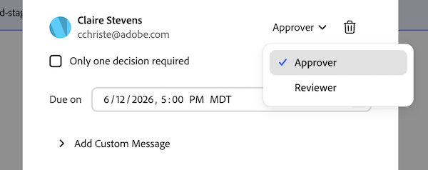

# 向文档审批工作流中添加其他审批人或审阅人

您可以将附加批准者或审阅者添加到已具有待审批的文档审批工作流。

>[!IMPORTANT]
>
>本文内容介绍更新的文档审批功能，该功能仅适用于特定帐户。 有关标准审批流程的信息，请参阅[工作审批](/help/quicksilver/review-and-approve-work/manage-approvals/manage-approvals.md)中列出的文章。

## 访问权限要求

+++ 展开可查看本文所述功能的访问权限要求。

<table style="table-layout:auto"> 
 <tbody> 
  <tr> 
   <td role="rowheader">Adobe Workfront 包</td> 
   <td> 
使用旧版Workfront存储管理审批的任何Workfront软件包

任何使用Adobe云存储管理审批的工作流包
 </td> 
  </tr> 
  <tr> 
   <td role="rowheader">Adobe Workfront许可证</td> 
   <td>
   
参与者或更高版本

   
审核或更高
 
   
如果您使用的是Frame.io集成，则必须具有Standard许可证才能创建批准工作流。

   </td> 
  </tr> 
  <tr> 
   <td role="rowheader">访问级别配置</td> 
   <td> 
查看或更高权限的项目、任务、问题、模板、项目组合、程序、报告、功能板、日历和文档
</td> 
  </tr> 
  <tr> 
   <td role="rowheader">对象权限</td> 
   <td> 
查看或更高权限访问与请求访问权限或审批关联的对象 
</td> 
  </tr> 
 </tbody> 
</table>

有关信息，请参阅Workfront文档中的[访问要求](/help/quicksilver/administration-and-setup/add-users/access-levels-and-object-permissions/access-level-requirements-in-documentation.md)。

+++

<!--
## Add additional approvers or reviewers in the legacy documents area in Production

If your organization is on Workfront storage, you will see the legacy documents area when you access documents in Workfront. For more information about Workfront storage, see [Differences between Adobe cloud storage and legacy Workfront storage](/help/quicksilver/review-and-approve-work/esm-overview.md#differences-between-adobe-cloud-storage-and-legacy-workfront-storage).

To add additional approvers or reviewers from the Document Summary:

1. Go to the project, task, or issue that contains the document, then select **Documents** in the left panel.

1. Click on the document you need and the Document Summary panel for that document will open.

1. Select the version of the document you would like to add an approver or reviewer to in the version drop-down menu. The latest version is selected by default.

1. Scroll down to the **Approvals** section, then click **Edit workflow**.

   

1. Locate the stage you would like to add approvers or reviewers to, then add the user's name or email in the text box. You can also add an entire team if needed. 

1. Once their name is added, choose if they are an approver or reviewer. 

   

1. Repeat steps 5-6 to add additional approvers or reviewers.
 Once you save, the participants added receive an email notification that their approval or review is needed on the document.
-->

## 在旧文档区域中添加其他批准者或审阅者

如果您的组织位于Workfront存储中，则当您访问Workfront中的文档时，将会看到旧版文档区域。 有关Workfront存储的更多信息，请参阅[Adobe云存储与旧版Workfront存储之间的区别](/help/quicksilver/review-and-approve-work/esm-overview.md#differences-between-adobe-cloud-storage-and-legacy-workfront-storage)。

要从“文档摘要”添加其他批准者或审阅者，请执行以下操作：

1. 转到包含文档的项目、任务或问题，然后在左侧面板中选择&#x200B;**文档**。

1. 单击所需的文档。 随即会打开该文档的“文档摘要”面板。

1. 在版本下拉菜单中选择要向其中添加审批人或审阅人的文档的版本。 默认情况下会选择最新版本。

1. 向下滚动到&#x200B;**审批**&#x200B;部分，然后单击&#x200B;**编辑工作流**。 请求审批对话框会以上次保存审批的模式打开：基本模式用于单阶段审批，或高级模式用于具有并行路径的多阶段审批和审批。

1. 添加用户、团队或电子邮件：

   * 在基本模式下，在&#x200B;**添加名称或电子邮件**&#x200B;字段中键入名称或电子邮件。
   * 在“高级”模式下，选择包含要更新的阶段的路径，然后在阶段的&#x200B;**添加名称或电子邮件**&#x200B;字段中键入名称或电子邮件。

1. 对于您添加的每个人，选择他们是要审批者，还是审阅者。

   

1. 单击&#x200B;**保存**。 您添加的参与者会收到一封电子邮件通知，告知文档需要其批准或审阅。

>[!TIP]
>
>要将基本模式批准重构为多阶段或多路径批准，请单击右上角的&#x200B;**转至高级**。 您的现有参与者将保留为路径1，阶段1。 保存后，无法切换回基本模式。 有关详细信息，请参阅[创建文档审批工作流](/help/quicksilver/review-and-approve-work/document-reviews-and-approvals/manage-document-approvals/create-a-document-approval.md)。

<!--
## Add additional approvers or reviewers in the new Documents area in Production

If your organization uses Adobe cloud storage, you will see the new Documents area when you access documents in Workfront. For more information about Adobe cloud storage, see [Adobe cloud storage overview](/help/quicksilver/review-and-approve-work/esm-overview.md).

1. Go to the project, task, or issue that contains the document, then select **Documents** in the left panel.

1. Click on the document, then click the **Approvals** icon on the right side of the page. 

   

1. Click **Edit workflow**.

1. Locate the stage you would like to add approvers or reviewers to, then add the user's name or email in the text box. You can also add an entire team if needed. 

1. Once their name is added, choose if they are an approver or reviewer. 

   

1. Repeat steps 5-6 to add additional approvers or reviewers.
 Once you save, the participants added receive an email notification that their approval or review is needed on the document.
-->

## 在新建文档区域的“文档摘要”中添加其他批准者或审阅者

如果您的组织使用Adobe云存储，则在访问Workfront中的文档时，您将看到新的文档区域。 有关Adobe云存储的更多信息，请参阅[Adobe云存储概述](/help/quicksilver/review-and-approve-work/esm-overview.md)。

要从“文档摘要”添加其他批准者或审阅者，请执行以下操作：

1. 转到包含文档的项目、任务或问题，然后在左侧面板中选择&#x200B;**文档**。

1. 单击文档，然后单击页面右侧的&#x200B;**审批**&#x200B;图标。

   

1. 单击&#x200B;**编辑工作流**。 请求审批对话框会以上次保存审批的模式打开：基本模式用于单阶段审批，或高级模式用于具有并行路径的多阶段审批和审批。

1. 添加用户、团队或电子邮件：

   * 在基本模式下，在&#x200B;**添加名称或电子邮件**&#x200B;字段中键入名称或电子邮件。
   * 在“高级”模式下，选择包含要更新的阶段的路径，然后在阶段的&#x200B;**添加名称或电子邮件**&#x200B;字段中键入名称或电子邮件。

1. 对于您添加的每个人，选择他们是要审批者，还是审阅者。

   

1. 单击&#x200B;**保存**。 您添加的参与者会收到一封电子邮件通知，告知文档需要其批准或审阅。

>[!TIP]
>
>要将基本模式批准重构为多阶段或多路径批准，请单击右上角的&#x200B;**转至高级**。 您的现有参与者将保留为路径1，阶段1。 保存后，无法切换回基本模式。 有关详细信息，请参阅[创建文档审批工作流](/help/quicksilver/review-and-approve-work/document-reviews-and-approvals/manage-document-approvals/create-a-document-approval.md)。
