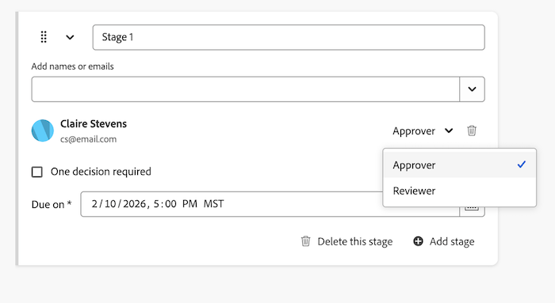

# 向文档审批工作流中添加其他审批人或审阅人

此页面上高亮显示的信息引用了尚未公开的功能。 它仅在“预览Sandbox”环境中可用。

您可以将附加批准者或审阅者添加到已具有待审批的文档审批工作流。

>[!IMPORTANT]
>
>本文内容介绍更新的文档审批功能，该功能仅适用于特定帐户。 有关标准审批流程的信息，请参阅[工作审批](/help/quicksilver/review-and-approve-work/manage-approvals/manage-approvals.md)中列出的文章。

## 访问权限要求

+++ 展开可查看本文所述功能的访问权限要求。

<table style="table-layout:auto"> 
 <tbody> 
  <tr> 
   <td role="rowheader">Adobe Workfront 包</td> 
   <td> 
“任一”
 </td> 
  </tr> 
  <tr> 
   <td role="rowheader">Adobe Workfront许可证</td> 
   <td>
   
参与者或更高版本

   
审核或更高
 
   
如果您使用的是Frame.io集成，则必须具有Standard许可证才能创建批准工作流。

   </td> 
  </tr> 
  <tr> 
   <td role="rowheader">访问级别配置</td> 
   <td> 
查看或更高权限的项目、任务、问题、模板、项目组合、程序、报告、功能板、日历和文档
</td> 
  </tr> 
  <tr> 
   <td role="rowheader">对象权限</td> 
   <td> 
查看或更高权限访问与请求访问权限或审批关联的对象 
</td> 
  </tr> 
 </tbody> 
</table>

有关信息，请参阅Workfront文档中的[访问要求](/help/quicksilver/administration-and-setup/add-users/access-levels-and-object-permissions/access-level-requirements-in-documentation.md)。

+++

## 从生产环境中的“文档详细信息”页面添加其他批准者或审阅者

1. 通过单击文档名称转到文档页面，然后在版本下拉菜单中选择要向其中添加审批者或审阅者的文档版本。 默认情况下会选择最新版本。

1. 在左侧面板中选择&#x200B;**审批**。 此处列出了所有现有批准者和审阅者。

1. 要添加审批者，请确保选中&#x200B;**审批者**&#x200B;复选框，然后开始在&#x200B;**审阅者**&#x200B;文本框中键入。 您可以按名称添加Workfront用户或团队。 如果要添加审阅者，只需在键入之前取消选中&#x200B;**审批者**&#x200B;复选框。

1. 重复上一步骤以添加其他批准者或审阅者。

## 从生产环境中的“文档摘要”添加其他批准者或审阅者

1. 转到包含文档的项目、任务或问题，然后选择&#x200B;**文档**。

1. 单击所需的文档，此时将打开“文档摘要”面板。

1. 在版本下拉菜单中选择要向其中添加审批人或审阅人的文档的版本。 默认情况下会选择最新版本。

1. 向下滚动到“文档摘要”面板中的&#x200B;**审批**&#x200B;部分，其中列出了所有现有审批者和审阅者。 要添加审批者，请确保选中&#x200B;**审批者**&#x200B;复选框，然后开始在&#x200B;**审阅者**&#x200B;文本框中键入。 您可以按名称添加Workfront用户或团队。 如果要添加审阅者，只需在键入之前取消选中&#x200B;**审批者**&#x200B;复选框。

1. 重复上一步骤以添加其他批准者或审阅者。

## 在旧文档区域的预览环境中，从“文档摘要”添加其他批准者或审阅者

如果您的组织位于Workfront存储中，则当您访问Workfront中的文档时，将会看到旧版文档区域。 有关Workfront存储的详细信息，请参阅[Workfront存储与Adobe企业存储](/help/quicksilver/review-and-approve-work/esm-overview.md#workfront-storage-vs-adobe-enterprise-storage)。

要从“文档摘要”添加其他批准者或审阅者，请执行以下操作：

1. 转到包含文档的项目、任务或问题，然后在左侧面板中选择&#x200B;**文档**。

1. 单击所需的文档，此时将打开该文档的“文档摘要”面板。

1. 在版本下拉菜单中选择要向其中添加审批人或审阅人的文档的版本。 默认情况下会选择最新版本。

1. 向下滚动到&#x200B;**审批**&#x200B;部分，然后单击&#x200B;**编辑工作流**。

   

1. 找到您要向其中添加批准者或审阅者的阶段，然后在文本框中添加用户名或电子邮件。 如果需要，您还可以添加整个团队。

1. 添加其名称后，选择他们是批准者还是审阅者。

   

1. 重复步骤5至6以添加其他批准者或审阅者。
保存后，添加的参与者会收到电子邮件通知，告知文档需要其批准或审阅。

## 在新建文档区域的“文档摘要”中添加其他批准者或审阅者

如果您的组织使用企业存储，则当您访问Workfront中的文档时，将会看到“新建文档”区域。 有关企业存储的详细信息，请参阅[企业存储概述](/help/quicksilver/review-and-approve-work/esm-overview.md)。

1. 转到包含文档的项目、任务或问题，然后在左侧面板中选择&#x200B;**文档**。

1. 单击文档，然后单击页面右侧的&#x200B;**审批**&#x200B;图标。

   

1. 单击&#x200B;**编辑工作流**。

1. 找到您要向其中添加批准者或审阅者的阶段，然后在文本框中添加用户名或电子邮件。 如果需要，您还可以添加整个团队。

1. 添加其名称后，选择他们是批准者还是审阅者。

   

1. 重复步骤5至6以添加其他批准者或审阅者。
保存后，添加的参与者会收到电子邮件通知，告知文档需要其批准或审阅。

<!--
## Add additional approvers or reviewers from Home

1. Click the **Home** icon  in the upper-left corner of Adobe Workfront.

   >[!NOTE]
   >
   >Your Workfront administrator might make the following changes to the Home icon in your environment:
   >
   >* Replace it with an image customized to illustrate your organization. In this case, the icon will look different that shown in this article. 
   >* Replace the page linked to it with a different page. In this case, click the **Main Menu**  in the upper-right corner of the page, then click **Home**.

1. In the **Work List** area, Go to the **Approvals I've Submitted** grouping.

1. Select a **Document** approval.  

1. Click **Manage Approvals**&nbsp;in the upper-right corner of the right panel.
1. In the **Have someone approve this document** box, type the name of the approver.

   If your Adobe Workfront administrator has enabled the capability to collaborate with people who don't use Workfront, as described in [Configure system security preferences](../../administration-and-setup/manage-workfront/security/configure-security-preferences.md), you can type their email addresses to include them.

1. Click **Save**.
-->
