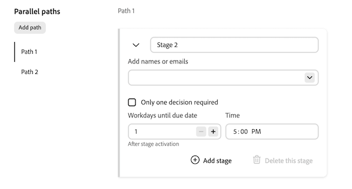

# 为文档创建审批工作流模板

在Workfront设置区域中，具有Standard许可证的用户可以创建可重复使用的审批模板。 创建后，审批模板可应用于对象文档区域中的资产。
>[!IMPORTANT]
>
>本文内容介绍更新的文档审批功能，该功能仅适用于特定帐户。 有关标准审批流程的信息，请参阅[工作审批](/help/quicksilver/review-and-approve-work/manage-approvals/manage-approvals.md)中列出的文章。

## 访问权限要求

+++ 展开可查看本文所述功能的访问权限要求。

<table style="table-layout:auto"> 
 <col> 
 <col> 
 <tbody> 
  <tr> 
   <td role="rowheader">Adobe Workfront 包</td> 
   <td>
使用旧版Workfront存储管理审批的任何Workfront软件包

任何使用Adobe云存储管理审批的工作流包
 </td> 
  </tr> 
  <tr> 
   <td role="rowheader">Adobe Workfront许可证</td> 
   <td> 
标准
 
   
规划

   </td> 
  </tr> 
 </tbody> 
</table>

有关此表中信息的更多详细信息，请参阅Workfront文档中的[访问要求](/help/quicksilver/administration-and-setup/add-users/access-levels-and-object-permissions/access-level-requirements-in-documentation.md)。

+++

<!--
## Create an Approval Template in Production

{{step-1-to-setup}}

1. In the left panel, click **Review and Approval** > **Approval Templates**.
1. Click **New Template** on the right side of the page. 

1. Fill in the following details:

   <table>
     <tr>
   <td><strong>Template name</strong></td>
   <td>Add a template name. </td>
   </tr>
   <tr>
   <td><strong>Stage name</strong></td>
   <td>Add a stage name. You can change the name to something more descriptive, such as <em>Initial Review</em> or <em>Final Approval</em>.</td>
   </tr>
   <tr>
   <td><strong>Add names or emails</strong></td>
   <td>Begin typing a user or team name to add as an approver or reviewer. If you only have reviewers, they will be notified and have the option to complete the review but no decision will be required or made.</td>
   </tr>
   <tr>
   <td><strong>One decision required (optional)</strong></td>
   <td>The first person who makes a decision completes the stage.</td>
   </tr>
   <tr>
   <td><strong>Workdays until due date</strong></td>
   <td>Choose how many workdays until the approval is due after a stage is activated.</td>
   </tr>
   </table>

1. (Optional) Repeat the previous step to add additional stages as needed.

   >[!NOTE]
   >
   >If you add multiple stages, the approval workflow proceeds in the order the stages are listed. When all required decisions are made, the next stage begins and the previous stage is locked.

   
    
1. Click **Save**.

Once the template is created, it can be applied to documents in the Documents area of an object to begin the formal review and approval process in Workfront.
-->

## 创建审批模板

审批模板对话框始终在高级模式下打开。 模板没有“基本”模式。 在一个模板中最多可以配置30条并行路径，总计最多可配置100个阶段。 每个路径都独立运行，可以包含一个或多个顺序阶段。

要创建审批模板，请执行以下操作：

{{step-1-to-setup}}

1. 在左侧面板中，单击&#x200B;**审阅和批准** > **批准模板**。

1. 单击页面右侧的&#x200B;**新建模板**。

1. 添加&#x200B;**模板名称**。

1. 填写路径1的第1阶段的详细信息：

   <table>
   <tr>
   <td><strong>阶段名称</strong></td>
   <td>默认情况下，阶段名为<em>阶段1</em>、<em>阶段2</em>，依此类推。 将阶段重命名为更具描述性的状态，如<em>初始审阅</em>或<em>最终批准</em>。</td>
   </tr>
   <tr>
   <td><strong>添加姓名或电子邮件（可选）</strong></td>
   <td>开始键入要作为审批者或审阅者添加的用户或团队名称。 在模板中，参与者是可选的。 当模板应用于文档时，可以添加这些模板。
注意：对于同一资源，一次只能将一个打开阶段分配给查看者或审批者。 如果同时打开多个并行阶段，则无法将同一人员添加到多个阶段。
</td>
   </tr>
   <tr>
   <td><strong>只需一个决策（可选）</strong></td>
   <td>第一个做出决策的人将完成阶段。</td>
   </tr>
   <tr>
   <td><strong>截至到期日的工作日（可选）</strong></td>
   <td>选择阶段打开后需要多少个工作日才能完成。 每个路径的第一阶段还支持绝对到期日期。 路径中的每个后续阶段仅支持相对到期日期。</td>
   </tr>
   <tr>
   <td><strong>添加自定义消息（可选）</strong></td>
   <td>在<strong>添加自定义消息</strong>文本框中键入消息。 将模板应用于文档后，该消息会显示在批准电子邮件通知和Workfront的“批准”选项卡中。
添加第二个阶段时，默认情况下会选中<strong>在所有阶段上显示此消息</strong>。 将其保留为选中状态，以便在每个阶段中使用相同的消息。 若要对每个阶段使用不同的消息，请清除<strong>在所有阶段上显示此消息</strong>，然后在每个阶段的<strong>添加自定义消息</strong>文本框中键入特定于阶段的消息。
</td>
   </tr>
   </table>

   

1. （可选）单击&#x200B;**添加阶段**&#x200B;以向路径中添加另一个阶段。 路径中的阶段将按其列出的顺序依次运行。 当一个阶段中所有必需的决策都完成时，该路径中的下一阶段将开始，而上一个阶段将锁定。 您可以对路径中的阶段重新排序，但无法将阶段从一个路径移动到另一个路径。 每个路径可以有不同的阶段数。

1. （可选）在&#x200B;**并行路径**&#x200B;下，单击&#x200B;**添加路径**&#x200B;以添加其他路径。 新路径从一个空阶段开始，成为选定的路径。 无法对路径重新排序。

   

1. （可选）要重命名路径，请将鼠标悬停在路径标签上，单击铅笔图标，然后键入新名称。 要删除路径，请将鼠标悬停在路径标签上并单击垃圾桶图标。 无法删除&#x200B;**路径1**，仅当路径中没有已锁定或已完成的阶段时，才能删除其他路径。

1. （可选）要清除所有路径和阶段并重新开始，请单击右上角的&#x200B;**重置**。

1. 单击&#x200B;**保存**。

创建模板后，可将其应用于对象的“文档”区域中的文档，以在Workfront中开始正式的审阅和批准流程。

<!--
 Once a template is created, it can be applied to assets sent from Frame.io to begin the formal review and approval process in Workfront.

-->
