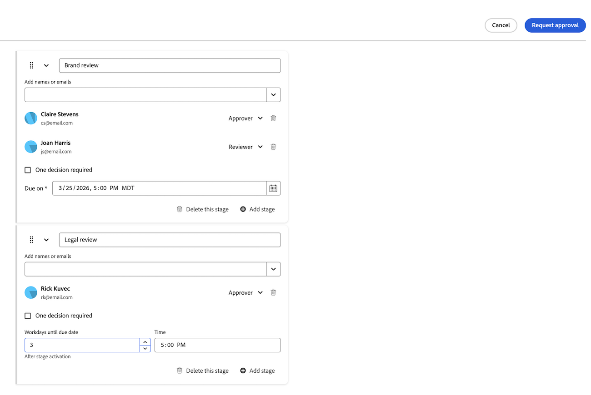

# 上传新文档版本并请求审批

If a document is marked &quot;Needs work&quot; in a previous review, you can upload a new version to the original document and start another round of approvals. Once you upload a new version of the document, the previous versions are locked.

如果新版本的文件名与先前版本的文件名不同，则Workfront显示具有新文件名的文档。

When a new version is added to a document with outstanding approvals, the approval on the previous version displays as &quot;Withdrawn&quot;. The previous approval process closes, even if some participants have not yet made a decision.

If the newest document version is deleted, the previous versions remain locked. If you need to edit a previous version, you must manually unlock it.

## 访问权限要求

+++ 展开可查看本文所述功能的访问权限要求。

<table style="table-layout:auto"> 
 <col> 
 </col> 
 <col> 
 </col> 
 <tbody> 
  <tr> 
   <td role="rowheader">Adobe Workfront 包</td> 
   <td> 
使用旧版Workfront存储管理审批的任何Workfront软件包

使用Adobe企业存储管理审批的任意工作流包
 </td> 
  </tr> 
  <tr> 
   <td role="rowheader">Adobe Workfront 许可证</td> 
   <td> 
请求或更高版本

   
参与者或更高版本

   
如果您使用的是Frame.io集成，则必须具有Standard许可证才能创建批准工作流。

    </td> 
  </tr> 
  <tr data-mc-conditions=""> 
   <td role="rowheader">访问级别配置</td> 
   <td> 
编辑对文档的访问权限
 </td> 
  </tr> 
  <tr data-mc-conditions=""> 
   <td role="rowheader">对象权限</td> 
   <td> 
编辑对与文档关联的对象的访问权限
 </td> 
  </tr> 
 </tbody> 
</table>

有关信息，请参阅Workfront文档中的[访问要求](/help/quicksilver/administration-and-setup/add-users/access-levels-and-object-permissions/access-level-requirements-in-documentation.md)。

+++

## Use drag-and-drop to add a new version in the legacy documents area

如果您的组织位于Workfront存储中，则当您访问Workfront中的文档时，将会看到旧版文档区域。 有关Workfront存储的详细信息，请参阅[Workfront存储与Adobe企业存储](/help/quicksilver/review-and-approve-work/esm-overview.md#workfront-storage-vs-adobe-enterprise-storage)。

>[!NOTE]
>
>Internet Explorer无法执行拖放操作。

If you need another round of review and approval on a document, you can create a new document version in Workfront.

可添加先前的参与者、新参与者或两者的组合。 您可以在“文档详细信息”页面上查看有关先前版本和参与者的信息。

要添加新版本：

1. 导航到Workfront中的文档。
1. 将新文件拖放到上一个文档上。 这会自动创建新版本。

1. 文档上传完成后，选择文档以打开文档摘要面板。 在这里，您将在面板顶部看到版本号。
   

1. 向下滚动到&#x200B;**审批**&#x200B;部分。

1. 单击&#x200B;**创建工作流**，然后填写以下详细信息：

   <table>
   <tr>
   <td><strong>阶段名称</strong></td>
   <td>添加阶段名称。 您可以将名称更改为更具描述性的名称，如<em>初始审阅</em>或<em>最终批准</em>。</td>
   </tr>
   <tr>
   <td><strong>添加姓名或电子邮件</strong></td>
   <td>开始键入要作为审批者或审阅者添加的用户或团队名称。 如果您只有审阅人，则系统会通知他们并可以选择完成审阅，但无需或做出任何决定。</td>
   </tr>
   <tr>
   <td><strong>需要一个决策（可选）</strong></td>
   <td>第一个做出决策的人将完成阶段。</td>
   </tr>
   <tr>
   <td><strong>截止日期（可选）</strong></td>
   <td>设置审批的截止日期。 用户和团队将在指定到期日期之前的72小时（即24小时）通过电子邮件接收通知。</td>
   </tr>
   </table>

1. （可选）根据需要重复上一步添加其他阶段。

   >[!NOTE]
   >
   >如果添加多个阶段，则审批工作流会按阶段列出的顺序继续执行。 完成所有必需的决策后，将开始下一阶段，并锁定上一阶段。

1. （可选）要添加现有的审批模板，请从对话框左侧选择模板。

   >[!TIP]
   >
   >   拥有Standard许可证的用户可以从设置区域创建可重复使用的审批模板。 有关详细信息，请参阅[为文档创建审批工作流模板](/help/quicksilver/review-and-approve-work/document-reviews-and-approvals/manage-document-approvals/create-approval-template.md)。

1. 添加所需的所有阶段和参与者后，单击&#x200B;**请求审批**。

   审批工作流将启动，审批者会收到通知，告知需要对新文档版本进行审批。 以前的文档版本被锁定，并且以前版本上的任何未完成的批准都将被撤回。

   
   <!--1. To add all previous participants, click **Add all**. You can also add new participants or remove previous participants as needed.-->
