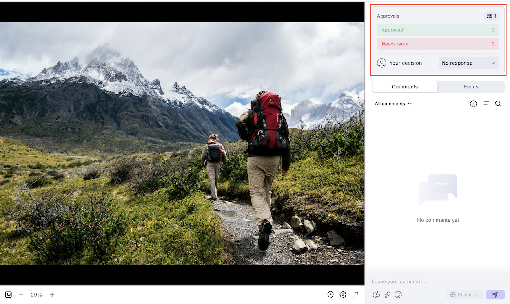

# 使用Frame.io查看器审阅和批准

您可以使用Frame.io查看器在Workfront中查看和批准文档。

使用Frame.io查看器审阅Workfront文档时，您可以留下注释或标记文档、图像或视频的特定部分，以便与团队高效地协作，并确保反馈清晰且可操作。

<!--For more information on the Frame.io integration with Workfront, see [Frame.io integration overview](/help/quicksilver/review-and-approve-work/native-integrations/frame-io/frame-int-overview.md).-->

## 访问要求

+++ 展开以查看本文中各项功能的访问要求。

<table style="table-layout:auto"> 
 <col> 
 </col> 
 <col> 
 </col> 
 <tbody> 
  <tr> 
   <td role="rowheader">Adobe Workfront包</td> 
   <td> 
 任何
 </td> 
  </tr> 
  <tr> 
   <td role="rowheader">Adobe Workfront许可证*</td> 
   <td> 
请求或更高版本

   
参与者或更高版本
 </td> 
  </tr> 
  <tr data-mc-conditions=""> 
   <td role="rowheader">访问级别配置</td> 
   <td> 
编辑对文档的访问权限
 
注意：如果您仍然没有访问权限，请咨询Workfront管理员是否对您的访问级别设置了其他限制。 有关Workfront管理员如何修改您的访问级别的信息，请参阅<a href="/help/quicksilver/administration-and-setup/add-users/configure-and-grant-access/create-modify-access-levels.md" class="MCXref xref">创建或修改自定义访问级别</a>。
 </td> 
  </tr> 
  <tr data-mc-conditions=""> 
   <td role="rowheader">对象权限</td> 
   <td> 
编辑对与文档关联的对象的访问权限
 
有关请求其他访问权限的信息，请参阅<a href="/help/quicksilver/workfront-basics/grant-and-request-access-to-objects/grant-and-request-access-to-objects.md" class="MCXref xref">请求访问对象</a>。
 </td> 
  </tr> 
 </tbody> 
</table>

有关信息，请参阅Workfront文档中的[访问要求](/help/quicksilver/administration-and-setup/add-users/access-levels-and-object-permissions/access-level-requirements-in-documentation.md)。

+++

## 审阅文档

作为审阅人，您可以向资源添加注释和标记资源。 完成后，您可以在Workfront中将审核标记为完成。 资产无需在审批流程中继续前进，即可将审核标记为完成。

1. 转到审阅电子邮件通知，然后单击&#x200B;**转到审阅**。
或
转到Workfront主页，找到我的审批小组件，然后单击&#x200B;**打开审核**。

   >[!NOTE]
   > 
   >您可能需要将我的审批构件添加到您的主页。 有关详细信息，请参阅[添加、编辑或删除主页中的小组件](/help/quicksilver/workfront-basics/using-home/using-the-home-area/add-edit-remove-widgets-in-new-home.md)。

1. 在Frame.io中，使用注释工具提供反馈或提出问题。
注释和资产标记仅在Frame.io查看器中可见。 有关使用Frame.io查看器的详细信息，请参阅[在媒体上发表评论](https://help.frame.io/en/articles/9105251-commenting-on-your-media)。
1. 对文档满意后，请导航回Workfront中的“文档详细信息”页面，并将您的审阅标记为完成。

   

## 批准文档

审批者可以添加注释并标记资产。 您必须决定推进审批流程。

在所有分配的审批人选择“已批准”之前，文档不会移至“已批准”状态。

要对文档做出决策，请执行以下操作：

1. 转到审阅电子邮件通知，然后单击&#x200B;**转到审阅**。
或
转到Workfront主页，找到我的审批小组件，然后单击&#x200B;**打开审核**。

   >[!NOTE]
   > 
   >您可能需要将我的审批构件添加到您的主页。 有关详细信息，请参阅[添加、编辑或删除主页中的小组件](/help/quicksilver/workfront-basics/using-home/using-the-home-area/add-edit-remove-widgets-in-new-home.md)。

1. 在Frame.io中，使用注释工具提供反馈或提出问题。
注释和资产标记仅在Frame.io查看器中可见。 有关使用Frame.io查看器的详细信息，请参阅[在媒体上发表评论](https://help.frame.io/en/articles/9105251-commenting-on-your-media)。
1. 对文档满意后，您可以在Frame.io查看器中选择以下决策之一：

   * **批准**：该资产不需要更改，可以随时使用。
   * **需要工作**：该资产需要更改，并且未准备就绪。 完成指定的更改后，必须将资源上传为新版本，并经过另一轮批准。 有关详细信息，请参阅[上传新文档版本并请求审批](/help/quicksilver/review-and-approve-work/document-reviews-and-approvals/manage-document-approvals/upload-new-doc-version.md)。<!--do they need to tell someone it was uploaded via comment tagging?-->

   作出决定后，将通过电子邮件通知文档所有者。

   有关Workfront中决策的详细信息，请参阅[文档决策状态概述](/help/quicksilver/review-and-approve-work/document-reviews-and-approvals/manage-document-approvals/document-approval-status.md)。

   

<!--is document owner the correct term?-->

