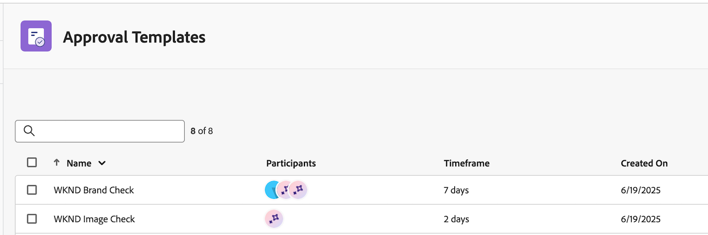

# Workfront内容审查者入门

内容查看者是一种AI协作者 — 可添加到您的项目、任务和文档的一种AI代理。 AI协作者可以在设置区域中配置，并像用户一样进行分配。

在Workfront中，内容查看者有助于在整个审核和批准过程中提高内容速度并改善品牌合规性。 您可以将内容审阅人添加到批准模板，或将他们包含在单独的审阅和批准请求中。

## 访问权限要求

要在Workfront中设置内容查看者，您必须是系统管理员。

任何用户都可以将“内容审阅者”添加到审阅和批准请求。

## 要求

* 您的Workfront实例必须启用统一批准。
* 您的组织必须具有GenStudio Foundation。
   * Workfront中的内容审阅者提供了GenStudio Foundation中用于资源审阅和批准工作流的功能。 您无需直接访问GenStudio Foundation即可完成工作。 您通过Content Reviewer访问GenStudio Foundation功能是受Workfront合同条款约束的。
* Adobe必须有一个已签署的Adobe Gen AI协议文件。
有关签署协议的更多信息，请参阅[签署Adobe Gen AI协议](/help/quicksilver/workfront-basics/ai-assistant/ai-assistant-overview.md#sign-the-adobe-gen-ai-agreement)。

## 支持的文件类型 {#supported-file-types-ai-reviewer}

>[!CONTEXTUALHELP]
>id="wf_document_approvals_ai_supported_files"
>title="不支持的文件类型"
>abstract="此内容查看者不支持所选的文件类型。 上载支持的文件类型，或移除内容审阅者以提交请求。"

内容查看者可以查看以下文件类型：

* PNG (.png)
* JPEG (.jpeg， .jpg)
* WEBP (.webp)
* 非动画GIF (.gif)
* PDF (.pdf)
* PPT (.ppt， .pptx)
* DOC (.doc， .docx)

如果您上传的文件类型不受支持，则在创建审批工作流时，内容查看者选项将不可用。

## 设置品牌指南

Workfront内容审阅者在审阅内容时使用品牌准则。 Workfront管理员可以在Workfront设置区域中设置品牌指南。 在GenStudio Foundation中创建的品牌也可以在Workfront中使用。

要设置品牌指南，系统管理员必须：

1. [授予对品牌权限的访问权限](/help/quicksilver/administration-and-setup/add-users/configure-and-grant-access/grant-access-brands.md)
1. [为内容查看者创建和管理品牌](/help/quicksilver/review-and-approve-work/document-reviews-and-approvals/create-a-brand.md)。

## 创建内容审阅者

至少设置了一个品牌后，Workfront管理员就可以在“设置”区域开始创建内容审阅者。 您可以创建多个侧重于不同准则的内容审阅人：

* **图像**：此内容审阅人将依据您在Workfront中设置的图像品牌指南审阅资产。 [!BADGE Beta 版]{type=Positive tooltip="此功能当前处于测试阶段。"}
   * 系统管理员必须签署测试版协议才能启用此功能。
* **品牌声音**：内容审阅人将依据您在Workfront中设置的品牌声音准则审阅资产。

然后，可以将内容审阅人分配给批准模板和各个审阅和批准请求。

有关详细信息，请参阅[配置AI协作者](/help/quicksilver/administration-and-setup/set-up-workfront/configure-system-defaults/configure-ai-collaborators.md)。

## 添加内容审阅人以审阅和批准请求

用户可以将内容审阅人添加到现有审批模板或单个审阅和审批请求。

### 审批模板

如果贵组织经常添加相同人员来审阅和审批请求，则Standard许可证用户可以在Workfront设置区域创建审批模板。

用户可以将内容审阅人添加到批准模板，以在使用模板创建请求时自动检查品牌合规性。

创建后，审批模板可应用于项目、任务或问题的文档区域中的资产。

有关详细信息，请参阅[为文档创建审批工作流模板](/help/quicksilver/review-and-approve-work/document-reviews-and-approvals/manage-document-approvals/create-approval-template.md)。

显示AI审阅者的

### 单个审阅和批准请求

当用户创建单个审阅和批准请求时，他们可以将内容审阅者与其他参与者一起添加到中，也可以创建单个请求，仅让内容审阅者检查品牌合规性。

有关详细信息，请参阅[创建文档审批工作流](/help/quicksilver/review-and-approve-work/document-reviews-and-approvals/manage-document-approvals/create-a-document-approval.md)。

## 查看内容查看者得分和反馈

在提交具有内容审阅人的审阅和批准请求后的几秒内，内容审阅人的分数和反馈将显示在“文档摘要”面板中 — 即使其他参与者仍在审阅和做出决策。

审批所有者还会收到一封电子邮件，通知他们已对该资产完成审核。 在电子邮件中，单击&#x200B;**前往**&#x200B;查看Workfront中的分数和反馈。

内容审阅人并非设计作为审阅和批准工作流程中的决策者。 它仅提供分数和建议，以将资产与指定的品牌要求保持一致。

如果资产不符合品牌指南，创意人员可以上传新版本，审批所有者可以使用“内容审阅者”创建第二个审阅和审批请求。

有关查看分数和反馈的详细信息，请参阅[查看内容查看者分数和反馈](/help/quicksilver/review-and-approve-work/document-reviews-and-approvals/view-ai-reviewer-feedback.md)。

