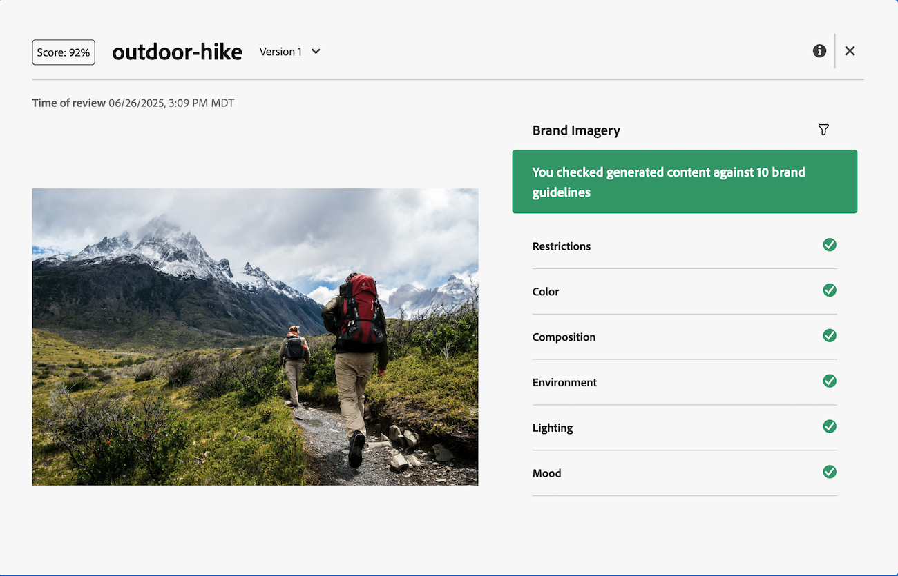

# Workfront AI Reviewer入门

>[!NOTE]
>
>此功能当前处于测试阶段。

借助Workfront AI审阅者，您可以在审阅和批准工作流程中提高内容速度并优化品牌合规性。 您可以在Workfront中将AI审阅人添加到批准模板或单个审阅和批准请求。

## 访问要求

要在Workfront中设置AI审阅者，您必须是系统管理员。

任何用户都可以将AI审阅者添加到审阅和批准请求。

## 先决条件

* 贵组织必须已迁移到Adobe IMS (Identity Management System)。
* 您的Workfront实例必须启用统一批准。
* Adobe必须有一个已签署的Adobe Gen AI协议文件。
有关签署协议的更多信息，请参阅[签署Adobe Gen AI协议](/help/quicksilver/workfront-basics/ai-assistant/ai-assistant-overview.md#sign-the-adobe-gen-ai-agreement)。

## 支持的文件类型 {#supported-file-types-ai-reviewer}

>[!CONTEXTUALHELP]
>id="wf_document_approvals_ai_supported_files"
>title="不支持的文件类型"
>abstract="此 AI 审阅者不支持所选的文件类型。 上传支持的文件类型，或移除 AI 审阅者以提交请求。"

AI审阅者可审阅以下文件类型：

* PNG (.png)
* JPEG (.jpeg， .jpg)
* WEBP (.webp)
* 非动画GIF (.gif)

## 设置品牌指南

Workfront AI审阅者在审阅内容时，会使用Genstudio基础中设置的品牌准则。 目前，您只能设置图像的品牌指南。 有关详细信息，请参阅[Adobe GenStudio for Performance Marketing入门](https://experienceleague.adobe.com/zh-hans/docs/genstudio-for-performance-marketing/user-guide/get-started)。

## 创建AI审阅者

一旦在GenStudio Foundation中至少设置了一个品牌，Workfront管理员便可以在“设置”区域开始创建AI审阅者。 随后，可以将这些AI审阅人分配给审批模板以及单个审阅和审批请求。 目前，AI审阅者只能根据图像品牌指南进行审阅。

有关详细信息，请参阅[创建AI审阅者](/help/quicksilver/review-and-approve-work/document-reviews-and-approvals/set-up-ai-reviewer.md)。

## 添加AI审阅人审阅和批准请求

用户可以将AI审阅人添加到现有审批模板或单个审阅和审批请求。

### 审批模板

如果贵组织经常添加相同人员来审阅和审批请求，则Standard许可证用户可以在Workfront设置区域创建审批模板。

用户可将AI审阅人添加到批准模板，以在使用模板创建请求时自动检查品牌合规性。

创建后，审批模板可应用于项目、任务或问题的文档区域中的资产。

有关详细信息，请参阅[为资源和文档创建批准模板](/help/quicksilver/review-and-approve-work/document-reviews-and-approvals/manage-document-approvals/create-approval-template.md)。

显示AI审阅者的

### 单个审阅和批准请求

当用户创建单个审阅和批准请求时，他们可以与其他参与者一起添加AI审阅人，也可以仅使用AI审阅人创建单个请求以检查品牌合规性。

有关详细信息，请参阅[创建文档审阅或审批请求](/help/quicksilver/review-and-approve-work/document-reviews-and-approvals/manage-document-approvals/create-a-document-approval.md)。

## 查看AI审核者得分和反馈

在提交具有AI审阅人的审阅和批准请求后的几秒内，来自AI审阅人的得分和反馈将显示在“文档摘要”面板中 — 即使其他参与者仍在审阅和做出决策。

审批所有者还会收到一封电子邮件，通知他们已对该资产完成审核。 在电子邮件中，单击&#x200B;**前往**&#x200B;查看Workfront中的分数和反馈。

AI审阅者并非旨在成为审阅和批准工作流中的决策者。 它仅提供分数和建议，以将资产与指定的品牌要求保持一致。

如果图像长期符合品牌准则，创意人员可以上传新版本，审批所有者可以使用AI审阅者创建第二个审阅和审批请求，从而允许您在版本之间切换并比较反馈。

有关查看分数和反馈的详细信息，请参阅[查看AI审阅者分数和反馈](/help/quicksilver/review-and-approve-work/document-reviews-and-approvals/view-ai-reviewer-feedback.md)。

## 视频演练

>[!VIDEO](https://video.tv.adobe.com/v/3470847/)