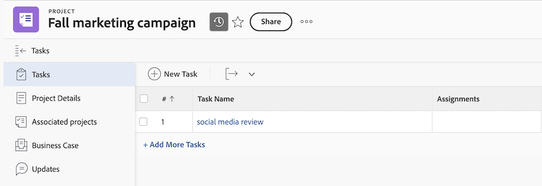

# Adobe企业存储模型的对象权限和访问级别概述

<!--linked in UI -->

Adobe企业存储是一种基于云的存储解决方案，它用作Adobe企业产品中资产的中央存储存储库。 使用Adobe企业存储的Workfront环境的对象权限和访问级别行为与使用旧版Workfront文档存储的环境略有不同。

## 访问级别

Workfront访问级别仅适用于Workfront。 Workfront中的项目和文档限制并不总是适用于其他Adobe应用程序。

### 同时使用Adobe企业级存储和旧版Workfront存储的环境

根据项目是在Adobe企业存储上还是在旧版Workfront存储上，文档访问的行为有所不同：

* **旧版Workfront存储**：使用旧版Workfront存储的项目、程序、项目组合和模板遵循标准Workfront访问级别逻辑进行文档访问。 当访问级别为文档选择了&#x200B;**无访问权限**&#x200B;时，他们将无法在Workfront或其他Adobe产品（如Frame.io或Creative Cloud）中查看文档。
* **Adobe企业存储**：使用Adobe企业存储的项目、程序、项目组合和模板遵循Adobe其他产品的Adobe企业存储访问级别逻辑。

   * **项目、程序、项目组合和模板对象权限**：当访问级别对项目、程序、项目组合和模板选择&#x200B;**无访问权限**，但该对象与他们共享时，用户无法在Workfront中查看该对象，但在其他Adobe工具（如Frame.io和Adobe Creative Cloud）中仍可以查看对象名称和任何关联文档。
   * **文档权限**：当访问级别对文档选择&#x200B;**无访问权限**&#x200B;时，用户无法查看Workfront中项目的文档，但仍可以查看和管理在其他Adobe工具（如Frame.io和Adobe Creative Cloud）中与用户共享的项目文档。 这是因为文档访问由Adobe企业存储中的项目级权限决定，而不是仅由Workfront访问级别决定。

如果您在Workfront环境中启用了Adobe企业级存储，则可以创建Adobe企业级存储项目和旧版Workfront存储项目。 旧版Workfront存储项目在Workfront中项目名称旁边会显示一个图标。 Adobe企业存储项目不显示图标。

项目名称旁边的

### 仅使用Adobe企业存储的环境

您无法修改使用Adobe企业存储的项目、项目和项目组合的访问级别文档权限。

所有访问级别都具有文档的编辑权限。 项目级别的权限可决定其他Adobe工具中的文档访问权限。

您无法限制文档继承访问权限。

### 仅使用旧版Workfront存储的环境

不更改文档访问级别或行为。

## 对象权限

对象权限决定您可以查看的项目、任务、问题和Workfront中的文档并执行哪些操作。 当有人与您共享对象时，将分配权限。

>[!IMPORTANT]
>
>在Adobe企业存储中，文档权限的工作方式与旧版Workfront存储中的不同。 文档从链接的项目、任务或问题继承权限。

### 文档权限的工作方式

文档权限由文档链接到的对象驱动。 您无法设置单个文档的权限。

将文档上传到任务或问题时，系统会使用任务或问题名称创建系统生成的文件夹。 此文件夹链接到任务或问题并继承其权限。

可在系统生成的文件夹中创建子文件夹以进一步组织文档。 所有子文件夹都从父文件夹继承权限。 在项目级别，您可以在文件夹之外上传文档，但只有具有项目级别访问权限的用户才能查看文档。

在项目级别，系统生成的文件夹显示链接对象。 这通常是任务或问题的名称，也是系统知道文件夹应显示在哪个任务或问题上的方式。

### 项目权限

如果您具有项目级别的权限，则可以在Workfront及其他Adobe产品（如Frame.io和Adobe Creative Cloud）中查看和管理该项目的文档。 项目名称在这些工具中也可见。 其他项目数据在Workfront之外不可见。

### 任务和问题权限

任务和问题从项目继承权限。 如果您具有任务或问题级别的权限，则可以在Workfront及其他Adobe产品（如Frame.io和Adobe Creative Cloud）中查看和管理与该任务或问题关联的文档。

**系统生成的文件夹**

* 从任务或问题中移除用户不会自动移除其文件夹访问权限。 他们仍可通过项目级别的权限进行访问。
* 子任务不会从父任务继承系统生成的文件夹权限。 您必须直接添加到子任务才能访问其系统生成的文件夹。
* 将用户添加到任务或问题会与这些用户共享该对象的系统生成的文件夹。

**移动和重命名系统生成的文件夹：**

* 可以重命名和移动系统生成的文件夹。
* 如果将系统生成的文件夹移动到其他位置，则其链接对象将更新为新对象。 然后，权限会从新的父对象继承。

请求遵循与任务和问题相同的行为。

### 审批

将您添加到文档审批工作流后，无论项目权限如何，您都可以看到以下内容：

* 项目名称
* 文档名称
* 文档缩略图

