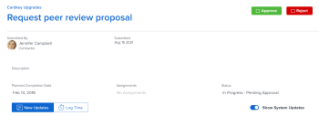

# 审批工作

<!--

(NOTE:&nbsp;From&nbsp;Courtney: Linked to Training sites/ articles , don't change title and link)

-->

如果您被设置为批准者，您应定期查看等待批准的工作。

有关创建审批流程的信息，请参阅[为工作项创建审批流程](../../administration-and-setup/customize-workfront/configure-approval-milestone-processes/create-approval-processes.md)。

有关将审批与Workfront中的工作关联的信息，请参阅[将新的或现有的审批流程与工作关联](../../review-and-approve-work/manage-approvals/associate-approval-with-work.md)。

## 访问要求

您必须具有以下权限才能执行本文中的步骤：

<table style="table-layout:auto"> 
 <col> 
 <col> 
 <tbody> 
  <tr> 
   <td role="rowheader">Adobe Workfront计划*</td> 
   <td> 
任何
 </td> 
  </tr> 
  <tr> 
   <td role="rowheader">Adobe Workfront许可证*</td> 
   <td> 
审核或更高
 </td> 
  </tr> 
  <tr> 
   <td role="rowheader">访问级别配置*</td> 
   <td> 
查看或更高权限访问与审批关联的对象
 
注意：如果您仍然没有访问权限，请咨询Workfront管理员是否对您的访问级别设置了其他限制。 有关Workfront管理员如何修改您的访问级别的信息，请参阅<a href="../../administration-and-setup/add-users/configure-and-grant-access/create-modify-access-levels.md" class="MCXref xref">创建或修改自定义访问级别</a>。
 </td> 
  </tr> 
  <tr> 
   <td role="rowheader">对象权限</td> 
   <td> 
查看与审批关联的对象的权限或更高的权限
 
有关请求其他访问权限的信息，请参阅<a href="../../workfront-basics/grant-and-request-access-to-objects/request-access.md" class="MCXref xref">请求访问对象</a>。
 </td> 
  </tr> 
 </tbody> 
</table>

&#42;要了解您拥有什么计划、许可证类型或访问权限，请与Workfront管理员联系。

## 在Adobe Workfront中查找批准

您可以在Workfront的各个区域查看和管理审批。

有关查看等待审批的项或您自己已提交审批的项的更多信息，请参阅[查看审批](../../review-and-approve-work/manage-approvals/view-approvals.md)。

## 批准主页区域的工作

1. 单击Adobe Workfront左上角的&#x200B;**主页**&#x200B;图标。

   >[!NOTE]
   >
   >您的Workfront管理员可以对环境中的主页图标进行以下更改：
   >
   >   
   >* 请将其替换为用于说明贵组织的自定义图像。 在这种情况下，图标的外观将与本文中显示的有所不同。
   >* 将链接到该页面的页面替换为其他页面。 在这种情况下，请单击页面右上角的&#x200B;**主菜单** ，然后单击&#x200B;**主页**。

1. 单击&#x200B;**筛选器**&#x200B;下拉菜单。

   

1. 选择&#x200B;**审批**。\
   所有需要您审批的工作项都会显示。 

   >[!NOTE]
   >
   >分配给工作角色或组的审批不显示在主页中。 分配给团队的审批显示在工作列表的团队请求分组中。

1. （可选）更改审批的显示顺序，如[主页的工作列表显示项](../../workfront-basics/using-home/using-the-home-area/display-items-in-home-work-list.md)中的“按日期、项目或优先级分组和排序”一节中所述。
1. 选择要在其中作出批准决策的项目。

   

1. 在右侧面板中作出批准决策时，单击其中一个可用选项。 根据要批准的项目类型，以下选项将显示在页面的右上角：

   * **项目：**&#x200B;单击&#x200B;**批准**&#x200B;或&#x200B;**拒绝**。

   * **任务：**&#x200B;单击&#x200B;**批准**&#x200B;或&#x200B;**拒绝** 。

   * **问题：**&#x200B;单击&#x200B;**批准**&#x200B;或&#x200B;**拒绝** 。

   * **时间表：**&#x200B;单击&#x200B;**批准**&#x200B;或&#x200B;**拒绝** 。

   * **文档：**&#x200B;单击&#x200B;**批准**、**拒绝**&#x200B;或&#x200B;**更改**。\
      查看时，请考虑以下事项  审批：

      * 当用户与您共享验证时，验证审批将显示在此处，如[在Adobe Workfront中共享验证](../../review-and-approve-work/proofing/managing-proofs-within-workfront/share-a-proof-in-workfront.md)一文中的“共享验证链接”一节所述。
      * 仅当您的Workfront环境与Workfront Proof Premium帐户集成时，验证审批才会显示在主页区域中。 如果您无法使用此处讨论的验证，请与Workfront管理员联系。
      * 您会收到应用程序内通知，通知您验证审批。\
        有关应用程序内通知的详细信息，请参阅[查看和管理应用程序内通知](../../workfront-basics/using-notifications/view-and-manage-in-app-notifications.md)。

      * 请求批准的用户的名称显示在主页区域的缩略图图像旁边，其中包含以下文本：\
        “*用户A*&#x200B;希望您批准……”

        <!--      
        <MadCap:conditionalText data-mc-conditions="QuicksilverOrClassic.Draft mode">      
        (NOTE:&nbsp;From&nbsp;Courtney: Is this true?)      
        </MadCap:conditionalText>      
        -->

        如果用户名不可用，将显示以下文本：\
        “新版本的验证已准备就绪，可供查看”
      * 要对校对作出批准决定，请单击&#x200B;**转至校对**，单击&#x200B;**完成审阅**，然后单击其中一个可用选项。 批准校对时可用的选项为：**已批准**、**已批准但有更改**、**需要更改**&#x200B;和&#x200B;**不相关**。

      * 在对验证做出决定后，验证将保留在“我的审批”选项卡中，并显示“已做出决定”文本，直至您单击&#x200B;**刷新**&#x200B;按钮或刷新浏览器页面。

        有关审阅校样的信息，请参阅[在Adobe Workfront中审阅校样](../../review-and-approve-work/proofing/reviewing-proofs-within-workfront/review-proofs-in-wf.md)。

   * **访问权限：**&#x200B;在&#x200B;**更改访问权限**&#x200B;下拉菜单中选择要授予的访问权限级别，然后单击&#x200B;**授予访问权限**。 或者，单击&#x200B;**忽略**。

## 直接批准项目、任务或问题中的工作

当项目、任务或问题正在等待审批时，您可以直接从项目、任务或问题批准或拒绝审批。 您还可以查看有关批准流程的详细信息。

要直接批准项目、任务或问题中的工作，请执行以下操作：

1. 转到需要您审批的项目、任务或问题。

   有关项目、任务或问题的当前审批流程的审批信息显示在项目的标题中。

   

   以下批准信息可用：

   <table style="table-layout:auto"> 
    <col> 
    <col> 
    <tbody> 
     <tr> 
      <td role="rowheader">状态</td> 
      <td>项目、任务或问题的当前状态。 这是待审批项目的当前状态。 在批准流程中的每个阶段都获得批准后，状态才会被批准。</td> 
     </tr> 
     <tr> 
      <td role="rowheader">审批阶段</td> 
      <td>审批流程的各个阶段。  待批准的当前阶段显示为“待批准”。 已批准的阶段显示为已批准；尚未批准的阶段显示为未启动。</td> 
     </tr> 
    </tbody> 
   </table>

1. 根据您是要批准或拒绝批准流程，单击&#x200B;**批准**&#x200B;还是&#x200B;**拒绝**。\
   待审批的审批阶段现在已审批，审批流程将移至下一个阶段。 在所有阶段都获得批准后，状态即为“已批准”。

## 直接从文档审批文档 

1. 转到文档区域，其中包含需要您审批的文档。
1. 选择文档，然后单击&#x200B;**批准**、**更改**&#x200B;或&#x200B;**拒绝**。\
   \
   

1. （可选）如果已为文档生成验证，则可以在验证界面中批准文档，如[从验证中批准文档](#approve-a-document-from-a-proof)中所述。

## 通过审批通知电子邮件审批文档

根据您的通知设置，您可能会收到电子邮件，通知您其他用户需要您做出批准决策的文档。 当您收到包含&#x200B;**作出批准决定**&#x200B;按钮的电子邮件时，可以直接从电子邮件启动批准流程：

1. 在电子邮件中，单击&#x200B;**作出批准决定**&#x200B;以打开验证的文档详细信息页面。
1. 执行以下任一操作以查看文档：

   * 查看有关文档的元数据。
   * 如果已创建用于审阅带标记和注释的文档的验证，请单击右上角附近的&#x200B;**打开验证** 并审阅该验证。

     <!--   
     [Andrzej, does it make sense to leave this here if it's s document approval?&nbsp;Would there never be a proof in that situation?]   
     -->

     有关审阅校样的信息，请参阅[在Adobe Workfront中审阅校样](../../review-and-approve-work/proofing/reviewing-proofs-within-workfront/review-proofs-in-wf.md)。

1. 单击右上角的&#x200B;**决策**&#x200B;选项以批准、审批并更改，或拒绝文档。

## 从验证审批文档 {#approve-a-document-from-a-proof}

您可以在验证查看器中批准文档。 有关详细信息，请参阅[在校对查看器中做出校对决定](../../review-and-approve-work/proofing/reviewing-proofs-within-workfront/make-a-decision-on-a-proof/make-decisions-on-proof.md)一文中的[在校对查看器中做出校对决定](../../review-and-approve-work/proofing/reviewing-proofs-within-workfront/make-a-decision-on-a-proof/make-decisions-on-proof.md)。
