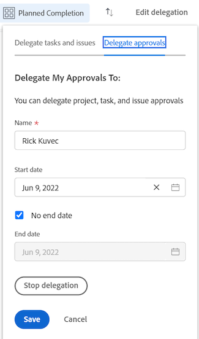

# 委派批准请求

您可以在外出时临时委派分配给的工作。 您可以委派任务和发放分配，也可以委派审批请求。 本文介绍了如何委派批准请求。 有关委派任务和问题分配的信息，请参阅 [管理任务和问题委派](../../manage-work/delegate-work/how-to-delegate-work.md).

>[!NOTE]
>
>为确保在计划进行委派审批的日期中不会出现不一致的情况，我们建议用户配置文件的时区与计划的时区相匹配。 有关更多信息，请参阅以下文章：
>
>* [创建计划](../../administration-and-setup/set-up-workfront/configure-timesheets-schedules/create-schedules.md)
>* [编辑用户的配置文件](../../administration-and-setup/add-users/create-and-manage-users/edit-a-users-profile.md)
>

## 访问要求

您必须具有以下访问权限才能执行本文中的步骤：

<table style="table-layout:auto"> 
 <col> 
 </col> 
 <col> 
 </col> 
 <tbody> 
  <tr> 
   <td role="rowheader">
Adobe Workfront计划*
</td> 
   <td> 
任意
 </td> 
  </tr> 
  <tr> 
   <td role="rowheader">
Adobe Workfront许可证*
</td> 
   <td> 
审阅或更高版本
 </td> 
  </tr> 
 </tbody> 
</table>

&#42;要了解您拥有的计划或许可证类型，请联系您的Workfront管理员。

## 了解用户获取委托批准的访问权限

在指定的批准期间，您将批准请求委派给的用户具有以下功能：

* 在尚未作出决定的情况下，可以批准或拒绝现有的批准请求
* 可以批准和拒绝在指定时间段内收到的新批准请求
* 已授予查看对待批准对象的访问权限

   >[!NOTE]
   >
   > Adobe Workfront管理员可以限制用户访问某些对象类型。 当用户无权访问对象类型，并且已将该类型的批准委派给用户时，用户将无权访问该对象。 但是，用户仍可以批准或拒绝 **主页** 页面，如 [批准工作](../../review-and-approve-work/manage-approvals/approving-work.md).\
   例如，用户A属于组A。Workfront管理员已限制组A的访问权限，因此此组中的用户无法查看Workfront中的任务。 如果将任务批准请求委派给用户A，则用户A无法查看与批准关联的任务。 但是，用户A可以从主页批准或拒绝批准请求。

   有关Workfront管理员如何限制对设置中对象类型的访问的信息，请参阅  [创建或修改自定义访问级别](../../administration-and-setup/add-users/configure-and-grant-access/create-modify-access-levels.md). 

批准委派停止或取消后，指定为审批者的用户：

* 无权再批准需要批准的项目的工作
* 继续具有查看工作项的访问权限\
   已通过批准委托授予了对对象的查看访问权限的用户，即使在批准委托停止或被撤回后仍会保留该视图访问权限。 要删除在委派审批期间用户有权访问的任何对象的查看访问权限，您必须转到对象并直接从对象中删除访问权限。

## 在“主页”区域中委派批准请求

* [将您的批准委派给其他用户](#delegate-your-approvals-to-another-user)
* [更新或停止批准委派](#update-or-stop-an-approval-delegation)
* [查看委派的批准](#view-delegated-approvals)

### 将您的批准委派给其他用户 {#delegate-your-approvals-to-another-user}

您可以将以下类型的批准委派给您，而不管是如何分配给您的批准（无论是直接分配给您、您所属的团队还是您的工作角色）：

* 项目批准
* 任务批准
* 颁发批准

您无法委派时间表和文档审批。 

委派批准时，请考虑以下事项：

* 委派批准时，会委派所有批准。 您无法委派单个批准请求。
* 您只能将批准委派给一个用户；您无法同时将批准委派给多个用户。\
   所有项目、任务和问题的所有批准都会委派给指定的用户。
* 最多5个用户可以同时将批准委派给同一用户。 换言之，不能将单个用户指定为同时超过5个用户的临时审批者。
* 与批准有关的活动会显示在更新选项卡中。 必须启用显示系统更新。 委派批准的用户和被委派批准的用户都会收到有关批准活动的电子邮件通知。

要将批准委派给其他用户，请执行以下操作：

1. 单击 **主页** 图标  在Adobe Workfront的左上角。

   >[!NOTE]
   您的Workfront管理员可以对环境中的主页图标进行以下更改：
   * 将其替换为自定义的图像，以说明您的组织。 在这种情况下，图标将与本文中显示的不同。
   * 将链接到该页面的页面替换为其他页面。 在这种情况下，单击 **主菜单**  ，然后单击 **主页**.

   或

   单击 **主菜单** 图标> **您的姓名** > **结束时间** 中。

1. （可选和视情况而定）在“主页”区域中，单击 **过滤器** 下拉菜单，然后单击 **批准**.

1. （视情况而定）单击 **委派我的批准**

   或

   如果系统或组管理员已启用任务和问题委派，请单击 **委派**，然后单击 **委派批准**.

   

1. 在Delegate My Approvals部分中指定以下信息：

   * **名称**:开始键入要将批准委派到的用户的名称，然后在下拉菜单中显示该名称时单击该名称。
   * **开始日期**:选择开始转发审批的日期。 转发从您选择的日期的半夜12:00开始。\
      开始日期必须是当前日期或将来日期。
   * **结束日期**：执行下列操作之一：

      * 选择批准停止转发的日期。 转发在您选择的日期的晚上11点59分结束。
      * 选择 **无结束日期** 配置Workfront以无限期地委派批准。

1. 单击&#x200B;**保存**。

### 更新或停止批准委派 {#update-or-stop-an-approval-delegation}

1. 单击 **主页** 图标  在Adobe Workfront的左上角。

   >[!NOTE]
   您的Workfront管理员可以对环境中的主页图标进行以下更改：
   * 将其替换为自定义的图像，以说明您的组织。 在这种情况下，图标将与本文中显示的不同。
   * 将链接到该页面的页面替换为其他页面。 在这种情况下，单击 **主菜单**  ，然后单击 **主页**.

1. 单击 **过滤器** 下拉菜单，然后单击 **批准**.

1. （视情况而定）单击 **编辑委派**

   或

   如果系统或组管理员已启用任务和问题委派，请单击 **编辑委派**，然后单击 **委派批准**.

1. （视情况而定）执行以下任一操作：

   * 要更新现有的批准委派，请执行以下操作：更改显示的信息，然后单击 **保存**.

   * 要停止现有委派，请执行以下操作：单击 **停止委派**，然后单击 **停止委派** 确认。

      

### 查看委派的批准 {#view-delegated-approvals}

您只能在工作列表中查看以下类型的审批委托：

* 项目批准
* 任务批准
* 颁发批准

要查看委派的审批，请执行以下操作：

1. 单击 **主页** 图标  在Adobe Workfront的左上角。

   >[!NOTE]
   您的Workfront管理员可以对环境中的主页图标进行以下更改：
   * 将其替换为自定义的图像，以说明您的组织。 在这种情况下，图标将与本文中显示的不同。
   * 将链接到该页面的页面替换为其他页面。 在这种情况下，单击 **主菜单**  ，然后单击 **主页**.

1. 单击 **过滤器** 下拉菜单，然后单击 **批准**.\
   默认情况下，所有批准都会显示在列表中，包括分配给您的批准和分配给您的批准。

   
