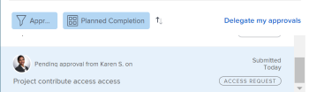

# 撤回提交的审批

您可以撤消以下任何提交供审批的对象：

* 项目
* 任务
* 问题
* 时间表
* 文档
* 访问请求

## 访问要求

+++ 展开以查看本文中各项功能的访问要求。

<table style="table-layout:auto"> 
 <col> 
 <col> 
 <tbody> 
  <tr> 
   <td role="rowheader">Adobe Workfront包</td> 
   <td> 
任何
 </td> 
  </tr> 
  <tr> 
   <td role="rowheader">Adobe Workfront许可证</td> 
   <td>
   
Contribute或更高版本

   
请求或更高版本

   </td> 
  </tr> 
  <tr> 
   <td role="rowheader">访问级别配置</td> 
   <td> 
查看或更高权限的项目、任务、问题、时间表、文档
</td> 
  </tr> 
  <tr> 
   <td role="rowheader">对象权限</td> 
   <td> 
查看或拥有对与审批关联的对象的更高访问权限 
</td> 
  </tr> 
 </tbody> 
</table>

有关信息，请参阅Workfront文档中的[访问要求](/help/quicksilver/administration-and-setup/add-users/access-levels-and-object-permissions/access-level-requirements-in-documentation.md)。

+++

## 项目

当您撤消项目审批时，项目会返回到启动审批流程之前的状态。

如果调回与项目的开始状态关联的审批，则会绕过审批流程，并且项目仍保持开始状态。

>[!NOTE]
>
>您可以使用模板将项目或任务的第一个状态与审批流程相关联。 有关将审批添加到模板的详细信息，请参阅  [编辑项目模板](../../manage-work/projects/create-and-manage-templates/edit-templates.md)。

要撤消您提交的项目审批，请执行以下操作：

1. 单击Adobe Workfront左上角的&#x200B;**主页**&#x200B;图标。

   >[!NOTE]
   >
   >您的Workfront管理员可以对环境中的主页图标进行以下更改：
   >
   >* 请将其替换为用于说明贵组织的自定义图像。 在这种情况下，图标的外观将与本文中显示的有所不同。
   >* 将链接到该页面的页面替换为其他页面。 在这种情况下，请单击页面右上角的&#x200B;**主菜单** ，然后单击&#x200B;**主页**。

1. 在&#x200B;**工作列表**&#x200B;区域中，导航到我已提交的&#x200B;**审批**&#x200B;分组。

1. 单击工作列表中的&#x200B;**项目**&#x200B;批准。

   这将打开工作列表右侧的项目。

   

1. 单击右面板右上角的&#x200B;**撤消**。

## 任务

当您撤消任务审批时，任务将返回到启动审批流程之前所处的状态。

如果调回与任务的开始状态关联的审批，则会绕过审批流程，任务仍保持开始状态。

>[!NOTE]
>
>您可以使用模板将项目或任务的第一个状态与审批流程相关联。 有关向模板添加审批的详细信息，请参阅[编辑项目模板](../../manage-work/projects/create-and-manage-templates/edit-templates.md)。

要撤消您提交的任务审批，请执行以下操作：

1. 单击Adobe Workfront左上角的&#x200B;**主页**&#x200B;图标。

   >[!NOTE]
   >
   >您的Workfront管理员可以对环境中的主页图标进行以下更改：
   >
   >* 请将其替换为用于说明贵组织的自定义图像。 在这种情况下，图标的外观将与本文中显示的有所不同。
   >* 将链接到该页面的页面替换为其他页面。 在这种情况下，请单击页面右上角的&#x200B;**主菜单** ，然后单击&#x200B;**主页**。

1. 在&#x200B;**工作列表**&#x200B;区域中，导航到我已提交的&#x200B;**审批**&#x200B;分组。

1. 单击工作列表中的&#x200B;**任务**&#x200B;批准。

   这将打开工作列表右侧的任务。

   

1. 单击右面板右上角的&#x200B;**撤消**。

## 问题

当您撤消批准问题时，问题会返回到启动批准流程之前所处的状态。

如果您撤消了与问题的开始状态关联的审批，则会绕过审批流程，而问题仍保持开始状态。

>[!NOTE]
>
>您可以使用模板将问题的第一个状态与审批流程相关联。 有关创建请求队列的详细信息，请参阅[创建请求队列](../../manage-work/requests/create-and-manage-request-queues/create-request-queue.md)。

1. 单击Adobe Workfront左上角的&#x200B;**主页**&#x200B;图标。

   >[!NOTE]
   >
   >您的Workfront管理员可以对环境中的主页图标进行以下更改：
   >
   >* 请将其替换为用于说明贵组织的自定义图像。 在这种情况下，图标的外观将与本文中显示的有所不同。
   >* 将链接到该页面的页面替换为其他页面。 在这种情况下，请单击页面右上角的&#x200B;**主菜单** ，然后单击&#x200B;**主页**。

1. 在&#x200B;**工作列表**&#x200B;区域中，导航到我已提交的&#x200B;**审批**&#x200B;分组。

1. 单击工作列表中的&#x200B;**问题**&#x200B;批准。

   这将打开工作列表右侧的问题。

   

1. 单击右面板右上角的&#x200B;**撤消**。

## 时间表

当您撤消批准时间表时，时间表会返回到提交以供批准之前所处的状态。

1. 单击Adobe Workfront左上角的&#x200B;**主页**&#x200B;图标。

   >[!NOTE]
   >
   >您的Workfront管理员可以对环境中的主页图标进行以下更改：
   >
   >* 请将其替换为用于说明贵组织的自定义图像。 在这种情况下，图标的外观将与本文中显示的有所不同。
   >* 将链接到该页面的页面替换为其他页面。 在这种情况下，请单击页面右上角的&#x200B;**主菜单** ，然后单击&#x200B;**主页**。

1. 在&#x200B;**工作列表**&#x200B;区域中，导航到我已提交的&#x200B;**审批**&#x200B;分组。

1. 在工作列表中单击&#x200B;**时间表**&#x200B;批准。

   这将打开工作列表右侧的时间表。

   

1. 单击右面板右上角的&#x200B;**撤消**。

## 文档

要撤消文档审批，您必须从审批中手动删除一个或多个用户。

1. 单击Adobe Workfront左上角的&#x200B;**主页**&#x200B;图标。

   >[!NOTE]
   >
   >您的Workfront管理员可以对环境中的主页图标进行以下更改：
   >
   >* 请将其替换为用于说明贵组织的自定义图像。 在这种情况下，图标的外观将与本文中显示的有所不同。
   >* 将链接到该页面的页面替换为其他页面。 在这种情况下，请单击页面右上角的&#x200B;**主菜单** ，然后单击&#x200B;**主页**。

1. 在&#x200B;**工作列表**&#x200B;区域中，导航到我已提交的&#x200B;**审批**&#x200B;分组。

1. 单击工作列表中的&#x200B;**文档**&#x200B;审批。

   这将打开工作列表右侧的文档。

   

1. 单击右面板右上角的&#x200B;**管理审批**。 这将打开管理审批框。
1. 单击“管理审批”框内与用户名内联的&#x200B;**删除**&#x200B;图标。 删除所有用户以完全撤回文档审批。

   

## 访问请求

1. 单击Adobe Workfront左上角的&#x200B;**主页**&#x200B;图标。

   >[!NOTE]
   >
   >您的Workfront管理员可以对环境中的主页图标进行以下更改：
   >
   >* 请将其替换为用于说明贵组织的自定义图像。 在这种情况下，图标的外观将与本文中显示的有所不同。
   >* 将链接到该页面的页面替换为其他页面。 在这种情况下，请单击页面右上角的&#x200B;**主菜单** ，然后单击&#x200B;**主页**。

1. 在&#x200B;**工作列表**&#x200B;区域中，导航到我已提交的&#x200B;**审批**&#x200B;分组。

1. 在工作列表中单击&#x200B;**访问请求**&#x200B;批准。

   这将打开工作列表右侧的访问请求。

   

1. 单击右面板右上角的&#x200B;**撤消**。
