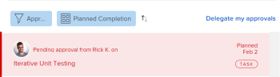

# 撤回提交的审批

您可以撤消以下任何提交供审批的对象：

* 项目
* 任务
* 问题
* 时间表
* 文档
* 访问请求

## 访问要求

您必须具有以下权限才能执行本文中的步骤：

<table style="table-layout:auto"> 
 <col> 
 <col> 
 <tbody> 
  <tr> 
   <td role="rowheader">Adobe Workfront计划*</td> 
   <td> 
任何
 </td> 
  </tr> 
  <tr> 
   <td role="rowheader">Adobe Workfront许可证*</td> 
   <td> 
请求或更高版本
 </td> 
  </tr> 
  <tr> 
   <td role="rowheader">访问级别配置*</td> 
   <td> 
查看或更高权限的项目、任务、问题、时间表、文档
 
注意：如果您仍然没有访问权限，请咨询Workfront管理员是否对您的访问级别设置了其他限制。 有关Workfront管理员如何修改您的访问级别的信息，请参阅 <a href="../../administration-and-setup/add-users/configure-and-grant-access/create-modify-access-levels.md" class="MCXref xref">创建或修改自定义访问级别</a>.
 </td> 
  </tr> 
  <tr> 
   <td role="rowheader">对象权限</td> 
   <td> 
查看或拥有对与审批关联的对象的更高访问权限 
 
有关请求其他访问权限的信息，请参阅 <a href="../../workfront-basics/grant-and-request-access-to-objects/request-access.md" class="MCXref xref">请求访问对象 </a>.
 </td> 
  </tr> 
 </tbody> 
</table>

&#42;要了解您拥有的计划、许可证类型或访问权限，请联系您的Workfront管理员。

## 项目

当您撤消项目审批时，项目会返回到启动审批流程之前的状态。

如果调回与项目的开始状态关联的审批，则会绕过审批流程，并且项目仍保持开始状态。

>[!NOTE]
>
>您可以使用模板将项目或任务的第一个状态与审批流程相关联。 有关将审批添加到模板的详细信息，请参阅  [编辑项目模板](../../manage-work/projects/create-and-manage-templates/edit-templates.md).

要撤消您提交的项目审批，请执行以下操作：

1. 单击 **主页** 图标  在Adobe Workfront的左上角。

   >[!NOTE]
   >
   您的Workfront管理员可以对环境中的主页图标进行以下更改：
   >
   * 请将其替换为用于说明贵组织的自定义图像。 在这种情况下，图标的外观将与本文中显示的有所不同。
   * 将链接到该页面的页面替换为其他页面。 在此例中，单击 **主菜单**  （位于页面的右上角），然后单击 **主页**.

1. 在 **工作列表** 区域，导航到 **我已提交的审批** 分组。

1. 单击 **项目** 在工作列表中审批。

   这将打开工作列表右侧的项目。

   

1. 单击 **撤消** 位于右面板的右上角。

## 任务

当您撤消任务审批时，任务将返回到启动审批流程之前所处的状态。

如果调回与任务的开始状态关联的审批，则会绕过审批流程，任务仍保持开始状态。

>[!NOTE]
>
您可以使用模板将项目或任务的第一个状态与审批流程相关联。 有关将审批添加到模板的详细信息，请参阅 [编辑项目模板](../../manage-work/projects/create-and-manage-templates/edit-templates.md).

要撤消您提交的任务审批，请执行以下操作：

1. 单击 **主页** 图标  在Adobe Workfront的左上角。

   >[!NOTE]
   >
   您的Workfront管理员可以对环境中的主页图标进行以下更改：
   >
   * 请将其替换为用于说明贵组织的自定义图像。 在这种情况下，图标的外观将与本文中显示的有所不同。
   * 将链接到该页面的页面替换为其他页面。 在此例中，单击 **主菜单**  （位于页面的右上角），然后单击 **主页**.

1. 在 **工作列表** 区域，导航到 **我已提交的审批** 分组。

1. 单击 **任务** 在工作列表中审批。

   这将打开工作列表右侧的任务。

   

1. 单击 **撤消** 位于右面板的右上角。

## 问题

当您撤消批准问题时，问题会返回到启动批准流程之前所处的状态。

如果您撤消了与问题的开始状态关联的审批，则会绕过审批流程，而问题仍保持开始状态。

>[!NOTE]
>
您可以使用模板将问题的第一个状态与审批流程相关联。 有关创建请求队列的详细信息，请参阅 [创建请求队列](../../manage-work/requests/create-and-manage-request-queues/create-request-queue.md).

1. 单击 **主页** 图标  在Adobe Workfront的左上角。

   >[!NOTE]
   >
   您的Workfront管理员可以对环境中的主页图标进行以下更改：
   >
   * 请将其替换为用于说明贵组织的自定义图像。 在这种情况下，图标的外观将与本文中显示的有所不同。
   * 将链接到该页面的页面替换为其他页面。 在此例中，单击 **主菜单**  （位于页面的右上角），然后单击 **主页**.

1. 在 **工作列表** 区域，导航到 **我已提交的审批** 分组。

1. 单击 **问题** 在工作列表中审批。

   这将打开工作列表右侧的问题。

   

1. 单击 **撤消** 位于右面板的右上角。

## 时间表

当您撤消批准时间表时，时间表会返回到提交以供批准之前所处的状态。

1. 单击 **主页** 图标  在Adobe Workfront的左上角。

   >[!NOTE]
   >
   您的Workfront管理员可以对环境中的主页图标进行以下更改：
   >
   * 请将其替换为用于说明贵组织的自定义图像。 在这种情况下，图标的外观将与本文中显示的有所不同。
   * 将链接到该页面的页面替换为其他页面。 在此例中，单击 **主菜单**  （位于页面的右上角），然后单击 **主页**.

1. 在 **工作列表** 区域，导航到 **我已提交的审批** 分组。

1. 单击 **工时表** 在工作列表中审批。

   这将打开工作列表右侧的时间表。

   

1. 单击 **撤消** 位于右面板的右上角。

## 文档

要撤消文档审批，您必须从审批中手动删除一个或多个用户。

1. 单击 **主页** 图标  在Adobe Workfront的左上角。

   >[!NOTE]
   >
   您的Workfront管理员可以对环境中的主页图标进行以下更改：
   >
   * 请将其替换为用于说明贵组织的自定义图像。 在这种情况下，图标的外观将与本文中显示的有所不同。
   * 将链接到该页面的页面替换为其他页面。 在此例中，单击 **主菜单**  （位于页面的右上角），然后单击 **主页**.

1. 在 **工作列表** 区域，导航到 **我已提交的审批** 分组。

1. 单击 **文档** 在工作列表中审批。

   这将打开工作列表右侧的文档。

   

1. 单击 **管理审批** 位于右面板的右上角。 这将打开管理审批框。
1. 单击 **移除** 在管理审批框中内联用户名的图标。 删除所有用户以完全撤回文档审批。

   

## 访问请求

1. 单击 **主页** 图标  在Adobe Workfront的左上角。

   >[!NOTE]
   >
   您的Workfront管理员可以对环境中的主页图标进行以下更改：
   >
   * 请将其替换为用于说明贵组织的自定义图像。 在这种情况下，图标的外观将与本文中显示的有所不同。
   * 将链接到该页面的页面替换为其他页面。 在此例中，单击 **主菜单**  （位于页面的右上角），然后单击 **主页**.

1. 在 **工作列表** 区域，导航到 **我已提交的审批** 分组。

1. 单击 **访问请求** 在工作列表中审批。

   这将打开工作列表右侧的访问请求。

   

1. 单击 **撤消** 位于右面板的右上角。
