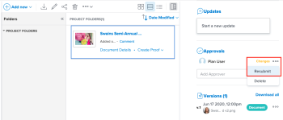

# 请求文档批准

您可以在Adobe Workfront中请求经理或其他用户批准文档。 如果您的Workfront管理员已启用此功能，则还可以向没有Workfront帐户的人员请求文档批准，如 [配置系统安全首选项](../../administration-and-setup/manage-workfront/security/configure-security-preferences.md).

## 访问要求

您必须具有以下访问权限才能执行本文中的步骤：

<table style="table-layout:auto"> 
 <col> 
 <col> 
 <tbody> 
  <tr> 
   <td role="rowheader">Adobe Workfront计划*</td> 
   <td> 
任意
 </td> 
  </tr> 
  <tr> 
   <td role="rowheader">Adobe Workfront许可证*</td> 
   <td> 
审阅或更高版本
 </td> 
  </tr> 
  <tr> 
   <td role="rowheader">访问级别配置*</td> 
   <td> 
查看或更高程度地访问项目、任务、问题、模板、Portfolio、程序、报表、功能板和日历、文档
 
注意：如果您仍然没有访问权限，请咨询Workfront管理员，他们是否在您的访问级别设置了其他限制。 有关Workfront管理员如何修改访问级别的信息，请参阅 <a href="../../administration-and-setup/add-users/configure-and-grant-access/create-modify-access-levels.md" class="MCXref xref">创建或修改自定义访问级别</a>.
 </td> 
  </tr> 
  <tr> 
   <td role="rowheader">对象权限</td> 
   <td> 
查看或更高访问与请求访问或批准关联的对象的权限 
 
有关请求其他访问权限的信息，请参阅 <a href="../../workfront-basics/grant-and-request-access-to-objects/request-access.md" class="MCXref xref">请求对对象的访问 </a>.
 </td> 
  </tr> 
 </tbody> 
</table>

&#42;要了解您拥有的计划、许可证类型或访问权限，请联系您的Workfront管理员。

## 请求文档批准

1. 转到包含文档的项目、任务或问题，然后选择 **文档**.
1. 查找所需的文档。

1. 向下滚动到 **批准** ，然后开始在 **添加审批者** 框中。 您可以按名称添加Workfront用户，也可以通过电子邮件添加外部用户。

1. 如果您的Adobe Workfront管理员已启用与未使用Workfront的人员协作的功能，如 [配置系统安全首选项](../../administration-and-setup/manage-workfront/security/configure-security-preferences.md)，则可以键入其电子邮件地址以包含这些地址。

   您无法请求团队或组的批准。

1. 重复上一步以添加其他批准者。

## 在新版本上重新提交审批

在上传新版本时，不会自动重置文档批准决策。 例如，如果您的文档已通过更改获得批准，则该决策将显示“更改”作为决策，即使您上载了具有指定更改的新版本也是如此。 如果您人工重新提交审批，则可以清除对新版本的决定。

1. 转到包含文档的项目、任务或问题，然后选择 **文档**.
1. 查找所需的文档。

1. 向下滚动到 **批准** 部分，单击“更多”图标，然后单击“重新提交”。

   

## 删除文档批准请求

1. 转到包含文档的项目、任务或问题，然后选择 **文档**.
1. 查找所需的文档。

1. 向下滚动到 **批准** ，然后单击 **更多** 菜单，并选择 **删除**.

   审批请求会被删除，审批者会收到通知，告知不再需要其审批。 他们与批准相关的共享访问权限也会被删除。

## 向审批者发送提醒

您可以发送消息提醒文档审批者您正在等待他们的反馈。

1. 转到包含文档的项目、任务或问题，然后选择 **文档**.
1. 查找所需的文档。

1. 向下滚动到 **批准** ，然后单击 **更多** 菜单，并选择 **提醒**.

   审批者会收到通知，通知他们批准仍在等待。 如果启用了此功能，则用户也可能会收到电子邮件提醒。
