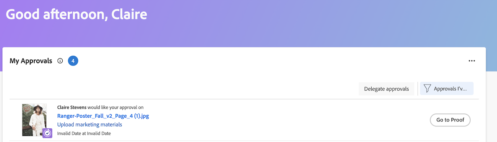

# 查看提交的验证审批

仅当您的Adobe Workfront环境与Workfront Proof Premium帐户集成时，验证审批才会显示在主页区域中。 如果您无法使用此处讨论的验证，请与Workfront管理员联系。

## 访问要求

+++ 展开以查看本文中各项功能的访问要求。

<table style="table-layout:auto"> 
 <col> 
 <col> 
 <tbody> 
  <tr> 
   <td role="rowheader">Adobe Workfront包</td> 
   <td> 
任何
 </td> 
  </tr> 
  <tr> 
   <td role="rowheader">Adobe Workfront许可证</td> 
   <td> 
   
贡献或更高

   
审核或更高
 </td> 
  </tr> 
  <tr> 
   <td role="rowheader">访问级别配置</td> 
   <td> 
查看或更高权限的项目、任务、问题、模板、项目组合、程序、报告、功能板和日历、文档
</td> 
  </tr> 
  <tr> 
   <td role="rowheader">对象权限</td> 
   <td> 
查看或更高权限访问与请求访问权限或审批关联的对象 
 </td> 
  </tr> 
 </tbody> 
</table>

有关信息，请参阅Workfront文档中的[访问要求](/help/quicksilver/administration-and-setup/add-users/access-levels-and-object-permissions/access-level-requirements-in-documentation.md)。

+++

## 查看提交的验证审批

1. 单击右上角的&#x200B;**[!UICONTROL 主菜单]** ，然后单击&#x200B;**[!UICONTROL 主页]**。
1. （视情况而定）单击&#x200B;**自定义**&#x200B;以添加&#x200B;**我的审批**&#x200B;小组件。
1. （视情况而定）单击&#x200B;**筛选器**&#x200B;下拉菜单，然后选择&#x200B;**我已提交的审批**&#x200B;以查看您提交的审批。

   

   >[!NOTE]
   >
   > 如果您向访客验证用户提交审批，则此审批不会显示在主页中。

1. （可选）单击右面板右上角的&#x200B;**转至验证**&#x200B;以启动验证查看器。

   <!--
   <note type="note">
   You must have View or Edit access to Documents in your Access Level to launch the proofing viewer.
   </note>
   -->
