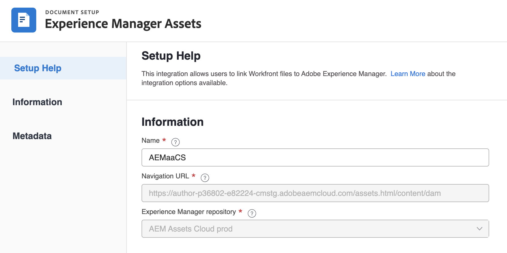

# 将Adobe Experience Manager与Workfront和Adobe云存储结合使用

您可以使用&#x200B;[!DNL Experience Manager Assets]&#x200B;管理和存储已过审阅和批准周期的数字资产。 此集成允许您利用Adobe Experience Manager、Frame.io和Workfront的功能来简化内容管理和协作流程。

## 配置Experience Manager Assets集成

您可以在&#x200B;[!DNL Experience Manager Assets]中将您的工作与您的内容连接起来：

* 将资源和元数据从[!DNL Adobe Workfront]推送到[!DNL Experience Manager Assets]&#x200B;
* 促进版本控制用例
* 跟踪资源的元数据
* 在[!DNL Workfront]和[!DNL Experience Manager Assets]之间同步项目元数据

>[!NOTE]
>
>您还可以跨组织ID将多个[!DNL Experience Manager Assets]存储库连接到一个[!UICONTROL Workfront]环境，或将多个[!DNL Workfront]环境连接到一个[!DNL Experience Manager Assets]存储库。 对于要设置的每个集成，请按照本文中的配置说明进行操作。

## 访问权限要求

+++ 展开可查看本文所述功能的访问权限要求。

<table>
  <tr>
   <td>Adobe Workfront 包
   </td>
   <td> 
Prime或Ultimate

    
工作流 Ultimate

   </td>
  </tr>
    <tr>
   <td>Adobe Workfront 许可证
   </td>
   <td>
  
要配置集成，请执行以下操作：

   
标准

   
规划

要将文档发送到Experience Manager Assets，请执行以下操作：

   
参与者或更高版本

   
请求或更高版本

   </td>
  </tr>
  </tr>
    <tr>
   <td>Adobe Experience Manager许可证
   </td>
   <td>标准
   </td>
  </tr>
  <tr>
   <td>其他产品
   </td>
   <td>您必须具有[!DNL Experience Manager Assets as a Cloud Service]，并且您必须作为用户添加到产品中。
   </td>
  </tr>
   <tr>
   <td>访问级别配置
   </td>
   <td>您必须是[!DNL Workfront]管理员。
   </td>
  </tr>
</table>

有关此表中信息的更多详细信息，请参阅Workfront文档中的[访问要求](/help/quicksilver/administration-and-setup/add-users/access-levels-and-object-permissions/access-level-requirements-in-documentation.md)。

+++

## 先决条件

开始之前，

* 您必须在[!DNL Adobe Admin Console]中将[!DNL Workfront]和[!DNL Adobe Experience Manager Assets]与组织ID关联。 有关详细信息，请参阅[基于平台的管理差异([!DNL Adobe Workfront]/[!DNL Adobe Business Platform])](/help/quicksilver/administration-and-setup/get-started-wf-administration/actions-in-admin-console.md)。
* 您的Workfront实例必须使用Adobe云存储。

## 设置集成信息

{{step-1-to-setup}}

1. 在左侧面板中选择&#x200B;**[!UICONTROL 文档]**，然后选择&#x200B;**[!UICONTROL [!DNL Experience Manager]集成]**。
1. 选择&#x200B;**[!UICONTROL 添加[!DNL Experience Manager]集成]**。
1. 在&#x200B;**[!UICONTROL 名称]**&#x200B;字段中，输入您希望用户在Workfront和Experience Manager Assets中与此集成交互时看到的名称。
1. 在&#x200B;**[!UICONTROL 导航URL]**&#x200B;字段中，系统会自动填充导航URL。 此只读URL用于从[!UICONTROL 主菜单]链接到组织的[!DNL Experience Manager]实例，以进行快速访问。
1. 从&#x200B;**[!UICONTROL [!DNL Experience Manager]Assets存储库]**&#x200B;下拉菜单中选择一个存储库。 系统会自动填充与您的用户配置文件所分配到的组织ID关联的任何[!DNL Experience Manager]存储库。
   

1. 单击&#x200B;**[!UICONTROL 保存]**&#x200B;或转到本文中的[设置元数据（可选）](#set-up-metadata-optional)部分。

   >[!IMPORTANT]
   >
   >由于集成的复杂性，您在保存初始配置后无法更改存储库。

## 设置元数据（可选）

您可以将[!DNL Workfront]对象数据映射到[!DNL Experience Manager] Assets中的资源媒体字段。

>[!NOTE]
>
>只能在一个方向上映射元数据：从[!DNL Workfront]到[!DNL Experience Manager]。 从[!DNL Experience Manager]链接到[!DNL Workfront]的文档的元数据无法传输到[!DNL Workfront]。

### 配置元数据字段

在开始映射元数据字段之前，必须在Workfront和Experience Manager Assets中配置元数据字段。

要配置元数据字段，请执行以下操作：

1. 在[!DNL Experience Manager Assets]中配置元数据架构，如[配置Adobe [!DNL Workfront] 和 [!DNL Experience Manager Assets]](https://experienceleague.adobe.com/en/docs/experience-manager-cloud-service/content/assets/integrations/configure-asset-metadata-mapping)之间的资源元数据映射中所述。

1. 在Workfront中配置自定义表单字段。 [!DNL Workfront]有许多您可以使用的内置自定义字段。 但是，您也可以创建自己的自定义字段，如[创建自定义表单](/help/quicksilver/administration-and-setup/customize-workfront/create-manage-custom-forms/form-designer/design-a-form/design-a-form.md)中所述。

+++ **展开以查看有关支持的Workfront和Experience Manager Assets字段的更多信息** 

**Experience Manager Assets标记**

您可以将任何Workfront支持的字段映射到Experience Manager Assets中的标记。 为此，您必须确保Experience Manager Assets中的标记值与Workfront匹配。

* 标记和Workfront字段值在拼写和格式上必须完全匹配。
* 映射到Workfront assets标记的Experience Manager字段值必须全部小写，即使Experience Manager Assets中的标记似乎包含大写字母。
* Workfront字段值不得包含空格。
* Workfront中的字段值还必须包含Experience Manager Assets标记的文件夹结构。
* 要将多个单行文本字段映射到标记，请在元数据映射的Workfront端和Experience Manager Assets端分别输入一个以逗号分隔的标记值列表，`xcm:keywords`。 每个字段值都映射到单独的标记。 您可以使用计算字段将多个Workfront字段组合到一个以逗号分隔的文本字段中。
* 您可以通过输入该字段中可用值的逗号分隔列表，来映射下拉字段、单选按钮或复选框字段中的值。

>[!INFO]
>
>**示例**：要匹配此处文件夹结构中显示的标记，Workfront中的字段值应为`landscapes:trees/spruce`。 请注意Workfront字段值中的小写字母。
>
>如果希望标记是标记树中最左边的项目，则必须后跟一个冒号。 在此示例中，要映射到景观标记，Workfront中的字段值将为`landscapes:`。
>
>AEM中的

在Experience Manager Assets中创建标记后，这些标记将显示在元数据部分的标记下拉列表下。 要将字段链接到标记，请在元数据映射区域的Experience Manager Assets字段下拉列表中选择`xcm:keywords`。

有关Experience Manager Assets中的标记（包括如何创建和管理标记）的更多信息，请参阅[管理标记](https://experienceleague.adobe.com/en/docs/experience-manager-64/administering/contentmanagement/tags)。

**Experience Manager Assets自定义元数据架构字段**

您可以将内置和自定义Workfront字段映射到Experience Manager Assets中的自定义元数据架构字段。

在Experience Manager Assets中创建的自定义元数据字段在元数据设置区域的相应部分中进行了组织。

<!-- 
link to documentation about creating schema - waiting on response from Anuj about best article to link to
-->

**Workfront字段**

您可以将内置和自定义Workfront字段映射到Experience Manager Assets。 Workfront和Experience Manager Assets之间的以下字段值的大小写和拼写必须匹配：

* 下拉字段
* 多选字段

>[!TIP]
>
> 要检查字段值是否完全匹配，请转到
>
> * Workfront中的设置>自定义Forms或对象中的字段
> * Experience Manager Assets中的Assets >元数据架构

+++

### 映射资源的元数据

首次从[!DNL Workfront]推送资产时元数据映射。 具有内置或自定义字段的文档在首次将资源发送到[!DNL Experience Manager Assets]时自动映射到指定的字段。

要映射资源的元数据，请执行以下操作：

<!--
1. Select **[!UICONTROL Assets]** above the metadata table.
-->
1. 在&#x200B;**[!UICONTROL [!DNL Workfront]字段]**&#x200B;列中，选择一个内置或自定义Workfront字段。

   >[!NOTE]
   >
   >您可以将单个[!DNL Workfront]字段映射到多个[!UICONTROL Experience Manager Assets]字段。 您无法将多个[!DNL Workfront]字段映射到单个[!DNL Experience Manager Assets]字段。
   ><!--To map a Workfront field to an Experience Manager Assets tag, see -->

1. 在[!DNL Experience Manager Assets]字段中，搜索预填充的类别，或在搜索字段中输入至少两个字母以访问其他类别。
1. 根据需要重复步骤2和3。
   
1. 单击&#x200B;[!UICONTROL **保存**]&#x200B;或移动到本文中的[对象元数据同步](#object-metadata-sync)部分。

### 对象元数据同步

映射到[!DNL Workfront]项目组合、计划、项目、任务、问题和文档字段的[!DNL Experience Manager]字段在[!DNL Workfront]中更改该字段时会自动更新。

启用此选项后，任何已推送到Adobe Experience Manager的资源都会在Workfront的“文档详细信息”页面上显示文档Adobe Experience Manager元数据的实时视图。

1. 启用&#x200B;**[!UICONTROL 同步对象元数据]**&#x200B;字段，然后单击&#x200B;**保存**。

>[!IMPORTANT]
>
>用户必须在[!DNL Experience Manager]中拥有对象中资产的写入权限，元数据才能在更新时同步。

## 将文档发送到Experience Manager Assets或Assets Essentials

您可以将文档从Workfront发送到Experience Manager Assets或Assets Essentials。 从Workfront上传并发送到Assets Essentials的文档仍会计入您的总体文档存储中。

通过此集成发送到Experience Manager的Assets具有&#x200B;**5o TB**&#x200B;的大小限制。

<!--In the Preview environment, Assets sent to Experience Manager through this integration have a size limit of **30 GB**.-->

在将资源从Workfront发送到Experience Manager Assets或Assets Essentials时，首先映射元数据字段。 配置为映射父对象的任何元数据也会发送。 有关配置元数据映射的详细信息，请参阅[配置Experience Manager Assets as a Cloud Service集成](/help/quicksilver/administration-and-setup/configure-integrations/configure-aacs-integration.md)或[配置Experience Manager Assets Essentials集成](/help/quicksilver/documents/adobe-workfront-for-experience-manager-assets-essentials/setup-asset-essentials.md)。

>[!INFO]
>
>**示例**&#x200B;首次发送附加到项目的资源时，元数据将映射到Experience Manager Assets或Assets Essentials以及父对象（例如项目组合和项目群）中的任何映射元数据。

### 从Workfront发送文档

当用户将文档从Workfront发送到Experience Manager Assets或Assets Essentials时，映射的元数据将沿文档传输。 发送文档后，在Workfront中对文档元数据所做的更改不会反映在Assets或Assets Essentials中。 如果Workfront中的映射字段发生更改，您必须将包含更新后元数据的文档的新版本发送到Assets或Assets Essentials。

要发送文档，请执行以下操作：

1. 转到Workfront中的&#x200B;**文档**&#x200B;区域，然后选择要发送的文档。
1. 在屏幕底部的栏中，单击&#x200B;**发送至**。

1. 选择您的管理员设置的Experience Manager集成，然后单击&#x200B;**发送**。

   >[!NOTE]
   >
   >Workfront管理员可以选择此集成的任何名称，因此可能没有特别提及Assets或Assets Essentials。

1. 选择要将资源放置到的位置，然后单击&#x200B;**选择文件夹**。

## 从Experience Manager Assets链接内容

要链接内容，请执行以下操作：

1. 转到要在其中链接内容的Workfront对象。
1. 单击左侧面板中的&#x200B;**文档**&#x200B;部分。
1. 单击页面右侧的&#x200B;**新建**，然后单击&#x200B;**AEM文件**&#x200B;以链接单个资源。
   

1. 使用内容审查程序，您可以：

   <table style="table-layout:auto">
   <tbody>
      <tr>
         <td><strong>使用AI 搜索搜索资源。</strong> 使用AI支持的搜索，该搜索理解查询背后的含义和意图，支持多种语言、拼写错误和同义词。</td>
         <td>有关详细信息，请参阅<a href="https://experienceleague.adobe.com/en/docs/experience-manager-cloud-service/content/assets/manage/content-advisor-adobe-applications#content-advisor-ai-search">更智能的资源发现AI 搜索</a>。</td>
      </tr>
      <tr>
         <td><strong>根据上下文和意图查看智能建议。</strong> 使用宿主Adobe应用程序提供的上下文感知推荐，探索符合您的内容需求的资源。</td>
         <td>有关详细信息，请参阅<a href="https://experienceleague.adobe.com/en/docs/experience-manager-cloud-service/content/assets/manage/content-advisor-adobe-applications#smart-suggestions-content-advisor">基于上下文和意图的智能建议</a>。</td>
      </tr>
      <tr>
         <td><strong>上传营销活动简报以发现相关资源。</strong> 上传PDF、DOCX或TXT营销活动简介文档，以便内容顾问可以分析该文档并推荐相关资源。</td>
         <td>有关详细信息，请参阅<a href="https://experienceleague.adobe.com/en/docs/experience-manager-cloud-service/content/assets/manage/content-advisor-adobe-applications#campaign-briefs-content-advisor">发现相关资产的Campaign简介</a>。</td>
      </tr>
      <tr>
         <td><strong>查看和选择Dynamic Media资源演绎版。</strong> 浏览渠道优化演绎版（包括图像预设、智能裁剪和格式类型），并应用Dynamic Media修饰符实时预览调整。</td>
         <td>有关详细信息，请参阅<a href="https://experienceleague.adobe.com/en/docs/experience-manager-cloud-service/content/assets/manage/content-advisor-adobe-applications#dynamic-media-renditions-content-advisor">可供使用的Dynamic Media资源演绎版</a>。</td>
      </tr>
      <tr>
         <td><strong>将Dynamic Media修饰符应用于演绎版。</strong> 添加修饰符以实时转换资源演绎版，并在为主机应用程序选择演绎版之前预览结果。</td>
         <td>有关详细信息，请参阅<a href="https://experienceleague.adobe.com/en/docs/experience-manager-cloud-service/content/assets/manage/content-advisor-adobe-applications#dynamic-media-renditions-content-advisor">可供使用的Dynamic Media资源演绎版</a>。</td>
      </tr>
      <!--
      <tr>
         <td><strong>Discover and browse Content Fragments.</strong> Search through Content Fragments, view live thumbnail previews, check status (Draft, Modified, or Published), and inspect detailed properties, references, and variations.</td>
         <td>For more information, see <a href="https://experienceleague.adobe.com/en/docs/experience-manager-cloud-service/content/assets/manage/content-advisor-adobe-applications#content-fragments-discovery-content-advisor">Discovery of Content Fragments</a>.</td>
      </tr>
      -->
      <tr>
         <td><strong>访问资源元数据。</strong> 查看与Assets视图一致的资源属性，例如标题、描述、格式、大小和其他元数据选项卡（产品、营销活动、标记）。</td>
         <td>有关详细信息，请参阅<a href="https://experienceleague.adobe.com/en/docs/experience-manager-cloud-service/content/assets/manage/content-advisor-adobe-applications#asset-metadata-content-advisor">访问与Assets视图一致的资源元数据</a>。</td>
      </tr>
      <tr>
         <td><strong>使用预定义筛选器筛选资源。</strong> 使用文件类型、文件格式、资源状态、文件大小、图像宽度、图像高度、修改日期和创建日期等过滤器优化资源结果。</td>
         <td>有关详细信息，请参阅<a href="https://experienceleague.adobe.com/en/docs/experience-manager-cloud-service/content/assets/manage/content-advisor-adobe-applications#filters-content-advisor">与Assets视图一致的访问筛选器</a>。</td>
      </tr>
      <tr>
         <td><strong>保存并重用搜索。</strong> 通过指定搜索词和过滤器选项创建保存的搜索，然后在Experience Manager Assets和其他Adobe应用程序中重复使用它们。</td>
         <td>有关详细信息，请参阅<a href="https://experienceleague.adobe.com/en/docs/experience-manager-cloud-service/content/assets/manage/content-advisor-adobe-applications#saved-searches-content-advisor">访问和重复使用最近和保存的搜索</a>。</td>
      </tr>
      <tr>
         <td><strong>在收藏集间和收藏集中搜索资产。</strong> 在所有收藏集中搜索资产或收藏集，或将搜索限制在特定收藏集中。</td>
         <td>有关详细信息，请参阅<a href="https://experienceleague.adobe.com/en/docs/experience-manager-cloud-service/content/assets/manage/content-advisor-adobe-applications#search-collections-content-advisor">在收藏集间和收藏集中搜索资产</a>。</td>
      </tr>
   </tbody>
   </table>

   >[!NOTE]
   >
   >内容指导中的推荐内容使用来自以下项的数据来确定Workfront中的推荐内容：
   >
   >* Workfront对象名称和描述字段
   >* 标记为必填的自定义表单字段
   >* 来自附加文档的数据

<!--
### Link a new version from Experience Manager Assets

You can pull new content over from Experience Manager Assets and add it to an existing asset as a new version. If the document is already linked and a new version is added in Experience Manager Assets, the new version appears automatically in Workfront.

To link a new version:

1. Go to the Workfront object where you want to link content.
1. Click the **Documents** section in the left panel.
1. Select the asset you want to replace with a new version. You can't create a new version of an asset in a linked folder.
1. Select **Add New** > **Version**, then select the Experience Manager integration your administrator set up.

   >[!NOTE]
   >
   >The Workfront administrator can choose any name for this integration, so it might not specifically mention Experience Manager Assets.

1. Select the content you want to link.
1. Click **Select**.
-->

<!--
## Link a folder from Experience Manager Assets

Permissions to view individual assets inside of a folder rely on Experience Manager Assets permissions.

To link a folder:

1. Go to the Workfront object where you want to link content.
1. Click the **Documents** section in the left panel.
1. Click **Assets** > **Files & Folders**.
1. Click the **Filter** icon, then in the **Asset Type** section, choose **Folders**.
1. Select the folder you want to link.
1. Click **Select**.
-->

## 注意事项

* 链接的AEM资源不支持审阅和批准工作流。
* 在将资源从Workfront发送到Experience Manager Assets时，首先映射元数据字段。 如果您的Workfront管理员启用了对象元数据同步，则在任一应用程序中更改了某些字段后，这些字段将保持最新状态。

<!--
 not sure if this is in yet

### Send a new version

You can add a new version to a document you have previously uploaded to Workfront. For more information, see [Upload a new version of a document](/help/quicksilver/documents/managing-documents/upload-new-document-version.md). After the latest version is uploaded, you can send it to Assets Essentials. If a mapped field in Workfront has changed, the new version updates the metadata in Assets Essentials when it sends.

>[!IMPORTANT]
>
>Before you upload a new version to Workfront, we recommend renaming the file. If you upload a new version with the exact same file name as a previous version, only the most recent version can be downloaded from Workfront. All versions can be downloaded from Experience Manager Assets or Assets Essentials regardless of the file name. - is this accuate for ESM?

To send the most recent version:

1. Go to the **Documents** area in Workfront, and locate the document.
1. In the bar at the bottom of the screen, click **Send to**. 

1. Choose the Experience Manager integration your administrator set up, then click **Send**.

   >[!NOTE]
   >
   >The Workfront administrator can choose any name for this integration, so it might not specifically mention Assets or Assets Essentials.

1. Click **Save**. The new version saves in the same location as the previous version.
 
 -->