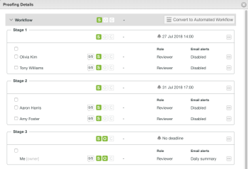

# 自动化工作流暂存概述

验证阶段是不同用户查看验证的时间段。 当校样从一个阶段移动到下一个阶段时，Adobe Workfront会通知审阅人，告知他们何时需要处理校样。

阶段在两种不同的情况下发生：

* [使用自动化工作流创建验证](#create-a-proof-with-an-automated-workflow)
* [为验证上的不同查看者分配截止日期](#assign-deadlines-for-different-reviewers-on-a-proof)

## 使用自动化工作流创建验证 {#create-a-proof-with-an-automated-workflow}

将自动化工作流添加到验证时，您可以设置希望发生的审阅工作的阶段。

使用自动工作流为验证设置阶段时：

* 可以将阶段配置为连续运行或同时运行。
* 您可以将某些阶段配置为仅在前一个阶段完成后才变为活动状态。
* 你可以让一些阶段成为私有。 例如，这对于在与客户共享验证之前查看验证并且不希望客户看到由此产生的评论的机构非常有用。

有关使用自动化工作流创建验证阶段的说明，请参阅[使用自动化工作流创建高级验证](../../../review-and-approve-work/proofing/creating-proofs-within-workfront/create-automated-proof-workflow.md)。

>[!NOTE]
>
>如果用户未包含在任何阶段，但有权访问文档并打开验证，则系统会创建一个名为&#x200B;*Workfront*&#x200B;的阶段。
>
>打开验证的用户被分配了设置>审阅和审批>打开文档验证的非收件人角色中指定的角色。

## 为验证上的不同查看者分配截止日期 {#assign-deadlines-for-different-reviewers-on-a-proof}

为验证上的审阅人分配不同的验证截止日期时，系统会为每个截止日期创建一个阶段，并为相应阶段中的每个截止日期对审阅人进行分组。 

**示例：**&#x200B;例如，如果您创建了一个包含四个审阅人的校样：

* 对于审稿人Olivia和Tony，您为几天后的14:00指定了截止时间。
* 您为Aaron和Amy指定了几天后17:00的最后期限。
* 您没有为自己指定截止日期。

系统为每个审阅人创建一个阶段，这三组审阅人包括：

如果您与其他查看者共享验证并且未指定截止日期，则Workfront会将用户添加到阶段3，其中没有截止日期。 
