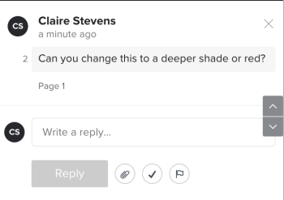

# 解决验证评论

可在注释解决后将其标记为已解决。 您可以重新打开您或其他审阅人已解决的评论。

## 访问权限要求

+++ 展开可查看本文所述功能的访问权限要求。

<table style="table-layout:auto"> 
 <col> 
 <col> 
 <tbody> 
  <tr> 
   <td role="rowheader">Adobe Workfront 包</td> 
   <td> 
“任一”
 </td> 
  </tr> 
  <tr> 
   <td role="rowheader">Adobe Workfront许可证</td> 
   <td> 
“任一”
</td> 
  </tr> 
  <tr> 
   <td role="rowheader">校样权限配置文件</td> 
   <td>经理或更高版本</td> 
  </tr> 
  <tr> 
   <td role="rowheader">验证角色</td> 
   <td>作者或审查方</td> 
  </tr> 
  <tr> 
   <td role="rowheader">访问级别配置</td> 
   <td> 
编辑对文档的访问权限
 </td> 
  </tr> 
 </tbody> 
</table>

有关信息，请参阅Workfront文档中的[访问要求](/help/quicksilver/administration-and-setup/add-users/access-levels-and-object-permissions/access-level-requirements-in-documentation.md)。

+++

## 解决评论

1. 转到包含文档的项目、任务或问题，然后选择&#x200B;**文档**。
1. 找到所需的校对，然后单击&#x200B;**打开校对**。

1. （视情况而定）如果评论区域未打开，请单击右上角的&#x200B;**查看评论**。
1. 选择注释。
1. 单击评论右下角的复选标记图标。 评论的左上角出现绿色复选标记，“线程已解决”标签和消息出现在其下方。 提交评论的用户会收到一封电子邮件通知，告知评论已解决。

   

## 重新打开已解决的评论

1. 转到包含文档的项目、任务或问题，然后选择&#x200B;**文档**。
1. 找到所需的校对，然后单击&#x200B;**打开校对**。

1. （视情况而定）如果评论区域未打开，请单击右上角的&#x200B;**查看评论**。
1. 选择注释。
1. 单击评论右下角的绿色复选标记图标（**回复**&#x200B;按钮右侧）。 评论左上角的复选标记消失，并在其下方显示“线程重新打开”标签和消息。 提交评论的用户会收到一封电子邮件通知，告知该评论已重新打开。

   
