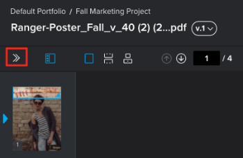

# 管理验证评论和决策的通知

<!-- Audited: 4/2025 -->

处理验证时，无论您是Adobe Workfront用户还是外部协作者，都可以指定您想要接收哪些有关对验证所做的评论和决策的电子邮件通知。 有关详细信息，请参阅[校对评论和决策概述](../../../review-and-approve-work/proofing/proofing-overview/notifications-proof-comments-decisions.md)的通知。

>[!NOTE]
>
>这些通知不同于您可以收到的有关审阅人之间验证流程的电子邮件警报，以及可在Workfront中配置的电子邮件警报设置。

## 访问要求

+++ 展开以查看本文中各项功能的访问要求。

<table style="table-layout:auto"> 
 <col> 
 <col> 
 <tbody> 
  <tr> 
   <td role="rowheader">Adobe Workfront包</td> 
   <td> 
任何
 </td> 
  </tr> 
  <tr> 
   <td role="rowheader">Adobe Workfront许可证</td> 
   <td> 
任何
 </td> 
  </tr> 
  <tr> 
   <td role="rowheader">验证角色 </td> 
   <td>审阅人、审阅人和审批人、作者、审查方</td> 
  </tr> 
  <tr> 
   <td role="rowheader">校样权限配置文件 </td> 
   <td>经理或更高版本</td> 
  </tr> 
  <tr> 
   <td role="rowheader">访问级别配置</td> 
   <td> 
编辑对文档的访问权限
 </td> 
  </tr> 
 </tbody> 
</table>

有关信息，请参阅Workfront文档中的[访问要求](/help/quicksilver/administration-and-setup/add-users/access-levels-and-object-permissions/access-level-requirements-in-documentation.md)。

+++

## 管理验证评论和决策的通知

1. 打开要为其配置通知的验证。
1. 如果未显示左侧工具栏，请单击Web验证查看器左上角的&#x200B;**菜单**&#x200B;图标。

   

1. 在左侧工具栏中，单击&#x200B;**设置**&#x200B;图标 。

1. 在&#x200B;**向我发送关于**&#x200B;的电子邮件通知部分中，选择此验证的通知设置。

   <table style="table-layout:auto"> 
    <col> 
    <col> 
    <tbody> 
     <tr> 
      <td role="rowheader">所有活动</td> 
      <td>每次验证上存在任何活动（如新评论、回复或决策）时，都会向查看者发送电子邮件。 
建议管理验证流程的人员使用此设置，因为他们可以查看所发生的活动。 用户不会收到有关其自身活动（例如，评论、回复或做出的决策）的电子邮件警报。
</td> 
     </tr> 
     <tr> 
      <td role="rowheader">回复我的评论</td> 
      <td>仅当某人直接回复其评论（不包括他们自己的回复）时，才会向审阅人发送电子邮件。
建议为您的客户端使用此设置，以便他们仅收到对自己的评论的回复的通知，不会收到对验证所做的任何其他评论的通知，但他们仍然可以在验证查看器中查看所有评论。

      
有关信息，请参阅<a href="../../../review-and-approve-work/proofing/reviewing-proofs-within-workfront/comment-on-a-proof/view-proof-comments.md" class="MCXref xref">查看和回复校对评论</a>。
</td> 
     </tr> 
     <tr> 
      <td role="rowheader">决策</td> 
      <td>仅当有人做出决定时，才会向审阅人发送电子邮件。 
此电子邮件警报对管理审批流程的人员非常有用，因为它允许管理审批流程的人员监控验证进度并查看哪些用户做出了决定。 

除非您在提交决策时选择了电子邮件确认选项，否则不会通知您自己的决策。
</td> 
     </tr> 
     <tr> 
      <td role="rowheader">最终决定</td> 
      <td>对验证做出最终决定时会发送电子邮件。 
此警报通常由设计人员使用，因为设计人员不需要参与实际的审阅讨论。 当做出最终决定时，设计人员会收到通知，然后可以对任何必要的更改执行操作。 
</td> 
     </tr> 
     <tr> 
      <td role="rowheader">每小时摘要</td> 
      <td>每小时会向查看者发送一封电子邮件，其中包含过去一小时内发生的所有评论、回复和决策的摘要。 
仅当过去一小时内发生除您自己的活动以外的活动时，才会发送电子邮件。 如果其他用户没有活动，则不会发送电子邮件。 

此警报非常适合用于在项目过程中查看项目概述。
</td> 
     </tr> 
     <tr> 
      <td role="rowheader">每日摘要</td> 
      <td>（默认设置）：每天都会发送一封电子邮件，其中列出了所有评论、回复和决策。 仅当您的活动之外有活动时才发送。 
此警报非常适合用于查看项目摘要，而不会在一天之内出现多次更新。 
</td> 
     </tr> 
     <tr> 
      <td role="rowheader">无电子邮件</td> 
      <td>不发送电子邮件提醒。 
此设置对于仅出于参考目的添加到验证而无需通知任何更改的人员非常有用。

注释： 
此选项仅关闭有关验证评论和决策的电子邮件警报；它不会关闭您收到的有关验证流程的电子邮件警报，例如新验证或延迟验证电子邮件。 有关更多信息，请参阅以下文章： 

        <ul>
         <li><a href="../../../workfront-proof/wp-emailsntfctns/proof-notifications-and-reminders/new-proof-email.md" class="MCXref xref">新验证电子邮件</a></li>
         <li><a href="../../../workfront-proof/wp-emailsntfctns/proof-notifications-and-reminders/new-version-email.md" class="MCXref xref">新版本电子邮件</a></li>
         <li><a href="../../../workfront-proof/wp-emailsntfctns/proof-notifications-and-reminders/late-proof-email.md" class="MCXref xref">延迟验证电子邮件</a></li>
         <li><a href="../../../workfront-proof/wp-emailsntfctns/proof-notifications-and-reminders/proof-made-email.md" class="MCXref xref">校对已发送电子邮件</a></li>
        </ul>
</td> 
     </tr> 
    </tbody> 
   </table>
