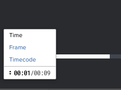

# 更改视频验证中时间轴的测量单位

您可以调整视频时间轴中使用的测量单位。 您可以按“时间”、“帧”或“时间码”查看时间轴。

## 访问要求

+++ 展开以查看本文中各项功能的访问要求。

<table style="table-layout:auto"> 
 <col> 
 <col> 
 <tbody> 
  <tr> 
   <td role="rowheader">Adobe Workfront包</td> 
   <td> 
任何
 </td> 
  </tr> 
  <tr> 
   <td role="rowheader">Adobe Workfront许可证</td> 
   <td> 
任何
 </td> 
  </tr> 
  <tr> 
   <td role="rowheader">验证角色 </td> 
   <td>审阅人、审阅人和审批人、作者、审查方</td> 
  </tr> 
  <tr> 
   <td role="rowheader">校样权限配置文件 </td> 
   <td>经理或更高版本</td> 
  </tr> 
  <tr> 
   <td role="rowheader">访问级别配置</td> 
   <td> 
编辑对文档的访问权限
 </td> 
  </tr> 
 </tbody> 
</table>

有关信息，请参阅Workfront文档中的[访问要求](/help/quicksilver/administration-and-setup/add-users/access-levels-and-object-permissions/access-level-requirements-in-documentation.md)。

+++

## 更改时间线的度量单位

1. 转到包含文档的项目、任务或问题，然后选择&#x200B;**文档**。
1. 找到所需的校对，然后单击&#x200B;**打开校对**。

1. 在校样查看器的左下角，单击当前度量单位。

   

1. 从以下选项中选择：

   <table style="table-layout:auto"> 
    <col> 
    <col> 
    <tbody> 
     <tr> 
      <td role="rowheader">时间</td> 
      <td>以分钟/秒为单位显示视频时间轴。 默认情况下，该选项处于选中状态。</td> 
     </tr> 
     <tr> 
      <td role="rowheader">框架</td> 
      <td>以帧为单位显示视频时间轴。 校对查看器使用原始文件上的信息来确定每秒显示的帧数。</td> 
     </tr> 
     <tr> 
      <td role="rowheader">时间码</td> 
      <td>以时间代码显示视频时间轴。 时间码的数字表示小时、分钟、秒和帧。 
Example: </b>"><b>示例： </b>时间码1:48:36:18表示视频中有1小时、48分钟、36秒和18帧。
</td> 
     </tr> 
    </tbody> 
   </table>
