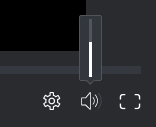

# 控制视频验证中的播放

## 访问权限要求

+++ 展开可查看本文所述功能的访问权限要求。

<table style="table-layout:auto"> 
 <col> 
 <col> 
 <tbody> 
  <tr> 
   <td role="rowheader">Adobe Workfront 包</td> 
   <td> 
“任一”
 </td> 
  </tr> 
  <tr> 
   <td role="rowheader">Adobe Workfront许可证</td> 
   <td> 
“任一”
 </td> 
  </tr> 
  <tr> 
   <td role="rowheader">验证角色 </td> 
   <td>审阅人、审阅人和审批人、作者、审查方</td> 
  </tr> 
  <tr> 
   <td role="rowheader">校样权限配置文件 </td> 
   <td>经理或更高版本</td> 
  </tr> 
  <tr> 
   <td role="rowheader">访问级别配置</td> 
   <td> 
编辑对文档的访问权限
 </td> 
  </tr> 
 </tbody> 
</table>

有关信息，请参阅Workfront文档中的[访问要求](/help/quicksilver/administration-and-setup/add-users/access-levels-and-object-permissions/access-level-requirements-in-documentation.md)。

+++

## 调整视频播放速度

您可以调整视频校样的播放速度。 您可以选择以四分之一速度观看视频，以加倍速度。

1. 转到包含文档的项目、任务或问题，然后选择&#x200B;**文档**。
1. 找到所需的校对，然后单击&#x200B;**打开校对**。

1. 在验证查看器的右下角，单击&#x200B;**设置**&#x200B;图标。

   

1. 单击当前速度，然后选择新的回放速度。
1. 单击视频上的&#x200B;**播放**&#x200B;按钮以测试新速度。

## 逐帧查看视频

要更详细地查看视频校样，您可以手动逐帧查看视频。

1. 转到包含文档的项目、任务或问题，然后选择&#x200B;**文档**。
1. 找到所需的校对，然后单击&#x200B;**打开校对**。

1. 在校对查看器的底部，单击&#x200B;**前进**&#x200B;和&#x200B;**后退**&#x200B;箭头逐帧查看视频。

   

## 更改播放音量

您可以控制视频播放中的音量。

1. 转到包含文档的项目、任务或问题，然后选择&#x200B;**文档**。
1. 找到所需的校对，然后单击&#x200B;**打开校对**。

1. 在校对查看器的右下角，将鼠标悬停在&#x200B;**音量**&#x200B;图标上，然后拖动滑块以选择新的音量。

   

   或

   单击&#x200B;**卷**&#x200B;图标将卷静音并取消静音。
