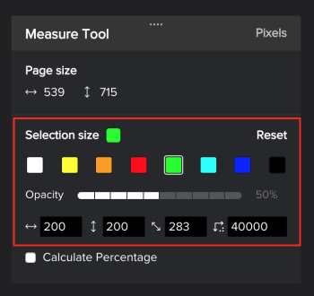

# 测量校样内的区域

您可以测量校样中的区域。

## 访问要求

您必须具有以下访问权限才能执行本文中的步骤：

<table style="table-layout:auto"> 
 <col> 
 <col> 
 <tbody> 
  <tr> 
   <td role="rowheader">Adobe Workfront计划*</td> 
   <td> 
当前计划：Pro或更高版本
 
或
 
旧版计划：选择或Premium
 
有关使用不同计划校对访问权限的更多信息，请参阅 <a href="/help/quicksilver/administration-and-setup/manage-workfront/configure-proofing/access-to-proofing-functionality.md" class="MCXref xref">访问Workfront中的校对功能</a>.
 </td> 
  </tr> 
  <tr> 
   <td role="rowheader">Adobe Workfront许可证*</td> 
   <td> 
当前计划：工作或计划
 
旧版计划：任意（必须为用户启用校样）
 </td> 
  </tr> 
  <tr> 
   <td role="rowheader">校对权限配置文件 </td> 
   <td>经理或更高级别</td> 
  </tr> 
  <tr> 
   <td role="rowheader">访问级别配置*</td> 
   <td> 
编辑对文档的访问
 
有关请求其他访问权限的信息，请参阅 <a href="../../../../workfront-basics/grant-and-request-access-to-objects/request-access.md" class="MCXref xref">请求对对象的访问 </a>.
 </td> 
  </tr> 
 </tbody> 
</table>

&#42;要了解您拥有的计划、角色或校样权限配置文件，请联系您的Workfront或Workfront校样管理员。

## 测量校样内的区域

1. 转到包含文档的项目、任务或问题，然后选择 **文档**.
1. 找到所需的校样，然后单击 **打开校样**.

1. 单击 **测量区域** 图标。

   

1. （可选）单击 **测量标记颜色** 要展开颜色选项，请单击颜色，然后 **不透明度** 你的证据很容易看到。\
   

   默认测量工具颜色为红色。

   校样查看器会记住您打开的所有校样上的颜色和不透明度选择，直到您清除浏览器缓存。

1. （可选）选择其他 **测量单位。**

   >[!NOTE]
   >
   >“测量单位”选项仅可用于通过PDF创建的校样。

1. 将测量窗口拖动到需要测量的校样区域。

   

1. 拖动测量窗口的角或边以调整其大小。
1. （可选）如果需要测量区域的确切大小，请键入 **选择大小** 值。
1. （可选）如果您需要测量某个区域内的特定百分比，请选中计算百分比框。 随即会出现一个新框，允许您调整该框\
   
