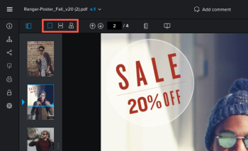

# 在校样中查看内容

## 访问要求

您必须具有以下访问权限才能执行本文中的步骤：

<table style="table-layout:auto"> 
 <col> 
 <col> 
 <tbody> 
  <tr> 
   <td role="rowheader">Adobe Workfront计划*</td> 
   <td> 
当前计划：Pro或更高版本
 
或
 
旧版计划：选择或Premium
 
有关使用不同计划校对访问权限的更多信息，请参阅 <a href="/help/quicksilver/administration-and-setup/manage-workfront/configure-proofing/access-to-proofing-functionality.md" class="MCXref xref">访问Workfront中的校对功能</a>.
 </td> 
  </tr> 
  <tr> 
   <td role="rowheader">Adobe Workfront许可证*</td> 
   <td> 
当前计划：工作或计划
 
旧版计划：任意（必须为用户启用校样）
 </td> 
  </tr> 
  <tr> 
   <td role="rowheader">校对权限配置文件 </td> 
   <td>经理或更高级别</td> 
  </tr> 
  <tr> 
   <td role="rowheader">访问级别配置*</td> 
   <td> 
编辑对文档的访问
 
有关请求其他访问权限的信息，请参阅 <a href="../../../../workfront-basics/grant-and-request-access-to-objects/request-access.md" class="MCXref xref">请求对对象的访问 </a>.
 </td> 
  </tr> 
 </tbody> 
</table>

&#42;要了解您拥有的计划、角色或校样权限配置文件，请联系您的Workfront或Workfront校样管理员。

## 更改校样的视图

您可以在单个视图、连续视图或杂志视图中查看包含多个页面的静态校样。

1. 转到包含文档的项目、任务或问题，然后选择 **文档**.
1. 找到所需的校样，然后单击 **打开校样**.

1. 在校样查看器的左上角区域，找到查看选项。\
   

1. 单击以下任意选项：

   <table style="table-layout:auto"> 
    <col> 
    <col> 
    <tbody> 
     <tr> 
      <td role="rowheader">单个视图</td> 
      <td>一次只显示一个页面。 单击要查看的页面缩略图，或按向左和向右箭头键在页面之间导航。 </td> 
     </tr> 
     <tr> 
      <td role="rowheader">连续视图</td> 
      <td>在单个堆叠视图中显示所有页面。 单击要查看的页面缩略图，或按向左和向右箭头键以在连续视图中向上或向下滚动所有页面。 </td> 
     </tr> 
     <tr> 
      <td role="rowheader">杂志视图</td> 
      <td>在单个杂志视图（并排和堆叠）中显示所有页面。 单击要查看的页面缩略图，或按向左和向右箭头键在所有页面之间滚动。 </td> 
     </tr> 
    </tbody> 
   </table>

## 使用缩略图

缩略图面板显示在校样查看器的左侧。 您可以使用缩略图区域在校样中导航。 当校样包含多个页面时，缩略图特别有用。

* [隐藏和显示缩略图面板](#hide-and-display-the-thumbnails-panel)
* [缩放和平移缩略图视图](#zoom-and-pan-in-the-thumbnail-view)

### 隐藏和显示缩略图面板 {#hide-and-display-the-thumbnails-panel}

默认情况下，将显示缩略图面板。 您可以隐藏或调整面板的大小。

1. 转到包含文档的项目、任务或问题，然后选择 **文档**.
1. 找到所需的校样，然后单击 **打开校样**.

1. 单击 **缩略图** 图标。\
   

1. （可选）再次单击缩略图图标以显示缩略图面板。

   >[!TIP]
   >
   >您可以将鼠标悬停在缩略图面板的右边缘上，以调整面板的大小。

### 缩放和平移缩略图视图 {#zoom-and-pan-in-the-thumbnail-view}

缩略图面板中的缩放区域显示您当前正在查看的校样区域。 您可以调整缩略图区域中的缩放比例，也可以平移区域以查看校样的不同部分。

要缩放和平移缩览图视图，请执行以下操作：

1. 转到包含文档的项目、任务或问题，然后选择 **文档**.
1. 找到所需的校样，然后单击 **打开校样**.

1. 在缩略图面板中找到当前缩放区域。\
   缩放区域在缩览图边缘周围显示为蓝色框架。

   

1. 要调整缩放区域的大小，请拖动缩放区域的右下角，直到达到所需的大小。
1. 要将缩放区域移动到校样的其他部分，请拖动缩放区域，直到它覆盖要查看的校样部分为止。

## 旋转校样

您可以在校样查看器中旋转校样。 旋转包含多个页面的校样时，所有页面都会同时旋转。

1. 转到包含文档的项目、任务或问题，然后选择 **文档**.
1. 找到所需的校样，然后单击 **打开校样**.

1. 单击 **旋转** 图标。

   

   每次单击 **旋转** 图标。

## 缩放和平移校样

在查看校样时，您可以调整缩放百分比。 以较大的缩放百分比查看校样时，“平移”选项允许您使用光标导航到校样的不同区域。

1. 转到包含文档的项目、任务或问题，然后选择 **文档**.
1. 找到所需的校样，然后单击 **打开校样**.

1. 执行以下任一操作可调整校样的缩放百分比：

   * 单击 **缩放** 图标，然后单击校样以在更高的缩放级别查看校样，或者跨校样的某个区域拖动以仅查看该区域。

      

   * 单击当前缩放百分比，单击新的缩放百分比，或单击 **适合宽度**, **适合高度**&#x200B;或 **适合页面大小**.

      

   * 单击 **加号** 或 **减号** 图标，以增加或减少缩放百分比。

      

1. 如果需要平移到视频校样上的特定区域，请单击 **盘** 图标，然后根据需要拖动校样。

   

   >[!TIP]
   >
   >要在缩放和平移工具之间轻松切换，请在使用缩放图标进行平移时按住空格键。
