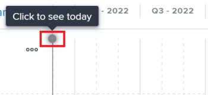

# 在[!DNL Scenario Planner]中创建和编辑计划

<!--Audited: 07/2024-->

使用[!UICONTROL Adobe Workfront Scenario Planner]时，您可以在已创建或已与您共享的计划中创建计划。 通过创建计划，您可以显示较小的组织单位对计划完成的贡献。 例如，如果贵组织有计划在未来三年内向新市场扩展，则您可以在此计划内为每个部门创建计划，以估计每个部门完成此计划所需的人员和预算。

## 访问要求

+++ 展开以查看本文中各项功能的访问要求。

<table style="table-layout:auto"> 
 <col> 
 <col> 
 <tbody> 
  <tr> 
   <td> 
[!DNL Adobe Workfront] 计划*
 </td> 
   <td> <ul></li>
   <li>
新增功能：Ultimate 
</li>
   
Scenario Planner不可用于新的Workfront Select或Workfront Prime计划。 

   <li>
当前： [!UICONTROL Business]或更高版本
</ul>
   </td> 
  </tr> 
  <tr> 
   <td> 
[!DNL Adobe Workfront] 许可证*
 </td> 
   <td> 
新增：浅色或更高
 
   
当前： [!UICONTROL Review]或更高版本
 </td> 
  </tr> 
  <tr> 
   <td>产品* </td> 
   <td> <ul><li>
对于新的Workfront计划：

 Adobe Workfront</li>

   <li>
对于当前Workfront计划： 

   
Adobe Workfront
 
Adobe Workfront Scenario Planner
</li></ul>

有关详细信息，请参阅<a href="../scenario-planner/access-needed-to-use-sp.md" class="MCXref xref">使用[!DNL Scenario Planner]</a>所需的访问权限。 
 </td> 
  </tr> 
  <tr data-mc-conditions=""> 
   <td>访问级别 </td> 
   <td> 
[!UICONTROL Edit]访问 [!DNL Scenario Planner]
 </td> 
  </tr> 
  <tr data-mc-conditions=""> 
   <td> 
对象权限 
 </td> 
   <td> 
[!UICONTROL Manage]对计划的权限
 
有关请求对计划的附加访问权限的信息，请参阅<a href="../scenario-planner/request-access-to-plan.md" class="MCXref xref">在[!DNL Scenario Planner]</a>中请求对计划的访问权限。
 </td> 
  </tr> 
 </tbody> 
</table>

*有关信息，请参阅[Workfront文档的访问要求](/help/quicksilver/administration-and-setup/add-users/access-levels-and-object-permissions/access-level-requirements-in-documentation.md)。

+++

## 先决条件

您必须先创建计划，或者另一个用户必须与您共享计划，然后才能在该计划中创建计划。 有关创建计划的信息，请参阅[在 [!DNL Scenario Planner]](../scenario-planner/create-and-edit-plans.md)中创建和编辑计划。

有关什么是计划的详细信息，请参阅 [!DNL Scenario Planner][&#128279;](../scenario-planner/initiatives-overview.md)中的计划概述。

## 创建计划

您可以通过以下方式创建计划：

* 从头开始。
* 通过将项目导入计划

  有关将项目作为计划中的计划导入的信息，请参阅[将项目导入计划中的计划 [!DNL Scenario Planner]](../scenario-planner/import-projects-to-plans.md)。

* 通过复制现有计划。

  有关复制计划的信息，请参阅[复制 [!DNL Scenario Planner]](../scenario-planner/copy-initiatives.md)中的计划。

要从头开始创建计划，请执行以下操作：

{{step1-to-scenario-planner}}

1. 单击要为其创建方案的计划的名称。
1. 单击&#x200B;**[!UICONTROL 新计划]**&#x200B;左侧的&#x200B;**+图标**

   或

   单击&#x200B;**[!UICONTROL 新计划]**&#x200B;下拉菜单，然后选择&#x200B;**[!UICONTROL 新计划]**&#x200B;或&#x200B;**[!UICONTROL 导入项目]。**

1. 在&#x200B;**[!UICONTROL 无标题的计划]**&#x200B;字段中键入计划的名称，然后按Enter或单击页面上的其他位置。

   计划会以蓝色条的形式显示在计划的时间线上。 默认情况下，计划的持续时间为一个月，并且始终从计划的第一个月开始。

1. （可选）在左侧面板和时间轴之间拖动分隔栏以调整左侧面板的大小。

1. （可选）拖动计划栏的结尾以将其持续时间延长到一个多月，并在您希望计划结束月份的位置发布它。
1. （可选且有条件）如果方案的持续时间短于计划的持续时间，请将方案栏拖放到计划时间线上的不同位置，以将其移动到另一个时间范围。

   

   >[!IMPORTANT]
   >
   >您只能选择以月为单位的持续时间。 您从头创建的计划的持续时间不得超过计划的持续时间。

1. （可选）从&#x200B;**[!UICONTROL 月]**&#x200B;下拉菜单中，选择以下选项之一以更改计划的时间表：

   | 下拉菜单选项 | 描述 |
   |---|---|
   | [!UICONTROL 个月] | 按月显示时间线。 这是一年计划的默认选项。 |
   | [!UICONTROL 季度] | 按季度显示时间线。 仅当计划的[!UICONTROL 持续时间]为3年或5年时，此选项才可用。 这是3年计划的默认选项。 |
   | [!UICONTROL 年] | 按年显示时间线。 仅当计划的[!UICONTROL 持续时间]为5年时，此选项才可用。 这是5年计划的默认选项。 |

1. （可选）从左向右滚动以查看计划的整个持续时间。
1. （可选）单击&#x200B;**[!UICONTROL 今天]**&#x200B;指示符行以返回当前日期。

   

   >[!TIP]
   >
   >如果您的计划是未来或过去的计划，并且不包括当前日期，则不显示“今天”指示器。

1. 单击方案栏。 将在右侧打开计划详细信息面板。

   

   指定或查看以下信息：

   <table style="table-layout:auto"> 
    <col> 
    <col> 
    <tbody> 
     <tr data-mc-conditions=""> 
      <td role="rowheader">计划持续时间</td> 
      <td>计划的持续时间（月）。 </td> 
     </tr> 
     <tr data-mc-conditions=""> 
      <td role="rowheader">开始和结束日期</td> 
      <td>计划的开始和结束日期。</td> 
     </tr> 
     <tr> 
      <td role="rowheader">“必需的工作角色”部分 </td> 
      <td> 
单击<strong>[!UICONTROL 开始键入工作角色]</strong>字段并从列表中选择一个角色，或开始键入n活动工作角色的名称。 
 
根据计划是设置为使用FTE还是使用小时数，添加此计划在FTE 或小时数中计划每月所需的工作角色数。 默认情况下将显示计划的前三个月。
 
更新计划的工作角色信息也会更新计划所需的工作角色信息。 
 
有关设置计划以使用FTE或小时数的信息，请参阅<a href="../scenario-planner/create-and-edit-plans.md" class="MCXref xref">在[!DNL Scenario Planner]</a>中创建和编辑计划。 

      
<b>重要</b>
  
      
对于[!DNL Scenario Planner]中的所有计算，[!DNL Workfront]使用以下值： 1 FTE = 8小时。 

   
<b>提示</b>

   <ul> 
       <li> 
使用[!UICONTROL Tab]键移至下个月。 
 </li> 
      <li> 
 当您单击此字段时，系统中所有活动工作角色都会列出。 
 </li> 
       <li> 
已添加到计划的可用工作角色的工作角色将首先显示。 有关将可用工作角色添加到计划的信息，请参阅<a href="../scenario-planner/create-and-edit-plans.md" class="MCXref xref">在Scenario Planner中创建和编辑计划</a>。 
 </li> 
       <li> 
[!DNL Workfront] 认为全职相当于一个月160小时。 
 
对于Scenario Planner中的所有计算，Workfront使用以下值： 1 FTE = 8小时。 
</li> 
      </ul> 
 
您可以为FTE 或 小时输入小于1 FTE的数字或小数。 例如，0.5的顾问工作角色意味着顾问将投入一半FTE（通常为4小时，其中8小时是1 FTE）用于此计划。 
  </td> 
     </tr> 
     <tr> 
      <td rowspan="3" role="rowheader">成本部分</td> 
      <td> 
计划的总成本显示在[!UICONTROL Costs]部分的右侧。 [!DNL Workfront]使用以下公式计算计划的成本：
 
<code>[!UICONTROL Initiative Costs] = [!UICONTROL Fixed Costs] + [!UICONTROL People] Costs</code> 
 </td> 
     </tr> 
     <tr> 
      <td> 
在<strong>[!UICONTROL 固定成本]</strong>字段中，手动输入您认为完成此计划所需成本的粗略估计金额。 这不应包括与计划的估计工作角色相关的成本。
 
使用Tab键从一个月移至下个月，从而输入计划每个月的金额。 
 </td> 
     </tr> 
     <tr> 
      <td> 
       
 
        
根据计划是设置为使用FTE还是小时，[!UICONTROL Workfront]使用以下公式来计算[!UICONTROL 人员成本]：
 
        <ul> 
         <li> 
使用FTE时： 
 
<code>[!UICONTROL People Costs] = SUM(Job role hourly rate * Number of months in the Duration * 160 * Number of FTEs)</code>，其中160是每月的总工作时间。 
 </li> 
         <li> 
使用小时数时： 
 
<code>Monthly People Costs = SUM(Job role hourly rate * Number of hours estimated for an initiative)</code> 
 
有关将计划设置为使用小时数或FTE的信息，请参阅<a href="../scenario-planner/create-and-edit-plans.md" class="MCXref xref">在Scenario Planner中创建和编辑计划</a>。
 </li> 
        </ul> 
        
人员成本以您在“汇率”首选项中选择的基本货币计算。 有关汇率的信息，请参阅<a href="../administration-and-setup/manage-workfront/exchange-rates/set-up-exchange-rates.md" class="MCXref xref">设置汇率</a>。
 
        
更新计划的成本信息也会更新计划的[!UICONTROL 成本]区域。 
 
       
 </td> 
     </tr> 
     <tr> 
      <td colspan="2" role="rowheader"> 
在为方案定义所需的工作角色和成本值并修改方案的持续时间后，可能会出现以下情况之一：
 
       <ul> 
        <li> 
如果缩短计划，[!DNL Workfront]将删除所需的资源量以及与从计划中删除的时间相关的成本。 工作角色保留在计划中，但他们没有必需的FTE或小时。 计划和预算的可用资源保持不变。 有关计划的更新信息，请参阅<a href="../scenario-planner/create-and-edit-plans.md" class="MCXref xref">在[!DNL Scenario Planner]</a>中创建并编辑计划。 
 </li> 
        <li> 
如果延长计划期限，则必须指定计划上新添加月份的工作角色数量和成本。 
 </li> 
       </ul> </td> 
     </tr> 
     <tr> 
      <td role="rowheader">[!DNL Net Value] 部分</td> 
      <td>在<strong>[!DNL Net Value]</strong>部分中，在<strong>[!UICONTROL 计划收益]</strong>字段中手动输入粗略估计金额。 这就是你相信实现这一倡议的好处所在。 </td> 
     </tr> 
    </tbody> 
   </table>

   >[!NOTE]
   >
   >如果您已经定义了计划的职位角色数和预算，并且定义了正在编辑的方案及其上面所有方案的工作角色数和成本，并且它们都超过了您为计划指定的金额，则[!DNL Workfront]可能会发现您没有足够资源完成该方案。 [!DNL Workfront]在尝试实现此计划时将此项目标记为冲突，并将其显示为红色条形。 冲突计划之后的所有计划都以红色背景显示。 您可能需要从资源不足的计划开始调整计划的某些需求。 有关调整冲突计划的信息，请参阅[解决 [!DNL Scenario Planner]](../scenario-planner/resolve-conflicts-in-sp.md)中的计划冲突。

1. （可选）将鼠标悬停在工作角色的名称上，然后单击&#x200B;**[!UICONTROL 垃圾桶图标]** 以将其从计划中删除。

1. （视情况而定）如果您更改了计划，请单击&#x200B;**[!UICONTROL 应用]**。

   <!--
   <MadCap:conditionalText data-mc-conditions="QuicksilverOrClassic.Draft mode">
   (NOTE: Add more steps here as you can do more in the Initiative box over time)
   </MadCap:conditionalText>
   -->

1. （视情况而定）如果未进行任何更改，请单击计划详细信息面板右上角的&#x200B;**X**&#x200B;图标以将其关闭。
1. （可选）更新计划的优先级。

   有关为计划设置优先顺序的信息，请参阅[在场景规划器中更新计划优先级](../scenario-planner/prioritize-initiatives.md)。

   >[!TIP]
   >
   >在列表中排在第一位的计划具有更高的优先级，且在列表中排在较低位置的计划之前获取资源。

1. 单击&#x200B;**[!UICONTROL 保存计划]**。

   计划现已包含在您的计划中。

   有关从计划中删除计划的信息，请参阅[删除 [!DNL Scenario Planner]](../scenario-planner/delete-initiatives.md)中的计划。
