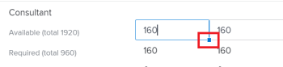
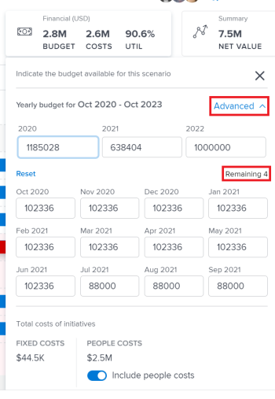

# 在[!DNL Scenario Planner]中创建和编辑计划

在优先处理公司更高级别的策略时，作为使用[!DNL Workfront Scenario Planner]的一部分，您可以创建计划。 有关计划的详细信息，请参阅 [!DNL Scenario Planner]](../scenario-planner/plans-overview.md)中的[计划概述。

<!--

(NOTE: talk about:

- Show people conflicts >> this impacts the conflicts calculation for initiatives>> link to the conflicts article

- explain what hovering over the green upward-pointing arrow does, with screen shot)

-->

## 访问要求

+++ 展开以查看本文中各项功能的访问要求。

<table style="table-layout:auto"> 
 <col> 
 <col> 
 <tbody> 
  <tr> 
   <td> 
[!DNL Adobe Workfront] 计划*
 </td> 
   <td> <ul></li>
   <li>
新增：Ultimate 
</li>
   
场景规划程序不可用于新的Workfront Select或Workfront Prime计划。 

   <li>
当前： [！UICONTROL Business]或更高版本
</ul>
   </td> 
  </tr> 
  <tr> 
   <td> 
[!DNL Adobe Workfront] 许可证*
 </td> 
   <td> 
新增：浅色或更高
 
   
当前： [！UICONTROL Review]或更高版本
 </td> 
  </tr> 
  <tr> 
   <td>产品* </td> 
   <td> <ul><li>
对于新的Workfront计划：

 Adobe Workfront</li>

   <li>
对于当前Workfront计划： 

   
Adobe Workfront
 
Adobe Workfront Scenario Planner
</li></ul>

有关详细信息，请参阅<a href="../scenario-planner/access-needed-to-use-sp.md" class="MCXref xref">使用[!DNL Scenario Planner]</a>所需的访问权限。 
 </td> 
  </tr> 
  <tr data-mc-conditions=""> 
   <td>访问级别 </td> 
   <td> 
[！UICONTROL Edit]访问 [!DNL Scenario Planner]
 </td> 
  </tr> 
  <tr data-mc-conditions=""> 
   <td> 
对象权限 
 </td> 
   <td> 
[！UICONTROL Manage]对计划的权限
 
有关请求对计划的附加访问权限的信息，请参阅<a href="../scenario-planner/request-access-to-plan.md" class="MCXref xref">在[!DNL Scenario Planner]</a>中请求对计划的访问权限。
 </td> 
  </tr> 
 </tbody> 
</table>

*有关信息，请参阅[Workfront文档的访问要求](/help/quicksilver/administration-and-setup/add-users/access-levels-and-object-permissions/access-level-requirements-in-documentation.md)。

+++

## 创建或编辑计划

您可以从头开始创建计划，也可以编辑与您共享的现有计划。

>[!NOTE]
>
>创建计划后，您即被视为计划创建者和所有者。 停用用户后，计划没有所有者，除非之前已与链接共享，否则任何人都不可见。

本文介绍了如何从头开始创建计划或编辑现有计划。

有关计划的所有注意事项，包括可用于计划的信息，请参阅 [!DNL Scenario Planner]](../scenario-planner/plans-overview.md)中的[计划概述。

有关删除计划的信息，请参阅[删除 [!DNL Scenario Planner]](../scenario-planner/delete-plans.md)中的计划。

要创建或编辑计划，请执行以下操作：

{{step1-to-scenario-planner}}

[!DNL Workfront Scenario Planner]中将显示您创建的现有计划列表。

1. （可选）单击计划列表右上角的&#x200B;**[!UICONTROL 筛选器]**&#x200B;图标，然后从以下内容中选择：

   | 筛选 | 描述 |
   |---|---|
   | [!UICONTROL 全部] | 显示您已创建或已与您共享的所有计划。 |
   | [!UICONTROL 我的计划] | 显示您创建的计划。 |
   | [!UICONTROL 与我共享] | 显示与您共享的计划。 |

   

1. （可选）单击&#x200B;**[!UICONTROL 搜索]**&#x200B;图标以键入关键字并在列表中快速找到计划。

1. 单击现有计划的名称以对其进行编辑并继续执行步骤7。

   <!--
   
(NOTE: is the step still accurate) 

   -->

   或

   单击左上角的&#x200B;**[!UICONTROL 新建计划]**&#x200B;以创建计划并继续执行步骤5。

   <!--
   
(NOTE: is the step still accurate)

   -->

   

   此时将显示[!UICONTROL 新计划]框。

   

1. （视情况而定）创建新计划时，请指定以下信息：

   <table style="table-layout:auto"> 
    <col> 
    <col> 
    <tbody> 
     <tr> 
      <td role="rowheader">[！UICONTROL名称]</td> 
      <td>键入计划的名称。 这是必填字段。</td> 
     </tr> 
     <tr> 
      <td role="rowheader" colspan="2"> 
重要信息： 创建并保存计划后，无法修改以下选择。 
 </td> 
     </tr> 
     <tr data-mc-conditions=""> 
      <td role="rowheader">FTE （[！UICONTROL全时等效项]）或[！UICONTROL小时数] </td> 
      <td> 
选择以下选项之一以指示您希望如何估计此计划的工作角色信息： 
 
       <ul> 
      <li> 
<strong>FTE</strong>。 这是默认 
 
      
<b>重要</b>
  
      
对于[!DNL Scenario Planner]中的所有计算，[!DNL Workfront]使用以下值： 1 FTE = 8小时。 
 </li> 
      <li> 
<strong>[！UICONTROL小时]</strong> 
 </li> 
       </ul> 
<b>重要</b>

   您在此处选择的选项决定了计划、计划方案和计划的工作角色信息的显示方式
 </td>
   </tr> 
     <tr> 
      <td role="rowheader">[！UICONTROL开始日期]</td> 
      <td> 
选择计划要开始的月份和年份。 您只能在此字段中选择月份。 [!DNL Workfront]假定计划的开始日期是所选月份的第一天，结束日期是月份持续时间中结束的最后一天。 
 </td> 
     </tr> 
     <tr> 
      <td role="rowheader">[！UICONTROL持续时间]</td> 
      <td> 
从下拉菜单中选择以下持续时间：
 
       <ul> 
        <li>1年。 这是默认持续时间。 </li> 
        <li>3年</li> 
        <li> 
5年
 </li> 
       </ul> </td> 
     </tr> 
    </tbody> 
   </table>

<!--for table above - how FTE is calcualted: NOTE: snippet below: this is per Ani; it does NOT look at the system FTE.) 
-->

1. （视情况而定）单击&#x200B;**[!UICONTROL 下一步]**。

   计划的时间线显示为&#x200B;**[!UICONTROL 初始方案]**。

   有关创建其他方案的信息，请参阅[在 [!DNL Scenario Planner]](../scenario-planner/create-and-compare-scenarios-for-a-plan.md)中创建和比较计划方案。

1. （可选）从时间线下拉菜单中选择下表中的一个选项，以更改查看计划时间线的方式。

   

   | 下拉菜单选项 | 描述 |
   |---|---|
   | [!UICONTROL 个月] | 按月显示时间线。 这是一年计划的默认且唯一选项。 |
   | [!UICONTROL 季度] | 按季度显示时间线。 仅当计划的[!UICONTROL 持续时间]为3年或5年时，此选项才可用。 这是3年计划的默认选项。 |
   | [!UICONTROL 年] | 按年显示时间线。 仅当计划的[!UICONTROL 持续时间]为5年时，此选项才可用。 这是5年计划的默认选项。 |

1. （可选）从左向右滚动以查看计划的整个持续时间。
1. （可选）单击&#x200B;**[!UICONTROL Today]**&#x200B;指示符行以返回到当天。

   

1. 单击计划标题中的&#x200B;**[!UICONTROL 工作角色]**&#x200B;框可添加可用于执行计划的工作角色。

   此时将显示[!UICONTROL 工作角色]框的详细信息。

   >[!TIP]
   >
   >[!DNL Workfront]用于此计划的角色分配单元（FTE或小时数）显示在框标题的括号中。

   

1. 单击&#x200B;**[!UICONTROL 开始键入工作角色]**&#x200B;字段并从列表中选择一个角色，或开始键入有效工作角色的名称。

   单击此字段时，将列出系统中的所有活动工作角色。

   这会将工作角色添加到“工作角色”列。

1. 更新或查看工作角色的以下信息：

   <table style="table-layout:auto"> 
    <col> 
    <col> 
    <tbody> 
     <tr> 
      <td role="rowheader"> 
[！UICONTROL Max available]（适用于FTE） 
 
或 
 
[！UICONTROL总计可用]（用于小时） 
 </td> 
      <td> 
根据您选择为计划使用小时数或FTE，在以下字段中键入可用于对计划执行工作的工作角色FTE数或小时数： 
 
       <ul> 
        <li> 
<strong>[！UICONTROL总可用小时数]</strong>（表示小时数）：表示在方案持续期间所有月份的总小时数。 默认情况下，[!DNL Workfront]将总可用数平均除以方案持续时间中的所有月。 
 
Example: </b>"><b>示例： </b>如果为Designer输入1200小时，则意味着在计划[！UICONTROL Duration]为1年时，Designer在计划持续时间每月有100小时可用。 
 </li> 
        <li> 
<b>[！UICONTROL最大可用数量]</b>（对于FTE）：表示在计划持续时间内，工作角色每月可用的FTE数量。 默认情况下，<strong>Workfront</strong>在方案持续时间内每月分配[！UICONTROL Max available]数字。
 
Example: </b>"><b>示例： </b>如果您为顾问输入1 FTE，这意味着顾问在计划期间每月都有1 FTE可用。 
 
您可以输入小于1 FTE的数字。 
 
Example: </b>"><b>示例：</b>0.5顾问工作角色意味着顾问将投入一半的FTE（通常为4小时，其中8小时是1 FTE）用于处理此计划。 对于Scenario Planner中的所有计算，Workfront使用以下值： 1 FTE = 8小时。 
 </li> 
       </ul> </td> 
     </tr> 
     <tr> 
      <td role="rowheader"> 
[！UICONTROL Max required]（对于FTE）
 
或 
 
[！UICONTROL Total required] （用于小时） 
 </td> 
      <td> 
根据您选择为计划使用小时数或FTE，查看完成方案中的计划所需的工作角色FTE数或。 查看以下字段：
 
       <ul> 
        <li> 
<strong>[！UICONTROL所需总计]</strong>（小时数）：计划持续时间中所有月份所需的总小时数。
 </li> 
        <li> 
<strong>[！UICONTROL Max required]</strong> （对于FTE）：在计划持续时间内的任何月份所需的最大FTE数。 
 </li> 
       </ul> 
提示：开始添加计划后，将显示该工作角色所需的最大FTE数或总小时数。 有关将计划添加到计划的信息，请参阅<a href="../scenario-planner/create-and-edit-initiatives.md" class="MCXref xref">在[!DNL Scenario Planner]</a>中创建和编辑计划。
 </td> 
     </tr> <!--
      <tr data-mc-conditions="QuicksilverOrClassic.Draft mode"> 
       <td role="rowheader">[!UICONTROL Avg utilization]</td> 
       <td> 
(NOTE: this field was removed in 21.2 - May 2021) 
 
[!DNL Workfront] calculates the average utilization for each job role using the job role FTEs associated with initiatives (required) and the job role FTEs associated with the plan (available). 
 
 [!DNL Workfront] calculates the job role utilization percentage for a plan using the following formula: 
 
<code>Job role utilization percentage = Sum [(Required job roles for each month of the plan *100)/ (Available job roles for each month of the plan)] / Number of months in the Duration of the plan</code> 
 
        
Example: </b>"> <b>Example: </b> 
         
For example, if you have a plan with a duration of 12 months and an initiative with the duration of 2 months, where you use 1 Designer for your initiative (required job role) and there are 2 Designers available on the plan (available), the Utilization percentage for the Designer job role is calculated as follows:
 
         
<code>Designer utilization percentage = [(1/2 + 1/2) * 100] / 12 = 100 / 12 = 8.3%</code> 
 
        
 
As you add job roles to the plan and indicate the Available amount for each one, the [!UICONTROL Utilization] value for each role also updates and [!DNL Workfront] calculates a utilization percentage for the plan. For information about how [!DNL Workfront] calculates the Job Role Utilization for a plan, see <a href="../scenario-planner/plans-overview.md" class="MCXref xref">Plans overview in the [!DNL Scenario Planner]</a>. 
 
Tip: The Utilization percentage is rounded and has one decimal. 
 </td> 
      </tr>
     --> 
     <tr> 
      <td role="rowheader">[！UICONTROL小时费率]</td> 
      <td> 
这是工作角色的[！UICONTROL成本小时数]比率。 小时费率以系统的货币显示。 有关为系统设置汇率的信息，请参阅<a href="../administration-and-setup/manage-workfront/exchange-rates/set-up-exchange-rates.md" class="MCXref xref">设置汇率</a>。
 </td> 
     </tr> 
    </tbody> 
   </table>

1. （可选）将鼠标悬停在工作角色的名称上或在更新角色信息后单击选项卡，然后单击&#x200B;**[!UICONTROL 垃圾桶图标]** 以将其从计划中删除。
1. 单击&#x200B;**[!UICONTROL 工作角色分配]**。

   工作角色分配面板将显示方案持续时间中的所有月份。

   

1. 在&#x200B;**[!UICONTROL 开始键入工作角色字段]**&#x200B;中键入工作角色的名称，以将其添加到计划中，然后当该名称出现在列表中时，单击“输入”。 这会将工作角色添加到[!UICONTROL 工作角色]列。
1. 针对方案的每个月更新或查看以下信息：

   <table style="table-layout:auto"> 
    <col> 
    <col> 
    <tbody> 
     <tr> 
      <td role="rowheader">[！UICONTROL职位角色]（FTE或小时数）</td> 
      <td>可用于方案的工作角色和方案上的计划所需的工作角色都会显示在工作角色分配面板中。 在列标题中，指示工作角色估计是以FTE格式还是以小时为单位。 </td> 
     </tr> 
     <tr> 
      <td role="rowheader"> 
[！UICONTROL可用]（最大&lt;FTE数&gt;） 
 
       
 
        
或
 
        
[！UICONTROL可用] （总计&lt;小时数&gt;） 
 
       
 </td> 
      <td> 
根据您选择为计划使用小时数或FTE，查看或更新以下字段中可用于方案的每月工作角色FTE数或：
 
       <ul> 
        <li> 
<strong>[！UICONTROL可用] （最大&lt;FTE数&gt;）</strong>：括号中的数字显示方案任一月份可用角色的最大数量。 查看或更新方案每月的FTE数。 更改每月分配可能会更新括号中的FTE数量。 
 </li> 
        <li> 
<strong>[！UICONTROL可用] （总计&lt;小时数&gt;）</strong>：括号中的数字显示方案中所有月的可用小时总数。 查看或更新方案每个月的小时数。 更改每月分配将更新括号中的小时数。 
 </li> 
       </ul> 
手动更新每月工作角色分配是解决场景中计划之间的工作角色冲突的另一种方法。 
 
提示：   
要更新每月角色可用状态几个月，请在任意月的[！UICONTROL Available]字段中键入小时数或FTE数，然后将该字段的边角拖动到相邻月份上，以复制每个月的相同值。 删除它以更新所有月份。 
 
  
 
 </td> 
     </tr> 
     <tr> 
      <td role="rowheader"> 
[！UICONTROL必需] （最大&lt;数字&gt;）
 
       
 
        
或
 
        
[！UICONTROL必需] （总计&lt;数字&gt;）
 
       
 </td> 
      <td> 
根据您选择为计划使用小时数还是FTE，在以下字段中查看方案所需的工作角色FTE或小时数的月数： 
 
       <ul> 
        <li> 
<strong>[！UICONTROL Required] （最大&lt;FTE数&gt;）</strong>：括号中的数字显示方案任意一个月所需的最大角色数。 
 </li> 
        <li> 
<strong>[！UICONTROL必需] （总计&lt;小时数&gt;）</strong>：括号中的数字显示方案中所有月份所需的总小时数。 
 </li> 
       </ul> 
提示：您无法修改工作角色所需的FTE数或小时数。 在您开始添加计划及其工作角色要求后，此数字将填充方案。 
 </td> 
     </tr> 
     <tr> 
      <td role="rowheader">[！UICONTROL差异]</td> 
      <td> 
       
 
        
方案的所需工作角色数量与可用工作角色数量之间的每月差额。 [!DNL Workfront]使用以下公式计算每个工作角色每个月的差异：
 
        
<code>Monthly role difference = Monthly required roles - Monthly available roles</code> （以FTE或小时为单位） 
 
        
提示：当差异显示负数时，方案需要的工作角色比计划的可用角色多。 您的资源已过度分配。 
 
       
 </td> 
     </tr> 
     <tr> 
      <td role="rowheader">[！UICONTROL利用率] %</td> 
      <td> 
       
 
        
利用率的百分比显示了在场景中的计划上实际使用（或需要）的可用工作角色的数量。 
 
        
[!DNL Workfront] 使用以下公式计算每个工作角色的每月利用率： 
 
        
<code>Monthly role utilization % = Monthly required roles / Monthly available roles * 100</code> 
 
        
根据资源的分配，利用率百分比可能会以下列颜色显示：
 
        <ul> 
         <li> 
<b>绿色</b>：可用和所需数量的工作角色匹配。 资源已完全分配，利用率百分比为100%。 
 </li> 
         <li> 
<b>红色</b>：所需的工作角色比计划的可用角色多。 资源过度分配，利用率高于100%。
 </li> 
         <li> 
<b>蓝色</b>：可用工作角色多于所需数量。 资源分配不足，利用率低于100%。 
 </li> 
        </ul> 
       
 
  
 </td> 
     </tr> 
    </tbody> 
   </table>

1. 单击&#x200B;**[!UICONTROL 应用]**&#x200B;以保存每月工作角色分配

   或

   单击&#x200B;**[!UICONTROL 取消]**&#x200B;以关闭工作角色分发列表并返回方案。

1. 单击计划标题中的&#x200B;**[!UICONTROL 财务]**&#x200B;框以添加此计划的预算。

   显示[!UICONTROL 财务]框的详细信息。

   >[!TIP]
   >
   >[!DNL Workfront]用于此计划的货币显示在框标题的括号中。

1. 指定&#x200B;**[!UICONTROL 年度预算]**。

   >[!NOTE]
   >
   >如果您的计划跨越多年，则必须为每年指定一个预算金额。

1. 按Enter保存年度预算，然后按[!UICONTROL Tab]移至下一年。

   年度预算自动为选定年份的每个月平均分配。

1. 单击&#x200B;**[!UICONTROL 高级]**&#x200B;查看每月预算分配。 年度和每月预算始终为舍入的数字。 当预算金额由于小数而无法平均分配到一年内的所有月份时，年度预算分配下会显示&#x200B;**[!UICONTROL 剩余]**&#x200B;指示符。

   

1. 手动调整每月预算以清除超出金额。

   当所有每月预算金额的总和大于年度预算时，年度预算分配下将显示&#x200B;**[!UICONTROL 超过]**&#x200B;警告指示符。 手动调整每月预算金额，直到它们等于或小于计划的可用预算。

   

1. 禁用&#x200B;**[!UICONTROL 包括人员成本]**&#x200B;设置以排除与工作角色相关的成本，不计入计划的整体成本。 固定成本始终计入计划的整体成本。 此设置默认处于启用状态，并影响计划中的所有方案。
1. 单击[!UICONTROL Financial]框之外的任意位置将其关闭。 您输入的信息将自动保存。

   您现在可以开始创建计划上的计划，并添加方案。

1. （推荐）单击&#x200B;**[!UICONTROL 新计划]**&#x200B;以添加新计划。

   <!--
   
(NOTE: Should this include information on how to create scenarios - see also information about scenarios in Manage Plans?)

   -->

   有关添加计划的信息，请参阅文章[在 [!DNL Scenario Planner]](../scenario-planner/create-and-edit-initiatives.md)中创建和编辑计划。

1. （可选）复制现有方案以创建一个相同计划的新方案。 有关创建和使用多个方案的详细信息，请参阅[在 [!DNL Scenario Planner]](../scenario-planner/create-and-compare-scenarios-for-a-plan.md)中创建和比较计划方案。
1. 单击&#x200B;**[!UICONTROL 保存计划]**。

   您的计划已创建或更新。

1. （可选）单击计划名称右侧的&#x200B;**[!UICONTROL 收藏夹图标]** 以将计划添加到收藏夹列表。

1. （可选）复制计划的URL，并将其发送给可能需要审阅或更新该计划的任何其他用户。 他们的访问级别必须至少具有[!UICONTROL 查看]权限才能查看计划。 他们必须具有[!UICONTROL 编辑]权限才能编辑它。 如果他们必须审核计划的财务信息，如预算、成本和工作角色费率信息，则他们还必须有权访问其访问级别的[!UICONTROL 财务数据]。 有关[!DNL Scenario Planner]所需访问权限的信息，请参阅[使用 [!DNL Scenario Planner]](../scenario-planner/access-needed-to-use-sp.md)所需的访问权限。
