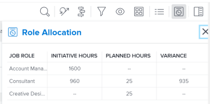

# 通过在[!DNL Scenario Planner]中发布计划来更新或创建项目

从[!DNL Adobe Workfront Scenario Planner]发布方案将完成以下操作：

* 从场景中的计划创建项目并将它们链接在一起。
* 使用链接的计划中的信息更新已链接到场景中的计划的项目。 在将项目导入到计划时，还可以将其链接到计划。 有关信息，请参阅[将项目导入 [!DNL Scenario Planner]](../scenario-planner/import-projects-to-plans.md)中的计划

## 访问要求

+++ 展开以查看本文中各项功能的访问要求。

<table style="table-layout:auto"> 
 <col> 
 <col> 
 <tbody> 
  <tr> 
   <td> 
[!DNL Adobe Workfront] 计划*
 </td> 
   <td> <ul></li>
   <li>
新增：Ultimate 
</li>
   
场景规划程序不可用于新的Workfront Select或Workfront Prime计划。 

   <li>
当前： [！UICONTROL Business]或更高版本
</ul>
   </td> 
  </tr> 
  <tr> 
   <td> 
[!DNL Adobe Workfront] 许可证*
 </td> 
   <td> 
新增：浅色或更高
 
   
当前： [！UICONTROL Review]或更高版本
 </td> 
  </tr> 
  <tr> 
   <td>产品* </td> 
   <td> <ul><li>
对于新的Workfront计划：

 Adobe Workfront</li>

   <li>
对于当前Workfront计划： 

   
Adobe Workfront
 
Adobe Workfront Scenario Planner
</li></ul>

有关详细信息，请参阅<a href="../scenario-planner/access-needed-to-use-sp.md" class="MCXref xref">使用[!DNL Scenario Planner]</a>所需的访问权限。 
 </td> 
  </tr> 
  <tr data-mc-conditions=""> 
   <td>访问级别 </td> 
   <td> 
对[!DNL Scenario Planner]和[！UICONTROL项目的[！UICONTROL Edit]访问权限
</td> 
  </tr> 
  <tr data-mc-conditions=""> 
   <td> 
对象权限 
 </td> 
   <td>  <ul> 
     <li>计划的[！UICONTROL Manage]权限 </li> 
     <li>已发布项目的[！UICONTROL Manage]权限</li> 
    </ul> 
有关请求对计划的附加访问权限的信息，请参阅<a href="../scenario-planner/request-access-to-plan.md" class="MCXref xref">在[!DNL Scenario Planner]</a>中请求对计划的访问权限。
 </td> 
  </tr> 
 </tbody> 
</table>

*有关信息，请参阅[Workfront文档的访问要求](/help/quicksilver/administration-and-setup/add-users/access-levels-and-object-permissions/access-level-requirements-in-documentation.md)。

+++

## 先决条件

开始之前：

* 您必须先创建并保存计划，然后才能从中发布计划。
* 必须在“设置”的“项目偏好设置”区域中启用“允许用户在不使用模板的情况下创建项目”设置。 有关信息，请参阅[配置系统范围的项目首选项](/help/quicksilver/administration-and-setup/set-up-workfront/configure-system-defaults/set-project-preferences.md)。

## 有关将计划发布到项目的注意事项

* 您只能从计划发布一个方案。
* 一个计划只能链接到一个项目。
* 当计划属于不同计划时，一个项目可以链接到多个计划。

  >[!TIP]
  >
  >当一个项目存在于多个计划中，并且您从所有计划发布信息到该项目时，最新的发布会覆盖项目上的现有[!DNL Scenario Planner]信息。

* 如果通过将项目导入到计划中对计划创建了计划，则发布计划也会使用计划信息更新链接的项目。

  >[!TIP]
  >
  >您可以将同一项目导入多个计划中。 发布可能会覆盖链接到多个计划的项目上的计划信息。

  有关通过导入项目创建计划的信息，请参阅[在 [!DNL Scenario Planner]](../scenario-planner/import-projects-to-plans.md)中将项目导入计划。

* 对项目所做的任何更改都不会转移到链接的计划。

## 发布计划

>[!IMPORTANT]
>
>如果您对计划上的计划进行任何更改，包括解决冲突，则必须重新发布计划，以使新信息在项目上可见。 仅当您发布相应的计划时，此信息才会显示在链接到计划的项目上。 有关解决计划之间冲突的信息，请参阅[解决 [!DNL Scenario Planner]](../scenario-planner/resolve-conflicts-in-sp.md)中的计划冲突

{{step1-to-scenario-planner}}

1. （可选且有条件）如果要从现有计划发布，请单击计划右上角的&#x200B;**[!UICONTROL 过滤器]**&#x200B;图标，然后选择以下选项之一：

   <table style="table-layout:auto"> 
    <col> 
    <col> 
    <tbody> 
     <tr> 
      <td role="rowheader">[！UICONTROL All]</td> 
      <td>显示您拥有或与您共享的所有计划。 这是默认设置。 </td> 
     </tr> 
     <tr> 
      <td role="rowheader">[！UICONTROL我的计划]</td> 
      <td>显示您创建的计划。</td> 
     </tr> 
     <tr> 
      <td role="rowheader">[！UICONTROL已与我共享]</td> 
      <td> 
显示您未创建但与您共享的计划。
 
重要信息：您必须对与您共享的计划具有[！UICONTROL Manage]权限才能发布这些计划。 
 </td> 
     </tr> 
    </tbody> 
   </table>

   

1. （可选）单击&#x200B;**[!UICONTROL 搜索]**&#x200B;图标并开始键入计划的名称以便在列表中快速找到它。
1. （视情况而定）要从新计划发布，请创建计划。

   有关创建计划的信息，请参阅[在 [!DNL Scenario Planner]](../scenario-planner/create-and-edit-plans.md)中创建和编辑计划。

1. （可选）单击现有计划的名称，然后为计划创建新方案。

   有关为计划创建方案的信息，请参阅[在 [!DNL Scenario Planner]](../scenario-planner/create-and-compare-scenarios-for-a-plan.md)中创建和比较计划方案。

1. （可选）更新现有计划或新计划的计划或创建新计划。

   有关创建计划的信息，请参阅[在 [!DNL Scenario Planner]](../scenario-planner/create-and-edit-initiatives.md)中创建和编辑计划。

1. 单击&#x200B;**[!UICONTROL 保存计划]**。
1. 从&#x200B;**[!UICONTROL 初始方案]**&#x200B;下拉菜单中选择要发布的方案，然后单击右上角的&#x200B;**[!UICONTROL 转到Publish]** 。

   或

   单击&#x200B;**[!UICONTROL 比较方案]**，将鼠标悬停在要从中发布的方案卡片上，然后单击&#x200B;**[!UICONTROL 转到Publish]** 。

   此时会显示[!UICONTROL Publish计划]页面，其中包含方案中的所有计划列表。 如果之前已发布任何计划，则项目图标将显示在其名称之后，列表中会填充&#x200B;**[!UICONTROL 上次发布]**&#x200B;日期。

   >[!TIP]
   >
   >通过导入项目创建的计划在其名称的右侧还会显示项目图标

   

1. （可选且有条件）如果要从现有计划发布，请单击计划右上角的&#x200B;**[!UICONTROL 过滤器]**&#x200B;图标，然后选择以下选项之一：

   <table style="table-layout:auto"> 
    <col> 
    <col> 
    <tbody> 
     <tr> 
      <td role="rowheader">[！UICONTROL All]</td> 
      <td>显示选定方案的所有计划。 </td> 
     </tr> 
     <tr> 
      <td role="rowheader">[！UICONTROL已发布]</td> 
      <td>显示您或其他用户之前发布的计划。 </td> 
     </tr> 
     <tr> 
      <td role="rowheader">[！UICONTROL已取消发布]</td> 
      <td> 
显示未发布的计划。 
 </td> 
     </tr> 
    </tbody> 
   </table>

   

1. （可选）单击&#x200B;**[!UICONTROL 搜索]**&#x200B;图标并开始键入计划的名称以在列表中快速找到它。
1. 选择一个或多个计划以发布并创建或更新其中的项目，然后单击&#x200B;**[!UICONTROL Publish计划]**。

   这将从每个所选计划创建一个新项目，或者如果发布的计划已链接到项目，则更新现有的连接项目。

   >[!TIP]
   >
   >新项目与发布的计划具有相同的名称。

1. （视情况而定）执行以下操作之一：

   * 如果您发布了一个计划，请单击&#x200B;**[!UICONTROL 查看关联的项目]**&#x200B;以打开根据该计划创建或更新的项目。
   * 如果您发布了多个计划，请单击&#x200B;**[!UICONTROL 查看关联的项目]**&#x200B;以打开从计划发布的项目列表。 默认情况下，[!DNL Workfront]将[!DNL Scenario Planner]项目筛选器应用于项目列表。 最近发布的项目将显示在列表顶部。

     

1. 转到以下区域查看有关项目的计划信息：

   * **[!UICONTROL 更新]部分**：发布更新以指示项目是从计划创建或更新的。 更新包含创建或更新项目的计划名称以及包含该计划的计划的链接名称。 您可以在更新中单击计划的名称以在[!DNL Scenario Planner]中打开该计划。

     

   * **[!UICONTROL 项目详细信息]分区的[!UICONTROL 概述]区域**：在此区域创建了新的[!DNL Scenario Planner]分区，其中包含来自链接计划的信息。

     

     以下计划信息发布在[!UICONTROL 项目详细信息]部分的[!DNL Scenario Planner]区域：

     <table style="table-layout:auto"> 
      <col> 
      <col> 
      <tbody> 
       <tr> 
        <td role="rowheader">[！UICONTROL计划持续时间] </td> 
        <td>项目链接到计划时，相应计划的持续时间。 此字段不可编辑。 </td> 
       </tr> 
       <tr> 
        <td role="rowheader">[！UICONTROL上次发布日期] </td> 
        <td>上次从相应的计划发布项目的日期。 </td> 
       </tr> 
       <tr> 
        <td role="rowheader">[！UICONTROL计划开始日期] </td> 
        <td>项目链接到计划时，计划开始月份的第一天。 </td> 
       </tr> 
       <tr> 
        <td role="rowheader">[！UICONTROL计划结束日期] </td> 
        <td>当项目链接到计划时，计划结束月份的最后一天。 </td> 
       </tr> 
       <tr> 
        <td role="rowheader">[！UICONTROL FTE和小时数中的计划工作角色] </td> 
        <td> 
有关相关工作角色及其为计划分配的时间的信息。 这包括：
 
         <ul> 
          <li>工作角色名称</li> 
          <li>FTE数量</li> 
          <li> 
所有FTE的时数
 
您可以使用小时数或FTE估计计划或计划所需的工作角色的数量。
 
有关详细信息，请参阅<a href="../scenario-planner/create-and-edit-plans.md" class="MCXref xref">在Scenario Planner</a>中创建和编辑计划。 
 </li> 
         </ul> 
      
<b>提示</b>

     如果计划中的每个月工作角色的数量不同，则此字段显示计划所需的最大角色数量。 例如，如果您在1月需要1名顾问，在2月需要2名顾问，则列会显示2FTE以及所有月份中2个FTE的相应小时数。
 </td>
     </tr> 
      </tbody> 
     </table>

     >[!NOTE]
     >
     >所有对该项目具有[!UICONTROL 查看]权限的用户都可以在[!UICONTROL 概述]区域中看到[!DNL Scenario Planner]部分。 您可以使用布局模板控制此区域是否显示在[!UICONTROL 详细信息]部分中。 如果用户没有与其关联的布局模板，则默认情况下将显示此区域。
     >
     >   
     >   
     >   * 有关使用布局模板在[!UICONTROL 详细信息]部分中添加或删除区域的信息，请参阅[使用布局模板自定义[!UICONTROL 详细信息]视图](../administration-and-setup/customize-workfront/use-layout-templates/customize-details-view-layout-template.md)。
     >   * 有关查看[!UICONTROL 项目详细信息]的[!UICONTROL 概述]区域中的信息的详细信息，请参阅项目[!UICONTROL 概述]区域](../manage-work/projects/manage-projects/understand-project-overview-area.md)中的[[!UICONTROL 管理]信息。
     >   
     >

   * **[!UICONTROL 工作负载均衡器]或项目的任务列表中的[!UICONTROL 角色分配]面板**：除了项目上的角色分配之外，还会填充此区域中有关计划上的角色分配的信息。

     有关详细信息，请参阅[在项目和计划之间协调资源分配概述](../scenario-planner/overview-reconcile-allocations-between-projects-initiatives.md)。

     

     对项目日期或资源所做的任何更改不会影响相应的计划或项目上包含计划信息的任何区域。

   * **项目**&#x200B;的[!UICONTROL 业务案例]的[!UICONTROL 资源预算]区域：在项目的[!UICONTROL 业务案例]的[!UICONTROL 资源预算]区域中添加了一个用于使用[!DNL Scenario Planner]信息管理项目资源的新选项。

     有关详细信息，请参阅[!UICONTROL 商业案例]中使用 [!DNL Scenario Planner]](../manage-work/projects/define-a-business-case/budget-resources-in-business-case-use-scenario-planner.md)的[预算资源。

     

1. （可选）发布方案后，在[!DNL Scenario Planner]中查看以下信息：

   * 已发布的方案将成为从中发布计划后的第一个方案。
   * 在发布方案至少一次后，您无法从任何其他方案发布。
   * 从场景中发布至少一个计划后，会从所有其他场景中删除[!UICONTROL 转到Publish]选项。
   * 计划中已发布计划的项目图标旁会显示一个绿色指示器。

     

   * 绿色“已发布”指示器显示在方案的顶部和方案卡片上，并且方案卡片中会填充已发布字段，以指示已发布的方案中的计划数。

     

     >[!TIP]
     >
     >如果删除了从方案的计划发布的所有项目，则会删除已发布方案的指示。 有关信息，请参阅[删除项目](../manage-work/projects/manage-projects/delete-projects.md)。

1. （可选）更新计划信息并重复上述过程以重新发布计划并更新链接项目上的计划信息。

   有关编辑计划的信息，请参阅[在 [!DNL Scenario Planner]](../scenario-planner/create-and-edit-initiatives.md)中创建和编辑计划。

