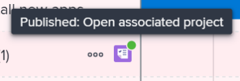

# 通过发布中的计划来更新或创建项目 [!DNL Scenario Planner]

从发布方案 [!DNL Adobe Workfront Scenario Planner] 完成以下操作：

* 从场景中的计划创建项目并将它们链接在一起。
* 使用链接的计划中的信息更新已链接到场景中的计划的项目。 在将项目导入到计划时，还可以将其链接到计划。 有关信息，请参阅 [将项目导入中的计划 [!DNL Scenario Planner]](../scenario-planner/import-projects-to-plans.md)

## 访问要求

您必须具备以下条件：

<table style="table-layout:auto"> 
 <col> 
 <col> 
 <tbody> 
  <tr> 
   <td> 
[!DNL Adobe Workfront] 计划*
 </td> 
   <td>[！UICONTROL Business]或更高版本</td> 
  </tr> 
  <tr> 
   <td> 
[!DNL Adobe Workfront] 许可证*
 </td> 
   <td> 
[！UICONTROL Review]或更高版本
 </td> 
  </tr> 
  <tr> 
   <td>产品 </td> 
   <td> 
您必须为以下产品购买额外的许可证： [!DNL Adobe Workfront Scenario Planner] 访问本文中介绍的功能。
 
有关获取 [!DNL Workfront Scenario Planner]，请参见 <a href="../scenario-planner/access-needed-to-use-sp.md" class="MCXref xref">使用所需的访问权限 [!DNL Scenario Planner]</a>. 
 </td> 
  </tr> 
  <tr data-mc-conditions=""> 
   <td> 

 
访问级别*
 </td> 
   <td> 
    <ul> 
    <li>[！UICONTROL Edit]访问权限 [!DNL Scenario Planner] 和项目</li></ul>

<b>注释</b>

如果您仍然没有访问权限，请咨询 [!DNL Workfront] 管理员（如果他们在您的访问级别设置了其他限制）。 有关如何 [!DNL Workfront] 管理员可以更改您的访问级别，请参见 <a href="../administration-and-setup/add-users/configure-and-grant-access/create-modify-access-levels.md" class="MCXref xref">创建或修改自定义访问级别</a>.
 </td>
</tr> 
  <tr data-mc-conditions=""> 
   <td> 
对象权限
 </td> 
   <td> 
    <ul> 
     <li>计划的[！UICONTROL Manage]权限 </li> 
     <li>已发布项目的[！UICONTROL Manage]权限</li> 
    </ul> 
有关请求对项目的附加访问权限的信息，请参阅 <a href="../workfront-basics/grant-and-request-access-to-objects/request-access.md" class="MCXref xref">请求访问对象 </a>.
 
有关请求对计划的附加访问权限的信息，请参阅 <a href="../scenario-planner/request-access-to-plan.md" class="MCXref xref">在中请求对计划的访问权限 [!DNL Scenario Planner]</a>.
 </td> 
  </tr> 
 </tbody> 
</table>

&#42;要了解您拥有的计划、许可证类型或访问权限，请联系贵机构的 [!DNL Workfront] 管理员。

有关访问 [!DNL Workfront Scenario Planner]，请参见 [使用所需的访问权限 [!DNL Scenario Planner]](../scenario-planner/access-needed-to-use-sp.md).

## 先决条件

开始之前：

* 您必须先创建并保存计划，然后才能从中发布计划。
* 必须在“设置”的“项目偏好设置”区域中启用“允许用户在不使用模板的情况下创建项目”设置。 有关信息，请参阅 [配置系统范围的项目首选项](/help/quicksilver/administration-and-setup/set-up-workfront/configure-system-defaults/set-project-preferences.md).

## 有关将计划发布到项目的注意事项

* 您只能从计划发布一个方案。
* 一个计划只能链接到一个项目。
* 当计划属于不同计划时，一个项目可以链接到多个计划。

  >[!TIP]
  >
  >当一个项目存在于多个计划中，并且您从所有计划中将信息发布到项目时，最新的发布将覆盖现有的发布 [!DNL Scenario Planner] 项目信息。

* 如果通过将项目导入到计划中对计划创建了计划，则发布计划也会使用计划信息更新链接的项目。

  >[!TIP]
  >
  >您可以将同一项目导入多个计划中。 发布可能会覆盖链接到多个计划的项目上的计划信息。

  有关通过导入项目创建计划的信息，请参阅 [将项目导入中的计划 [!DNL Scenario Planner]](../scenario-planner/import-projects-to-plans.md).

* 对项目所做的任何更改都不会转移到链接的计划。

## 发布计划

>[!IMPORTANT]
>
>如果您对计划上的计划进行任何更改，包括解决冲突，则必须重新发布计划，以使新信息在项目上可见。 仅当您发布相应的计划时，此信息才会显示在链接到计划的项目上。 有关解决方案之间冲突的信息，请参阅 [解决中的计划冲突 [!DNL Scenario Planner]](../scenario-planner/resolve-conflicts-in-sp.md)

1. 单击 **[!UICONTROL 主菜单]** 图标  (在Workfront的右上角)，然后单击 **[!UICONTROL 方案]**
1. （可选且视情况而定）如果要从现有计划发布，请单击 **[!UICONTROL 筛选]** 图标  在计划的右上角，选择以下选项之一：

   <table style="table-layout:auto"> 
    <col> 
    <col> 
    <tbody> 
     <tr> 
      <td role="rowheader">[！UICONTROL All]</td> 
      <td>显示您拥有或与您共享的所有计划。 这是默认设置。 </td> 
     </tr> 
     <tr> 
      <td role="rowheader">[！UICONTROL我的计划]</td> 
      <td>显示您创建的计划。</td> 
     </tr> 
     <tr> 
      <td role="rowheader">[！UICONTROL已与我共享]</td> 
      <td> 
显示您未创建但与您共享的计划。
 
重要信息：您必须对与您共享的计划具有[！UICONTROL Manage]权限才能发布这些计划。 
 </td> 
     </tr> 
    </tbody> 
   </table>

   

1. （可选）单击 **[!UICONTROL Search]** 图标  然后开始键入计划的名称，以便在列表中快速找到该计划。
1. （视情况而定）要从新计划发布，请创建计划。

   有关创建计划的信息，请参阅 [在中创建和编辑计划 [!DNL Scenario Planner]](../scenario-planner/create-and-edit-plans.md) .

1. （可选）单击现有计划的名称，然后为计划创建新方案。

   有关为计划创建方案的信息，请参阅 [在中创建和比较计划方案 [!DNL Scenario Planner]](../scenario-planner/create-and-compare-scenarios-for-a-plan.md).

1. （可选）更新现有计划或新计划的计划或创建新计划。

   有关创建计划的信息，请参阅 [在中创建和编辑计划 [!DNL Scenario Planner]](../scenario-planner/create-and-edit-initiatives.md).

1. 单击 **[!UICONTROL 保存计划]**.
1. 从中选择要发布的方案 **[!UICONTROL 初始方案]** 下拉菜单，然后单击 **[!UICONTROL 转到“发布”]**  在右上角。

   或

   单击 **[!UICONTROL 比较方案]**，将鼠标悬停在要从中发布的方案卡片上，然后单击 **[!UICONTROL 转到“发布”]** .

   此 [!UICONTROL 发布计划] 此时将显示页面，其中显示方案中所有计划的列表。 如果之前已发布任何计划，则为项目图标  显示在它们的名称和 **[!UICONTROL 上次发布时间]** 日期将填充在列表中。

   >[!TIP]
   >
   >通过导入项目创建的计划也会显示项目图标  他们名字的右边

   

1. （可选且视情况而定）如果要从现有计划发布，请单击 **[!UICONTROL 筛选]** 图标  在计划的右上角，选择以下选项之一：

   <table style="table-layout:auto"> 
    <col> 
    <col> 
    <tbody> 
     <tr> 
      <td role="rowheader">[！UICONTROL All]</td> 
      <td>显示选定方案的所有计划。 </td> 
     </tr> 
     <tr> 
      <td role="rowheader">[！UICONTROL已发布]</td> 
      <td>显示您或其他用户之前发布的计划。 </td> 
     </tr> 
     <tr> 
      <td role="rowheader">[！UICONTROL已取消发布]</td> 
      <td> 
显示未发布的计划。 
 </td> 
     </tr> 
    </tbody> 
   </table>

   

1. （可选）单击 **[!UICONTROL Search]** 图标  并开始键入方案的名称以便在列表中快速找到该方案。
1. 选择要发布的一个或多个计划并从其中创建或更新项目，然后单击 **[!UICONTROL 发布计划]**.

   这将从每个所选计划创建一个新项目，或者如果发布的计划已链接到项目，则更新现有的连接项目。

   >[!TIP]
   >
   >新项目与发布的计划具有相同的名称。

1. （视情况而定）执行以下操作之一：

   * 如果您发布了一个计划，请单击 **[!UICONTROL 查看相关项目]** 打开从计划创建或更新的项目。
   * 如果发布多个计划，请单击 **[!UICONTROL 查看关联的项目]** 打开从计划发布的项目列表。 [!DNL Workfront] 应用 [!DNL Scenario Planner] 默认情况下，项目会筛选到项目列表。 最近发布的项目将显示在列表顶部。

     

1. 转到以下区域查看有关项目的计划信息：

   * **此 [!UICONTROL 更新] 部分**：发布更新以指示项目是从计划创建或更新的。 更新包含创建或更新项目的计划名称以及包含该计划的计划的链接名称。 您可以在更新中单击计划的名称，以在 [!DNL Scenario Planner].

     

   * **此 [!UICONTROL 概述] 区域 [!UICONTROL 项目详细信息] 部分**：一个新的 [!DNL Scenario Planner] 部分在此区域创建，包含来自链接计划的信息。

     

     以下计划信息发布在 [!DNL Scenario Planner] 区域 [!UICONTROL 项目详细信息] 部分：

     <table style="table-layout:auto"> 
      <col> 
      <col> 
      <tbody> 
       <tr> 
        <td role="rowheader">[！UICONTROL计划持续时间] </td> 
        <td>项目链接到计划时相应计划的持续时间。 此字段不可编辑。 </td> 
       </tr> 
       <tr> 
        <td role="rowheader">[！UICONTROL上次发布日期] </td> 
        <td>上次从相应计划发布项目的日期。 </td> 
       </tr> 
       <tr> 
        <td role="rowheader">[！UICONTROL计划开始日期] </td> 
        <td>当项目链接到计划时，计划开始月份的第一天。 </td> 
       </tr> 
       <tr> 
        <td role="rowheader">[！UICONTROL计划结束日期] </td> 
        <td>计划结束月份的最后一天，即项目链接到计划时。  </td> 
       </tr> 
       <tr> 
        <td role="rowheader">[！UICONTROL FTE和小时数中的计划工作角色] </td> 
        <td> 
有关相关工作角色及其为计划分配的时间的信息。 这包括：
 
         <ul> 
          <li>工作角色名称</li> 
          <li>FTE数量</li> 
          <li> 
所有FTE的时数
 
您可以使用小时数或FTE估计计划或计划所需的工作角色的数量。
 
有关更多信息，请参阅 <a href="../scenario-planner/create-and-edit-plans.md" class="MCXref xref">在Scenario Planner中创建和编辑计划</a>. 
 </li> 
         </ul> 
      
<b>提示</b>

     如果计划中的每个月工作角色的数量不同，则此字段显示计划所需的最大角色数量。 例如，如果您在1月需要1名顾问，在2月需要2名顾问，则列会显示2FTE以及所有月份中2个FTE的相应小时数。
 </td>
     </tr> 
      </tbody> 
     </table>

     >[!NOTE]
     >
     >所有用户具有 [!UICONTROL 视图] 对项目的访问权限可以看到 [!DNL Scenario Planner] 中的部分 [!UICONTROL 概述] 区域。 您可以控制此区域是否显示在 [!UICONTROL 详细信息] 区域。 如果用户没有与其关联的布局模板，则默认情况下将显示此区域。
     >
     >   
     >   
     >   * 有关添加或删除区域的信息 [!UICONTROL 详细信息] 部分使用布局模板，请参阅 [自定义 [!UICONTROL 详细信息] 使用布局模板查看](../administration-and-setup/customize-workfront/use-layout-templates/customize-details-view-layout-template.md).
     >   * 有关查看中信息的详细信息 [!UICONTROL 概述] 区域 [!UICONTROL 项目详细信息]，请参见 [[!UICONTROL 管理] 项目中的信息 [!UICONTROL 概述] 区域](../manage-work/projects/manage-projects/understand-project-overview-area.md).
     >   
     >

   * **此 [!UICONTROL 角色分配] 中的面板 [!UICONTROL 工作负载均衡器] 或项目的任务列表**：除了项目中的角色分配之外，有关计划中的角色分配的信息还会填充到此区域中。

     有关更多信息，请参阅 [在项目和计划之间协调资源分配概述](../scenario-planner/overview-reconcile-allocations-between-projects-initiatives.md).

     

     对项目日期或资源所做的任何更改不会影响相应的计划或项目上包含计划信息的任何区域。

   * **此 [!UICONTROL 资源预算] 区域 [!UICONTROL 商业论证] 项目的**：用于使用管理项目资源的新选项 [!DNL Scenario Planner] 信息将添加到 [!UICONTROL 资源预算] 区域 [!UICONTROL 商业论证] 项目的URL。

     有关更多信息，请参阅 [中的预算资源 [!UICONTROL 商业论证] 使用 [!DNL Scenario Planner]](../manage-work/projects/define-a-business-case/budget-resources-in-business-case-use-scenario-planner.md).

     

1. （可选）在中查看以下信息 [!DNL Scenario Planner] 发布方案后：

   * 已发布的方案将成为从中发布计划后的第一个方案。
   * 在发布方案至少一次后，您无法从任何其他方案发布。
   * 此 [!UICONTROL 转到“发布”] 从场景中发布至少一个计划后，从所有其他场景中删除选项。
   * 计划中已发布计划的项目图标旁会显示一个绿色指示器。

     

   * 绿色“已发布”指示器显示在方案的顶部和方案卡片上，并且方案卡片中会填充已发布字段，以指示已发布的方案中的计划数。

     

     >[!TIP]
     >
     >如果删除了从方案的计划发布的所有项目，则会删除已发布方案的指示。 有关信息，请参阅 [删除项目](../manage-work/projects/manage-projects/delete-projects.md).

1. （可选）更新计划信息并重复上述过程以重新发布计划并更新链接项目上的计划信息。

   有关编辑计划的信息，请参阅 [在中创建和编辑计划 [!DNL Scenario Planner]](../scenario-planner/create-and-edit-initiatives.md).

