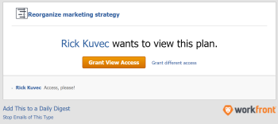

# 在[!DNL Scenario Planner]中请求计划的权限

<!--Audited: 11/2025-->

当计划的链接与您共享时，您可以在[!DNL Adobe Workfront Scenario Planner]中请求对计划的权限。

## 访问要求

+++ 展开以查看本文中各项功能的访问要求。 

<table style="table-layout:auto"> 
 <col> 
 <col> 
 <tbody> 
  <tr> 
   <td> 
[!DNL Adobe Workfront] 包
 </td> 
   <td> 
   
Workfront Ultimate

<b>注释</b>

如果您拥有其他Workfront软件包，请与您的Workfront代表联系。

   </td> 
  </tr> 
  <tr> 
   <td> 
[!DNL Adobe Workfront] 许可证
 </td> 
   <td> 
[!UICONTROL Light]或更高版本
 
   
[!UICONTROL Review]或更高版本
 </td> 
  </tr> 
    <tr> 
   <td>访问级别配置</td> 
   <td> 
[!UICONTROL View]或更高权限访问 [!DNL Scenario Planner]
 </td> 
  </tr> 
 </tbody> 
</table>

有关访问Scenario Planner的详细信息，请参阅[使用 [!DNL Scenario Planner]](../scenario-planner/access-needed-to-use-sp.md)所需的访问权限。

有关Workfront访问要求的信息，请参阅[Workfront访问要求文档](/help/quicksilver/administration-and-setup/add-users/access-levels-and-object-permissions/access-level-requirements-in-documentation.md)。

+++

<!--Old:
<table style="table-layout:auto"> 
 <col> 
 <col> 
 <tbody> 
  <tr> 
   <td> 
[!DNL Adobe Workfront] plan*
 </td> 
   <td> <ul></li>
   <li>
New: Ultimate 
</li>
   
The Scenario Planner is not available for the new Workfront Select or Workfront Prime plans. 

   <li>
Current: [!UICONTROL Business] or higher
</ul>
   </td> 
  </tr> 
  <tr> 
   <td> 
[!DNL Adobe Workfront] license*
 </td> 
   <td> 
New: Light or higher
 
   
Current: [!UICONTROL Review] or higher
 </td> 
  </tr> 
  <tr> 
   <td>Product* </td> 
   <td> <ul><li>
For the new Workfront plans:

 Adobe Workfront</li>

   <li>
For the current Workfront plans: 

   
Adobe Workfront
 
Adobe Workfront Scenario Planner
</li></ul>
   
   
For more information, see <a href="../scenario-planner/access-needed-to-use-sp.md" class="MCXref xref">Access needed to use the [!DNL Scenario Planner]</a>. 
 </td> 
  </tr> 
  <tr data-mc-conditions=""> 
   <td>Access level </td> 
   <td>  
[!UICONTROL View] or higher access to the [!DNL Scenario Planner]
  </td> 
  </tr>
 </tbody> 
</table>-->

## 先决条件

在[!DNL Scenario Planner]中请求访问计划之前，您必须具备以下条件：

* 指向计划的链接。

>[!NOTE]
>
>如果您没有[!DNL Scenario Planner]的访问权限级别权限，并尝试从链接访问计划，则无法请求对该计划的访问权限。 而是显示一个屏幕，通知您联系[!DNL Workfront]管理员。

## 请求[!DNL Workfront Scenario Planner]中计划的权限

如果您还没有对某个计划的权限，并且从与您共享的链接导航到该计划，则会显示一个屏幕，通知您无权查看该计划。 系统会提示您向计划创建者请求权限。

>[!TIP]
>
>您只能向计划的所有者或创建者请求权限。 您无法向也有权访问该计划的其他用户请求权限。

要请求权限，请执行以下操作：

1. 单击指向计划的链接。

   

1. 在&#x200B;**[!UICONTROL 请求访问]**&#x200B;下拉菜单中，指示您希望授予的权限级别。 从以下项中选择：

   * [!UICONTROL 查看]
   * [!UICONTROL 管理]

   您不能请求高于您对[!DNL Scenario Planner]的访问权限级别的权限。 例如，如果您对[!UICONTROL 具有查看访问权限，则无法请求]管理[!DNL Scenario Planner]权限。

   有关不同权限级别的信息，请参阅[在 [!DNL Scenario Planner]](../scenario-planner/share-a-plan.md)中共享计划。

   有关Workfront管理员可以管理对[!DNL Scenario Planner]的访问权限的信息，请参阅[授予对 [!DNL Scenario Planner]](../administration-and-setup/add-users/configure-and-grant-access/grant-access-sp.md)的访问权限。

1. （可选）在&#x200B;**[!UICONTROL 留下评论框]**&#x200B;中输入评论或请求，然后单击&#x200B;**[!UICONTROL 请求访问]**。

   会发生以下情况：

   * [!DNL Workfront]向计划所有者发送电子邮件通知，以便他们授予所请求的权限。\
     

   * 在计划所有者授予所请求的权限后，如果您的[!DNL Workfront]管理员在您的系统中启用了对象共享到用户通知，并且在您的配置文件中启用了[!UICONTROL 其他人与我共享对象]电子邮件通知，您将收到一封电子邮件，指出已授予权限。

     

   * 您还可以从[!UICONTROL 主页]区域和[!DNL Workfront]移动应用程序向计划授予权限。

   有关启用系统通知的信息，请参阅[为系统中的每个人配置事件通知](../administration-and-setup/manage-workfront/emails/configure-event-notifications-for-everyone-in-the-system.md)。

   有关在配置文件中启用通知的信息，请参阅[通知：其他信息](../workfront-basics/using-notifications/notifications-misc-information.md)。
