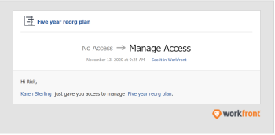

# 请求对 [!DNL Scenario Planner]

您可以在 [!DNL Adobe Workfront Scenario Planner] 与您共享计划链接时。

## 访问要求

您必须具备以下条件：

<table style="table-layout:auto"> 
 <col> 
 <col> 
 <tbody> 
  <tr> 
   <td> 
[!DNL Adobe Workfront]<b> 计划*</b> 
 </td> 
   <td>[!UICONTROL Business]或更高版本</td> 
  </tr> 
  <tr> 
   <td> 
[!DNL Adobe Workfront]<b> 许可证*</b> 
 </td> 
   <td> 
[!UICONTROL Review]、[!UICONTROL Work]或[!UICONTROL Plan]
 </td> 
  </tr> 
  <tr> 
   <td><strong>产品*</strong> </td> 
   <td> 
您必须为 [!DNL Adobe Workfront Scenario Planner] ，以访问本文中描述的功能。
 
有关获取 [!DNL Workfront Scenario Planner]，请参阅 <a href="../scenario-planner/access-needed-to-use-sp.md" class="MCXref xref">使用[!UICONTROL Scenario Planner]所需的访问权限</a>. 
 </td> 
  </tr> 
  <tr data-mc-conditions=""> 
   <td><strong>访问级别配置*</strong> </td> 
   <td> 
查看对 [!DNL Scenario Planner]
 
注意：如果您仍无权访问，请咨询您的 [!DNL Workfront] 管理员。 有关如何 [!DNL Workfront] 管理员可以更改您的访问级别，请参阅 <a href="../administration-and-setup/add-users/configure-and-grant-access/create-modify-access-levels.md" class="MCXref xref">创建或修改自定义访问级别</a>.
 </td> 
  </tr> 
 </tbody> 
</table>

&#42;要了解您拥有的计划、许可类型或访问权限，或您的公司是否已购买 [!DNL Workfront Scenario Planner]，联系 [!DNL Workfront] 管理员。

## 先决条件

在您请求访问 [!DNL Scenario Planner]，则必须具有以下内容：

* 指向计划的链接。

>[!NOTE]
>
>如果您没有 [!DNL Scenario Planner] 如果尝试从链接访问计划，则无法请求访问计划。 而是会显示一个屏幕，通知您联系 [!DNL Workfront] 管理员。

## 在中请求对计划的访问权限 [!DNL Workfront Scenario Planner]

如果您还没有计划的权限，并且从与您共享的链接导航到该计划，则会显示一个屏幕，通知您您没有查看计划的权限。 系统会提示您请求计划创建者授予权限。

>[!TIP]
>
>您只能请求计划的所有者或创建者授予权限。 您无法向其他也有权访问计划的用户请求权限。

要请求权限，请执行以下操作：

1. 单击指向计划的链接。

   

1. 在 **[!UICONTROL 请求访问权限]** 下拉菜单，指示您希望授予的权限级别。 从以下选项中进行选择：

   * [!UICONTROL 查看]
   * [!UICONTROL 管理]

   您无法请求高于 [!DNL Scenario Planner]. 例如，您无法请求 [!UICONTROL 管理] 权限(如果您拥有 [!DNL Scenario Planner].

   有关不同权限级别的信息，请参阅 [在中共享计划 [!DNL Scenario Planner]](../scenario-planner/share-a-plan.md).

   有关Workfront管理员可以管理 [!DNL Scenario Planner]，请参阅 [授予访问 [!DNL Scenario Planner]](../administration-and-setup/add-users/configure-and-grant-access/grant-access-sp.md).

1. （可选）在 **[!UICONTROL 留下注释框]**，然后单击 **[!UICONTROL 请求访问]**.

   发生以下情况：

   * [!DNL Workfront] 向计划所有者发送电子邮件通知，他们可以在其中授予请求的权限。\
      

   * 在计划所有者授予所请求的权限后，您会收到一封电子邮件，表明您的 [!DNL Workfront] 管理员在您的系统中启用了“对象共享到用户”通知，并且您启用了 [!UICONTROL 有人和我分享一个物品] 电子邮件通知。

      

   * 您还可以从 [!UICONTROL 主页] 和 [!DNL Workfront] 移动设备应用程序。
   有关启用系统通知的信息，请参阅 [为系统中的每个人配置事件通知](../administration-and-setup/manage-workfront/emails/configure-event-notifications-for-everyone-in-the-system.md).

   有关在配置文件中启用通知的信息，请参阅 [通知：其他信息](../workfront-basics/using-notifications/notifications-misc-information.md).
