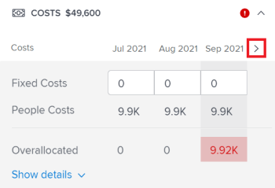

# 解决 [!DNL Scenario Planner]

当各项倡议相互冲突时，它们正在争夺相同的资源。 您在情景中可用的资源不足以涵盖情景中所有倡议所需的全部资源。

在以下任何情况下都可能发生这种情况：

* 该倡议所需的职务角色数大于计划预算的职位数。
* 该倡议的费用大于计划可用的预算数额。

## 访问要求

您必须具备以下条件：

<table style="table-layout:auto"> 
 <col> 
 <col> 
 <tbody> 
  <tr> 
   <td> 
[!DNL Adobe Workfront]<b> 计划*</b> 
 </td> 
   <td>[!UICONTROL Business]或更高版本</td> 
  </tr> 
  <tr> 
   <td> 
[!DNL Adobe Workfront]<b> 许可证*</b> 
 </td> 
   <td> 
[!UICONTROL Review]或更高版本
 </td> 
  </tr> 
  <tr> 
   <td><b>产品</b> </td> 
   <td> 
您必须为 [!DNL Adobe Workfront Scenario Planner] ，以访问本文中描述的功能。
 
有关获取 [!DNL Workfront Scenario Planner]，请参阅 <a href="../scenario-planner/access-needed-to-use-sp.md" class="MCXref xref">使用所需的访问权限 [!DNL Scenario Planner]</a>. 
 </td> 
  </tr> 
  <tr data-mc-conditions=""> 
   <td><strong>访问级别配置*</strong> </td> 
   <td> 
[!UICONTROL Edit]或更高版本 [!DNL Scenario Planner]
 
注意：如果您仍无权访问，请咨询您的 [!DNL Workfront] 管理员。 有关如何 [!DNL Workfront] 管理员可以更改您的访问级别，请参阅 <a href="../administration-and-setup/add-users/configure-and-grant-access/create-modify-access-levels.md" class="MCXref xref">创建或修改自定义访问级别</a>.
 </td> 
  </tr> 
  <tr data-mc-conditions=""> 
   <td> 
<strong>对象权限</strong> 
 </td> 
   <td> 
[!UICONTROL管理]计划的权限
 
有关请求对计划进行额外访问的信息，请参阅 <a href="../scenario-planner/request-access-to-plan.md" class="MCXref xref">请求对 [!DNL Scenario Planner]</a>.
 </td> 
  </tr> 
 </tbody> 
</table>

&#42;要了解您拥有的计划、许可证类型或访问权限，请联系您的Workfront管理员。

## 解决冲突概述

* 冲突也被理解为工作角色或方案预算的过度分配。
* When [!DNL Workfront] 检测冲突，在方案持续时间内与冲突月份对应的栏以红色显示。 在以下任何情况下都可能发生这种情况：

   * 每月计划所需的工作角色数大于计划预算的角色数，因为以前的所有计划都使用了计划预算的资源。
   * 在所有以前的倡议都使用计划预算支付其费用后，倡议的每月费用大于计划可用的预算。

>[!TIP]
>
>默认情况下， [!DNL Scenario Planner] 假定您已为0个职务角色编入预算，并且为方案以系统货币$0或等于$0（除非另有指定）。 职务角色的数量表示为职务角色编入预算的FTE（全职等效人员）或小时数。
>
>对于方案计划器中的所有计算，Workfront会使用以下值：1个FTE = 8小时。
>
>有关更新计划和预算的可用角色的信息，请参阅 [在 [!DNL Scenario Planner]](../scenario-planner/create-and-edit-plans.md).

* 您可以通过执行以下操作之一来解决冲突：

   * 从方案中的方案自动添加缺少的必需资源。 本文介绍了如何使用此选项解决冲突。
   * 通过编辑计划来调整方案的任务职责和预算资源。 有关更多信息，请参阅 [在 [!DNL Scenario Planner]](../scenario-planner/create-and-edit-plans.md).

## 解决各项倡议之间的冲突

1. 转到要解决冲突的计划。

   有关创建计划的信息，请参阅 [在 [!DNL Scenario Planner]](../scenario-planner/create-and-edit-plans.md).

   有关创建计划的信息，请参阅 [在 [!DNL Scenario Planner]](../scenario-planner/create-and-edit-initiatives.md).

1. （可选）从 **[!DNL Initial scenario]** 下拉菜单中，选择要查看的方案。

   >[!TIP]
   >
   >计划可能有多种情况。 看计划的冲突， [!DNL Workfront] 是指选定方案中当前可用的资源以及该方案计划所需的资源。 有关方案的信息，请参阅 [在 [!DNL Scenario Planner]](../scenario-planner/create-and-compare-scenarios-for-a-plan.md).

1. 确保 **[!UICONTROL 显示冲突]** 启用。 默认情况下处于启用状态。

   

   第一个冲突的方案将以红色显示冲突的月份，并在方案名称旁边显示一个警告图标。

   从第一个冲突方案开始的所有方案的背景在计划图表上以红色显示。

   当方案显示冲突时，这意味着至少一个特定职责的职务职责数、所产生的成本，或两者都超过为特定月份的计划定义的职务职责数或预算。

   

1. 请执行以下操作之一，以进一步了解可能存在的冲突：

   * 将鼠标悬停在方案名称旁边的警告图标上，可了解您是具有职务角色还是预算冲突。

      

      根据您是否为方案分配了过多的职务角色或高估了成本，当将鼠标悬停在警告图标上时，您可能会看到以下选项之一：

      * 显示工作角色冲突详细信息
      * 显示预算冲突详细信息
      * 显示职务角色和预算详细信息
   * 按月查看计划时，将鼠标悬停在计划时间轴中的某个月上，以查看该月的所需资源以及该月的冲突是人员冲突还是与成本相关冲突。

      

      在计划级别查看以下月度信息：

      * 当月计划的所有计划的可用、必需和过度分配的工作角色数
      * 当月计划的所有计划的可用、必需和超额分配的成本

         >[!TIP]
         >
         >的 [!UICONTROL 可用] 成本是该月的方案预算。
   * 将鼠标悬停在方案的红色栏上一个月，可显示有关当月发生冲突的其他信息框。

      

      在计划级别查看其他信息框中的以下字段：

      <table style="table-layout:auto"> 
      <col> 
      <col> 
      <tbody> 
       <tr> 
        <td role="rowheader">发生冲突的月份</td> 
        <td>显示在附加信息框的标题中。</td> 
       </tr> 
       <tr> 
        <td role="rowheader">方案名称</td> 
        <td>显示在附加信息框的标题中。</td> 
       </tr> 
       <tr> 
        <td role="rowheader">[!UICONTROL作业角色]</td> 
        <td> 
与此方案关联的在选定月份中被过度分配的作业角色。 以下列显示选定月份所需的每个作业角色的信息，这些信息与该月可用的作业角色数量相冲突：
 
         <ul> 
          <li> 
<strong>[!UICONTROL可用]</strong>:方案中选定月份的每个作业角色的数量。
 </li> 
          <li> 
<strong>[!UICONTROL必需]</strong>:在选定月份内，方案所需的每个职务角色的数量。
 </li> 
          <li> 
<strong>[!UICONTROL Overallocated]:</strong> 方案所需数量与方案可用数量之差。 
 </li> 
         </ul> 
提示：有时，[!UICONTROL Available]角色的数量会匹配或大于[!UICONTROL Required]角色的数量，但是 [!DNL Scenario Planner] 仍显示超量分配。 这意味着，在同月的计划中，已经使用了可用的工作角色的更高级别举措。 
 </td> 
       </tr> 
       <tr> 
        <td role="rowheader">成本</td> 
        <td> 
选定月份的方案费用。 以下列显示所需成本以及选定月份可用预算的信息：
 
         <ul> 
          <li> 
<strong>[!UICONTROL可用]</strong>:计划中选定月份的可用预算。
 </li> 
          <li> 
<strong>[!UICONTROL必需]</strong>:与选定月份的此方案关联的成本。
 </li> 
          <li> 
<strong>[!UICONTROL Overallocated]:</strong> 计划成本与计划可用预算之差。 
 </li> 
         </ul> 
提示：有时，[!UICONTROL Available]成本与选定月份的方案的[!UICONTROL Required]成本匹配或高于 [!DNL Scenario Planner] 仍显示成本的过度分配。 这意味着，在同月的计划中，已经使用了可用预算的更高级别举措。 
 </td> 
       </tr> 
      </tbody> 
     </table>

1. 执行以下操作之一以打开方案详细信息面板，查看有关冲突发生位置的更多信息并解决冲突：

   * 单击方案名称旁边的警告图标。
   * 单击方案的栏。
   * 单击 **[!UICONTROL 更多]** 图标  在方案名称的右侧，单击 **[!UICONTROL 编辑]**.

      方案详细信息面板将显示在右侧。

      如果您的方案没有足够的人员或预算，则以下部分旁边会显示一个红色警告图标：

   * [!UICONTROL 所需的工作角色]
   * [!UICONTROL 成本]

1. （视情况而定）对于存在工作角色冲突的倡议，请转至 **[!UICONTROL 所需的作业角色]** 部分查看您的计划所需的所有工作角色。 确定可能被过度分配的作业角色。 查看计划每个月每个工作角色所需的FTE或小时数。 在红色大纲中显示具有超额分配的月份的FTE或小时数框。

   

1. （可选）单击方案时间轴中月份旁边的右箭头，以查看哪些额外月份显示了工作角色冲突。

   

1. （可选）单击 **[!UICONTROL 显示详细信息]** 在显示冲突的职务职责下，查看冲突的显示位置，并突出显示计划图表区域中冲突的月份。 将显示每个作业角色的其他信息。

   每个作业角色将显示以下字段：

   <table style="table-layout:auto"> 
    <col> 
    <col> 
    <tbody> 
     <tr> 
      <td role="rowheader">[!UICONTROL可用]</td> 
      <td> 
计划中每月可用的职务角色数。 
 </td> 
     </tr> 
     <tr> 
      <td role="rowheader">[!UICONTROL以前分配]</td> 
      <td>从计划预算中分配给特定月份的更高级别计划的职位数量。 </td> 
     </tr> 
     <tr> 
      <td role="rowheader">[!UICONTROL Overallocated]</td> 
      <td> 
主动行动中所需工作角色的数量与计划中较高级别主动行动后可用的数量之间的差额，也使用了一些角色。 Workfront使用以下公式计算[!UICONTROL Overallocated]作业角色的数量：
 
<code>Overallocated roles = (Roles Previously Allocated to higher initiatives + Required roles for current initiative) - Monthly available roles from the plan</code> 
 </td> 
     </tr> 
    </tbody> 
   </table>

   >[!TIP]
   >
   >在计划图表上，分配职务角色的月份显示每个需要职务的方案所需的职务名称和数量。 您必须选择 [!UICONTROL 月] 查看以查看作业角色的名称

   

1. 执行下列操作之一以解决作业角色冲突：

   * 手动将计划每个月的作业角色数量调整为较低数量。
   * 将鼠标悬停在作业角色的名称上，然后单击 **[!UICONTROL 删除] 图标**  从方案中删除作业角色。
   * 选择 **[!UICONTROL 将角色添加到方案的可用资源]**，然后单击 **[!UICONTROL 应用]**.

      这会将缺少的工作角色FTE或小时数添加到方案的 [!UICONTROL 可用] 字段。

      >[!NOTE]
      >
      >您添加的用于解决冲突的角色将修改 [!UICONTROL 可用] 所选方案的作业角色，而不是计划中所有方案的作业角色。

      向上指向的绿色箭头  在计划时间轴中显示该月的，以指示该月向计划添加了更多资源。 您必须选择 [!UICONTROL 月] 查看此指示器。

   * （视情况而定）关闭详细信息面板，并为方案提供更高的优先级，以便首先从计划中接收预算资源（如果可能）。 有关更新方案优先级的信息，请参阅 [更新方案计划员中的方案优先级](../scenario-planner/prioritize-initiatives.md).

1. （可选）单击 **[!UICONTROL 隐藏详细信息]** 要关闭其他详细信息框，请单击 **[!UICONTROL 应用]** 以保存您对作业角色所做的更改。

1. （视情况而定）对于存在成本冲突的倡议，请转至 **[!UICONTROL 成本]** 在倡议详细资料小组审查倡议期间每个月的费用一节。 确定哪些月份在计划预算中可能没有足够的资金来支付选定方案的费用。 可用预算不足的框以红色边框显示。
1. （可选）单击计划时间表中月份旁边的向右箭头，可查看预算不足以支付成本的其他月份。

   

1. （可选）单击 **[!UICONTROL 显示详细信息]** 在成本信息下，查看冲突的显示位置，并在计划图表上突出显示冲突月份。 针对每种成本类型显示以下附加字段：

   <table style="table-layout:auto"> 
    <col> 
    <col> 
    <tbody> 
     <tr> 
      <td role="rowheader">[!UICONTROL可用]</td> 
      <td> 
计划预算中每个月的可用成本。 
 </td> 
     </tr> 
     <tr> 
      <td role="rowheader">[!UICONTROL以前分配]</td> 
      <td>从计划预算中分配给更高级别计划的资金数额。 </td> 
     </tr> 
     <tr> 
      <td role="rowheader">[!UICONTROL Overallocated]</td> 
      <td> 
计划所需费用与计划预算中在较高级别的计划后可用资金数额之间的月差，也使用了一些可用预算。 [!DNL Workfront] 使用以下公式计算“超额分配”成本的数量：
 
<code>Overallocated costs = (Costs Previously Allocated to higher initiatives + Required costs for the current initiative) - Monthly available budget from the plan</code> 
 
[!DNL Workfront] 使用以下公式计算每月当前方案的必需成本：
 
<code>Required initiative costs = Initiative Fixed Costs + Initiative People Costs</code> 
 </td> 
     </tr> 
    </tbody> 
   </table>

   >[!TIP]
   >
   >在计划图表上，成本不足的月份显示了计划仍需要的角色名称和数量。 您必须选择“月”视图来查看成本金额。

   

   >[!NOTE]
   >
   >如果您禁用了 [!UICONTROL 包括人员成本] 为计划设置 [!UICONTROL 预算] 框， [!UICONTROL 人员成本] 在任何情况下，不会为任何方案显示行。 在这种情况下，Workfront不会将人员成本计算在内，以确定成本冲突。 有关创建计划的信息，请参阅 [在 [!DNL Scenario Planner]](../scenario-planner/create-and-edit-plans.md).

1. 执行以下操作之一以解决成本冲突：

   * 手动调整 [!UICONTROL 固定成本] 每月的计划数量减少。
   * 在 **[!UICONTROL 所需的作业角色]** 部分中，如果可能，使用人员成本预算手动调整当月的职务角色数。 这会减少人员成本。

      >[!TIP]
      >
      >您不能手动调整人员成本。

   * 选择 **[!UICONTROL 向方案预算中添加金额]**，然后单击 **[!UICONTROL 应用]**.

      这会为方案预算中缺少该预算的月份添加不足的金额，这也会更新整个方案预算。

      >[!NOTE]
      >
      >您为解决成本冲突而添加的金额将修改选定方案的预算，而不是计划中所有方案的预算。

   * （视情况而定）关闭详细信息面板，并为方案提供更高的优先级，以便首先从计划中接收预算资源（如果可能）。 有关更新方案优先级的信息，请参阅 [更新 [!DNL Scenario Planner]](../scenario-planner/prioritize-initiatives.md).

1. 单击 **[!UICONTROL 应用]** 对“成本”部分进行任何更改时。
1. 单击 **[!UICONTROL 保存计划]** 以保存更改。

