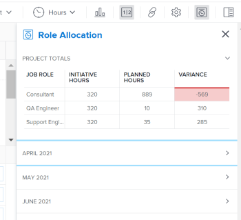

# 在[!UICONTROL 工作负载均衡器]中显示项目和计划的角色分配

<!--Audited: 07/2024-->

连接项目和计划后，您可以并排管理其资源分配以确保它们相匹配。 这样可避免过度分配或过度利用它们。

本文介绍了如何使用项目的[!UICONTROL 工作负载均衡器]中的[!UICONTROL 角色分配]面板协调资源。

有关在项目和计划之间协调资源的一般信息，包括先决条件，请参阅[在项目和计划之间协调资源分配概述](../scenario-planner/overview-reconcile-allocations-between-projects-initiatives.md)。

## 访问要求

+++ 展开以查看本文中各项功能的访问要求。

<table style="table-layout:auto"> 
 <col> 
 <col> 
 <tbody> 
  <tr> 
   <td> 
[!DNL Adobe Workfront] 计划*
 </td> 
   <td> <ul></li>
   <li>
新增：Ultimate 
</li>
   
Scenario Planner不可用于新的Workfront Select或Workfront计划。 

   <li>
当前： [！UICONTROL Business]或更高版本
</ul>
   </td> 
  </tr> 
  <tr> 
   <td> 
[!DNL Adobe Workfront] 许可证*
 </td> 
   <td> 
新增：浅色或更高
 
   
当前： [！UICONTROL Review]或更高版本
 </td> 
  </tr> 
  <tr> 
   <td>产品* </td> 
   <td> <ul><li>
对于新的Workfront计划：

 Adobe Workfront</li>

   <li>
对于当前Workfront计划： 

   
Adobe Workfront
 
Adobe Workfront Scenario Planner
</li></ul>

有关详细信息，请参阅<a href="../scenario-planner/access-needed-to-use-sp.md" class="MCXref xref">使用[!DNL Scenario Planner]</a>所需的访问权限。 
 </td> 
  </tr> 
  <tr data-mc-conditions=""> 
   <td>访问级别 </td> 
   <td> 
查看或更高权限的项目。
 </td> 
  </tr> 
  <tr data-mc-conditions=""> 
   <td> 
对象权限 
 </td> 
   <td> 
 查看或更高权限的项目。
 </td> 
  </tr> 
 </tbody> 
</table>

*有关信息，请参阅[Workfront文档的访问要求](/help/quicksilver/administration-and-setup/add-users/access-levels-and-object-permissions/access-level-requirements-in-documentation.md)。

+++

## 在[!UICONTROL 工作负载均衡器]中显示项目和计划的角色分配

如果您的公司购买了[!DNL Workfront Scenario Planner]许可证，您可以在项目级别[!UICONTROL 工作负载均衡器]中协调计划与链接到该计划的项目之间的资源分配。

1. （视情况而定）使用以下文章中描述的方法之一将项目与计划关联：

   * [将项目导入 [!DNL Adobe Workfront Scenario Planner]](import-projects-to-plans.md)中的计划。
   * [通过在 [!DNL Adobe Workfront Scenario Planner]](publish-scenarios-update-projects.md)中发布计划来更新或创建项目。

   >[!IMPORTANT]
   >
   >如果对计划中的资源进行了更改，则必须重新发布计划所属的方案，以便计划中的最新资源信息能够更新项目。

1. 转到要在其中查看项目和相关计划的工作角色分配情况的项目。
1. 单击左侧面板中的[!UICONTROL 工作负载均衡器]。

   您可能需要单击&#x200B;**[!UICONTROL 计划]**，然后单击&#x200B;**[!UICONTROL 切换到工作负载均衡器]**。

1. 执行下列操作之一：

   * 单击&#x200B;**[!UICONTROL 月]**&#x200B;查看按月的工作负载均衡器，单击时间线中一个月旁边的下拉菜单，然后单击&#x200B;**[!UICONTROL 更多]**。
   * 单击工具栏右上角的&#x200B;**[!UICONTROL 显示角色分配]**&#x200B;图标。

   此时将显示[!UICONTROL 角色分配]面板。

   

   >[!CAUTION]
   >
   >尽管即使您的组织未购买[!DNL Workfront Scenario Planner]许可证，您仍可以查看[!UICONTROL 角色分配]面板，但您无法查看有关计划工作角色的信息。

   <!--
   
(NOTE: ensure this step stays 5 to match the mention of it in the section below)

   -->

1. 查看“角色分配”面板的&#x200B;**[!UICONTROL 项目总计]**&#x200B;区域中的以下信息：

   <table style="table-layout:auto"> 
    <col> 
    <col> 
    <tbody> 
     <tr> 
      <td role="rowheader">[！UICONTROL Job Role]</td> 
      <td> 
与以下任何一项关联的工作角色的名称：
 
       <ul> 
        <li> 
项目中的任务
 </li> 
        <li> 
项目问题
 </li> 
        <li> 
链接到项目的计划
 </li> 
       </ul> </td> 
     </tr> 
     <tr> 
      <td role="rowheader">[！UICONTROL计划小时数]</td> 
      <td>计划总持续时间内与计划上每个工作角色关联的所需小时数。 </td> 
     </tr> 
     <tr> 
      <td role="rowheader">[！UICONTROL已计划小时数]</td> 
      <td>在项目总持续时间内，与项目任务或问题中的每个工作角色关联的已计划小时数。 </td> 
     </tr> 
     <tr> 
      <td role="rowheader">[！UICONTROL变量]</td> 
      <td> 
计划所需的小时数与项目工作相关的计划小时数之间的差额。 [!DNL Workfront]使用以下公式计算[！UICONTROL方差]：
 
<code>Role Allocation Variance = Initiative Hours - Planned Hours</code> 
 
当计划的资源时间超过计划所需的小时数时，[！UICONTROL差异]为负数并显示为红色。 这意味着您的资源被过度分配。 
 </td> 
     </tr> 
    </tbody> 
   </table>

   >[!TIP]
   >
   >项目中的计划小时数未显示在以下方案中：
   >
   >   
   >   
   >   * 未将任务或问题分配给工作角色或与其关联的工作角色的用户。
   >   * 当任务或问题的[!UICONTROL 持续时间]为零时。
   >   
   >

1. （可选）如果[!UICONTROL Variance]列显示您的资源分配过量，请调整以下选项之一：

   * 减少显示过度分配的一个工作角色的计划小时数，或向任务添加更多资源，并向新资源分配更多计划小时数。 您可以在编辑任务或问题时更新分配或计划小时数。 有关更多信息，请参阅以下文章：

      * [编辑任务](../manage-work/tasks/manage-tasks/edit-tasks.md)
      * [编辑问题](../manage-work/issues/manage-issues/edit-issues.md)

     >[!NOTE]
     >
     >您必须具有其他访问权限才能编辑任务和问题。

   * 增加在计划上显示过度分配的角色所需的小时数。 有关详细信息，请参阅[在 [!DNL Adobe Workfront Scenario Planner]](create-and-edit-initiatives.md)中创建和编辑计划。

     >[!NOTE]
     >
     >您必须具有其他访问权限才能编辑计划。

1. （可选）单击下拉图标以在[!UICONTROL 角色分配]面板或[!UICONTROL 工作负载均衡器]的时间线中展开一个月之一。

   

   每个月还会显示[!UICONTROL 项目总计]区域中所显示的相同类型的信息。

   >[!TIP]
   >
   >[!UICONTROL 角色分配]面板中列出的月份是[!UICONTROL 工作负载均衡器]的屏幕上显示的时间线中的月份。 在时间轴上前后滚动以查看其他月份。

   <!--
   <li value="8" data-mc-conditions="QuicksilverOrClassic.Draft mode"> 
 
 </li>
   -->

