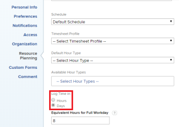

# 配置时间是以小时还是天记录

作为拥有计划员许可证的用户，您可以配置您是以小时还是天在Adobe Workfront中记录时间。 系统管理员可以为个人用户或其组织中的多个用户配置此设置。 默认情况下，用户以小时为单位记录时间。 有关如何在Workfront中记录时间的信息，请参阅 [日志时间](../../timesheets/create-and-manage-timesheets/log-time.md).

>[!NOTE]
>
>我们建议在整个组织内以相同方式（小时或天）记录时间，以确保报表的准确性。

## 访问要求

您必须具有以下访问权限才能执行本文中的步骤：

<table style="table-layout:auto"> 
 <col> 
 </col> 
 <col> 
 </col> 
 <tbody> 
  <tr> 
   <td role="rowheader">Adobe Workfront计划*</td> 
   <td> 
任意
 </td> 
  </tr> 
  <tr> 
   <td role="rowheader">Adobe Workfront许可证*</td> 
   <td> 
计划 
 </td> 
  </tr> 
  <tr data-mc-conditions=""> 
   <td role="rowheader">访问级别配置*</td> 
   <td> 
规划者可以为自己配置时间。 只有Workfront管理员才能为其他用户配置时间。
 </td> 
  </tr> 
 </tbody> 
</table>

&#42;要了解您拥有的计划、许可证类型或访问权限，请联系您的Workfront管理员。

1. 根据您在系统中的目标和访问级别，执行以下任一操作：

   * **计划员用户为自己配置时间日志记录：** 单击 **主菜单** 图标  在Adobe Workfront的右上角，单击配置文件图片旁边的用户名。 然后，单击 **更多** 图标，然后选择 **编辑**.

   * **系统管理员为其他人员配置时间日志记录：** 开始编辑一个或多个用户帐户，如 [编辑用户的配置文件](../../administration-and-setup/add-users/create-and-manage-users/edit-a-users-profile.md).

1. 在生成的对话框中，在 **资源计划** ，找到 **登录时间** 选项。

   

1. （视情况而定）如果您是同时编辑多个用户的系统管理员，请选择 **登录时间**.
1. 从以下选项中选择记录时间：

   | 选项 | 描述 |
   |---|---|
   | **小时** | 用户在Workfront中指定记录时间的小时数。 |
   | **天数** | 用户可指定在Workfront中记录时间的天数。 |

1. （视情况而定）如果您选择以天为单位记录时间，请在 **完整Workday的等效小时数** 字段中，键入等于一整天的小时数。 用户的时间表上的某一天等于您在此处输入的小时数。

   配置此设置时，请考虑以下事项：

   * 此选项在配置为以小时为单位记录时间时不可用。
   * 此选项仅用于记录时间。 此选项与 **计划** 选项。 的 **计划** 选项。 (有关使用 **计划** 选项，请参阅 [创建计划](../../administration-and-setup/set-up-workfront/configure-timesheets-schedules/create-schedules.md).) 

1. 单击 **保存更改**.
