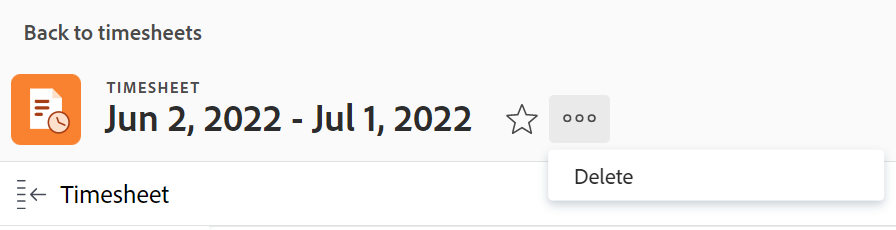

# 删除Adobe Workfront中的工时表

您对时间表配置文件所做的更改对当前现有时间表无效，如[创建、编辑和分配时间表配置文件](../../timesheets/create-and-manage-timesheets/create-timesheet-profiles.md)中所述。 要使更改在现有时间表上可见，您必须删除已生成的时间表并生成新时间表。 这仅适用于通过将时间表用户档案与用户关联而生成的时间表。

>[!NOTE]
>
>无法通过重新生成时间表来重新创建手动创建的时间表，除非自手动创建时间表以来，用户已与时间表配置文件关联。 删除手动创建的时间表可能会导致数据丢失。 有关创建单个时间表的信息，请参阅[创建一次性时间表](../../timesheets/create-and-manage-timesheets/create-tmshts.md)。

Adobe Workfront管理员或组管理员可以为系统中的每个人生成时间表。 有关手动生成时间表的详细信息，请参阅：

* [手动生成工时表](../../timesheets/create-and-manage-timesheets/manually-generate-timesheets.md)
* [创建和管理组的周期性工时表](../../administration-and-setup/manage-groups/work-with-group-objects/create-and-modify-a-groups-timesheet-profiles.md)

>[!IMPORTANT]
>
>* 无法恢复已删除的时间表。
>* 我们建议您不要删除过去的时间表，因为它们不是根据时间表配置文件自动生成的。 如果希望对时间表用户档案所做的更改立即显示在新时间表中，您可以删除当前和未来时间表，并手动生成这些时间表。
>* 当您删除时间表时，不会删除针对任务、问题和项目记录的小时数。 时间表只删除常规小时。 在单独的文本编辑器中，写下与时间表关联的常规小时。 删除时间表后，您可以将其记录在新时间表中。
>

## 访问要求

+++ 展开以查看本文中各项功能的访问要求。

<table style="table-layout:auto">
 <col> 
 <col>
 <tbody> 
  <tr> 
   <td>Adobe Workfront包</td> 
   <td>
任何
</td> 
  </tr> 
  <tr> 
   <td>Adobe Workfront许可证</td> 
   <td>
   
标准

   
规划
</td>
  </tr> 
  <tr> 
   <td>访问级别配置</td> 
   <td>
对工时表的管理访问权限
 </td> 
  </tr> 
 </tbody> 
</table>

有关信息，请参阅Workfront文档中的[访问要求](/help/quicksilver/administration-and-setup/add-users/access-levels-and-object-permissions/access-level-requirements-in-documentation.md)。

+++

## 删除列表中的工时表

1. 单击Adobe Workfront右上角的&#x200B;**主菜单**&#x200B;图标。

1. 单击&#x200B;**时间表**。 默认情况下已选择&#x200B;**所有**&#x200B;筛选器，该筛选器显示您有权查看的所有时间表。

   

1. （可选）执行以下操作之一以更新时间表列表中的过滤器：

   * 选择页面右上角的&#x200B;**我的工时表批准**&#x200B;以仅查看您批准的时间表

     或

     选择&#x200B;**我的时间表**&#x200B;以仅查看您的时间表。

     这会将我的时间表批准或我的时间表过滤器应用到时间表列表。

     

   * 单击“筛选器”图标以应用其他筛选器，或创建新筛选器。 有关创建或更新筛选器的信息，请参阅[在Adobe Workfront中创建或编辑筛选器](../../reports-and-dashboards/reports/reporting-elements/create-filters.md)。

   >[!NOTE]
   >
   >如果您的Workfront管理员或组管理员从“设置”区域的列表控件或布局模板中删除了“我的时间表审批”和“我的时间表”过滤器，则“我的时间表审批”和“我的时间表”选项不会显示在时间表列表顶部或过滤器列表中。 有关更多信息，请参阅以下文章：
   >
   >   
   >   
   >   * [使用布局模板自定义筛选器、视图和分组](../../administration-and-setup/customize-workfront/use-layout-templates/customize-fvg-list-controls-layout-template.md)
   >   
   >

1. （可选）单击&#x200B;**视图** 或&#x200B;**分组** 图标以应用不同的视图或分组或创建新视图或分组。

   有关创建过滤器、视图或分组的信息，请参阅以下文章：

   * [在Adobe Workfront中创建或编辑筛选器](../../reports-and-dashboards/reports/reporting-elements/create-filters.md)
   * [在Adobe Workfront中创建或编辑视图](../../reports-and-dashboards/reports/reporting-elements/create-edit-views.md)
   * [在Adobe Workfront中创建分组](../../reports-and-dashboards/reports/reporting-elements/create-groupings.md)

1. 选择一个或多个要删除的时间表，然后单击时间表列表顶部的&#x200B;**删除** 图标。

1. 单击&#x200B;**删除**。

   选定的时间表将被删除并且无法恢复。

   要生成新时间表，请确保用户与时间表配置文件相关联，并要求Workfront管理员或组管理员生成新时间表。

   有关更多信息，请参阅以下内容：

   * [创建、编辑和分配时间表配置文件](../../timesheets/create-and-manage-timesheets/create-timesheet-profiles.md)
   * [手动生成工时表](../../timesheets/create-and-manage-timesheets/manually-generate-timesheets.md)
   * [创建和管理组的周期性工时表](../../administration-and-setup/manage-groups/work-with-group-objects/create-and-modify-a-groups-timesheet-profiles.md)

## 从时间表页面删除时间表

1. 单击Adobe Workfront右上角的&#x200B;[!UICONTROL **主菜单**]&#x200B;图标。
1. 单击要删除的时间表以将其打开。
1. 单击时间表名称右侧的&#x200B;[!UICONTROL **更多**]&#x200B;图标，然后单击&#x200B;**删除**。

   
1. 单击&#x200B;[!UICONTROL **删除**]&#x200B;以确认。

   该时间表已被删除，无法恢复。
