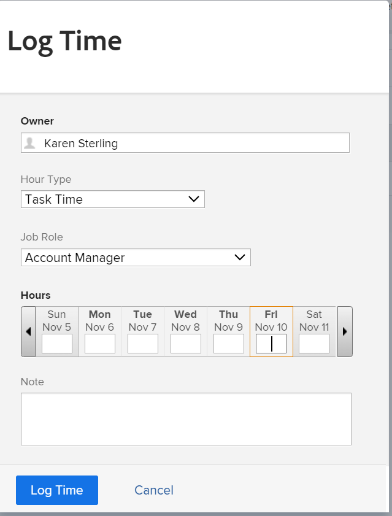
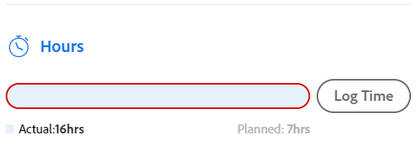

# 记录时间

<!--Audited: 12/2023-->

<!--remove all preview and production references from this article with 23.3 release-->

<!--
The highlighted information on this page refers to functionality not yet generally available. It is available only in the Preview environment for all customers. After the monthly releases to Production, the same features are also available in the Production environment for customers who enabled fast releases.   
For information about fast releases, see [Enable or disable fast releases for your organization](../../administration-and-setup/set-up-workfront/configure-system-defaults/enable-fast-release-process.md). 

For information about the current release schedule, see [Fourth Quarter 2023 release overview](../../product-announcements/product-releases/23-q4-release-activity/23-q4-release-overview.md) 
-->

您可以在Adobe Workfront中记录工作项的时间，以指示您处理这些工作项的小时数。 您还可以记录与工作无关的时间，如假期、病假或会议时间。 您的登录时间显示在您的时间表中。

有关可登录Workfront的小时类型的详细信息，请参阅[管理小时类型](../../administration-and-setup/set-up-workfront/configure-timesheets-schedules/hour-types.md)。

## 访问要求

+++ 展开以查看本文中各项功能的访问要求。

您必须具有以下权限才能执行本文中的步骤并记录项目特定的小时数：

<table style="table-layout:auto"> 
 <col> 
 <col> 
 <tbody> 
  <tr> 
   <td role="rowheader">Adobe Workfront计划</td> 
   <td> 
任何
 </td> 
  </tr> 
  <tr> 
   <td role="rowheader">Adobe Workfront许可证*</td> 
   <td> 
新增：在项目、任务、问题或时间表上的常规小时数上记录小时数的较短或更高

   
当前： 
   <ul><li>查看或更高版本以在时间表中记录常规小时数</li>
   <li>用于记录项目、任务或问题的小时数的工作或更高</li></ul> </td> 
  </tr> 
  <tr> 
   <td role="rowheader">访问级别配置</td> 
   <td> 
编辑您记录时间的工作项类型的访问权限 
 
例如，您需要对问题的编辑访问权限，以记录问题的时间
 </td> 
  </tr> 
  <tr> 
   <td role="rowheader">对象权限</td> 
   <td> 
您为其记录时间的工作项的Contribute或更高权限，包括“记录小时数”权限
 </td> 
  </tr> 
 </tbody> 
</table>

*有关详细信息，请参阅Workfront文档中的[访问要求](/help/quicksilver/administration-and-setup/add-users/access-levels-and-object-permissions/access-level-requirements-in-documentation.md)。

+++

## 在Workfront中记录时间时的注意事项

* 您可以为项目、任务或问题记录时间，也可以直接在时间表中记录时间。

  有关创建时间表的信息，请参阅[创建一次性时间表](../../timesheets/create-and-manage-timesheets/create-tmshts.md)。

* 通过非时间表工具记录的所有时间都会显示在相应时间段的时间表中。
* 项目上非当前的任务和问题不会预填充到时间表中。
* 工时表记录的时间会立即应用于任务、问题或项目。
* 时间表包括所有已记录日期的总时间。 始终包括周末，即使时间线计算已配置为排除它们（如[配置系统范围项目偏好设置](../../administration-and-setup/set-up-workfront/configure-system-defaults/set-project-preferences.md)中所述）。
* 时间表中显示的最大项目数为45。 如果超过45个项目的日期与时间表时间范围相匹配，则仅显示最近更新的项目。
* 已记帐记帐记录中包含的小时条目将灰显，无法在时间表中编辑。 有关详细信息，请参阅[创建开票记录](../../manage-work/projects/project-finances/create-billing-records.md)。
* 默认情况下，个人任务未显示在时间表中。 仅当个人任务已记录时，才会显示在时间表中。 在个人任务上记录时间后，您可以将任务固定到时间表，如果仍然固定，该任务将保留在时间表上。 有关详细信息，请参阅[从主页区域创建工作项](../../workfront-basics/using-home/using-the-home-area/create-work-items-in-home.md)。

## 记录时间 {#log-time-section}

您可以在Workfront的以下区域记录时间：

* [时间表](#timesheet)
* [主页](#home)
* [项目、任务或问题](#project-task-or-issue)
* [摘要面板](#summary-panel)
* [展示板](#boards)
* [移动应用程序](#mobile-app)

### 时间表 {#timesheet}

#### 在时间表上记录时间 {#log-time-on-a-timesheet}

您可以将时间记录到时间表中的以下项目：

* 预填充的任务、问题和项目，会根据Workfront管理员如何设置时间表首选项自动显示。 有关如何预填充时间表的信息，请参阅[配置时间表和小时首选项](../../administration-and-setup/set-up-workfront/configure-timesheets-schedules/timesheet-and-hour-preferences.md)。

  您的时间表中只预填充了分配给您的任务和问题。 分配给团队或工作角色的任务和问题不会自动填充您的时间表。

  在分配给您团队的项目上单击处理它会将项目分配给您，该项目将显示在您的时间表中。

* 您手动添加的任务、问题或项目。
* 已在Workfront中的其他位置记录时间的任务、问题或项目。
* 常规时间（休假、培训、管理时间）。

>[!NOTE]
>
>查看分配给时间表配置文件的用户可查看时间表区域并记录常规小时数。 但是，他们无法记录时间表上显示的、分配给他们的任何任务或问题的小时数。

要在时间表上记录时间，请执行以下操作：

{{step1-click-main-menu}}

1. 单击&#x200B;[!UICONTROL **时间表**]。 默认情况下显示您当前的工时表。
   

1. （可选）单击&#x200B;**全屏**&#x200B;图标以全屏模式显示时间表，然后单击&#x200B;**退出全屏** 图标以返回时间表。

   <!-- drafted for the resize columns in timesheet story: 1. (optional) Click on the separator lines between weeks or between the time frame area and the work item area to resize the columns of the timesheet.-->

1. （可选）要将项目、任务或问题添加到时间表，请单击时间表左上角的&#x200B;**添加项**&#x200B;下拉菜单，然后单击&#x200B;**添加项目**、**添加任务**&#x200B;或&#x200B;**添加问题**。

   此时将显示项目、任务或问题的列表。

   <!--drafted for full screen mode for add projects story - align it with the rest of the steps when you enable this:: 1. (Optional) Click the **full-screen** icon  to display the list of objects in full-screen mode.-->

1. （可选）单击搜索图标以使用要添加到时间表的关键字搜索特定项。

1. （可选）展开过滤器、视图或分组下拉菜单以应用或自定义一个下拉菜单，并查看所需的项目信息。

1. 在列表中选择一个或多个项目，然后单击&#x200B;**添加**。

   如果一次添加的项目少于50个，则这些项目会添加到时间表中。 任务和问题列在项目的名称下。

   >[!NOTE]
   >
   >将任务或问题添加到时间表时，也会添加项目。

1. （视情况而定）如果一次添加50个或更多项目，则会显示一条确认消息，其中显示添加到时间表的项目数。

   单击&#x200B;**全部添加**以添加所有项
或
单击**取消**&#x200B;停止添加选定项，然后单击&#x200B;**取消**&#x200B;关闭项列表。

   任务和问题列在项目的名称下。

   >[!NOTE]
   >
   >您手动添加到时间表的项目已固定，并将保留在当前和未来时间表中，直到您手动取消固定它们以将其删除。 有关取消固定项目以将其从时间表中删除的信息，请继续执行步骤10。

   <!--(ensure this stays accurate)-->

1. （可选）单击项目名称旁边的&#x200B;**折叠** 或&#x200B;**展开** 图标以显示或隐藏项目的任务和问题列表。

   >[!TIP]
   >
   >   使用标准QWERTY键盘时，在单击时间表中的项目名称后，按下列一组键折叠或展开该项目：
   >   * 要展开项目并显示其工作项，请执行以下操作：
   >     * Shift + Alt +向上箭头键（适用于Windows计算机）
   >     * 适用于Mac计算机的Shift + Option +向上箭头
   >   * 要折叠项目并隐藏其工作项，请执行以下操作：
   >     * Shift + Alt + Down箭头键（适用于Windows计算机）
   >     * 适用于Mac计算机的Shift + Option +向下箭头。

1. （可选）要手动固定自动显示在时间表上的项，请将鼠标悬停在该项名称上，然后单击&#x200B;**固定**&#x200B;图标。

   >[!TIP]
   >
   >   在单击时间表中的项目后使用标准QWERTY键盘时，请按以下一组键来固定项目：
   >   * Windows和Mac计算机均使用Option + P。

1. （可选）单击搜索图标并开始键入关键字以在时间表上查找项目、任务或问题。

1. （视情况而定）如果您的Workfront或组管理员已启用&#x200B;**手动将工作角色分配给小时条目**&#x200B;设置，请从下拉菜单中选择工作角色。 默认情况下，将显示分配给工作项时指定的角色。 如果您未在该对象上分配角色，则默认显示您的“主要角色”。 有关此设置的详细信息，请参阅文章[配置时间表和小时首选项](../../administration-and-setup/set-up-workfront/configure-timesheets-schedules/timesheet-and-hour-preferences.md)。

   

1. （可选）单击&#x200B;**+**&#x200B;图标以添加另一行，然后从[!UICONTROL 小时类型]列的下拉菜单中选择新的小时类型以记录不同小时类型的时间。

   

   >[!TIP]
   >
   >   根据您的操作系统或浏览器，在使用标准QWERTY键盘时，请按以下按键组合以添加另一行：
   >   * Ctrl + Option + +用于Windows计算机
   >   * 适用于Mac计算机的Cmd + Option + +

   可用小时类型取决于在系统、项目和用户级别定义的内容，如[定义小时类型和可用性](define-hour-types-and-availability.md)中所述。

   在时间表关闭后无法更改小时类型。

   >[!TIP]
   >
   >如果您以前记录时间，并且您选择的小时类型现在已停用，则记录时间的整行将灰显。 选择另一个小时类型并刷新页面会从下拉列表中删除已停用的小时类型选项，因此您无法向该小时类型添加其他小时。
   >
   >如果要保留与过去记录时间关联的停用小时类型，请考虑为要记录额外时间的工作项添加新行并选择新的小时类型。

1. 单击工作角色旁边的&#x200B;**删除**&#x200B;图标以将其删除。 同时也会删除为角色记录的任何时间。

   >[!TIP]
   >
   >   根据您的操作系统或浏览器，在使用标准QWERTY键盘时，请按以下一组键来删除行：
   >   * Ctrl + Option + — 用于Windows计算机
   >   * Cmd + Option + — 用于Mac计算机

1. 在时间表的时间线部分中指定要在任何给定日期上登录的时间量，然后单击小时框外部以保存小时条目。 小时数会自动保存。 您记录时间的行以浅蓝色突出显示，小时条目框以深蓝色列出。

   

   您以小时或天为单位记录时间。 此设置由拥有计划许可证的用户或系统管理员配置，如[配置时间是按小时还是按天](../../timesheets/config-timesheet-prefs/config-time-logged-hrs-days.md)记录中所述。

   >[!IMPORTANT]
   >
   >如果出现以下任何情况，则必须手动保存时间表：
   >
   >* 与先前记录的时间关联的工作角色已更改，并且已禁用&#x200B;**手动将工作角色分配给小时条目**&#x200B;设置。 新日期的记录时间会将其与不同的工作角色关联。
   >   
   >   如果角色已更改，并且启用了&#x200B;**手动将工作角色分配给小时条目**&#x200B;设置，则可以记录时间或更新角色，所做的更改将自动保存。
   >
   >* 分配给任务或问题的工作角色与时间表所有者使用<!--or assigned to them_ this last  piece came from a Support note but but sure what role it's referring to. Leaving it out for now.-->记录时间的工作角色不同。
   >
   >当两个角色之间不再有冲突的条目时，时间表将自动节省时间。
   >

1. （可选）在时间表标题的加班字段中指定加班的金额。

   >[!TIP]
   >
   >您无法记录的加班小时数大于时间表上当前的总小时数。 例如，如果迄今为止您在时间表上记录了7小时，则无法记录8小时的加班时间。

1. （可选）单击&#x200B;**评论**&#x200B;为您的小时条目添加评论。

   

   >[!TIP]
   >
   >   在单击小时输入框后使用标准QWERTY键盘时，请按以下一组键打开注释框：
   >   * Shift + F2，适用于Windows和Mac计算机。

1. 单击&#x200B;**完成**&#x200B;以保存评论。

   >[!TIP]
   >
   >   使用标准QWERTY键盘时，从注释框内，按以下一组键保存注释：
   >   * Ctrl + Enter用于Windows计算机。
   >   * Mac计算机的Cmd + Return。

1. （可选）单击工具栏中的&#x200B;**显示注释**&#x200B;以在工作项下显示小时条目注释。

   的项目下

   >[!TIP]
   >
   >   您对时间表所做的所有更改都会自动保存。

1. （可选）单击任务或问题的行，然后单击时间表右上角的&#x200B;**打开摘要**&#x200B;以添加更新或更新有关任务或问题的信息。 右侧将打开“摘要”面板。

   

   您的更新将显示在与登录时间关联的工作项的更新区域中。

   >[!TIP]
   >
   >您无法评论项目或常规时间小时条目。

1. 单击&#x200B;[!UICONTROL **关闭摘要**]&#x200B;以关闭摘要面板并返回时间表。

1. （可选）单击左侧面板中的&#x200B;[!UICONTROL **更新**]，然后将更新添加到时间表。 有关Workfront更新的详细信息，请参阅[更新工作](../../workfront-basics/updating-work-items-and-viewing-updates/update-work.md)。

   

1. （可选）返回到&#x200B;**时间表**&#x200B;区域以关闭或提交您的时间表。

   * **关闭**：更新完时间表后将其关闭。 仅当您的时间表与批准者无关联时，此选项才可用。

   * **提交以供审批：**&#x200B;仅当时间表上有审批者时，此选项才可用。 保存更改并提交以供审批。 如果尚未获得批准，您可以在关闭时间表后通过单击&#x200B;**撤消**&#x200B;将其打开。 有关详细信息，请参阅[提交时间表以供审批](../../timesheets/create-and-manage-timesheets/submit-timesheet-for-approval.md)。

   * **拒绝**：当您是时间表批准者并且时间表已提交您进行批准时，会显示此选项。 单击该选项会将时间表的状态更改为“已拒绝”，并且时间表保持打开状态。

   * **批准**：当您是时间表批准者并且时间表已提交您进行批准时，会显示此选项。 单击该选项会将时间表状态更改为已批准，并关闭时间表。

   >[!TIP]
   >
   >当您是系统管理员并且时间表与批准者相关联时，拒绝和批准选项也会显示在您的时间表上。

1. （视情况而定）如果您已关闭或已提交时间表以供审批，请单击以下选项之一：

   * **重新打开**：此选项适用于已关闭且没有批准者的时间表，或者已批准的时间表。 重新打开时间表以修改小时条目。
   * **撤消**：此选项适用于已提交审批但尚未批准或拒绝的时间表。 单击&#x200B;**撤消**&#x200B;以重新打开时间表并修改小时条目。

#### 从时间表删除项目

您可以从时间表删除小时条目或项目（项目、任务或问题）。

要从时间表删除小时条目，请执行以下操作：

1. 转到时间表，并查找要删除的小时条目。
1. 将输入的小时数替换为0
或
删除小时数并将其替换为0，然后按Enter。

   删除小时，并自动保存时间表。

如果尚未记录项目（项目、任务或问题）的时间，并且已手动添加该项目（如本文中[在时间表上记录时间](#log-time-on-a-timesheet)分区中的步骤4-8中所述），则可以通过取消固定该项目（项目、任务或问题）从时间表中删除。<!--ensure this stays accurate-->

您无法根据配置为预填充时间表的Workfront系统或组中的时间表首选项自动删除时间表中包含的项目（如[配置时间表和小时首选项](../../administration-and-setup/set-up-workfront/configure-timesheets-schedules/timesheet-and-hour-preferences.md)中所述）。 当项日期在时间表的时间范围之外时，项停止预填充时间表。

要从时间表中删除手动添加的项，请执行以下操作：

1. 确保未针对该项目记录任何时间。
1. 单击该项旁边的&#x200B;**取消固定**&#x200B;图标以从时间表中取消固定该项。

   >[!TIP]
   >
   >   单击时间表中的项目后使用标准QWERTY键盘时，请按以下一组键取消固定项目：
   > * Windows和Mac计算机均使用Option + P。

   刷新页面后，该项将从时间表中删除。

### 主页 {#home}

您可以在主页中记录特定于项目的时间。

有关使用主页区域的一般信息，请参阅[使用主页区域](../../workfront-basics/using-home/using-the-home-area/use-the-home-area.md)。

<!--#### Log time on a work item from the new Home area-->

您可以使用“主页”区域中的“摘要”面板来记录任何构件中任务和问题的时间。 有关信息，请参阅本文中的[摘要面板](#summary-panel)部分。

此外，要在“我的工作”小部件中记录项目的时间，请执行以下操作：

1. 转到&#x200B;**主页**&#x200B;区域。
1. 将&#x200B;**我的工作**&#x200B;构件添加到您的主页。
1. （可选）在列表中选择任务、问题或请求，然后单击&#x200B;**处理它**。
1. 将鼠标悬停在要为其记录时间的任务或问题上，然后单击任务信息右侧的&#x200B;**记录时间**&#x200B;图标。

   

1. 单击&#x200B;**记录时间**。

   记录的时间显示在对象的“小时”部分和您的时间表中。

<!--#### Log time on a work item from the legacy Home area

1. In the **Work List** area, select the item where you want to log time.
1. In the right panel, click **Log Time**.  
  
     

1. In the **Enter Hours** drop-down menu, select the appropriate hour type.  
   Hour types are available depending on what has been defined at the system, project, and user levels, as described in [Define hour types and availability](../../timesheets/create-and-manage-timesheets/define-hour-types-and-availability.md).
1. (Conditional) If your Workfront or group administrator has enabled the **Assign job roles to hour entries manually** setting, select a job role from the drop-down menu. The role specified when you are assigned to the work item displays by default. If you are not assigned a role on the object, your Primary Role displays as the default. For more information on this setting, see the article [Configure timesheet and hour preferences](../../administration-and-setup/set-up-workfront/configure-timesheets-schedules/timesheet-and-hour-preferences.md).
1. Specify the time you want to log, then click **Log Time**.

   The logged time displays in the object's Hours section, nad in your timesheet. -->

### 项目、任务或问题 {#project-task-or-issue}

您可以在以下部分中记录项目、任务或问题的项目特定时间：

* [更新分区](#updates-section)
* [“小时”部分](#hours-section)

#### “更新”部分{#updates-section}

要在项目、任务或问题的更新部分中记录时间，您必须具备以下各项：

* 正确的访问和权限，如本文的[访问要求](#access-requirements)部分中所述。

* 如果要直接将时间记录到项目，您的Workfront管理员必须在系统区域的&#x200B;[!UICONTROL **时间表和小时数**]> [!UICONTROL **首选项**]&#x200B;下直接启用项目记录时间设置。

  有关允许用户直接将小时数记录到项目的详细信息，请参阅[配置工时表和小时首选项](../../administration-and-setup/set-up-workfront/configure-timesheets-schedules/timesheet-and-hour-preferences.md)。

要在项目、任务或问题的更新部分中记录时间，请执行以下操作：

1. 转到项目、任务或问题。
1. 在左侧面板中，选择&#x200B;**更新**。
1. 单击&#x200B;**记录时间**。<!-- did Anna B change the casing for this button? If yes and if she changed it for the other areas, update screen shot too-->

   此时将显示日志时间对话框。

   >[!TIP]
   >
   >   如果配置文件的首选项设置为以天数记录时间，则会显示“输入天数”框。
   >   
   >   在“输入天数”框的右上角显示一天中包含的小时数。

   

1. 指定以下信息：

   * **小时类型**：从下拉菜单中选择小时类型（如果它与默认显示的类型不同）。

     根据系统中配置的小时类型，此处提供的选项可能会有所不同。 有关配置小时类型的详细信息，请参阅[定义小时类型和可用性](../../timesheets/create-and-manage-timesheets/define-hour-types-and-availability.md)。

   * **工作角色**： （视条件而定）如果您的Workfront或组管理员已启用&#x200B;**手动将工作角色分配给小时条目**&#x200B;设置，请从下拉菜单中选择&#x200B;**工作角色**。 默认情况下，系统将显示指定给对象时指定的角色。 如果您未在该对象上分配角色，则默认显示您的“主要角色”。 有关此设置的详细信息，请参阅文章[配置时间表和小时首选项](../../administration-and-setup/set-up-workfront/configure-timesheets-schedules/timesheet-and-hour-preferences.md)。

   * **小时数**：输入项目、任务或问题的小时数。

1. 单击&#x200B;**记录时间**。

   记录的时间显示在对象的“小时”部分中，并显示在您的时间表中。

#### “小时”部分{#hours-section}

您必须是Workfront管理员才能在小时数部分中记录项目、任务和问题的时间。

或

您必须具备以下所有条件：

* 对时间表和小时数具有管理访问权限的计划许可证。 有关授予对时间表和小时数的管理访问权限的详细信息，请参阅[授予用户对特定区域的管理访问权限](../../administration-and-setup/add-users/configure-and-grant-access/grant-users-admin-access-certain-areas.md)。
* 具有“记录小时数”访问权限的Contribute或更高项目权限。 有关授予项目权限的详细信息，请参阅[在Adobe Workfront中共享项目](../../workfront-basics/grant-and-request-access-to-objects/share-a-project.md)。
* 如果要直接将时间记录到项目，您的Workfront管理员必须在“设置”区域的&#x200B;**时间表和小时数>首选项**&#x200B;部分中启用直接在项目上记录时间设置。 有关允许用户直接将小时数记录到项目的详细信息，请参阅[配置工时表和小时首选项](../../administration-and-setup/set-up-workfront/configure-timesheets-schedules/timesheet-and-hour-preferences.md)。

要在项目、任务或问题的小时数部分中记录时间，请执行以下操作：

1. 转到项目、任务或问题。
1. 在左侧面板中，单击&#x200B;**小时**。
1. 单击&#x200B;**记录时间**。

   此时将显示记录小时数对话框。

1. 指定以下信息：

   * **所有者：**&#x200B;默认情况下，您的姓名将显示在此字段中。\
     如果要为其他用户记录小时数，请指定其名称。

   * **小时类型**：从下拉菜单中选择小时类型（如果它与默认显示的类型不同）。

     根据系统中配置的小时类型，此处提供的选项可能会有所不同。 有关配置小时类型的详细信息，请参阅[定义小时类型和可用性](../../timesheets/create-and-manage-timesheets/define-hour-types-and-availability.md)。

   * **工作角色**： （视条件而定）如果您的Workfront或组管理员已启用&#x200B;**手动将工作角色分配给小时条目**&#x200B;设置，请从下拉菜单中选择&#x200B;**工作角色**。 默认情况下，系统将显示指定给对象时指定的角色。 如果您未在该对象上分配角色，则默认显示您的“主要角色”。 有关此设置的详细信息，请参阅文章[配置时间表和小时首选项](../../administration-and-setup/set-up-workfront/configure-timesheets-schedules/timesheet-and-hour-preferences.md)。

     
   * **小时数**：输入项目、任务或问题的小时数。

1. 单击&#x200B;**记录时间**。

### 摘要面板

您可以在“摘要”面板中记录任务和问题的时间。
有关详细信息，请参阅[摘要概述](../../workfront-basics/the-new-workfront-experience/summary-overview.md)。

### 展示板 {#boards}

您可以在Workfront展示板上的已连接信息卡上记录时间。 这与在任务或问题上记录时间是同一过程，卡片上记录的小时数将保存在连接的任务或问题上。
有关详细信息，请参阅[在展示板上使用连接的卡片](/help/quicksilver/agile/get-started-with-boards/connected-cards.md)。

### 移动应用程序 {#mobile-app}

您可以从Workfront移动设备应用程序记录时间。
有关详细信息，请参阅适用于Android的[Adobe Workfront](/help/quicksilver/workfront-basics/mobile-apps/using-the-workfront-mobile-app/workfront-for-android.md)或适用于iOS的[Adobe Workfront](/help/quicksilver/workfront-basics/mobile-apps/using-the-workfront-mobile-app/workfront-for-ios.md)。

## 在列表和报告中编辑记录的小时数

>[!CAUTION]
>
>* 您无法修改属于已关闭时间表的小时条目。 必须首先重新打开时间表，然后更改小时条目信息。
>* 当您将小时类型从不计为收入的类型更改为计为收入的其他类型时，项目的财务也会发生更改。 此外，将小时类型从计入收入的类型更改为不计入收入的类型也会更新项目的财务。
>
>有关信息，请参阅[管理小时类型](/help/quicksilver/administration-and-setup/set-up-workfront/configure-timesheets-schedules/hour-types.md)。
>

您可以在以下区域编辑记录的小时数：

* 您在其中添加小时数的所有区域，包括未结时间表
* 小时列表和报告。

在列表或报告中编辑小时条目时，可以编辑小时条目的以下元素：

* 小时数
* 小时数类型
* 与小时条目关联的工作角色

根据您编辑的小时条目类型，可以编辑以下字段：

* 编辑特定于项目的小时数时：

   * 您可以编辑小时数。
   * 您只能将小时类型更改为项目特定的类型。
   * 只有在“设置”中启用了工作角色分配时，才能更改该小时。 有关信息，请参阅[配置工时表和小时首选项](/help/quicksilver/administration-and-setup/set-up-workfront/configure-timesheets-schedules/timesheet-and-hour-preferences.md)

* 编辑常规小时数时：

   * 您可以编辑小时数。
   * 您只能将小时类型更改为常规类型。
   * 您无法更改工作角色分配的小时数，因为常规小时数无法与角色关联。

* 当您批量编辑常规和项目特定小时组合时：

   * 您可以编辑小时数。
   * 您不能更改小时类型，因为常规小时类型不能更改为项目特定的类型，并且项目特定的小时类型不能更改为常规类型。
   * 您不能更改工作角色分配，因为常规小时数不能与角色关联。
