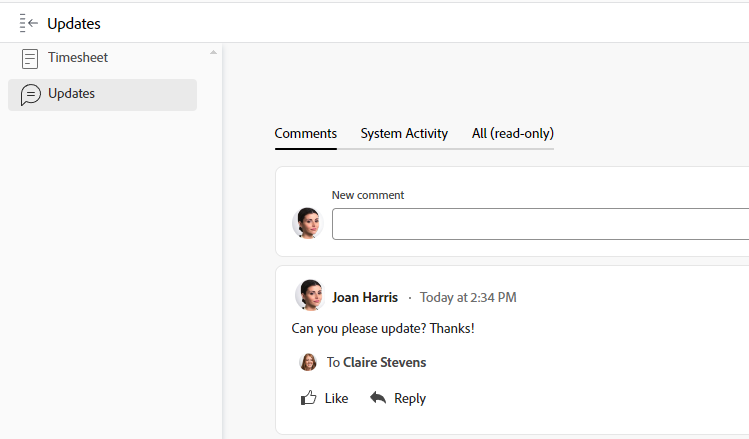

# 工时表布局概述

<!-- Audited: 12/2023 -->

<!--The highlighted information on this page refers to functionality not yet generally available. It is available only in the Preview environment for all customers or in Production for customers who enabled fast releases. 

For information about fast releases, see [Enable or disable fast releases for your organization](/help/quicksilver/administration-and-setup/set-up-workfront/configure-system-defaults/enable-fast-release-process.md).

For information about the current release schedule, see [Second Quarter 2024 release overview](/help/quicksilver/product-announcements/product-releases/24-q2-release-activity/24-q2-release-overview.md).-->

本文介绍了时间表在Adobe Workfront中的布局，使您能够更好地了解如何自定义和利用时间表来记录时间。

时间表和小时首选项控制时间表上显示的内容。 本文概述所有可用选项。 有关选择选项的信息，请参阅[配置工时表和小时首选项](../../administration-and-setup/set-up-workfront/configure-timesheets-schedules/timesheet-and-hour-preferences.md)。

有关如何记录时间表的详细信息，请参阅[记录时间](../../timesheets/create-and-manage-timesheets/log-time.md)。

以下是时间表区域：

* [工时表标题](#timesheet-header)
* [左侧面板](#the-left-panel)
* [工作项](#work-items)
* [工具栏](#toolbar)
* [时间表页脚](#timesheet-footer)
* [工作角色](#job-role)
* [小时数类型](#hour-type)
* [更新左侧面板中的区域](#updates-area-in-the-left-panel)
* [摘要面板](#summary-panel)
* [时间范围和小时输入区域](#time-frame-and-hour-entry-area)
* [小时条目评论](#hour-entry-comments)
* [小时](#hours)
* [总计](#totals)

## 工时表标题

时间表标题包含以下信息：

* 时间表的时间范围。
* “操作”区域包含以下内容：
   * 一个星形图标，用于将时间表添加到收藏夹列表。
   * 带有删除选项的“更多”图标允许您删除时间表。
* 时间表所有者的名称。
* 为时间表中显示的项目记录的小时数总计。
* 加班小时数。 这是手动输入，仅当在时间表上启用&#x200B;**加班**&#x200B;设置时才会显示。 有关详细信息，请参阅[编辑工时表信息](../create-and-manage-timesheets/edit-timesheets.md)。

>[!TIP]
>
>您无法记录的加班小时数大于时间表上当前的总小时数。 例如，如果迄今为止您在时间表上记录了7小时，则无法记录8小时的加班时间。

* 时间表状态。

## 左侧面板

您可以在左侧面板中访问以下部分：

* **时间表**：显示实际时间表。
* **更新**：显示时间表的注释和系统更新。 有关详细信息，请参阅本文左侧面板[&#128279;](#updates-area-in-the-left-panel)中的更新区域。

## 工作项

工作项是您要记录时间的项目、任务和问题。 单击标题行中的向下箭头可折叠下方列出的项目以及任务和问题。 单击项目名称旁边的向下箭头可折叠该项目的工作项。

在时间表外记录时间的任务、问题和项目或在时间表时间范围内计划的项目自动显示在此处。

## 工具栏

工具栏包含以下选项：

* 允许您添加项目、任务或问题的&#x200B;**添加项**&#x200B;按钮。
* 快速过滤器图标用于在时间表中搜索任务或问题。
* **显示备注**&#x200B;设置允许您查看或隐藏为项目、任务或问题小时条目记录的小时备注。
* 以全屏模式显示时间表的全屏图标。
* 使用&#x200B;**打开摘要**（或&#x200B;**关闭摘要**）按钮可打开或关闭摘要面板，以查看有关任务或问题的其他信息。 此按钮不适用于项目。

有关详细信息，请参阅[记录时间](../create-and-manage-timesheets/log-time.md)。

## 时间表页脚

您可以单击此区域中的&#x200B;**提交以供审批**、**关闭**、**批准**&#x200B;和&#x200B;**拒绝**&#x200B;按钮以关闭或拒绝时间表审批。

此区域还包含有关上次保存时间表的时间的信息。 您对时间表中的信息所做的所有更改都会自动保存。

## 工作角色

您可以选择其他工作角色来与小时条目关联。 您的Workfront管理员必须手动启用&#x200B;**将工作角色分配给小时条目**&#x200B;设置。 默认情况下，系统将显示分配给任务或问题时为您指定的工作角色。 如果您未分配任务或问题的工作角色，则默认显示您的主要角色。 有关详细信息，请参阅[配置工时表和小时首选项](../../administration-and-setup/set-up-workfront/configure-timesheets-schedules/timesheet-and-hour-preferences.md)。

您可以为不同角色的相同工作项记录多个小时条目。 有关详细信息，请参阅[记录时间](../create-and-manage-timesheets/log-time.md)。

## 小时数类型

您可以选择不同的小时类型，以与每个项目的小时条目关联。 仅当Workfront管理员为您的环境启用此字段时，才会显示此字段。 有关信息，请参阅[配置工时表和小时首选项](../../administration-and-setup/set-up-workfront/configure-timesheets-schedules/timesheet-and-hour-preferences.md)。

您可以为不同的小时类型记录同一工作项的多个小时条目。 有关详细信息，请参阅[记录时间](../create-and-manage-timesheets/log-time.md)。

## 更新左侧面板中的区域

您可以在时间表上添加备注，以与时间表批准者或其他用户在时间表左侧面板的更新部分通信。

对时间表所做的任何注释都将显示在此区域中。

## 摘要面板

您可以访问“摘要”面板，查看时间表中显示的任务或问题。 从此处，您可以对任务和问题进行评论，或更新其信息。 有关详细信息，请参阅[摘要概述](../../workfront-basics/the-new-workfront-experience/summary-overview.md)。

您在时间表摘要面板中为工作项输入的注释将显示在任务或问题的更新区域。 “摘要”面板不适用于项目。

## 时间范围和小时输入区域

工时表的时间范围显示在工作项的右侧。

您可以创建一个、两个或四个星期的时间表。

时间范围以整周为增量显示。 超出指定时间表时间范围的天数将变暗。 您无法记录超出时间表时间范围的天数的时间。

有关信息，请参阅[创建一次性时间表](../create-and-manage-timesheets/create-tmshts.md)或[创建、编辑和分配时间表配置文件](../create-and-manage-timesheets/create-timesheet-profiles.md)。

<!--drafted for the resize columns in timesheets story - make this blurb a TIP when the story is released: 
You can resize the columns that display different weeks, the time frame, or the work item areas by dragging and dropping the vertical lines that separate them.-->

## 小时条目评论

您可以为添加到时间表的每个小时条目添加评论。

您在小时条目注释框中输入的注释将显示在时间表中的每个工作项下，您记录了在工具栏中启用&#x200B;**显示注释**&#x200B;设置时的时间。

## 小时

时间表为每个工作项提供输入字段，并在时间表范围中指定日期，以记录处理该项所花费的时间。 在记录时间时，记录时间以浅蓝色突出显示的项目和小时框以深蓝色列出。

## 总计

查看在时间表上输入的所有小时数的总和，按天（在时间表标题中）和对象（在最后一列）汇总。
