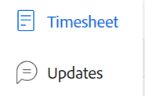

# 了解时间表布局

本文介绍了Adobe Workfront中时间表的布局，使您能够更好地了解如何自定义和利用时间表来记录时间。

工时单和工时首选项控制工时单上显示的内容。 本文概述了所有可用选项。 有关信息，请参阅 [配置工时单和工时首选项](../../administration-and-setup/set-up-workfront/configure-timesheets-schedules/timesheet-and-hour-preferences.md).

有关如何在时间表上记录时间的信息，请参阅 [日志时间](../../timesheets/create-and-manage-timesheets/log-time.md).

以下是时间表的区域：

* [时间表标题](#timesheet-header)
* [左侧面板](#the-left-panel)
* [工作项](#work-items)
* [工具栏](#toolbar)
* [时间表页脚](#timesheet-footer)
* [作业角色](#job-role)
* [小时数类型](#hour-type)
* [左面板中的更新区域](#updates-area-in-the-left-panel)
* [“摘要”面板](#summary-panel)
* [时间范围和小时进入区域](#time-frame-and-hour-entry-area)
* [小时条目评论](#hour-entry-comments)
* [小时](#hours)
* [总计](#totals)

## 时间表标题

时间表标题包括以下信息：

* 时间表的时间范围。
* “操作”区域包括以下内容：
   * 一个星形图标，用于将时间表添加到收藏夹列表。
   * 带有删除选项的更多图标，您可以在其中删除时间表。
* 工时单所有者的名称。
* 工时表中显示的项目记录的小时总数。
* 加班小时数。 这是手动输入，且仅当 **加班** 在时间表中启用了设置。 有关更多信息，请参阅 [编辑工时单信息](../create-and-manage-timesheets/edit-timesheets.md).

>[!TIP]
>
>您无法记录超过工时单上当前总工时数的加班小时数。 例如，如果迄今为止已在时间表上记录了7小时，则无法记录8小时的加班时间。

* 时间表状态。

## 左侧面板

您可以在左侧面板中访问以下部分：

* **时间表**:显示实际工时单。
* **更新**:显示工时单的注释和系统更新。 有关更多信息，请参阅 [左面板中的更新区域](#updates-area-in-the-left-panel) 章节。

## 工作项

工作项是您要记录其时间的项目、任务和问题。 单击标题行中的向下箭头可折叠项目以及下面列出的任务和问题。 单击项目名称旁边的向下箭头可折叠该项目的工作项。

任务、问题和项目在时间表时间段内计划的时间表或项目之外记录时间，这些任务、问题和项目会自动显示在此处。

## 工具栏

工具栏包含以下选项：

* 在添加项目、任务或问题中可添加项目的“添加项目”按钮。
* 快速筛选图标，用于搜索工时单中的任务或问题。
* 的 **显示注释** 用于查看或隐藏针对项目、任务或问题小时条目记录的小时评论的设置。
* 在全屏模式下显示工时单的全屏图标。
* **打开摘要** (或 **关闭摘要**)按钮，您可以在其中打开或关闭“摘要”面板以查看有关任务或问题的其他信息。 这不适用于项目。

有关更多信息，请参阅 [日志时间](../create-and-manage-timesheets/log-time.md).

## 时间表页脚

您可以单击此区域中的“提交以供审批”、“关闭”、“批准”和“拒绝”按钮，以关闭或拒绝工时表审批。

此区域还包含有关上次保存时间表的时间的信息。 您对时间表中的信息所做的所有更改都会自动保存。

## 工作角色

您可以选择与小时条目关联的其他作业角色。 您的Workfront管理员必须启用手动将作业角色分配给小时条目设置。 默认情况下，在为任务或问题分配时为您指定的作业角色会显示。 如果您未在任务或问题上分配作业角色，则默认显示“主角色”。 有关更多信息，请参阅文章 [配置工时单和工时首选项](../../administration-and-setup/set-up-workfront/configure-timesheets-schedules/timesheet-and-hour-preferences.md).

您可以为不同角色记录同一工作项的多个小时条目。 有关更多信息，请参阅 [日志时间](../create-and-manage-timesheets/log-time.md).

## 小时数类型

您可以选择不同的小时类型以与每个项目上的小时条目相关联。 仅当Workfront管理员为您的环境启用此字段时，才会显示此字段。 有关信息，请参阅文章 [配置工时单和工时首选项](../../administration-and-setup/set-up-workfront/configure-timesheets-schedules/timesheet-and-hour-preferences.md).

您可以针对不同的小时类型记录同一工作项的多个小时条目。 有关更多信息，请参阅 [日志时间](../create-and-manage-timesheets/log-time.md).

## 左面板中的更新区域

您可以在左侧面板的“更新”部分对时间表进行注释，以与时间表批准者或其他用户通信。

对工时单所作的任何评论都会显示在该区域，即工时单的底部。 此区域显示在工时表下方和工时表页脚上方。 有关更多信息，请参阅 [查看和管理工时单上的注释](../create-and-manage-timesheets/view-and-manage-comments-timesheets.md).

## “摘要”面板

对于时间表中显示的任务或问题，您可以对访问“摘要”面板进行注释。 在此，您可以对任务和问题进行评论，或更新其信息。 有关更多信息，请参阅 [概要概述](../../workfront-basics/the-new-workfront-experience/summary-overview.md).

在“时间表摘要”面板中为工作项输入的注释显示在任务或问题的“更新”区域中。 “摘要”面板不适用于项目。

## 时间范围和小时进入区域

时间表的时间范围显示在工作项的右侧。

您可以创建一、两或四周的工时单。

时间范围以整周增量显示。 指定时间表时间范围外的天数将灰显。 您无法记录超出时间表时间范围的天数。

有关信息，请参阅 [创建一次性工时单](../create-and-manage-timesheets/create-tmshts.md) 或 [创建、编辑和分配工时单配置文件](../create-and-manage-timesheets/create-timesheet-profiles.md).

<!--drafted for the resize columns in timesheets story - make this blurb a TIP when the story is released: 
You can resize the columns that display different weeks, the time frame, or the work item areas by dragging and dropping the vertical lines that separate them.-->

## 小时条目评论

您可以为您添加到工时单的每小时条目添加注释。

您在“小时录入注释”框中输入的注释显示在时间表中，位于您记录时间的每个工作项下 **显示注释** 设置时，才会启用。

## 小时

工时单为每个工作项和工时单范围的日期提供输入字段，以记录处理该物料所花费的时间。 当您记录时间时，您记录时间的项目以浅蓝色突出显示，小时框以深蓝色列出。

## 总计

查看在时间表上输入的所有小时的总和，按天（在时间表的标题中）以及按对象（在最后一列中）汇总。
