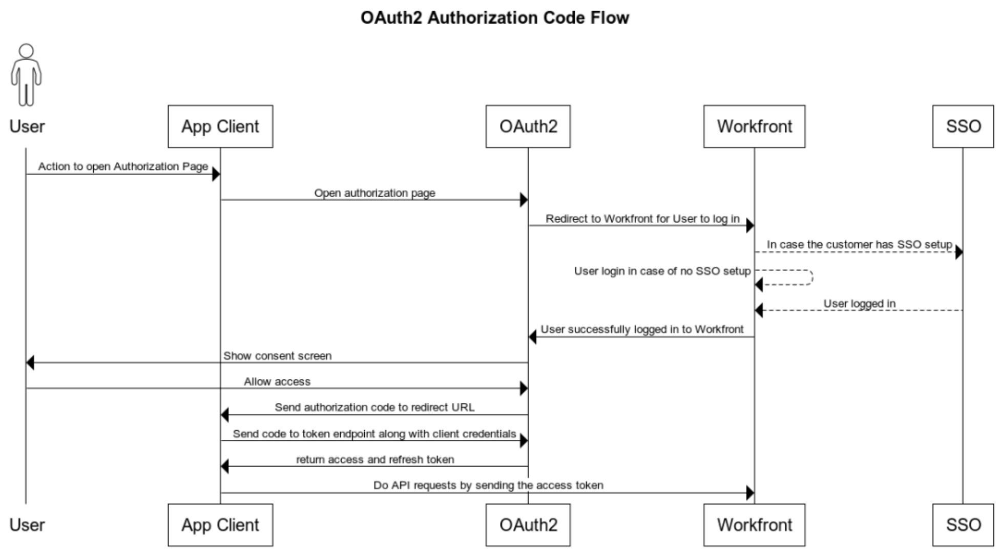

# 使用授权代码流配置并使用贵组织的自定义OAuth 2应用程序

要与Workfront集成并允许您的客户端应用程序代表用户与Workfront进行通信，您必须：

* 创建OAuth2应用程序
* 配置第三方应用程序
* 链接到您的用户的“授权”页面
* 设置授权代码流：用户登录到Workfront实例，并同意他们允许客户端应用程序代表他们连接到Workfront。 因此，您将获得一个授权代码，以便与访问和刷新令牌进行交换。
* 设置刷新令牌流程：在此流程中，您可以使用刷新令牌在旧令牌过期时获取新的访问令牌。

## 创建OAuth2应用程序

有关创建OAuth2应用程序的说明，请参阅 [使用用户凭据创建OAuth2应用程序（授权代码流）](../../administration-and-setup/configure-integrations/create-oauth-application.md#create3) 在 [为Workfront集成创建OAuth2应用程序](../../administration-and-setup/configure-integrations/create-oauth-application.md)

>[!NOTE]
>
>您一次最多可以拥有10个OAuth2应用程序。

## 链接到您的用户的“授权”页面

您的用户需要登录才能在自己的帐户中授权此集成。 用户可授权的页面具有特定的格式，如下所述。 使用此信息确定应用程序的授权页面地址，并为用户提供该地址或指向该地址的链接。

* 组织域的完整URL。 示例：

  ```
  https://myorganization.my.workfront.com
  ```


* `client_id`：这是您在Workfront中创建OAuth2应用程序时生成的客户端ID。

* `redirect_uri`：这是您在创建应用程序时输入的重定向URL。 您的用户在为其帐户授权应用程序后，将被定向到此页面。

* `response_type`：必须具有值 `code`.

因此，授权页面的URL为：

```
https://<URL of your organization's domain>/integrations/oauth2/authorize?client_id=<Your ClientID>&redirect_uri=<Your redirect URL>&response_type=code
```

>[!NOTE]
>
>我们建议您创建一个按钮或其他链接，以便用户可以单击该按钮或其他链接来定向到此页面。

## 配置第三方应用程序

第三方应用程序可能需要配置。 下表包含有关配置第三方应用程序时可能需要的字段的信息。

<table style="table-layout:auto"> 
 <col> 
 <col> 
 <tbody> 
  <tr> 
   <td role="rowheader">授权URI</td> 
   <td> <p><code>https://&lt;the full URL of your organization's domain&gt;/integrations/oauth2/authorize</code> </p> <p class="example" data-mc-autonum="<b>Example: </b>"><span class="autonumber"><span><b>示例： </b></span></span><code> https://myorganization.my.workfront.com/integrations/oauth2/authorize</code> </p> </td> 
  </tr> 
  <tr> 
   <td role="rowheader">令牌URL</td> 
   <td> <p><code>https://&lt;the full URL of your organization's domain&gt;/integrations/oauth2/api/v1/token</code> </p> <p class="example" data-mc-autonum="<b>Example: </b>"><span class="autonumber"><span><b>示例： </b></span></span><code>https://myorganization.my.workfront.com/integrations/oauth2/api/v1/token</code> </p> </td> 
  </tr> 
  <tr> 
   <td role="rowheader">范围</td> 
   <td>您无需指定范围。 </td> 
  </tr> 
 </tbody> 
</table>

## 设置授权代码流



要使用OAuth2登录用户，请使用以下流程：

1. 当用户打开授权页面时，它会重定向到Workfront登录页面，以便用户能够登录到Workfront。 如果用户具有SSO配置，将打开身份提供程序登录页。

   如果用户已在同一浏览器上登录到Workfront，或者用户已成功登录到Workfront，则用户将被重定向到同意屏幕：

   

1. 如果用户允许访问，页面将被重定向到 `redirect_url`. 重定向必须包含以下查询参数：

* `code`：获取访问/刷新令牌所需的授权代码。
* `domain`：您组织的域。 示例：在 `myorganization.my.workfront.com`，域为 `myorganization`.
* `lane`：请求的通道。 示例：在 `myorganization.preview.workfront.com`，该车道为 `preview`.

  >[!IMPORTANT]
  >
  >此 `code` 仅在2分钟内有效。 因此，您必须在这段时间内获得刷新和访问令牌。

1. 如果您拥有代码，则可以通过将该代码连同客户端应用程序凭据一起发送至 `/integrations/oauth2/api/v1/token` 端点。

   完整的令牌请求URL为

   ```
   https://<URL of your organization's domain></span>/integrations/oauth2/api/v1/token
   ```

   **示例：**  对令牌端点的CURL调用示例：

   示例1

   ```
      curl --location --request POST '**<workfront host>**/integrations/oauth2/api/v1/token' \
      --header 'Authorization: Basic **<base64(client_id:client_secret)>**' \
      --header 'Content-Type: application/json' \
      --data-raw '{
      "code": "**<code>**",
      "grant_type": "**authorization_code**",
      "redirect_uri": "**<redirect_url>**"
      }'
   ```

   示例2

   ```
      curl --location --request POST '**<workfront host>**/integrations/oauth2/api/v1/token' \
      --header 'Content-Type: application/x-www-form-urlencoded' \
      --data-urlencode 'grant_type=**authorization_code**' \
      --data-urlencode 'redirect_uri=**<redirect_url>**' \
      --data-urlencode 'code=**<code>**' \
      --data-urlencode 'client_id=**<client_id>**' \
      --data-urlencode 'client_secret=**<client_secret>**'  
   ```


   >[!IMPORTANT]
   >
   > 在Workfront中注册应用程序时生成了客户端密钥。 你应该把它存放在安全的地方，因为如果它丢失了，它是无法恢复的。

   当所有传递的参数均正确时，令牌端点返回以下有效负载：

   ```
   {
      "token_type": "sessionID",
      "access_token": "string", // the value of sessionID
      "refresh_token": "string",
      "expires_in": 0,
      "wid": "string"
   }
   ```

   访问令牌与 ```sessionID```，并且过期时间与常规过期时间相同 ```sessionID```

   >[!IMPORTANT]
   >
   > 将刷新令牌存储在安全位置。 旧令牌过期后，您需要它才能获取新的刷新令牌。 Workfront不会存储您的刷新令牌。

1. 现在，当您拥有访问令牌时，您可以对Workfront进行API调用

   ```
   curl --request GET 'https://<workfront host>/attask/api/v14.0/proj/search \
   --header 'sessionID: <access_token>'
   ```

## 设置刷新访问令牌


要刷新access_token，我们再次需要对令牌端点进行“POST”调用。 这次我们发送了不同的表单数据，如下所示：

```
curl --location --request POST '<workfront host>/integrations/oauth2/api/v1/token' \
--header 'Authorization: Basic <base64(client_id:client_secret)>' \
--header 'Content-Type: application/json' \
--data-raw '{
   "grant_type": "refresh_token",
   "refresh_token": "<refresh_token>"
}'

###### OR

curl --location --request POST '<workfront host>/integrations/oauth2/api/v1/token' \
--header 'Content-Type: application/x-www-form-urlencoded' \
--data-urlencode 'grant_type=refresh_token' \
--data-urlencode 'redirect_uri=<redirect_url>' \
--data-urlencode 'refresh_token=<refresh_token>' \
--data-urlencode 'client_id=<client_id>' \
--data-urlencode 'client_secret=<client_secret>'
```

它将返回以下结果：

```
{
  "token_type": "sessionID",
  "access_token": "string", // the value of sessionID
  "refresh_token": "string",
  "expires_in": 0,
  "wid": "string"
}
```

同样，访问令牌是 `sessionID` 这可用于向Workfront发出API请求。
