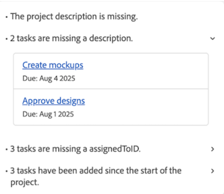

# 项目运行状况概述

>[!IMPORTANT]
>
>项目运行状况功能目前仅适用于参与Beta阶段的用户。

Adobe Workfront的项目运行状况功能利用AI Assistant的强大功能即时为您提供对项目执行情况、哪些领域需要您关注以及如何避免可能会耗费您时间和资金的问题评估。

AI助手可以为以下对象生成项目运行状况评估：

* 单个项目
* 单个项目
* 多个项目

有关AI助手的详细信息，请参阅[AI助手概述](/help/quicksilver/workfront-basics/ai-assistant/ai-assistant-overview.md)。

+++ 展开可查看本文所述功能的访问权限要求。

<table style="table-layout:auto"> 
<col> 
</col> 
<col> 
</col> 
<tbody> 
<tr> 
   <td role="rowheader">
Adobe Workfront 包
</td> 
   <td> 

选择或更高版本 
 

Workflow Select或更高版本

   </td> 
<tr> 
 <tr> 
   <td role="rowheader">
Adobe Workfront许可证
</td> 
   <td> 

标准
 
   </td> 
   </tr> 
  </tr> 
  <tr> 
   <td role="rowheader">
访问级别配置
</td> 
   <td>
您必须是系统管理员才能管理项目运行状况配置 

   
编辑对项目的访问权限以应用项目运行状况配置 

     
查看对项目的访问权限以查看项目运行状况配置 

     
查看对程序的访问权限，以使用查看程序中所有项目的项目运行状况

  </td> 
  <tr> 
   <td role="rowheader">
对象权限
</td> 
   <td>
管理项目的权限以应用项目运行状况配置 

     
查看项目权限以查看项目运行状况配置 

  </td> 
  </tr> 
  </tr>  
    </tr>  
</tbody> 
</table>

有关此表中信息的更多详细信息，请参阅Workfront文档中的[访问要求](/help/quicksilver/administration-and-setup/add-users/access-levels-and-object-permissions/access-level-requirements-in-documentation.md)。
+++

## 注册Project Health测试版

您的组织必须启用AI助手才能使用项目运行状况。

要为贵组织启用AI助手和项目运行状况，必须应用以下所有项：

* 您的组织必须已迁移到Adobe Identity Management System (IMS)。
* 您的组织必须具有Workfront或Workflow Select、Prime或Ultimate包。
* 必须启用Adobe Unified Experience。
* Adobe必须有一个已签署的Adobe Gen AI协议文件。
* Workfront管理员必须为贵组织中的用户启用AI助手。 通过访问级别启用AI助手。
* 必须在“设置”中“系统首选项”区域的“AI首选项”部分同时选择“启用AI”和“项目运行状况”选项。

  

有关详细信息，请参阅[AI助手概述](/help/quicksilver/workfront-basics/ai-assistant/ai-assistant-overview.md)和[配置系统首选项](/help/quicksilver/administration-and-setup/manage-workfront/security/configure-security-preferences.md)。

## 如何计算项目运行状况

AI Assistant通过为项目分配一个可用的项目运行状况状态，为您提供对项目总体状况的快速评估：

* 准时
* 处于风险中
* 存在问题

此状态是使用项目组件计算的，例如项目进度、低估的工作等等。 有关用于测量项目运行状况的组件的完整列表，请参阅[项目和项目群状态列表](#project-and-program-states-list)部分。

每个项目组件都分配了一个数值风险分数，该分数介于(0-100)之间，然后计算该分数的平均值，以创建项目的整体运行状况状态：

* 达成目标（75或更高）：项目性能在预期阈值内。
* 处于风险中(50-74)：检测到可能会影响项目性能的新问题。
* 存在问题（49或更少）：项目性能低于可接受的阈值，需要立即关注。

>[!NOTE]
>
>* AI助手当前仅评估所选项目的数据。
>* 跨项目或历史分析尚未包含在项目运行状况计算中。

### 计算项目运行状况的示例

在第一个示例中，对4个项目组件进行了评估，并计算了它们的各个风险分数，如下所示：

* 2正中目标（90个风险分数）
* 1处于风险中（45个风险分数）
* 1有麻烦（20个风险分数）

当你把这些分数取平均时，结果是61。 使用上面列出的项目运行状况标准，该项目将处于风险状态。

在下一个示例中，1天的时间表更改已在项目时间表的早期发生。 在此方案中，AI Assistant将评估相对于项目总持续时间的更改时间和影响：

* 在60天的项目时间线中提前1天的时间表班次很小，通常分数为“准时”。
* 在项目完成日期附近的1天计划班次更具破坏性，可能会得到“处于风险中”或“存在问题”的评分。

由于更改很小，并发生在项目时间线的早期，因此这会将项目置于目标状态。

如果在项目的时间表中发生多个计划更改，则在将这些更改应用于项目运行状况计算之前先对它们进行评分和平均化。

## 了解项目完成情况和项目运行状况之间的差异

项目完成情况和项目运行状况在Workfront中是相似的概念，具有相同的默认名称以描述项目完成情况或状态（已定位、存在风险和存在问题），但它们有不同的用途。

项目条件仅根据计划、预计和预计日期提供项目当前执行情况的基本快照。 它可以由项目所有者手动设置，也可以由Workfront根据项目的任务自动设置。 或者，项目运行状况会更全面并评估其他因素，从而让您更深入地了解其执行情况。

有关项目条件的更多信息，请参阅以下文章：

* [更新项目完成情况](/help/quicksilver/manage-work/projects/updating-work-in-a-project/update-condition-on-project.md)
* [自定义条件](/help/quicksilver/administration-and-setup/customize-workfront/create-manage-custom-conditions/custom-conditions.md)。

## 项目和项目群项目运行状况状态列表

下表包含在生成项目运行状况评估时，AI助手将分配您的项目或项目群的可用状态的明细。

<table>
    <tr>
        <td><b>项目状态</b></td>
        <td><b>定义</b></td>
        <td><b>因素</b></td>
    </tr>
    <tr>
        <td>准时</td>
        <td>当以下因素的平均风险级别处于正常阈值内时，将分配此值。
        </td>
        <td> 
        <ul><li>范围蔓延</li>
        <li>缺少字段</li>
        <li>计划变更</li>
        <li>低估的工作</li>
        <li>项目进度</li>
        <li>逾期任务</li>
        <li>预算</li>
        </ul></td>
    </tr>
    <tr>
        <td>处于风险中</td>
        <td>当以下因素的平均风险级别刚好低于健康阈值时，即分配此项。</td>
        <td>
        <ul><li>范围蔓延</li>
        <li>缺少字段</li>
        <li>计划变更</li>
        <li>低估的工作</li>
        <li>项目进度</li>
        <li>逾期任务</li>
        <li>预算</li>
        </ul></td>
    </tr>
    <tr>
        <td>存在问题</td>
        <td>当以下因素的平均风险级别低于健康阈值时，即分配此值。</td>
        <td>
        <ul><li>范围蔓延</li>
        <li>缺少字段</li>
        <li>计划变更</li>
        <li>低估的工作</li>
        <li>项目进度</li>
        <li>逾期任务</li>
        <li>预算</li>
        </ul></td>
    </tr>
    </tr>
   </table>

## AI助手提示列表

以下是一个提示列表，您可以使用它请求AI助手为项目、项目群或您有权查看的所有项目生成项目运行状况评估。

<table>
    <tr>
        <td><b>位置</b></td>
        <td><b>提示</b></td>
    </tr>
    <tr>
        <td>特定项目详细信息页面</td>
        <td><em>此项目的运行状况如何？</em></td>
    </tr>
    <tr>
        <td>Workfront中的任何页面 </td>
        <td><em>[PROJECT NAME]项目的运行状况如何？</em></td>
    </tr>
    <tr>
        <td>Workfront中的任何页面 </td>
        <td><em>我的项目运行状况如何？</em></td>
    </tr>
       <tr>
        <td>特定项目详细信息页面</td>
        <td><em>此计划的运行状况如何？</em></td>
    </tr>
       <tr>
        <td>Workfront中的任何页面 </td>
        <td><em>[计划名称]计划的运行状况如何？</em></td>
    </tr>
   </table>

## 管理项目运行状况配置

您必须是系统管理员才能管理项目运行状况配置。

项目运行状况配置包含确定如何计算项目运行状况的特定标准。 Workfront管理员创建配置后，您可以将其应用于项目。

您的系统中可以有多个项目运行状况配置。

{{step-1-to-setup}}

1. 单击左侧面板中的&#x200B;**项目首选项**，然后选择&#x200B;**项目运行状况**。

1. 在页面的右上角，单击&#x200B;**新建配置**。

   **AI设置**&#x200B;页面将打开。

1. （可选）单击&#x200B;**无标题配置**&#x200B;标题内部以重命名配置。

1. 在&#x200B;**要包括在项目运行状况中的因素**&#x200B;部分中，取消选择确定项目运行状况条件时不希望包括的任何因素：
   * **范围蠕变**：项目范围自启动以来扩展了多少。

   * **必填字段**：如果缺少任何必填字段（例如项目描述）。 这些必填字段决定项目完整性，并在&#x200B;**您要检查哪些字段的完整性？**&#x200B;配置部分如下。

   * **计划更改**：自项目启动以来，发生了多少次计划更改。

   * **任务估计**：估计任务工作的准确程度（例如，项目中当前没有逾期任务）。

   * **任务燃尽**：与项目时间线相比，项目工作的进度如何。

   * **超期任务**：当前已超过其到期日期的任务数。

   * **成本**：如果项目当前超出预算。

1. 在&#x200B;**中，您的项目何时正式开始？**&#x200B;部分中，从下拉列表中选择表示项目开始的事件。

1. 在&#x200B;**中，如何估计项目的工作范围？**&#x200B;部分中，选择哪个项目因子将随着项目范围的增加而增大。

1. 在&#x200B;**中，您要检查哪个必填字段？**&#x200B;部分中，选择一个或多个必须包含项目值的字段。

   

1. 单击&#x200B;**添加**&#x200B;到更多本机或自定义项目或任务字段。

1. 单击右上角的&#x200B;**保存**。

## 应用项目运行状况配置

Workfront管理员创建项目运行状况配置后，您可以将其应用于项目（如果您拥有项目的管理权限）。

{{step1-to-projects}}

1. 在&#x200B;**项目**&#x200B;页面上，选择一个项目。

1. 单击项目名称右侧的&#x200B;**更多**&#x200B;图标，然后选择&#x200B;**编辑**。 将打开&#x200B;**编辑项目**&#x200B;框。

1. 在左侧面板中，单击&#x200B;**项目设置**。

1. 在&#x200B;**项目运行状况配置**&#x200B;字段中，选择要应用于此项目的配置。

   

1. 单击页面左下角的&#x200B;**保存**。

## 为项目或项目群生成项目运行状况评估

您可以从AI助手在以下方面生成项目运行状况评估：

* 对于项目，您可以从项目页面生成评估，或者在询问助理特定项目的表现时，通过引用项目名称来生成评估。

* 对于项目，您可以生成评估项目的详细信息页面。

>[!NOTE]
>
>* 您需要项目或项目群的查看权限才能生成评估。
>* 在项目启动之前，无法为项目生成项目运行状况评估。 您可以在“项目首选项”中配置触发项目开始的事件

有关详细信息，请参阅本文中的[管理项目运行状况配置](#manage-project-health-configurations)部分。

要为项目或项目群生成项目运行状况评估，请执行以下操作：

1. 导航到要为其生成项目运行状况评估的项目或项目群。

1. 在项目/项目群详细信息页面上，单击屏幕右上角的&#x200B;**AI助手**&#x200B;图标。 AI助手将打开。

1. 在&#x200B;**向我询问Workfront**&#x200B;字段中键入以下内容： *此项目的运行状况如何？*

   或

   在&#x200B;**向我询问Workfront**&#x200B;字段中键入以下内容： *此程序的运行状况如何？*

   >[!NOTE]
   >
   >如果您正在从Workfront中的其他页面访问AI助手，则可以键入&#x200B;*项目[项目名称]的运行状况如何？*&#x200B;或&#x200B;*程序[程序名称]的运行状况如何？*  
   >有关可输入的当前提示的完整列表，请参阅本文中的[AI助手提示列表](#ai-assistant-prompts-list)部分。

1. 单击&#x200B;**发送**&#x200B;图标。 将生成项目运行状况评估，并显示在面板中。 每个项目运行状况评估顶部都会显示一个标记，该标记反映项目的当前条件。

   

   如果您在为项目群生成评估，将列出多个徽章，显示项目中每个项目的状态。 有关徽章标签的详细信息，请参阅本文中的[项目和项目群状态列表](#project-and-program-states-list)部分。

1. （可选）单击其中一个评估点以展开其详细信息。

1. （可选）在展开的详细信息模式下，单击项目链接以打开项目的详细信息。

   

1. 查看项目运行状况详细信息后，单击AI助手右上角的&#x200B;**关闭**&#x200B;图标。

## 为多个项目生成项目运行状况评估

您可以为当前具有“查看”权限或更高权限的所有项目生成合并的项目运行状况评估。

仅当项目已启动时，项目才会包含在合并的项目运行状况评估中。 您可以在项目设置中配置哪个事件触发项目开始。 有关详细信息，请参阅本文中的[管理项目运行状况配置](#manage-project-health-configurations)部分。

1. 单击屏幕右上角的&#x200B;**AI助手**&#x200B;图标。 AI助手将打开。

1. 在&#x200B;**询问有关Workfront的信息**&#x200B;字段中键入以下内容： *我的项目的运行状况如何？*

   有关可输入的当前提示的完整列表，请参阅本文中的以下部分：[AI助手提示列表](#ai-assistant-prompts-list)。

1. 单击&#x200B;**发送**&#x200B;图标。 项目运行状况评估将生成并显示在面板中。

   

   为多个项目生成评估时，AI Assistant会根据项目当前的执行方式将结果分组。

1. （可选）单击其中一个项目运行状况徽章以展开项目列表，然后选择特定项目的链接以转到该项目的详细信息页面。

1. 查看项目的运行状况详细信息后，单击AI助手右上角的&#x200B;**关闭**&#x200B;图标以将其关闭。

<!--

## Build a Project Health table report in a Canvas Dashboard

>[!IMPORTANT]
>
>The Canvas Dashboards feature is currently only available for users participating in the beta stage. For more information, see [Canvas Dashboards beta information](/help/quicksilver/product-announcements/betas/canvas-dashboards-beta/canvas-dashboards-beta-information.md). 

You can add a table report to a Canvas Dashboard in order to easily visualize your Project Health data in a table format.  

### Prerequisites 

You must create a dashboard before you can build a table report. 

For more, see [Create a Canvas Dashboard](/help/quicksilver/reports-and-dashboards/canvas-dashboards/create-dashboards/create-dashboards.md).

### Build a Project Health table report 

There are many configuration options available for building a Project Health table report. In this section, we'll walk you through the process of creating one that displays the following columns: 

* **Name**: Contains the project name. 
* **Project Health Analysis**: Contains a summary of the Project Health assessment. 
* **Project Health Created At**: Contains the date/time when the Project Health assessment was last generated. 
* **Project Health Label**: Contains the project's label (e.g. On Target, At Risk, or In Trouble).

{{step1-to-dashboards}}

1. In the left panel, click **Canvas Dashboards**. 
1. In the upper-right corner, click **New Dashboard**. 
1. In the **Create dashboard** box, enter the dashboard's **Name** and **Description**. 
1. Click **Create**. 
1. In the **Add report** box, select **Create report**. 
1. On the left side, select **Table**. 
1. In the upper-right corner, click **Create report**. 
1. (Optional) Follow the steps below to configure the **Details**  section: 
    1. Enter a report **Name**. 
    1. Enter a report **Description**. 
1. Follow the steps below to configure the **Build table**  section: 
    1. In the left panel, click the **Table columns** icon. 
    1. Click **Add column**, then select **Project** > **Name**. 
    1. Click **Add column**, then select **Project** > **Project Health** > **Health Analysis**. 
    1. Click **Add column**, then select **Project** > **Project Health** > **Created At**. 
    1. Click **Add column**, then select **Project** > **Project Health** > **Health Label**. 

1. Follow the steps below to configure the **Filter**  section: 
    1. In the left panel, click the **Filter** icon. 
    1. Select **Edit filter**. 
    1. Click **Add condition** and then specify the field you want to filter by and the modifier that defines what kind of condition the field must meet. The column appears in the preview section on the right.
    1. (Optional) Click **Add filter group** to add another set of filtering criteria. The default operator between the sets is AND. Click the operator to change it to OR. 

1. Follow the steps below to configure the **Drilldown Group Settings**  section: 
    1. In the left panel, click the **Group Settings** icon. 
    1. Click the **Add grouping** button and then select the field you want to create as a grouping. The grouping column appears in the preview section on the right. 

1. Click **Save** to create the report.

-->
