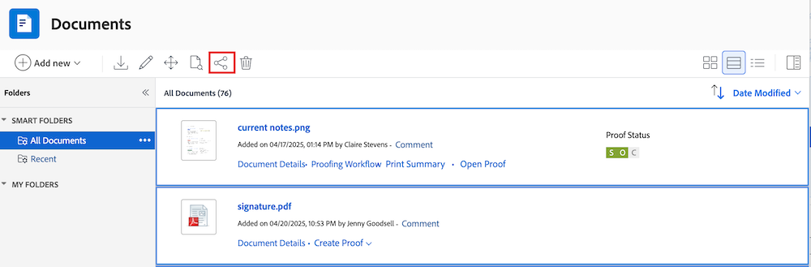

# 共享文档

Workfront管理员控制谁可以在“设置”的“访问级别”区域查看或编辑文档。 有关详细信息，请参阅[授予对文档的访问权限](../../administration-and-setup/add-users/configure-and-grant-access/grant-access-documents.md)。

用户还可以共享他们已上传或有权访问的文档，向其他人授予查看或管理这些文档的权限。

* 权限适用于各个项目，并定义用户可以采取的操作。
* 上传文档的用户会自动获得完全控制权（管理权限）。
* 要共享整个文件夹，请参阅[共享文档文件夹](../../workfront-basics/grant-and-request-access-to-objects/share-a-document-folder.md)。

>[!NOTE]
>
>如果您的Workfront实例使用Adobe企业存储，则无法共享单个文档。 相反，您可以在项目级别授予访问权限。 请记住，共享项目可以授予对敏感项目信息（如财务信息）的访问权限，具体取决于选择的权限级别。

## 访问要求

+++ 展开以查看本文中各项功能的访问要求。 

要共享对象，必须具备以下条件：

<table style="table-layout:auto"> 
 <col> 
 <col> 
 <tbody> 
  <tr> 
   <td role="rowheader">Adobe Workfront计划</td> 
   <td> 
任何 
 </td> 
  </tr> 
  <tr> 
   <td role="rowheader">Adobe Workfront许可证</td> 
   <td> 
新增：标准
 
   或
   
当前：工作或更高

   </td> 
  </tr> 
  <tr> 
   <td role="rowheader">访问级别配置</td> 
   <td> 
查看对要共享对象的访问权限或更高版本
 </td> 
  </tr> 
  <tr> 
   <td role="rowheader">对象权限</td> 
   <td> 
查看要共享对象的权限或更高
</td> 
  </tr> 
 </tbody> 
</table>

有关详细信息，请参阅Workfront文档中的[访问要求](/help/quicksilver/administration-and-setup/add-users/access-levels-and-object-permissions/access-level-requirements-in-documentation.md)。

+++

## 共享文档

默认情况下，将文档上传到Workfront的用户具有文档的管理权限。

{{step1-to-documents}}

1. 在&#x200B;**文档**&#x200B;页面上，将鼠标悬停在要共享的文档上，然后单击显示的&#x200B;**文档详细信息**&#x200B;链接。 **文档详细信息**&#x200B;页面打开。

   

1. 单击文档名称右侧的&#x200B;**更多**&#x200B;图标，然后单击&#x200B;**共享**。 将打开&#x200B;**共享[文档名称]**&#x200B;对话框。

   

1. 在&#x200B;**将文档访问权限授予**&#x200B;字段中，开始键入要与其共享该文档的用户、团队、角色、组或公司的名称，然后在该名称出现在下拉列表中时单击该名称。

   >[!TIP]
   >
   >您只能与活动用户、团队、角色或公司共享文档。

1. （可选）选择&#x200B;**具有访问权限**&#x200B;下拉列表并选择文档的访问级别：

   * **只有受邀人员才能访问：**&#x200B;只有受邀访问文档的用户才能访问文档（默认）。
   * **系统中的每个人都可以查看**：系统中的所有用户都可以查看文档，而无需邀请。

1. （可选）若要将文档设为公用，请单击齿轮图标，然后单击与&#x200B;**同行的框以将此文件设为外部用户公用**。 **复制公共链接**&#x200B;按钮显示在对话框底部。

1. 单击用户名右侧的下拉菜单并为该文档选择其权限级别：

   * **查看**：用户可以查看和共享文档。
   * **管理**：用户拥有对文档的完全访问权限，但没有管理权限，这些权限在访问级别被授予（还包括所有查看权限）。

1. （可选）单击您授予的权限级别旁边的高级选项图标，以配置文档的特定权限。

   

1. （可选）要关闭文档子对象的继承权限，请单击&#x200B;**关闭**&#x200B;与&#x200B;**继承权限**&#x200B;内联。

1. （视情况而定）要复制允许您与外部用户共享文档的公共链接，请单击&#x200B;**复制公共链接**。

   >[!CAUTION]
   >
   >建议在与外部用户共享包含机密信息的文档时务必谨慎。 这样，他们便可以查看信息，而无需成为Workfront用户或您组织的一部分。

1. 单击&#x200B;**保存**。

## 批量共享文档

{{step1-to-documents}}

1. 在&#x200B;**文档**&#x200B;页面上的&#x200B;**所有文档**&#x200B;选项卡中，在键盘上按住&#x200B;**Command** (Mac)或&#x200B;**Ctrl** (Windows)，然后单击要共享的每个文档。

1. 在页面顶部，单击&#x200B;**共享**&#x200B;图标。 这将打开共享模式窗口。

   

1. 在&#x200B;**将文档访问权限授予**&#x200B;字段中，开始键入要与其共享文档的用户、团队、角色、组或公司的名称，然后在名称出现在下拉列表中时单击该名称。

   >[!TIP]
   >
   >您只能与活动用户、团队、角色或公司共享文档。

1. （可选）选择&#x200B;**具有访问权限**&#x200B;下拉列表并选择文档的访问级别：

   * **只有受邀人员才能访问：**&#x200B;只有受邀访问文档的用户才能访问文档（默认）。
   * **系统中的每个人都可以查看**：系统中的所有用户都可以查看文档，而无需邀请。

1. 单击用户名右侧的下拉菜单，然后选择他们对文档的权限级别：

   * **查看**：用户可以查看和共享文档。
   * **管理**：用户拥有对无管理权限的文档的完全访问权限，这些权限是在访问级别授予的（还包括所有查看权限）。

1. （可选）单击您已授予的权限级别旁边的高级选项图标，以配置文档的特定权限。

   

1. 单击&#x200B;**保存**。

## 与Adobe企业存储共享文档

Workfront正在过渡到Adobe企业级存储解决方案，以便提供与Adobe Creative Cloud产品的更大连接。 现有客户将分阶段迁移至新模型。 有关Adobe企业存储优势的详细信息，请访问[Adobe企业存储概述](/help/quicksilver/review-and-approve-work/esm-overview.md)。

如果您的Workfront实例使用Adobe企业存储，则无法直接共享单个文档。 相反，您必须在项目级别授予访问权限。

>[!IMPORTANT]
>
>共享项目还可能会使用户能够访问敏感的项目信息，例如财务信息，具体取决于您选择的权限级别。
>
>在共享之前，请务必仔细查看权限设置。

## 文档权限

权限特定于Workfront中的一个项目，并定义您可以对该项目执行的操作。 有关对象权限的信息，请参阅[对象权限共享概述](../../workfront-basics/grant-and-request-access-to-objects/sharing-permissions-on-objects-overview.md)。

下表显示了允许用户查看或管理文档时，您可以授予用户哪些权限：

<table border="2" cellspacing="15" cellpadding="1"> 
 <col> 
 <col> 
 <col> 
 <thead> 
  <tr> 
   <th> 
<strong>操作</strong> 
 </th> 
   <th> 
<strong>管理</strong> 
 </th> 
   <th> 
<strong>查看</strong> 
 </th> 
  </tr> 
 </thead> 
 <tbody> 
  <tr> 
   <td scope="row">创建</td> 
   <td>✓</td> 
   <td> </td> 
  </tr> 
  <tr> 
   <td scope="row">编辑文档详细信息</td> 
   <td>✓</td> 
   <td> </td> 
  </tr> 
  <tr> 
   <td scope="row">删除*</td> 
   <td>✓</td> 
   <td> </td> 
  </tr> 
  <tr> 
   <td scope="row">下载</td> 
   <td>✓</td> 
   <td>✓</td> 
  </tr> 
  <tr> 
   <td scope="row">结帐</td> 
   <td>✓</td> 
   <td> </td> 
  </tr> 
  <tr> 
   <td scope="row">添加审批者</td> 
   <td>✓</td> 
   <td> </td> 
  </tr> 
  <tr> 
   <td scope="row">批准文档</td> 
   <td>✓</td> 
   <td>✓</td> 
  </tr> 
  <tr> 
   <td scope="row">附上自定义表单</td> 
   <td>✓</td> 
   <td> </td> 
  </tr> 
  <tr> 
   <td scope="row">编辑自定义字段</td> 
   <td>✓</td> 
   <td> </td> 
  </tr> 
  <tr> 
   <td scope="row">移动到（对象）</td> 
   <td>✓</td> 
   <td> </td> 
  </tr> 
  <tr> 
   <td scope="row">发送至（集成）</td> 
   <td>✓</td> 
   <td> </td> 
  </tr> 
  <tr> 
   <td scope="row">更新/评论</td> 
   <td>✓</td> 
   <td>✓</td> 
  </tr> 
  <tr> 
   <td scope="row">上传新版本</td> 
   <td>✓</td> 
   <td> </td> 
  </tr> 
  <tr> 
   <td scope="row">删除版本</td> 
   <td>✓</td> 
   <td> </td> 
  </tr> 
  <tr> 
   <td scope="row">查看文档</td> 
   <td>✓</td> 
   <td>✓</td> 
  </tr> 
  <tr> 
   <td scope="row">预览</td> 
   <td>✓</td> 
   <td>✓</td> 
  </tr> 
  <tr> 
   <td scope="row">校对**</td> 
   <td>✓</td> 
   <td>✓</td> 
  </tr> 
  <tr> 
   <td scope="row">生成校对**</td> 
   <td>✓</td> 
   <td> </td> 
  </tr> 
  <tr> 
   <td scope="row">移除校对**</td> 
   <td>✓</td> 
   <td> </td> 
  </tr> 
  <tr> 
   <td scope="row">共享*</td> 
   <td>✓</td> 
   <td>✓</td> 
  </tr> 
  <tr> 
   <td scope="row">共享系统范围*</td> 
   <td>✓</td> 
   <td> </td> 
  </tr> 
  <tr> 
   <td scope="row">公开共享文档*</td> 
   <td>✓</td> 
   <td> </td> 
  </tr> 
  <tr> 
   <td scope="row">与外部电子邮件地址共享</td> 
   <td> </td> 
   <td>✓</td> 
  </tr> 
  <tr> 
   <td scope="row">添加/删除</td> 
   <td>✓</td> 
   <td>✓</td> 
  </tr> 
  <tr> 
   <td scope="row">重命名</td> 
   <td>✓</td> 
   <td> </td> 
  </tr> 
  <tr> 
   <td scope="row">链接（与集成）</td> 
   <td>✓</td> 
   <td>✓</td> 
  </tr> 
  <tr> 
   <td scope="row">取消链接（与集成）</td> 
   <td>✓</td> 
   <td> </td> 
  </tr> 
 </tbody> 
</table>

&#42;操作由文档和文档文件夹共享。

&#42;&#42;您必须拥有与您的Workfront帐户关联的单独验证许可证才能验证文档。 有关获取验证许可证的信息，请与您的客户经理联系。 有关Workfront中校对的更多信息，请参阅[校对](../../review-and-approve-work/proofing/proofing.md)。

## 有关共享文档的注意事项

除了下面的注意事项外，另请参阅[对象权限共享概述](../../workfront-basics/grant-and-request-access-to-objects/sharing-permissions-on-objects-overview.md)。

>[!NOTE]
>
>Workfront管理员可以为系统中的任何项目为所有用户添加或删除权限，而无需成为这些项目的所有者。

* 共享文档与在Workfront中共享任何其他对象类似。 有关如何在Workfront中共享文档的信息，请参阅[共享对象](../../workfront-basics/grant-and-request-access-to-objects/share-an-object.md)。
* 您可以向文档授予以下权限：

   * 视图
   * 管理

* 您还可以公开或系统范围共享文档。

  >[!CAUTION]
  >
  >建议在与外部用户共享包含机密信息的对象时务必谨慎。 这样，他们便可以查看信息，而无需成为Workfront用户或您组织的一部分。

* 通过在授予文档访问权限字段中添加其电子邮件地址，您可以与没有Workfront帐户的人共享文档。
* 当您共享文档时，用户对所有文档版本和所有文档验证具有相同的访问权限。\
  有关Workfront中校对的更多信息，请参阅[校对](../../review-and-approve-work/proofing/proofing.md)部分。

* 您可以从文档关联的对象继承对文档的权限。 Workfront管理员可以限制访问级别中文档的权限继承。

  有关限制文档继承权限的详细信息，请参阅[创建或修改自定义访问级别](../../administration-and-setup/add-users/configure-and-grant-access/create-modify-access-levels.md)。

  您可以手动删除对文档的继承权限。 有关详细信息，请参阅[从对象中删除权限](../../workfront-basics/grant-and-request-access-to-objects/remove-permissions-from-objects.md)

* 附加的文档仅从其附加的对象继承权限。 如果在对象上创建文件夹并将文档移动到该文件夹中，它会继承该文件夹的权限。 但是，如果您在父对象或祖父对象上创建文件夹，并将文档移动到该文件夹中，则它不会继承该文件夹的权限。