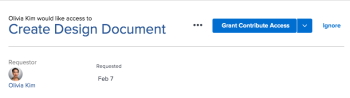

# 授予对“主页”区域中对象的访问权限

用户可以请求访问Adobe Workfront中的对象。 有关请求访问的详细信息，请参阅  [请求访问对象](../../workfront-basics/grant-and-request-access-to-objects/request-access.md)。

如果您是对象的所有者，则可以授予或拒绝对“主页”区域中的项目的访问权限。

## 访问要求

<!--drafted for P&P:

<table style="table-layout:auto"> 
 <col> 
 <col> 
 <tbody> 
  <tr> 
   <td role="rowheader">Adobe Workfront plan*</td> 
   <td> 
Any
 </td> 
  </tr> 
  <tr> 
   <td role="rowheader">Adobe Workfront license*</td> 
   <td> 
Current license: Standard
 
   Or
   
Legacy license: Work or higher

   </td> 
  </tr> 
  <tr> 
   <td role="rowheader">Access level configurations*</td> 
   <td> 
View access or higher to projects, tasks, issues, or documents
 
<b>NOTE</b>
   
   If you still don't have access, ask your Workfront administrator if they set additional restrictions in your access level. For information on how a Workfront administrator can modify your access level, see <a href="../../administration-and-setup/add-users/configure-and-grant-access/create-modify-access-levels.md" class="MCXref xref">Create or modify custom access levels</a>.
 </td> 
  </tr> 
  <tr> 
   <td role="rowheader">Object permissions</td> 
   <td> 
View permissions or higher to projects, tasks, issues, or documents
 
For information on requesting additional access, see <a href="../../workfront-basics/grant-and-request-access-to-objects/request-access.md" class="MCXref xref">Request access to objects </a>.
 </td> 
  </tr> 
 </tbody> 
</table>

-->

您必须具有以下权限才能执行本文中的步骤：

<table style="table-layout:auto"> 
 <col> 
 <col> 
 <tbody> 
  <tr> 
   <td role="rowheader">Adobe Workfront计划*</td> 
   <td> 
任何
 </td> 
  </tr> 
  <tr> 
   <td role="rowheader">Adobe Workfront许可证*</td> 
   <td> 
工作或更高
 </td> 
  </tr> 
  <tr> 
   <td role="rowheader">访问级别配置*</td> 
   <td> 
查看对项目、任务、问题或文档的访问权限或更高版本
 
<b>注释</b>

如果您仍然没有访问权限，请咨询Workfront管理员是否对您的访问级别设置了其他限制。 有关Workfront管理员如何修改您的访问级别的信息，请参阅<a href="../../administration-and-setup/add-users/configure-and-grant-access/create-modify-access-levels.md" class="MCXref xref">创建或修改自定义访问级别</a>。
 </td>
</tr> 
  <tr> 
   <td role="rowheader">对象权限</td> 
   <td> 
查看项目、任务、问题或文档的权限或更高
 
有关请求其他访问权限的信息，请参阅<a href="../../workfront-basics/grant-and-request-access-to-objects/request-access.md" class="MCXref xref">请求访问对象</a>。
 </td> 
  </tr> 
 </tbody> 
</table>

&#42;要了解您拥有什么计划、许可证类型或访问权限，请与Workfront管理员联系。

## 授予对“主页”区域中对象的访问权限

1. 单击Adobe Workfront左上角的&#x200B;**主页**&#x200B;图标。

   >[!NOTE]
   >
   >您的Workfront管理员可以对环境中的主页图标进行以下更改：
   >
   >* 请将其替换为用于说明贵组织的自定义图像。 在这种情况下，图标的外观将与本文中显示的有所不同。
   >* 将链接到该页面的页面替换为其他页面。 在这种情况下，请单击页面右上角的&#x200B;**主菜单** ，然后单击&#x200B;**主页**。

1. （视情况而定）在旧版主页区域中，执行以下操作：

   1. 在&#x200B;**工作列表**&#x200B;中，选择要在&#x200B;**审批**&#x200B;部分管理的访问请求。

   

   请求将显示在工作列表的右侧。

   1. 单击右上角的授予访问权限按钮。\
      根据请求的访问类型，按钮名称会发生更改。 例如，如果请求者请求查看权限，则按钮显示&#x200B;**授予查看权限**。\
      

   1. （可选）要授予不同于请求的访问级别，请单击“授予访问权限”按钮旁边的箭头并选择新的访问权限，然后单击&#x200B;**授予&lt;权限级别>访问权限>**。\
      将显示一条消息，确认已授予访问权限。

   1. （可选）单击&#x200B;**忽略**&#x200B;以拒绝访问。\
      出现一条消息，确认访问被忽略。

1. （视情况而定）在新的“主页”区域中，执行以下操作：

   1. 转到&#x200B;**等待我的审批**&#x200B;构件并查找有关更多访问权限的请求，然后单击&#x200B;**授予访问权限**。

      

   1. （可选）要授予不同于请求的访问级别，请单击“授予访问权限”按钮左侧的下拉菜单，选择新的访问权限，然后单击&#x200B;**授予访问权限**。

      访问请求被授予并从批准请求列表中消失。

   1. （可选）单击&#x200B;**忽略**&#x200B;以拒绝访问。 访问请求未被授予，并且该请求从批准请求列表中消失。

## 配置请求的电子邮件通知

您可以配置是否接收访问请求的电子邮件通知。 Workfront管理员可以禁用此功能（如[为系统中的每个人配置事件通知](../../administration-and-setup/manage-workfront/emails/configure-event-notifications-for-everyone-in-the-system.md)中所述）。

1. 单击Adobe Workfront右上角的&#x200B;**主菜单**&#x200B;图标，然后单击&#x200B;**设置** 。

1. 单击&#x200B;**首选项**，或滚动到“首选项”部分。
1. 在&#x200B;**何时向我发送电子邮件**&#x200B;下拉列表中，选择或取消选择&#x200B;**某人向我请求访问权限**，具体取决于您是否希望在其他用户向您请求访问权限时接收电子邮件通知。

1. 单击&#x200B;**保存更改**。
