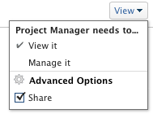

# 共享报表、功能板和日历

您的Adobe Workfront管理员在用户分配访问级别时，会授予用户查看或编辑报表、功能板和日历的权限。 有关授予对报表、功能板和日历的访问权限的更多信息，请参阅 [授予对报表、功能板和日历的访问权限](../../administration-and-setup/add-users/configure-and-grant-access/grant-access-reports-dashboards-calendars.md).

除了授予用户的访问级别之外，您还可以授予他们查看或管理您有权访问共享的特定报表、功能板或日历的权限。 有关授予用户共享对象权限的信息，请参阅 [对象共享权限概述](../../workfront-basics/grant-and-request-access-to-objects/sharing-permissions-on-objects-overview.md).

权限特定于Workfront中的一个项目，并定义可以对该项目执行哪些操作。

有关每个访问级别中的用户可以处理问题的信息，请参阅部分 [报表](../../administration-and-setup/add-users/access-levels-and-object-permissions/functionality-available-for-each-object-type.md#reports) 在文章中 [可用于每种对象类型的功能](../../administration-and-setup/add-users/access-levels-and-object-permissions/functionality-available-for-each-object-type.md).

## 有关共享报表、功能板或日历的注意事项

除了以下注意事项外，另请参阅 [对象共享权限概述](../../workfront-basics/grant-and-request-access-to-objects/sharing-permissions-on-objects-overview.md).

>[!NOTE]
>
>Workfront管理员可以添加或删除系统中所有用户的任何项目的权限，而不是这些项目的所有者。

* 默认情况下，报表、功能板或日历的创建者具有“管理”权限。
* 共享报表、功能板和日历与在Workfront中共享任何其他对象类似。

   有关如何在Workfront中共享对象的更多信息，请参阅 [共享对象](../../workfront-basics/grant-and-request-access-to-objects/share-an-object.md).

   另请参阅以下文章，了解如何共享报表、功能板和日历：

   * [在Adobe Workfront中共享报表](../../reports-and-dashboards/reports/creating-and-managing-reports/share-report.md)
   * [共享功能板](../../reports-and-dashboards/dashboards/creating-and-managing-dashboards/share-dashboard.md)
   * [共享日历报表](../../reports-and-dashboards/reports/calendars/share-a-calendar-report.md)

* 您可以单独共享报表和功能板，也可以批量共享报表和功能板。

   您只能单独共享日历。 您无法批量共享它们。

* 您无法共享内置系统报告。 您只能共享自定义报表。

   有关将系统报表另存为新自定义报表的更多信息，请参阅 [创建报表副本](../../reports-and-dashboards/reports/creating-and-managing-reports/create-copy-report.md).

* 您可以向报表、功能板和日历授予以下权限：

   * 查看

      

   * 管理

      

* 当您共享功能板时，用户默认拥有功能板上所有报表、日历和外部页面的“查看”权限。
* 具有请求许可证的用户无法查看系统范围的报告。 如果请求方需要查看报表，则必须单独与他们共享报表。
* 如果某个报表有提示，并且您公开共享该提示，则访问该报表的用户必须登录Workfront才能使用该提示运行该报表。 如果他们无法登录Workfront，则将在未应用提示的情况下看到报表。\
   有关与提示共享报表的限制的更多信息，请参阅部分 [共享提示报表的限制](../../reports-and-dashboards/reports/creating-and-managing-reports/add-prompt-report.md#limitations-of-running-public-prompted-reports) 在文章中 [向报表添加提示](../../reports-and-dashboards/reports/creating-and-managing-reports/add-prompt-report.md).

* 您可以从报表或日历中删除继承的权限。

   有关从对象中删除继承权限的更多信息，请参阅 [从对象删除权限](../../workfront-basics/grant-and-request-access-to-objects/remove-permissions-from-objects.md).

* 您还可以在公共或系统范围内共享报表或日历。

   您无法公开共享功能板，但可以在系统范围内共享它。

   >[!CAUTION]
   >
   >我们建议您在与外部用户共享包含机密信息的对象时务必谨慎。 这样，用户便无需成为Workfront用户或您组织的一员，即可查看信息。
