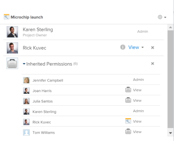

# 在Adobe Workfront中共享项目

在分配访问级别时，Adobe Workfront管理员可以授予您查看或编辑项目的权限。 有关更多信息，请参阅 [授予对项目的访问权限](../../administration-and-setup/add-users/configure-and-grant-access/grant-access-projects.md).

除了授予用户的访问级别之外，您还可以授予他们查看、贡献或管理您有权共享的特定项目的权限。

权限特定于Workfront中的一个项目，并定义可以对该项目执行哪些操作。

## 关于共享项目的注意事项

除了以下注意事项外，另请参阅 [对象共享权限概述](../../workfront-basics/grant-and-request-access-to-objects/sharing-permissions-on-objects-overview.md).

* 默认情况下，项目的创建者具有管理项目的权限，并且还被指定为项目所有者。 如果将项目分配给其他所有者，则该用户也有权管理项目。 当项目创建者（或所有者）与其他用户共享项目时，他们会向这些用户授予特定权限，以控制他们在项目中工作时可以执行的操作。

   但是，如果项目责任人没有计划员许可证，则他们无权完全管理项目。 只有具有计划许可证的用户才有权管理项目。 有关更多信息，请参阅 [访问级别和权限如何协同工作](../../administration-and-setup/add-users/access-levels-and-object-permissions/how-access-levels-permissions-work-together.md).

* 您可以单独共享项目，也可以一次共享其中多个项目。 共享项目与共享其他对象相同。 有关在Workfront中共享项目的更多信息，请参阅 [共享对象](../../workfront-basics/grant-and-request-access-to-objects/share-an-object.md).
* 您可以为项目授予以下权限： 

   * 查看
   * 管理
   * 参与

        

* 在共享项目时，除非另有指定，否则所有任务、问题和文档都将继承相同的权限。

   有关根据用户对项目的权限管理对项目任务和问题的访问权限的信息，请参阅  章节 [编辑项目](../../manage-work/projects/manage-projects/edit-projects.md).

   Workfront管理员可以指定文档是否应继承用户访问级别中较高对象的权限。 有关限制文档继承权限的更多信息，请参阅 [创建或修改自定义访问级别](../../administration-and-setup/add-users/configure-and-grant-access/create-modify-access-levels.md).

* 您可以从项目中删除继承的权限，以便子对象不会继承它们。 有关从对象中删除继承权限的更多信息，请参阅  [从对象删除权限](../../workfront-basics/grant-and-request-access-to-objects/remove-permissions-from-objects.md).

## 共享项目的方法 {#ways-to-share-a-project}

您可以通过以下方式共享项目：

* 通过执行以下操作之一手动操作：

   * 将用户添加到项目团队。 在将用户添加到项目团队时，他们会自动获取项目的查看权限。\
      有关将用户添加到项目团队的更多信息，请参阅 [项目团队概述](../../manage-work/projects/planning-a-project/project-team-overview.md).
   * 使用 **共享** 选项。

      共享项目与在Adobe Workfront中共享所有其他对象类似。

      有关在Workfront中共享对象的信息，请参阅 [共享对象](../../workfront-basics/grant-and-request-access-to-objects/share-an-object.md).

* 通过执行以下操作之一自动：

   * 将项目放入 **Portfolio** 或 **项目** 已与他人共享。 用户对项目拥有的权限与对项目组合或项目群拥有的权限相同。\
      有关将项目添加到 **Portfolio**，请参阅 [将项目添加到项目组合](../../manage-work/portfolios/create-and-manage-portfolios/add-projects-to-portfolios.md).\
      有关将项目添加到 **项目**，请参阅 [将项目添加到项目群](../../manage-work/portfolios/create-and-manage-programs/add-project-to-program.md).

      有关查看对象的继承权限的信息，请参阅 [查看对象的继承权限](../../workfront-basics/grant-and-request-access-to-objects/view-inherited-permissions-on-objects.md).

   * 在用于创建项目的模板上将实体添加到项目共享。 有关从模板共享项目的信息，请参阅 [共享模板](../../workfront-basics/grant-and-request-access-to-objects/share-a-template.md).
   * 定义项目访问模板。

      要定义项目访问模板，请参阅 [共享对象](../../workfront-basics/grant-and-request-access-to-objects/share-an-object.md).

      >[!TIP]
      >
      >附加或保存模板时，可以清除“模板项目共享”规则。

   * 编辑项目并定义 **当某人有权访问此项目时** 设置。 有关更多信息，请参阅 [编辑项目](../../manage-work/projects/manage-projects/edit-projects.md).

<!--

(NOTE: drafted because I created new article and linked it above) 

To view what users have inherited the access on the project from a portfolio or a program, do the following:

<ol style="list-style-type: lower-alpha;">
<li value="1">Go to a project whose sharing permissions you want to view. </li>
<li value="2"> Click the <strong>More</strong> menu , then click <strong>Sharing</strong>. </li>
<li value="3"> 
Expand the <strong>Inherited Permissions</strong> list. 
 
This list displays the names of users that have access to either the portfolio or the program that the project belongs to and also have permissions to the project. 
 
  
 </li>
</ol>

-->

<!--
<ol data-mc-conditions="QuicksilverOrClassic.Draft mode">
<li value="1">Go to a project whose sharing permissions you want for all projects you create from scratch. (NOTE: drafted because linked above)&nbsp;</li>
<li value="2"> Click the More menu, then click <strong>Sharing</strong>. </li>
<li value="3"> 
In the Project Access box that displays, near the upper-right corner, click the gear icon , then click <strong>Set as my project access template</strong>.
 
The entities that are granted permissions on the selected project have the same permissions for all the projects you create from scratch in the future.
 
 The project access template overrides the sharing defaults granted to you by the Workfront administrator in your Access Level. For more information about specifying sharing defaults for projects in the Access Level, see <a href="../../administration-and-setup/add-users/configure-and-grant-access/grant-access-projects.md" class="MCXref xref">Grant access to projects</a>.
 </li>
<li value="4">Click <strong>Save</strong>.</li>
</ol>
-->

## 不同许可证类型的限制

* 具有Worker许可证的用户无权管理项目。 对于Worker，最高的共享权限是Contribute。
* 具有请求许可证的用户可以查看项目信息，但他们对项目的访问权限有限。
* 如果审批流程中还包含具有查看或Contribute权限的用户，则更改项目状态会出现异常。 他们可以批准项目，该项目会更改项目的状态，但状态是要批准或拒绝的预定义状态。
* 要能够复制项目，用户还必须有权在其访问级别中创建项目。

<!--

<h2>Configure default permissions for a project</h2>

(NOTE: drafted because I added one more way to automatically share the project above in the bullet list and linked it to Edit Projects) 

As a project owner, you can configure the default permissions for View, Manage, and Contribute access that are used when sharing&nbsp;the project with others. When users share a project, the default permissions are used. Users can then adjust the default permissions when sharing the project, as described in <a title="Project Permissions" href="#ways-to-share-a-project" class="MCXref xref">Ways to share a project</a>. 

To configure the default permissions that are included with each access level:

<ol>
<li value="1">Go to the project where you want to set the default permissions.</li>
<li value="2"> 
Click the More menu , then click <strong>Edit</strong>. 
 
  
 </li>
<li value="3">Click <strong>Access</strong> in the list on the left.</li>
<li value="4"> 
In the <strong>When someone is given access to this PROJECT</strong> section, select permissions that you want to be available when users are given access to the project via sharing.
 
Ensure that any permissions that you want to include in the selected access level are selected and deselect any permissions that you do not want to include in the selected permissions level.
 
To view which permissions are available for each level, see&nbsp;<a title="Project Permissions" href="#Understanding_Project_Permissions" class="MCXref xref">Share a project in Adobe Workfront</a>.
 <note type="note">
The
<strong>Delete</strong> access in the
<strong>Manage</strong> permission level determines whether users can&nbsp;delete the project itself. Users with
<strong>Manage</strong> access to the project can delete tasks and issues within the project regardless of whether this option is selected, if they have
<strong>Manage</strong> permissions to the tasks and issues.&nbsp;
</note> </li>
<li value="5">Click <strong>Save Changes</strong>.</li>
</ol>

-->

## 项目权限选项

下表列出了用户在共享项目时可授予的权限。 有关用户根据其许可证获得的访问权限的更多信息，请参阅 [授予对项目的访问权限](../../administration-and-setup/add-users/configure-and-grant-access/grant-access-projects.md).

<table border="1" cellspacing="15" cellpadding="1"> 
 <col> 
 <col> 
 <col> 
 <col> 
 <thead> 
  <tr> 
   <th> 
<strong>操作</strong> 
 </th> 
   <th> 
<strong>管理</strong> 
 </th> 
   <th> 
<strong>参与</strong> 
 </th> 
   <th> 
<strong>查看</strong> 
 </th> 
  </tr> 
 </thead> 
 <tbody> 
  <tr> 
   <td> 
添加自定义表单
 </td> 
   <td> 
✓
 </td> 
   <td> 
 
 </td> 
   <td> 
 
 </td> 
  </tr> 
  <tr> 
   <td> 
更新自定义字段
 </td> 
   <td> 
✓
 </td> 
   <td> 
✓
 </td> 
   <td> 
 
 </td> 
  </tr> 
  <tr> 
   <td> 
添加批准流程
 </td> 
   <td> 
✓
 </td> 
   <td> 
 
 </td> 
   <td> 
 
 </td> 
  </tr> 
  <tr> 
   <td> 
批准项目
 </td> 
   <td> 
✓
 </td> 
   <td> 
✓
 </td> 
   <td> 
✓
 </td> 
  </tr> 
  <tr> 
   <td> 
批准小时数
 </td> 
   <td> 
✓
 </td> 
   <td> 
✓ 
 </td> 
   <td> 
 
 </td> 
  </tr> 
  <tr> 
   <td> 
创建项目
 </td> 
   <td> 
✓
 </td> 
   <td> 
 
 </td> 
   <td> 
 
 </td> 
  </tr> 
  <tr> 
   <td> 
添加文档
 </td> 
   <td> 
✓
 </td> 
   <td> 
✓
 </td> 
   <td> 
✓
 </td> 
  </tr> 
  <tr> 
   <td> 
添加问题
 </td> 
   <td> 
✓
 </td> 
   <td> 
✓
 </td> 
   <td> 
✓
 </td> 
  </tr> 
  <tr> 
   <td> 
添加任务
 </td> 
   <td> 
✓
 </td> 
   <td> 
✓
 </td> 
   <td> 
 
 </td> 
  </tr> 
  <tr> 
   <td> 
复制项目
 </td> 
   <td> 
 
 </td> 
   <td> 
✓
 </td> 
   <td> 
 
 </td> 
  </tr> 
  <tr> 
   <td> 
删除项目
 </td> 
   <td> 
✓
 </td> 
   <td> 
 
 </td> 
   <td> 
 
 </td> 
  </tr> 
  <tr> 
   <td> 
修改计划日期
 </td> 
   <td> 
✓
 </td> 
   <td> 
 
 </td> 
   <td> 
 
 </td> 
  </tr> 
  <tr> 
   <td> 
共享项目
 </td> 
   <td> 
✓
 </td> 
   <td> 
✓
 </td> 
   <td> 
✓
 </td> 
  </tr> 
  <tr> 
   <td> 
在系统范围内共享
 </td> 
   <td> 
 
 </td> 
   <td> 
 
 </td> 
   <td> 
✓
 </td> 
  </tr> 
  <tr> 
   <td> 
查看项目
 </td> 
   <td> 
✓
 </td> 
   <td> 
✓
 </td> 
   <td> 
✓
 </td> 
  </tr> 
  <tr> 
   <td> 
更新/注释
 </td> 
   <td> 
✓
 </td> 
   <td> 
✓
 </td> 
   <td> 
✓
 </td> 
  </tr> 
  <tr> 
   <td> 
更改状态
 </td> 
   <td> 
✓
 </td> 
   <td> 
 
 </td> 
   <td> 
 
 </td> 
  </tr> 
  <tr> 
   <td> 
记录小时数
 </td> 
   <td> 
✓
 </td> 
   <td> 
✓
 </td> 
   <td> 
 
 </td> 
  </tr> 
  <tr> 
   <td> 
编辑分配
 </td> 
   <td> 
✓
 </td> 
   <td> 
✓
 </td> 
   <td> 
 
 </td> 
  </tr> 
  <tr> 
   <td> 
管理基线
 </td> 
   <td> 
✓
 </td> 
   <td> 
 
 </td> 
   <td> 
 
 </td> 
  </tr> 
  <tr> 
   <td> 
管理风险*
 </td> 
   <td> 
✓
 </td> 
   <td> 
 
 </td> 
   <td> 
 
 </td> 
  </tr> 
  <tr> 
   <td> 
管理财务状况*
 </td> 
   <td> 
✓
 </td> 
   <td> 
 
 </td> 
   <td> 
 
 </td> 
  </tr> 
  <tr> 
   <td> 
添加/编辑费用*
 </td> 
   <td> 
✓
 </td> 
   <td> 
✓
 </td> 
   <td> 
 
 </td> 
  </tr> 
  <tr> 
   <td> 
查看财务状况*
 </td> 
   <td> 
✓
 </td> 
   <td> 
✓
 </td> 
   <td> 
✓
 </td> 
  </tr> 
  <tr> 
   <td> 
附加模板
 </td> 
   <td> 
✓
 </td> 
   <td> 
 
 </td> 
   <td> 
 
 </td> 
  </tr> 
  <tr> 
   <td> 
另存为模板
 </td> 
   <td> 
✓
 </td> 
   <td> 
✓
 </td> 
   <td> 
✓
 </td> 
  </tr> 
  <tr> 
   <td> 
添加/编辑业务案例
 </td> 
   <td> 
✓
 </td> 
   <td> 
 
 </td> 
   <td> 
 
 </td> 
  </tr> 
  <tr> 
   <td> 
编辑项目详细信息
 </td> 
   <td> 
✓
 </td> 
   <td> 
 
 </td> 
   <td> 
 
 </td> 
  </tr> 
  <tr> 
   <td> 
编辑人员配置
 </td> 
   <td> 
✓
 </td> 
   <td> 
 
 </td> 
   <td> 
 
 </td> 
  </tr> 
  <tr> 
   <td> 
导出至 MS 项目
 </td> 
   <td> 
✓
 </td> 
   <td> 
✓
 </td> 
   <td> 
✓
 </td> 
  </tr> 
  <tr> 
   <td> 
重新计算财务/时间表*
 </td> 
   <td> 
✓
 </td> 
   <td> 
 
 </td> 
   <td> 
 
 </td> 
  </tr> 
  <tr> 
   <td> 
设置队列属性
 </td> 
   <td> 
✓
 </td> 
   <td> 
 
 </td> 
   <td> 
  
 </td> 
  </tr> 
  <tr> 
   <td> 
在列表中批量编辑项目
 </td> 
   <td> 
✓
 </td> 
   <td> </td> 
   <td> </td> 
  </tr> 
 </tbody> 
</table>

&#42;无权访问财务数据的用户无法管理项目的风险和财务，即使他们有权编辑项目。 有关访问金融数据的信息，请参阅 [授予对财务数据的访问权限](../../administration-and-setup/add-users/configure-and-grant-access/grant-access-financial.md).
