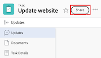

# 共享任务

当您的Adobe Workfront管理员分配访问级别时，可以授予您查看或编辑任务的权限。 有关授予任务访问权限的详细信息，请参阅[授予任务访问权限](../../administration-and-setup/add-users/configure-and-grant-access/grant-access-tasks.md)。

除了授予用户的访问级别之外，您还可以授予他们查看、Contribute或管理您有权共享的特定任务的权限。

权限特定于Workfront中的一个项目，并定义您可以对该项目执行的操作。

## 访问要求

+++ 展开以查看本文中各项功能的访问要求。

要共享对象，必须具备以下条件：

<table style="table-layout:auto"> 
 <col> 
 <col> 
 <tbody> 
  <tr> 
   <td role="rowheader">Adobe Workfront计划</td> 
   <td> 
任何 
 </td> 
  </tr> 
  <tr> 
   <td role="rowheader">Adobe Workfront许可证</td> 
   <td> 
新增：标准
 
   或
   
当前：工作或更高

   </td> 
  </tr> 
  <tr> 
   <td role="rowheader">访问级别配置</td> 
   <td> 
查看对要共享对象的访问权限或更高版本
 </td> 
  </tr> 
  <tr> 
   <td role="rowheader">对象权限</td> 
   <td> 
查看要共享对象的权限或更高
</td> 
  </tr> 
 </tbody> 
</table>

有关详细信息，请参阅Workfront文档中的[访问要求](/help/quicksilver/administration-and-setup/add-users/access-levels-and-object-permissions/access-level-requirements-in-documentation.md)。

+++

## 共享任务时的注意事项

除了下面的注意事项外，另请参阅[对象权限共享概述](../../workfront-basics/grant-and-request-access-to-objects/sharing-permissions-on-objects-overview.md)。

* 默认情况下，任务的创建者具有其“管理”权限。
* 您可以单独共享任务，也可以一次批量共享多个任务。\
  共享任务与共享其他对象相同。 有关在Workfront中共享项目的详细信息，请参阅[共享对象](../../workfront-basics/grant-and-request-access-to-objects/share-an-object.md)。

* 您可以向任务授予以下权限： 

   * 查看
   * 管理
   * 参与
* 共享任务时，默认情况下，用户将继承与该任务关联的所有子对象的相同权限。 例如，他们对附加到任务的子任务、问题和文档继承相同的权限。\
  有关Workfront中对象层次结构的详细信息，请参阅  [了解Adobe Workfront中的对象](../../workfront-basics/navigate-workfront/workfront-navigation/understand-objects.md)。

  Workfront管理员可以指定文档是否应从用户访问级别更高的对象继承权限。 有关限制文档继承权限的详细信息，请参阅[创建或修改自定义访问级别](../../administration-and-setup/add-users/configure-and-grant-access/create-modify-access-levels.md)。

* 您可以从任务中删除继承的权限。\
  有关从对象中删除继承权限的详细信息，请参阅  [从对象中删除权限](../../workfront-basics/grant-and-request-access-to-objects/remove-permissions-from-objects.md)。

## 共享任务的方法

您可以通过以下方式共享任务：

* 手动逐个或批量执行。

* 通过执行以下操作，自动执行：

   * 指定任务的任何父对象的权限：项目、项目群或项目组合。 任务从其父对象继承权限。 有关查看对象的继承权限的信息，请参阅[查看对象的继承权限](../../workfront-basics/grant-and-request-access-to-objects/view-inherited-permissions-on-objects.md)。
   * 在用于创建任务所在项目的模板上，将实体添加到项目共享。 有关从模板共享项目的信息，请参阅[共享模板](../../workfront-basics/grant-and-request-access-to-objects/share-a-template.md)。

   * 在编辑项目时，指定项目中所有任务的权限。 有关基于用户对项目的权限管理项目上任务的访问权限的信息，请参阅[编辑项目](../../manage-work/projects/manage-projects/edit-projects.md)一文中的部分。

  >[!TIP]
  >
  >如果您未指定在将用户分配给项目中的任务时希望用户具有哪些任务权限，则默认情况下，这些用户将获得他们在项目中的相同权限。

## 共享任务

1. 导航到要共享的任务。

1. 单击任务名称右侧的&#x200B;**共享**。 将打开&#x200B;**共享[任务名称]**&#x200B;对话框。

   

1. 在&#x200B;**将任务访问权限授予**&#x200B;字段中，开始键入要与其共享任务的用户、团队、角色、组或公司的名称，然后在名称出现在下拉列表中时单击该名称。

   >[!TIP]
   >
   >您只能与活动用户、团队、角色或公司共享任务。

1. （可选）选择&#x200B;**具有访问权限**&#x200B;下拉列表并选择任务的访问级别：

   * **只有受邀人员才能访问：**&#x200B;只有受邀参与该任务的用户才能访问它（默认）。
   * **系统中的每个人都可以查看**：系统中所有用户都可以查看任务，而无需邀请。

1. 单击用户名右侧的下拉列表，然后选择他们对于此任务的权限级别：

   * **查看**：用户可以查看和共享任务。
   * **Contribute**：用户可以进行更新、记录信息、进行细微编辑和共享任务（还包括所有查看权限）。
   * **管理**：用户具有任务的完全访问权限，但没有管理权限，这些权限是在访问级别授予的（还包括所有“查看”和“贡献”权限）。

1. （可选）单击您授予的权限级别旁边的高级选项图标，以配置任务的特定权限。

   

1. （可选）要关闭任务子对象的继承权限，请单击&#x200B;**关闭**&#x200B;与&#x200B;**继承权限**&#x200B;内联。

1. （可选）要使用链接快速共享任务，请单击&#x200B;**复制链接**，然后将其转发给收件人。

1. 单击&#x200B;**保存**。

## 批量共享任务

1. 导航到包含要共享的任务的项目。

1. 在项目页面的&#x200B;**任务**&#x200B;选项卡中，选中要共享的每个任务左侧的框，然后单击页面顶部的&#x200B;**共享**&#x200B;图标。 这将打开共享模式窗口。

   

1. 在&#x200B;**将任务访问权限授予**&#x200B;字段中，开始键入要与其共享任务的用户、团队、角色、组或公司的名称，然后在名称出现在下拉列表中时单击该名称。

   >[!TIP]
   >
   >您只能与活动用户、团队、角色或公司共享任务。

1. （可选）选择&#x200B;**具有访问权限**&#x200B;下拉列表并选择任务的访问级别：

   * **只有受邀人员才能访问：**&#x200B;只有受邀参与任务的用户才能访问这些任务（默认）。
   * **系统中的每个人都可以查看**：系统中的所有用户都可以查看任务，而无需邀请。

1. 单击用户名右侧的下拉列表，并为任务选择其权限级别：

   * **查看**：用户可以查看和共享任务。
   * **Contribute**：用户可以进行更新、记录信息、进行细微编辑和共享任务（还包括所有查看权限）。
   * **管理**：用户拥有对无管理权限任务的完全访问权限，这些权限在访问级别被授予（还包括所有“查看”和“贡献”权限）。

1. （可选）单击您授予的权限级别旁边的高级选项图标，以配置任务的特定权限。

   

1. 单击&#x200B;**保存**。

## 任务权限

下表显示了允许用户查看、参与或管理任务时，您可以授予用户哪些权限：

<table border="2" cellspacing="15" cellpadding="1"> 
 <col> 
 <col> 
 <col> 
 <col> 
 <thead> 
  <tr> 
   <th><strong>操作</strong> </th> 
   <th><strong>管理</strong> </th> 
   <th><strong>参与</strong> </th> 
   <th><strong>视图</strong> </th> 
  </tr> 
 </thead> 
 <tbody> 
  <tr> 
   <td scope="row">添加任务</td> 
   <td>✓</td> 
   <td>✓</td> 
   <td> </td> 
  </tr> 
  <tr> 
   <td scope="row">添加前置任务</td> 
   <td>✓</td> 
   <td> </td> 
   <td> </td> 
  </tr> 
  <tr> 
   <td scope="row">添加问题</td> 
   <td>✓</td> 
   <td>✓</td> 
   <td>✓</td> 
  </tr> 
  <tr> 
   <td scope="row">删除任务</td> 
   <td>✓</td> 
   <td> </td> 
   <td> </td> 
  </tr> 
  <tr> 
   <td scope="row"> 
常规任务编辑 
 </td> 
   <td>✓</td> 
   <td>✓</td> 
   <td> </td> 
  </tr> 
  <tr> 
   <td scope="row">更改任务状态</td> 
   <td>✓</td> 
   <td>✓</td> 
   <td> </td> 
  </tr> 
  <tr> 
   <td scope="row">编辑任务限制</td> 
   <td>✓</td> 
   <td> </td> 
   <td> </td> 
  </tr> 
  <tr> 
   <td scope="row">查看任务</td> 
   <td>✓</td> 
   <td>✓</td> 
   <td>✓</td> 
  </tr> 
  <tr> 
   <td scope="row">添加文档</td> 
   <td>✓</td> 
   <td>✓</td> 
   <td>✓</td> 
  </tr> 
  <tr> 
   <td scope="row">复制任务*</td> 
   <td>✓</td> 
   <td>✓</td> 
   <td>✓</td> 
  </tr> 
  <tr> 
   <td scope="row">移动任务*</td> 
   <td>✓</td> 
   <td> </td> 
   <td> </td> 
  </tr> 
  <tr> 
   <td scope="row">记录小时数</td> 
   <td>✓</td> 
   <td>✓</td> 
   <td> </td> 
  </tr> 
  <tr> 
   <td scope="row">修改计划日期</td> 
   <td>✓</td> 
   <td> </td> 
   <td> </td> 
  </tr> 
  <tr> 
   <td scope="row">接受分配</td> 
   <td>✓</td> 
   <td>✓</td> 
   <td> </td> 
  </tr> 
  <tr> 
   <td scope="row">进行分配</td> 
   <td>✓</td> 
   <td>✓</td> 
   <td> </td> 
  </tr> 
  <tr> 
   <td scope="row">附上自定义表单</td> 
   <td>✓</td> 
   <td> </td> 
   <td> </td> 
  </tr> 
  <tr> 
   <td scope="row">编辑自定义字段</td> 
   <td>✓</td> 
   <td>✓</td> 
   <td> </td> 
  </tr> 
  <tr> 
   <td scope="row">创建批准流程</td> 
   <td>✓</td> 
   <td> </td> 
   <td> </td> 
  </tr> 
  <tr> 
   <td scope="row">批准任务</td> 
   <td>✓</td> 
   <td>✓</td> 
   <td>✓</td> 
  </tr> 
  <tr> 
   <td scope="row">编辑财务*</td> 
   <td>✓</td> 
   <td> </td> 
   <td> </td> 
  </tr> 
  <tr> 
   <td scope="row">添加/编辑费用</td> 
   <td>✓</td> 
   <td>✓</td> 
   <td> </td> 
  </tr> 
  <tr> 
   <td scope="row">查看财务状况</td> 
   <td>✓</td> 
   <td>✓</td> 
   <td>✓</td> 
  </tr> 
  <tr> 
   <td scope="row">更新/评论</td> 
   <td>✓</td> 
   <td>✓</td> 
   <td>✓</td> 
  </tr> 
  <tr> 
   <td scope="row">共享</td> 
   <td>✓</td> 
   <td>✓</td> 
   <td>✓</td> 
  </tr> 
  <tr> 
   <td scope="row">在系统范围内共享</td> 
   <td> </td> 
   <td> </td> 
   <td>✓</td> 
  </tr> 
 </tbody> 
</table>

&#42;由访问级别和项目权限控制。
