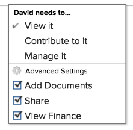

# 共享问题

您的Adobe Workfront管理员在用户分配访问级别时，会授予用户查看或编辑问题的权限。 有关授予对问题的访问权限的更多信息，请参阅 [授予对问题的访问权限](../../administration-and-setup/add-users/configure-and-grant-access/grant-access-issues.md).

除了授予用户的访问级别之外，您还可以授予他们查看、贡献或管理您有权共享的特定问题的权限。 有关访问级别和权限的更多信息，请参阅 [访问级别和权限如何协同工作](../../administration-and-setup/add-users/access-levels-and-object-permissions/how-access-levels-permissions-work-together.md).

权限特定于Workfront中的一个项目，并定义可以对该项目执行哪些操作。

## 有关共享问题的注意事项

除了以下注意事项外，另请参阅 [对象共享权限概述](../../workfront-basics/grant-and-request-access-to-objects/sharing-permissions-on-objects-overview.md).

>[!NOTE]
>
>Workfront管理员可以添加或删除系统中所有用户的任何项目的权限，而不是这些项目的所有者。

* 默认情况下，问题的创建者具有“管理”权限。
* 您可以单独共享问题，也可以一次共享其中的几个问题。 共享问题与在Workfront中共享其他项目相同。 有关在Workfront中共享项目的更多信息，请参阅 [共享对象](../../workfront-basics/grant-and-request-access-to-objects/share-an-object.md).
* 您可以为问题授予以下权限： 

   * 查看

      

   * 管理

      

   * 参与\
      

* 当您共享问题时，附加到该问题的所有文档都将继承相同的权限。

   Workfront管理员可以指定文档是否应继承用户访问级别中较高对象的权限。 有关限制文档继承权限的更多信息，请参阅 [创建或修改自定义访问级别](../../administration-and-setup/add-users/configure-and-grant-access/create-modify-access-levels.md).

* 您可以从问题中删除继承的权限。 有关更多信息，请参阅 [从对象删除权限](../../workfront-basics/grant-and-request-access-to-objects/remove-permissions-from-objects.md).

## 共享问题的方法

* 手动，这与在Workfront中共享任何其他对象类似。 有关如何在Workfront中共享对象的更多信息，请参阅 [共享对象](../../workfront-basics/grant-and-request-access-to-objects/share-an-object.md).
* 通过执行以下操作之一自动：

   * 指定问题任何父对象的权限：项目、项目群或项目组合。 问题从其父对象继承权限。 有关查看对象继承权限的信息，请参阅 [查看对象的继承权限](../../workfront-basics/grant-and-request-access-to-objects/view-inherited-permissions-on-objects.md).
   * 在用于创建问题所在项目的模板上将实体添加到项目共享。 有关从模板共享项目的信息，请参阅 [共享模板](../../workfront-basics/grant-and-request-access-to-objects/share-a-template.md).

   * 在编辑项目时，指定项目中所有问题的权限。 有关根据用户对项目的权限管理对项目问题或请求的访问权限的信息，请参阅  章节 [编辑项目](../../manage-work/projects/manage-projects/edit-projects.md).

      >[!TIP]
      >
      >如果您没有指定在将用户分配到项目问题时您希望用户拥有的问题权限，则他们会获得与他们在项目中拥有的权限相同的权限，默认情况下。

   * 指定用户在创建请求队列时在请求队列中提交的问题时收到的权限。 有关信息，请参阅 [创建请求队列](../../manage-work/requests/create-and-manage-request-queues/create-request-queue.md).

      >[!IMPORTANT]
      >
      >根据项目是否作为请求队列发布，授予的权限会有所不同：
      >
      >   
      >   
      >   * 当用户向以请求队列形式发布的项目提交请求时，“主要联系人”和“输入者”用户将获得指定的权限。
      >   * 当用户向未作为请求队列发布的项目提交请求时，将向主联系人（如果与“输入者”不同）授予指定的权限，并向“输入者”用户授予对问题的“管理”权限。

<!--

<h2>Automatically share an issue at the project level</h2>

(NOTE: this info duplicates in Edit projects - linked there instead (above).)&nbsp;

As the Project Owner, you can grant permissions automatically to users as the issues are added to a project.

<ol>
<li value="1">Go to the project whose issues you want to share automatically.</li>
<li value="2"> Click the More menu , then click <strong>Edit</strong>. </li>
<li value="3">In the <strong>Edit Project</strong> box that displays, click <strong>Access</strong>.</li>
<li value="4">In the <strong>When someone is assigned to an ISSUE</strong> field, select from the following permissions levels:
<ul>
<li><strong>View</strong></li>
<li><strong>Contribute</strong></li>
<li><strong>Manage</strong> Now, when someone is assigned to an issue on the selected project, they are granted the specified permissions to the issue.&nbsp;</li>
</ul></li>
<li value="5">(Optional) Select the <strong>Also grant ... access to the project</strong> field to also grant View, Contribute, or Manage permissions to the projects to the user assigned to the issue</li>
<li value="6">In the <strong>When someone submits a REQUEST ...</strong> field, select from the following permissions levels:
<ul>
<li><strong>View</strong></li>
<li><strong>Contribute</strong></li>
<li>
<strong>Manage</strong>
<note type="important">

Permissions are granted differently depending on whether or not the project is published as a request queue:

<ul>
<li>When a user submits a request to a project published as a request queue, the Primary Contact and Entered By users are granted the permission specified.</li>
<li>When a user submits a request to a project not published as a request queue, the Primary Contact (if different from Entered By user) is granted the permission specified, and the Entered By user is granted Manage permissions to the issue.</li>
</ul>
</note></li>
</ul></li>
<li value="7"> 
(Optional) Select the <strong>People from the same company will inherit the same permissions for all requests</strong> field.
 
People from the same company as the user submitting the request are granted the same permissions on the requests as the user.&nbsp;
 </li>
<li value="8">Click <strong>Save Changes</strong>.</li>
</ol>

-->

<!--

<h2>Automatically share an issue in request queues</h2>

(NOTE: drafted because it's duplicated from Create a Request Queue which is linked above)&nbsp;

As the Project Owner, you can grant permissions automatically to users as the issues are submitted to a request queue.

<ol>
<li value="1">Go to the project whose issues you want to share automatically.</li>
<li value="2">Click <strong>Edit Project</strong>.</li>
<li value="3">Click <strong>More</strong> then click <strong>Queue Setup</strong>. </li>
<li value="4"> 
On the <strong>Queue Details</strong> sub-tab, in the drop-down menu under <strong>When someone makes a request, automatically grant</strong>, select from the following permissions levels:

<ul>
<li><strong>View Access</strong> </li>
<li><strong>Contribute Access</strong> </li>
<li> 
<strong>Manage Access</strong> 
 </li>
</ul> 
Now, when someone submits a request to the selected project, they are granted the specified permissions to the request.
 </li>
<li value="5"> 
(Optional) Select the <strong>People from the same company will inherit the same permissions for all requests</strong>.
 
People from the same company as the user submitting the request are granted the same permissions on the requests as the user.&nbsp;
 </li>
<li value="6">Click <strong>Save</strong>.</li>
</ol>

-->

## 问题权限

下表显示了在允许用户查看、贡献或管理问题时，可以向其授予哪些权限：

<table style="table-layout:auto"> 
 <col> 
 <col> 
 <col> 
 <col> 
 <tbody> 
  <tr> 
   <td><strong>操作</strong> </td> 
   <td><strong>管理</strong> </td> 
   <td><strong>参与</strong> </td> 
   <td><strong>查看</strong> </td> 
  </tr> 
  <tr> 
   <td> 
添加问题
 </td> 
   <td>✓</td> 
   <td> </td> 
   <td> </td> 
  </tr> 
  <tr> 
   <td>删除 </td> 
   <td>✓</td> 
   <td> </td> 
   <td> </td> 
  </tr> 
  <tr> 
   <td>附上自定义表单</td> 
   <td>✓</td> 
   <td> </td> 
   <td> </td> 
  </tr> 
  <tr> 
   <td>编辑自定义字段</td> 
   <td>✓</td> 
   <td>✓</td> 
   <td> </td> 
  </tr> 
  <tr> 
   <td>批准问题</td> 
   <td>✓</td> 
   <td>✓</td> 
   <td>✓</td> 
  </tr> 
  <tr> 
   <td>添加批准流程</td> 
   <td>✓</td> 
   <td> </td> 
   <td> </td> 
  </tr> 
  <tr> 
   <td>添加文档</td> 
   <td>✓</td> 
   <td>✓</td> 
   <td>✓</td> 
  </tr> 
  <tr> 
   <td>复制问题*</td> 
   <td>✓</td> 
   <td>✓</td> 
   <td>✓</td> 
  </tr> 
  <tr> 
   <td>移动问题</td> 
   <td>✓</td> 
   <td> </td> 
   <td> </td> 
  </tr> 
  <tr> 
   <td>记录小时数</td> 
   <td>✓</td> 
   <td>✓</td> 
   <td> </td> 
  </tr> 
  <tr> 
   <td>转换至项目*</td> 
   <td>✓</td> 
   <td> </td> 
   <td> </td> 
  </tr> 
  <tr> 
   <td>接受分配</td> 
   <td>✓</td> 
   <td>✓</td> 
   <td> </td> 
  </tr> 
  <tr> 
   <td>更新/注释</td> 
   <td>✓</td> 
   <td>✓</td> 
   <td>✓</td> 
  </tr> 
  <tr> 
   <td>修改计划日期</td> 
   <td>✓</td> 
   <td> </td> 
   <td> </td> 
  </tr> 
  <tr> 
   <td>制定工作</td> 
   <td>✓</td> 
   <td>✓</td> 
   <td> </td> 
  </tr> 
  <tr> 
   <td>共享</td> 
   <td>✓</td> 
   <td>✓</td> 
   <td>✓</td> 
  </tr> 
  <tr> 
   <td>在系统范围内共享</td> 
   <td> </td> 
   <td> </td> 
   <td>✓</td> 
  </tr> 
 </tbody> 
</table>

&#42;由项目的访问级别和权限控制。
