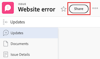

# 共享问题

在分配访问级别时，您的Adobe Workfront管理员会授予用户查看或编辑问题的访问权限。 有关授予问题访问权限的详细信息，请参阅[授予问题访问权限](../../administration-and-setup/add-users/configure-and-grant-access/grant-access-issues.md)。

除了授予用户的访问级别之外，您还可以授予他们查看、Contribute或管理您有权共享的特定问题的权限。 有关访问级别和权限的详细信息，请参阅[访问级别和权限如何协同工作](../../administration-and-setup/add-users/access-levels-and-object-permissions/how-access-levels-permissions-work-together.md)。

权限特定于Workfront中的一个项目，并定义您可以对该项目执行的操作。

## 访问要求

+++ 展开以查看本文中各项功能的访问要求。

要共享对象，必须具备以下条件：

<table style="table-layout:auto"> 
 <col> 
 <col> 
 <tbody> 
  <tr> 
   <td role="rowheader">Adobe Workfront计划</td> 
   <td> 
任何 
 </td> 
  </tr> 
  <tr> 
   <td role="rowheader">Adobe Workfront许可证</td> 
   <td> 
新增：标准
 
   或
   
当前：工作或更高

   </td> 
  </tr> 
  <tr> 
   <td role="rowheader">访问级别配置</td> 
   <td> 
查看对要共享对象的访问权限或更高版本
 </td> 
  </tr> 
  <tr> 
   <td role="rowheader">对象权限</td> 
   <td> 
查看要共享对象的权限或更高
</td> 
  </tr> 
 </tbody> 
</table>

有关详细信息，请参阅Workfront文档中的[访问要求](/help/quicksilver/administration-and-setup/add-users/access-levels-and-object-permissions/access-level-requirements-in-documentation.md)。

+++

## 关于共享问题的注意事项

除了下面的注意事项外，另请参阅[对象权限共享概述](../../workfront-basics/grant-and-request-access-to-objects/sharing-permissions-on-objects-overview.md)。

>[!NOTE]
>
>Workfront管理员可以为系统中的任何项目为所有用户添加或删除权限，而无需成为这些项目的所有者。

* 默认情况下，问题的创建者拥有其“管理”权限。
* 您可以单独共享问题，也可以一次共享多个问题。 共享问题与在Workfront中共享其他项目相同。 有关在Workfront中共享项目的详细信息，请参阅[共享对象](../../workfront-basics/grant-and-request-access-to-objects/share-an-object.md)。
* 您可以向问题授予以下权限： 

   * 查看
   * 参与
   * 管理

* 当您共享问题时，所有附加到问题的文档都会继承相同的权限。

  Workfront管理员可以指定文档是否应从用户访问级别更高的对象继承权限。 有关限制文档继承权限的详细信息，请参阅[创建或修改自定义访问级别](../../administration-and-setup/add-users/configure-and-grant-access/create-modify-access-levels.md)。

* 您可以从问题中删除继承的权限。 有关详细信息，请参阅[从对象中删除权限](../../workfront-basics/grant-and-request-access-to-objects/remove-permissions-from-objects.md)。

## 共享问题的方式

* 手动，与在Workfront中共享任何其他对象类似。
* 通过执行以下操作之一，自动执行：

   * 指定问题的任何父对象的权限：项目、项目群或项目组合。 问题会从其父对象继承权限。 有关查看对象的继承权限的信息，请参阅[查看对象的继承权限](../../workfront-basics/grant-and-request-access-to-objects/view-inherited-permissions-on-objects.md)。
   * 在用于创建问题所在项目的模板上将实体添加到项目共享。 有关从模板共享项目的信息，请参阅[共享模板](../../workfront-basics/grant-and-request-access-to-objects/share-a-template.md)。

   * 在编辑项目时，指定项目中所有问题的权限。 有关基于用户对项目的权限管理对项目上问题或请求的访问权限的信息，请参阅文章[编辑项目](../../manage-work/projects/manage-projects/edit-projects.md)中的[&#128279;](../../manage-work/projects/manage-projects/edit-projects.md#access)部分。

     >[!TIP]
     >
     >如果您没有指定在将用户分配给项目问题时希望他们拥有的问题权限，则默认情况下，他们将会获得与项目相同的权限。

   * 指定用户在创建请求队列时，对于在请求队列中提交的问题所接收的权限。 有关信息，请参阅[创建请求队列](../../manage-work/requests/create-and-manage-request-queues/create-request-queue.md)。

     >[!IMPORTANT]
     >
     >根据项目是否作为请求队列发布，授予的权限会有所不同：
     >
     >   
     >   
     >   * 当用户将请求提交到作为请求队列发布的项目时，主要联系人和输入者用户将被授予指定的权限。
     >   * 当用户将请求提交到未作为请求队列发布的项目时，主要联系人（如果与“输入者”用户不同）将被授予指定的权限，而“输入者”用户将获得该问题的管理权限。
     >   
     >

<!--

<h2>Automatically share an issue at the project level</h2>

(NOTE: this info duplicates in Edit projects - linked there instead (above).)&nbsp;

As the Project Owner, you can grant permissions automatically to users as the issues are added to a project.

<ol>
<li value="1">Go to the project whose issues you want to share automatically.</li>
<li value="2"> Click the More menu , then click <strong>Edit</strong>. </li>
<li value="3">In the <strong>Edit Project</strong> box that displays, click <strong>Access</strong>.</li>
<li value="4">In the <strong>When someone is assigned to an ISSUE</strong> field, select from the following permissions levels:
<ul>
<li><strong>View</strong></li>
<li><strong>Contribute</strong></li>
<li><strong>Manage</strong> Now, when someone is assigned to an issue on the selected project, they are granted the specified permissions to the issue.&nbsp;</li>
</ul></li>
<li value="5">(Optional) Select the <strong>Also grant ... access to the project</strong> field to also grant View, Contribute, or Manage permissions to the projects to the user assigned to the issue</li>
<li value="6">In the <strong>When someone submits a REQUEST ...</strong> field, select from the following permissions levels:
<ul>
<li><strong>View</strong></li>
<li><strong>Contribute</strong></li>
<li>
<strong>Manage</strong>
<note type="important">

Permissions are granted differently depending on whether or not the project is published as a request queue:

<ul>
<li>When a user submits a request to a project published as a request queue, the Primary Contact and Entered By users are granted the permission specified.</li>
<li>When a user submits a request to a project not published as a request queue, the Primary Contact (if different from Entered By user) is granted the permission specified, and the Entered By user is granted Manage permissions to the issue.</li>
</ul>
</note></li>
</ul></li>
<li value="7"> 
(Optional) Select the <strong>People from the same company will inherit the same permissions for all requests</strong> field.
 
People from the same company as the user submitting the request are granted the same permissions on the requests as the user.&nbsp;
 </li>
<li value="8">Click <strong>Save Changes</strong>.</li>
</ol>

-->

<!--

<h2>Automatically share an issue in request queues</h2>

(NOTE: drafted because it's duplicated from Create a Request Queue which is linked above)&nbsp;

As the Project Owner, you can grant permissions automatically to users as the issues are submitted to a request queue.

<ol>
<li value="1">Go to the project whose issues you want to share automatically.</li>
<li value="2">Click <strong>Edit Project</strong>.</li>
<li value="3">Click <strong>More</strong> then click <strong>Queue Setup</strong>. </li>
<li value="4"> 
On the <strong>Queue Details</strong> sub-tab, in the drop-down menu under <strong>When someone makes a request, automatically grant</strong>, select from the following permissions levels:

<ul>
<li><strong>View Access</strong> </li>
<li><strong>Contribute Access</strong> </li>
<li> 
<strong>Manage Access</strong> 
 </li>
</ul> 
Now, when someone submits a request to the selected project, they are granted the specified permissions to the request.
 </li>
<li value="5"> 
(Optional) Select the <strong>People from the same company will inherit the same permissions for all requests</strong>.
 
People from the same company as the user submitting the request are granted the same permissions on the requests as the user.&nbsp;
 </li>
<li value="6">Click <strong>Save</strong>.</li>
</ol>

-->

## 共享问题

1. 导航到要共享的问题。

1. 在问题名称的右侧，单击&#x200B;**共享**。 将打开&#x200B;**共享[问题名称]**&#x200B;对话框。

   

1. 在&#x200B;**将问题访问权限授予**&#x200B;字段中，开始键入要与其共享问题的用户、团队、角色、组或公司的名称，然后在该名称出现在下拉列表中时单击该名称。

   >[!TIP]
   >
   >您只能与活动用户、团队、角色或公司共享问题。

1. （可选）选择&#x200B;**具有访问权限**&#x200B;下拉列表并选择问题的访问级别：

   * **只有受邀人员才能访问：**&#x200B;只有受邀参与问题的用户才能访问它（默认）。
   * **系统中的每个人都可以查看**：系统中的所有用户都可以查看问题，而无需邀请。

1. 单击用户名右侧的下拉列表，然后选择他们对于此问题的权限级别：

   * **查看**：用户可以查看和共享问题。
   * **Contribute**：用户可以进行更新、记录信息、进行细微编辑和共享问题（还包括所有查看权限）。
   * **管理**：用户具有此问题的完全访问权限，但没有管理权限，这些权限在访问级别被授予（还包括所有“查看”和“贡献”权限）。

1. （可选）单击您已授予的权限级别旁边的高级选项图标，以配置有关问题的特定权限。

   

1. （可选）要使用链接快速共享问题，请单击&#x200B;**复制链接**，然后将其转发给收件人。

1. 单击&#x200B;**保存**。

## 批量共享问题

1. 导航到包含要共享的问题项目。

1. 在项目页面的&#x200B;**问题**&#x200B;选项卡中，选中要共享的每个问题左侧的框，然后单击页面顶部的&#x200B;**共享**&#x200B;图标。 这将打开共享模式窗口。

   

1. 在&#x200B;**将问题访问权限授予**&#x200B;字段中，开始键入要与其共享问题的用户、团队、角色、组或公司的名称，然后在该名称出现在下拉列表中时单击该名称。

   >[!TIP]
   >
   >您只能与活动用户、团队、角色或公司共享问题。

1. （可选）选择&#x200B;**具有访问权限**&#x200B;下拉列表并选择问题的访问级别：

   * **只有受邀人员才能访问：**&#x200B;只有受邀参与问题的用户才能访问它们（默认）。
   * **系统中的每个人都可以查看**：系统中的所有用户都可以查看问题，而无需邀请。

1. 单击用户名右侧的下拉列表，然后选择他们对问题的权限级别：

   * **查看**：用户可以查看和共享问题。
   * **Contribute**：用户可以进行更新、记录信息、进行细微编辑和共享问题（还包括所有查看权限）。
   * **管理**：用户拥有对问题的完全访问权限，但没有管理权限，这些权限是在访问级别授予的（还包括所有“查看”和“贡献”权限）。

1. （可选）单击您已授予的权限级别旁边的高级选项图标以配置有关问题的特定权限。

   

1. 单击&#x200B;**保存**。

## 问题权限

下表显示在允许用户查看、贡献或管理问题时您可以授予用户的权限：

<table style="table-layout:auto"> 
 <col> 
 <col> 
 <col> 
 <col> 
 <tbody> 
  <tr> 
   <td><strong>操作</strong> </td> 
   <td><strong>管理</strong> </td> 
   <td><strong>参与</strong> </td> 
   <td><strong>视图</strong> </td> 
  </tr> 
  <tr> 
   <td> 
添加问题
 </td> 
   <td>✓</td> 
   <td> </td> 
   <td> </td> 
  </tr> 
  <tr> 
   <td>删除 </td> 
   <td>✓</td> 
   <td> </td> 
   <td> </td> 
  </tr> 
  <tr> 
   <td>附上自定义表单</td> 
   <td>✓</td> 
   <td> </td> 
   <td> </td> 
  </tr> 
  <tr> 
   <td>编辑自定义字段</td> 
   <td>✓</td> 
   <td>✓</td> 
   <td> </td> 
  </tr> 
  <tr> 
   <td>批准问题</td> 
   <td>✓</td> 
   <td>✓</td> 
   <td>✓</td> 
  </tr> 
  <tr> 
   <td>添加审批流程</td> 
   <td>✓</td> 
   <td> </td> 
   <td> </td> 
  </tr> 
  <tr> 
   <td>添加文档</td> 
   <td>✓</td> 
   <td>✓</td> 
   <td>✓</td> 
  </tr> 
  <tr> 
   <td>复制问题*</td> 
   <td>✓</td> 
   <td>✓</td> 
   <td>✓</td> 
  </tr> 
  <tr> 
   <td>移动问题</td> 
   <td>✓</td> 
   <td> </td> 
   <td> </td> 
  </tr> 
  <tr> 
   <td>记录小时数</td> 
   <td>✓</td> 
   <td>✓</td> 
   <td> </td> 
  </tr> 
  <tr> 
   <td>转换为项目*</td> 
   <td>✓</td> 
   <td> </td> 
   <td> </td> 
  </tr> 
  <tr> 
   <td>接受分配</td> 
   <td>✓</td> 
   <td>✓</td> 
   <td> </td> 
  </tr> 
  <tr> 
   <td>更新/评论</td> 
   <td>✓</td> 
   <td>✓</td> 
   <td>✓</td> 
  </tr> 
  <tr> 
   <td>修改计划日期</td> 
   <td>✓</td> 
   <td> </td> 
   <td> </td> 
  </tr> 
  <tr> 
   <td>制定工作</td> 
   <td>✓</td> 
   <td>✓</td> 
   <td> </td> 
  </tr> 
  <tr> 
   <td>共享</td> 
   <td>✓</td> 
   <td>✓</td> 
   <td>✓</td> 
  </tr> 
  <tr> 
   <td>在系统范围内共享</td> 
   <td> </td> 
   <td> </td> 
   <td>✓</td> 
  </tr> 
 </tbody> 
</table>

&#42;由项目的访问级别和权限控制。
