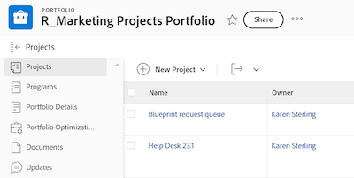

# 共享对象

<!--Audited: 01/2024-->

在分配访问级别时，您的Adobe Workfront管理员会授予用户查看或编辑对象的权限。 有关授予对象访问权限的详细信息，请参阅[创建或修改自定义访问级别](../../administration-and-setup/add-users/configure-and-grant-access/create-modify-access-levels.md)。

除了授予用户的访问级别之外，您还可以授予他们查看或编辑您创建或有权共享的特定对象的权限。 有关访问级别和权限的详细信息，请参阅[访问级别和权限如何协同工作](../../administration-and-setup/add-users/access-levels-and-object-permissions/how-access-levels-permissions-work-together.md)。

权限特定于Workfront中的一个项目，并定义您可以对该项目执行的操作。

有关共享对象权限的信息，请参阅[共享对象权限概述](../../workfront-basics/grant-and-request-access-to-objects/sharing-permissions-on-objects-overview.md)。

>[!NOTE]
>
>Workfront管理员可以为系统中的任何项目为所有用户添加或删除权限，而无需成为这些项目的所有者。

本文介绍了如何共享以下对象：

* 项目、任务、问题
* Portfolio、计划
* 文档

有关如何在Workfront中共享所有其他对象的信息，另请参阅以下文章：

* 有关模板，请参阅[共享项目模板](../../manage-work/projects/create-and-manage-templates/share-project-template.md)。
* 有关校样，请参阅[在Workfront Proof中共享校样](../../workfront-proof/wp-work-proofsfiles/share-proofs-and-files/share-proof.md)。
* 有关报告、功能板和日历，请参阅以下文章：

   * [在Adobe Workfront中共享报表](../../reports-and-dashboards/reports/creating-and-managing-reports/share-report.md)
   * [共享功能板](../../reports-and-dashboards/dashboards/creating-and-managing-dashboards/share-dashboard.md)
   * [共享日历报告](../../reports-and-dashboards/reports/calendars/share-a-calendar-report.md)

  此外，有关共享报告、功能板和日历的一般信息，请参阅[共享报告、功能板和日历](../../workfront-basics/grant-and-request-access-to-objects/permissions-reports-dashboards-calendars.md)。

* 有关筛选器、视图和分组，请参阅[共享筛选器、视图或分组](../../reports-and-dashboards/reports/reporting-elements/share-filter-view-grouping.md)。
* 有关文档文件夹，请参阅[共享文档文件夹](../../workfront-basics/grant-and-request-access-to-objects/share-a-document-folder.md)。
* 有关计划，请参阅[在Scenario Planner](../../scenario-planner/share-a-plan.md)中共享计划。

  Workfront Scenario Planner可能需要额外的许可证。

* 有关目标，请参阅[在Workfront目标中共享目标](../../workfront-goals/workfront-goals-settings/share-a-goal.md)。

  Workfront目标可能需要额外的许可证。

* 有关Workfront Planning对象，请参阅以下文章：

   * [共享视图](/help/quicksilver/planning/access/share-views.md)
   * [共享工作区](/help/quicksilver/planning/access/share-workspaces.md)

  访问Workfront Planning需要额外的许可证。

## 访问要求

+++ 展开以查看本文中各项功能的访问要求。

要共享对象，必须具备以下条件：

<table style="table-layout:auto"> 
 <col> 
 <col> 
 <tbody> 
  <tr> 
   <td role="rowheader">Adobe Workfront计划</td> 
   <td> 
任何 
 </td> 
  </tr> 
  <tr> 
   <td role="rowheader">Adobe Workfront许可证*</td> 
   <td> 
新许可证： Standard
 
   或
   
当前许可证：工作或更高

   </td> 
  </tr> 
  <tr> 
   <td role="rowheader">访问级别配置</td> 
   <td> 
查看对要共享对象的访问权限或更高版本
 </td> 
  </tr> 
  <tr> 
   <td role="rowheader">对象权限</td> 
   <td> 
查看要共享对象的权限或更高
</td> 
  </tr> 
 </tbody> 
</table>

*有关详细信息，请参阅Workfront文档中的[访问要求](/help/quicksilver/administration-and-setup/add-users/access-levels-and-object-permissions/access-level-requirements-in-documentation.md)。

+++

## 从其页面共享项目、任务或问题

1. 转到要共享的项目、任务或问题页面。

   有关哪些对象可以共享的信息，请参阅[对象权限共享概述](../../workfront-basics/grant-and-request-access-to-objects/sharing-permissions-on-objects-overview.md)。

1. 单击对象名称旁边的&#x200B;**共享**&#x200B;按钮。

   

1. 在&#x200B;**授予&lt;对象名称>访问**&#x200B;框中，开始键入要与其共享对象的用户、团队、角色、组或公司的名称，然后在名称出现在下拉列表中时单击该名称。

   {width="350"}

   >[!TIP]
   >
   >您只能与活动用户、团队、角色或公司共享对象。

   >[!TIP]
   >
   >如果多个图元具有类似的名称，则它们都列在其类型下。 图元名称按字母顺序显示。 但是，实体类型的显示顺序是随机的。
   >

1. （可选）对要授予对象访问权限的每个用户、团队、角色或组重复步骤3。

1. 通过单击用户名称右侧的下拉菜单，然后选择要授予的权限级别，指定您在步骤3中添加的每个用户、团队、角色、组或公司的权限。

   

   要从对象中删除权限，请参阅[从对象中删除权限](/help/quicksilver/workfront-basics/grant-and-request-access-to-objects/remove-permissions-from-objects.md)。

   可以使用以下选项：

   * **查看：**&#x200B;用户可以查看和共享该项目。
   * **Contribute**：用户可以进行更新、记录信息、进行细微编辑和共享，以及所有查看权限。
   * **管理：**&#x200B;用户拥有对象的完全访问权限，但没有管理权限（这些权限在访问级别被授予）。 此外，他们还具有所有“查看”和“Contribute”权限。

     >[!NOTE]
     >
     >Workfront管理员或对象创建者可以从这些实体中删除权限。

1. （可选）单击您授予的权限级别旁边的高级选项图标，以配置对象的特定权限。

   

   “查看”、“管理”和“Contribute”都具有不同的高级选项，具体取决于所选对象。

   有关权限级别的详细信息，请参阅[对象权限共享概述](../../workfront-basics/grant-and-request-access-to-objects/sharing-permissions-on-objects-overview.md)。

1. （可选）要使此对象对系统中的所有用户都可用，请单击&#x200B;**谁具有访问权限**&#x200B;下的下拉菜单，然后在下拉菜单中，单击&#x200B;**系统中的每个人都可以查看**。

   

   所有用户都可以根据您设置的权限查看对象。

1. （可选且有条件）共享项目时，单击&#x200B;**齿轮**&#x200B;图标，然后选中&#x200B;**设置为我的项目访问模板**&#x200B;旁边的框以将权限设置为模板。

   为一个项目定义权限后，下次从头开始创建项目时，将自动应用这些相同的权限。

   >[!NOTE]
   >
   >项目访问模板将覆盖由访问级别的Workfront管理员授予您的共享默认值。\
   >有关在访问级别中指定项目共享默认值的详细信息，请参阅[授予项目访问权限](../../administration-and-setup/add-users/configure-and-grant-access/grant-access-projects.md)

   <!--
   >this note also appears in Understanding Project Permissions-->

   您可以指定共享模板时将从模板创建的项目的权限。 有关详细信息，请参阅[共享项目模板](../../manage-work/projects/create-and-manage-templates/share-project-template.md)。

1. （视情况而定）要与外部用户共享对象，请单击&#x200B;**复制链接**，然后将该链接分发给外部用户。

   任何具有链接的用户都可以查看该对象。

   >[!CAUTION]
   >
   >建议在与外部用户共享包含机密信息的对象时务必谨慎。 这样，他们便可以查看信息，而无需成为Workfront用户或您组织的一部分。

1. 单击&#x200B;**保存**。

## 从其页面共享文档、项目组合或项目群

1. 转到要共享的文档、项目组合或项目群页面。

   有关哪些对象可以共享的信息，请参阅[对象权限共享概述](../../workfront-basics/grant-and-request-access-to-objects/sharing-permissions-on-objects-overview.md)。

1. 对于投资组合和计划：

   单击对象名称旁边的&#x200B;**共享**&#x200B;按钮。

   

   或

   对于文档：

   单击对象名称旁边的&#x200B;**更多**&#x200B;图标，然后单击&#x200B;**共享**。

   

1. 在&#x200B;**授予&lt;对象名称>对**&#x200B;的访问权限字段中，开始键入要与其共享对象的用户、团队、角色、组或公司的名称，然后在该名称出现在下拉列表中时单击该名称。

   

   >[!TIP]
   >
   >* 如果多个图元具有类似的名称，则它们都列在其类型下。 图元名称按字母顺序显示。 但是，实体类型的显示顺序是随机的。
   >
   >* 您只能与活动用户、团队、角色或公司共享对象。

1. （可选）对要授予对象访问权限的每个用户、团队、角色或组重复步骤3。

1. 通过单击下拉菜单，然后选择要授予的权限级别，指定您在步骤3中添加的每个用户、团队、角色、组或公司的权限。

   要从对象中删除权限，请参阅[从对象中删除权限](/help/quicksilver/workfront-basics/grant-and-request-access-to-objects/remove-permissions-from-objects.md)。

   可以使用以下选项：

   * **查看：**&#x200B;用户可以查看和共享该项目。
   * **管理：**&#x200B;用户拥有对象的完全访问权限，但没有管理权限（这些权限在访问级别被授予）。 此外，他们还具有所有“查看”和“Contribute”权限。

     >[!NOTE]
     >
     >Workfront管理员或对象创建者可以从这些实体中删除权限。

     

1. （可选）单击&#x200B;**高级设置**&#x200B;配置对象的特定权限。

   “查看”和“管理”权限具有不同的高级选项，具体取决于所选对象。\
   有关权限级别的详细信息，请参阅[对象权限共享概述](../../workfront-basics/grant-and-request-access-to-objects/sharing-permissions-on-objects-overview.md)。

1. （可选）要使此对象对系统中的所有用户都可用，请单击&#x200B;**齿轮**&#x200B;图标，然后在下拉菜单中单击&#x200B;**使此对象在系统范围内可见**。

   所有用户都可以根据您设置的权限查看对象。

1. （可选）要使对象公开，请单击&#x200B;**将此对象公开给外部用户**。

   >[!TIP]
   >
   >此选项并非对所有对象都可用。

   {width="350"}

1. （视情况而定）如果将对象公开给外部用户，请单击&#x200B;**复制链接**，然后将该链接分发给外部用户。

   任何具有链接的用户都可以查看该对象。

   >[!CAUTION]
   >
   >建议在与外部用户共享包含机密信息的对象时务必谨慎。 这样，他们便可以查看信息，而无需成为Workfront用户或您组织的一部分。

1. 单击&#x200B;**保存**。

## 共享列表中的单个或批量对象

1. 转到包含要共享对象的列表。

   有关哪些对象可以共享的信息，请参阅[对象权限共享概述](../../workfront-basics/grant-and-request-access-to-objects/sharing-permissions-on-objects-overview.md)。

1. 单击要共享的对象旁边的复选框，然后单击页面顶部的&#x200B;**共享图标** 。

   将打开&#x200B;**&lt; Object > Access**&#x200B;框。

   {width="350"}

1. 在&#x200B;**编辑&lt;对象名称>访问**&#x200B;框中，开始键入要与其共享对象的用户、团队、角色、组或公司的名称，然后当名称出现在下拉列表中时单击该名称。

   {width="350"}

   >[!TIP]
   >
   >* 您只能与活动用户、团队、角色或公司共享对象。
   >
   >
   >* 如果多个图元具有类似的名称，则它们都列在其类型下。 图元名称按字母顺序显示。 但是，实体类型的显示顺序是随机的。
   >

1. （可选）对要授予对象访问权限的每个用户、团队、角色或组重复步骤3。

1. 通过单击用户名称右侧的下拉菜单，然后选择要授予的权限级别，指定您在步骤3中添加的每个用户、团队、角色、组或公司的权限。

   要从对象中删除权限，请参阅[从对象中删除权限](/help/quicksilver/workfront-basics/grant-and-request-access-to-objects/remove-permissions-from-objects.md)。

   

   可以使用以下选项：

   * **查看：**&#x200B;用户可以查看和共享该项目。
   * **Contribute**：用户可以进行更新、记录信息、进行细微编辑和共享，以及所有查看权限。

     >[!TIP]
     >
     >您只能将Contribute权限授予以下对象：
     >
     >* 项目
     >* 任务
     >* 问题
     >

   * **管理：**&#x200B;用户拥有对象的完全访问权限，但没有管理权限（这些权限在访问级别被授予）。 此外，他们还具有所有“查看”和“Contribute”权限。

     >[!NOTE]
     >
     >Workfront管理员或对象创建者可以从这些实体中删除权限。

1. （可选）单击&#x200B;**高级设置**&#x200B;配置对象的特定权限。

   “查看”、“管理”和“Contribute”都具有不同的高级选项，具体取决于所选对象。\
   有关权限级别的详细信息，请参阅[对象权限共享概述](../../workfront-basics/grant-and-request-access-to-objects/sharing-permissions-on-objects-overview.md)。

   

1. （可选）要使此对象对系统中的所有用户都可用，请单击&#x200B;**齿轮**&#x200B;图标，然后在下拉菜单中单击&#x200B;**使此对象在系统范围内可见**。

   所有用户都可以根据您设置的权限查看对象。

1. （可选且有条件）共享项目时，单击&#x200B;**齿轮**&#x200B;图标，然后在下拉菜单中，单击&#x200B;**设置为我的项目访问模板**&#x200B;以将权限设置为模板。

   为一个项目定义权限后，下次从头开始创建项目时，将自动应用这些相同的权限。

   >[!NOTE]
   >
   >项目访问模板将覆盖由访问级别的Workfront管理员授予您的共享默认值。\
   >有关在访问级别中指定项目共享默认值的详细信息，请参阅[授予项目访问权限](../../administration-and-setup/add-users/configure-and-grant-access/grant-access-projects.md)

   <!--
   >this note also appears in Understanding Project Permissions-->

   您可以指定共享模板时将从模板创建的项目的权限。 有关详细信息，请参阅[共享项目模板](../../manage-work/projects/create-and-manage-templates/share-project-template.md)。

1. （可选）要使对象公开，请单击&#x200B;**将此对象公开给外部用户**。

   >[!TIP]
   >
   >此选项并非对所有对象都可用。

   {width="350"}

1. （视情况而定）如果将对象公开给外部用户，请单击&#x200B;**复制链接**，然后将该链接分发给外部用户。

   任何具有链接的用户都可以查看该对象。

   >[!CAUTION]
   >
   >建议在与外部用户共享包含机密信息的对象时务必谨慎。 这样，他们便可以查看信息，而无需成为Workfront用户或您组织的一部分。

1. 单击&#x200B;**保存**。
