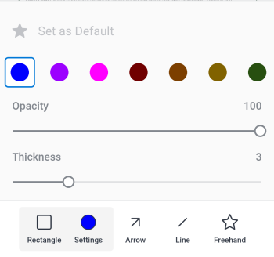

# 对中的校样进行注释 [!DNL Android]

您可以审阅并解析校样上的现有注释，并向校样文档中添加新的注释和注释。

您对校样的评论权限与 [!DNL Adobe Workfront]. 有关校对功能的信息，请参阅 [中的校样权限配置文件 [!DNL Workfront Proof]](../../../workfront-proof/wp-acct-admin/account-settings/proof-perm-profiles-in-wp.md).

>[!NOTE]
>
>如果校样所有者已锁定校样，则无法对其进行评论。 有关更多信息，请参阅 [锁定和解锁校样](../../../workfront-basics/mobile-apps/using-the-workfront-mobile-app/work-with-proofs-in-mobile-app.md#lock) 在文章中 [在 [!DNL Adobe Workfront] 移动设备应用程序](../../../workfront-basics/mobile-apps/using-the-workfront-mobile-app/work-with-proofs-in-mobile-app.md).

## 查看校样中的现有注释

您可以审阅对校样文档所做的注释。 注释通常具有关联的绘图来标注注释所引用文档的区域。 绘图可包括箭头、线、矩形、加亮和手绘图。

1. 打开文档校样。 有关信息，请参阅 [在 [!DNL Adobe Workfront] 移动设备应用程序](../../../workfront-basics/mobile-apps/using-the-workfront-mobile-app/work-with-proofs-in-mobile-app.md).
1. 在文档页面上选择注释图标  打开注释以及任何关联的绘图和附件。

   如果评论有多个回复，则可以选择 **[!UICONTROL 查看回复]** 显示所有回复，或上下轻扫评论表以显示更多内容。

1. 要查看注释上的附件，请选择注释缩略图。 按照提示将附件文件下载到设备。
1. 要回复评论，请在评论下方的文本框中键入您的响应，然后选择 **[!UICONTROL 发送]** 图标 .

### 使用注释列表

1. 要按页码顺序查看所有注释的列表，请选择注释图标  在右上方。

   未读评论数显示在评论图标上。  列表中的未读评论用蓝色圆点标记。 带有附件的评论具有纸夹图标 ![[!UICONTROL 附件] 图标](assets/mobile-paper-clip-icon.png).

1. 在列表中，选择单个注释以查看文档页面上的注释及其关联的绘图。
1. 选择X以关闭注释列表并返回校样。

### 在选择视图中对注释执行操作

>[!NOTE]
>
>选择视图中的选项 **[!UICONTROL 更多]** 菜单可能会因 [!DNL Workfront] 管理员或 [!DNL Workfront Proof] 管理员已设置。

1. 要查看更多注释选项，请选择 ![[!UICONTROL 评论列表] 图标](assets/mobile-listofcommentsicon-30x27.png) 在注释列表的右上角。

   每个评论旁会显示一个复选框。

   >[!NOTE]
   >
   >在选择视图中，您无法访问文档中的注释。 选择左上角的箭头以返回评论列表。

1. 要选择单个注释，请点按复选框。

   要选择所有注释，请选择 **[!UICONTROL 更多]** 菜单  选择 **[!UICONTROL 全选]**.

1. 要解析所选注释，请选择 ![[!UICONTROL 解析注释] 图标](assets/mobile-resolvecomment-icon-30x30.png) 在右上方。

   您一次只能解析一个评论。 注释带有绿色图标，表示已解决该问题。

   原始评论仍保留在文档上。 评论决议是对原评论的回复：&quot;[!UICONTROL 此线程由 [name].]&quot;

   您可以通过选择已解析的注释并选择 **[!UICONTROL 撤消]** 图标。

1. 要将所选注释标记为已读，请选择 **[!UICONTROL 标记为已读]** 图标 .

   仅当您选择了未读评论时，此选项才可用。

1. 要删除所选注释，请选择 **[!UICONTROL 更多]** 菜单  选择 **[!UICONTROL 删除]**. 然后，选择 **[!UICONTROL 删除]** 在确认消息中，永久删除评论。
1. 选择左上角的箭头以退出选择视图并返回到注释列表。

## 对校样的评论

您可以将校样注释与文档上的特定区域相关联。 使用绘图工具选取要注释的区域。

1. 打开文档校样。 有关信息，请参阅 [在 [!DNL Adobe Workfront] 移动设备应用程序](../../../workfront-basics/mobile-apps/using-the-workfront-mobile-app/work-with-proofs-in-mobile-app.md).
1. 从校样屏幕底部的工具栏中选择绘图工具。

   

   如果看不到所需的工具，请将工具栏滚动到右侧。

1. 选择 **[!UICONTROL 设置]** 工具名称旁边，用于定义颜色、不透明度和厚度。 选择星形图标，使这些选项成为工具的默认设置。

   

1. 在校样文档上绘制形状。 选择 **[!UICONTROL 撤消]** 图标  以撤消绘图。
1. （视情况而定）选择形状并选择 **[!UICONTROL 设置]** 编辑形状设置，或 **[!UICONTROL 删除]** 删除形状。

   

1. 选择 **[!UICONTROL 添加注释]**.
1. 在文本框中键入注释。
1. 要在评论中标记联系人，请键入@符号或选择 ![[!UICONTROL 标记联系人]](assets/mobile-tag-user-icon.png) 要添加@符号，请开始键入要包含的联系人的名称，然后在该名称出现在下拉列表中时单击该名称。

   将评论添加到校样后，联系人将收到电子邮件通知。

1. 要向注释添加附件，请选择 ![[!UICONTROL 附件] 图标](assets/mobile-paper-clip-icon.png). 选择 **[!UICONTROL 选择文档]** 或 **[!UICONTROL 拍照]**，并按照提示将文件或照片附加到注释中。

   单击缩略图图像上的X可删除附件。

1. 选择 **[!UICONTROL 发送]** 图标  添加注释和绘图到校样中。
