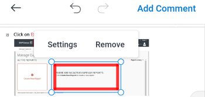

# 在[!DNL Android]中评论验证

您可以查看并解析验证上的现有注释，并向验证文档添加新注释和批注。

您对校样的评论访问权限与[!DNL Adobe Workfront]中的相同。 有关校对功能的信息，请参阅 [!DNL Workfront Proof][&#128279;](../../../workfront-proof/wp-acct-admin/account-settings/proof-perm-profiles-in-wp.md)中的校对权限配置文件。

>[!NOTE]
>
>如果验证所有者锁定了验证，则您无法对其进行评论。 有关详细信息，请参阅[查看并做出 [!DNL Adobe Workfront] 移动设备应用程序](../../../workfront-basics/mobile-apps/using-the-workfront-mobile-app/work-with-proofs-in-mobile-app.md)中的验证决策一文中的[锁定和解锁验证](../../../workfront-basics/mobile-apps/using-the-workfront-mobile-app/work-with-proofs-in-mobile-app.md#lock)。

## 查看验证中的现有评论

您可以查看对验证文档所做的评论。 注释通常具有关联的绘图，以调出注释所引用的文档区域。 绘图可以包括箭头、直线、矩形、加亮和手绘绘图。

1. 打开文档校对。 有关信息，请参阅[在 [!DNL Adobe Workfront] 移动设备应用程序](../../../workfront-basics/mobile-apps/using-the-workfront-mobile-app/work-with-proofs-in-mobile-app.md)中审阅和决定验证。
1. 选择文档页面上的注释图标以打开注释以及任何关联的绘图和附件。

   如果评论有多个回复，您可以选择&#x200B;**[!UICONTROL 查看回复]**&#x200B;以显示所有回复，或者上下滑动评论工作表以显示更多内容。

1. 要查看注释上的附件，请选择注释缩略图。 按照提示将附件文件下载到设备。
1. 若要回复评论，请在评论下面的文本框中键入您的回复，然后选择&#x200B;**[!UICONTROL 发送]**&#x200B;图标。

### 使用评论列表

1. 若要按页码顺序查看所有评论的列表，请选择右上角的评论图标。

   未读注释的数量在注释图标上指示。 列表中未读评论用蓝色圆点标记。 带有附件的注释具有回形针图标![[!UICONTROL 附件]图标](assets/mobile-paper-clip-icon.png)。

1. 在列表中，选择单个注释以在文档页面上查看注释及其关联的绘图。
1. 选择X以关闭评论列表并返回验证。

### 对选择视图中的注释执行操作

>[!NOTE]
>
>您在选择视图&#x200B;**[!UICONTROL 更多]**&#x200B;菜单中的选项可能不同，具体取决于您的[!DNL Workfront]管理员或[!DNL Workfront Proof]管理员设置的内容。

1. 要查看更多评论选项，请选择评论列表右上角的![[!UICONTROL 评论列表]图标](assets/mobile-listofcommentsicon-30x27.png)。

   每个注释旁边都会出现一个复选框。

   >[!NOTE]
   >
   >在选择视图中，无法访问文档中的注释。 选择左上方的箭头以返回注释列表。

1. 要选择单个注释，请点按复选框。

   要选择所有评论，请选择右上角的&#x200B;**[!UICONTROL 更多]**&#x200B;菜单，然后选择&#x200B;**[!UICONTROL 全选]**。

1. 若要解析所选评论，请选择右上角的![[!UICONTROL 解析评论]图标](assets/mobile-resolvecomment-icon-30x30.png)。

   一次只能解析一个注释。 该评论标有一个绿色图标来显示它已被解析。

   原始注释仍保留在文档上。 评论解析显示为对原始评论的回复：“[!UICONTROL 此线程由[名称].]解析”

   您可以通过选择已解析的注释并选择右上角的&#x200B;**[!UICONTROL 撤消]**&#x200B;图标来撤消分辨率。

1. 要将所选评论标记为已读，请选择&#x200B;**[!UICONTROL 标记为已读]**&#x200B;图标。

   仅当选择了未读注释时，此选项才可用。

1. 要删除所选评论，请选择右上角的&#x200B;**[!UICONTROL 更多]**&#x200B;菜单，然后选择&#x200B;**[!UICONTROL 删除]**。 然后，选择确认消息上的&#x200B;**[!UICONTROL 删除]**&#x200B;以永久删除评论。
1. 选择左上方的箭头可退出选择视图并返回到注释列表。

## 对验证进行评论

您可以将校样注释关联到文档上的特定区域。 使用绘图工具选取要注释的区域。

1. 打开文档校对。 有关信息，请参阅[在 [!DNL Adobe Workfront] 移动设备应用程序](../../../workfront-basics/mobile-apps/using-the-workfront-mobile-app/work-with-proofs-in-mobile-app.md)中审阅和决定验证。
1. 从校样屏幕底部的工具栏中选择一个绘图工具。

   

   如果您看不到所需的工具，请将工具栏滚动到右侧。

1. 选择工具名称旁边的&#x200B;**[!UICONTROL 设置]**&#x200B;以定义颜色、不透明度和粗细。 选择星形图标以使这些选项成为工具的默认设置。

   

1. 在校样文档上Draw形状。 选择&#x200B;**[!UICONTROL 撤消]**&#x200B;图标以撤消绘图。
1. （视情况而定）选择形状并选择&#x200B;**[!UICONTROL 设置]**&#x200B;以编辑形状设置，或选择&#x200B;**[!UICONTROL 删除]**&#x200B;以删除形状。

   

1. 选择&#x200B;**[!UICONTROL 添加评论]**。
1. 在文本框中键入注释。
1. 若要在评论上标记联系人，请键入@符号或选择![[!UICONTROL 标记联系人]](assets/mobile-tag-user-icon.png)以添加@符号，开始键入要包含的联系人的名称，然后在名称出现在下拉列表中时单击该名称。

   将评论添加到验证时，联系人将收到电子邮件通知。

1. 若要向评论添加附件，请选择![[!UICONTROL 附件]图标](assets/mobile-paper-clip-icon.png)。 选择&#x200B;**[!UICONTROL 选择文档]**&#x200B;或&#x200B;**[!UICONTROL 拍摄照片]**，然后按照提示将文件或照片附加到评论。

   单击缩略图图像上的X可删除附件。

1. 选择&#x200B;**[!UICONTROL 发送]**&#x200B;图标以将评论和绘图添加到验证中。
