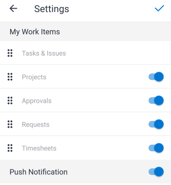

# 移动应用程序中的[!UICONTROL 我的工作]分区

[!UICONTROL 主页]区域的[!UICONTROL 我的工作]部分显示您的任务、问题、项目、审批、请求和时间表。

>[!NOTE]
>
>移动设备应用程序中的[!UICONTROL 我的工作]与桌面版[!UICONTROL Adobe Workfront]中的[!UICONTROL 我的工作]不同。

## 自定义[!UICONTROL 我的工作]部分

您可以选择在[!UICONTROL 我的工作]中显示哪些菜单项，并更改项顺序。

1. 在浮动菜单中，点按照片或缩写以访问您的个人资料。
1. 滚动到&#x200B;**[!UICONTROL 配置]**&#x200B;部分并点按&#x200B;**[!UICONTROL 设置]**。
1. 在&#x200B;**[!UICONTROL 设置]**&#x200B;页面上，选择菜单项并将其拖动到[!UICONTROL 主页]区域的正确顺序。
1. 点按蓝色切换图标可隐藏您不希望显示的任何菜单项。 点按灰色切换图标以再次显示项目。

   >[!NOTE]
   >
   >[!UICONTROL 任务和问题]菜单项始终显示，您无法隐藏它。

   
