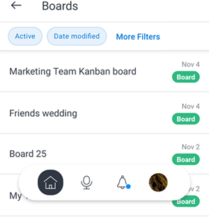
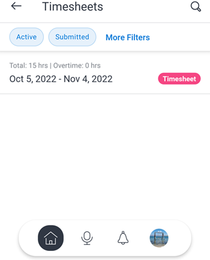

# [!DNL Adobe Workfront]的[!DNL iOS]

[!DNL Adobe Workfront]应用允许您在任何[!DNL iOS]设备上访问您的工作。 您可以在运行iOS 10或更高版本的手机和平板电脑上安装并使用[!DNL Workfront]移动应用程序。 专用的[!DNL Workfront]移动应用可用于[!DNL iPhone]和[!DNL iPad]。

有关登录到移动设备应用程序的信息，请参阅[登录到[!UICONTROL 一文中的]登录到](../../../workfront-basics/manage-your-account-and-profile/managing-your-workfront-account/log-in-to-workfront.md#log)Workfront[移动设备应用程序 [!DNL Adobe Workfront]](../../../workfront-basics/manage-your-account-and-profile/managing-your-workfront-account/log-in-to-workfront.md)部分。

## [!UICONTROL 主页]

[!UICONTROL 主页]区域允许您直接处理分配给您的任务、问题和批准。 从应用程序的[!UICONTROL 主页]区域，您可以：

<table style="table-layout:auto"> 
 <col> 
 <col> 
 <tbody> 
  <tr> 
   <td> 
    <ul> 
     <li>开始处理任务和问题</li> 
     <li>将任务和问题标记为[!UICONTROL 完成]</li> 
     <li>重新分配任务和问题</li> 
     <li>更改[!UICONTROL 提交日期]</li> 
    </ul> </td> 
   <td> 
    <ul> 
     <li>更新任务和问题状态</li> 
     <li>在更新区域发布</li> 
     <li>查看文档</li> 
     <li>附加照片</li> 
     <li> 
创建请求或快速任务
 
注：在主页中创建的快速任务属于个人任务，除非您选择分配项目。
 </li> 
    </ul> </td> 
  </tr> 
 </tbody> 
</table>

有关详细信息，请参阅移动设备应用程序[[!UICONTROL 中的]主页](../../../workfront-basics/mobile-apps/using-the-workfront-mobile-app/home-area-widgets-mobile.md)区域小组件[[!UICONTROL 和]我的工作](../../../workfront-basics/mobile-apps/using-the-workfront-mobile-app/my-work-section-mobile.md)部分。

## [!UICONTROL 展示板]

[!UICONTROL 讨论区]区域允许您访问您的[!DNL Workfront]讨论区。

有关详细信息，请参阅移动设备[[!DNL Adobe Workfront] [!UICONTROL 的]讨论区](/help/quicksilver/workfront-basics/mobile-apps/using-the-workfront-mobile-app/mobile-boards.md)。

## [!UICONTROL 项目]

[!UICONTROL 项目]区域允许您与您拥有的[!UICONTROL 项目]以及您参与的项目进行交互和管理。 在应用程序的项目区域中，您可以：

<table style="table-layout:auto"> 
 <col> 
 <col> 
 <tbody> 
  <tr> 
   <td> 
    <ul> 
     <li>更新项目状态</li> 
     <li>查看重要项目详细信息</li> 
     <li>在[!UICONTROL 更新]区域发布</li> 
     <li>将任务、问题和请求转换为项目</li> 
    </ul> </td> 
   <td> 
    <ul> 
     <li>与项目任务和问题交互</li> 
     <li>查看文档</li> 
     <li>附加照片</li> 
     <li> 
创建快速任务
 
注意：在项目中创建的任务会自动分配到您所在的项目。 
 </li> 
    </ul> </td> 
  </tr> 
 </tbody> 
</table>

## 审批

[!UICONTROL 审批]区域允许您查看和审批分配给您或委托给您的[!UICONTROL 审批]。 从审批区域，您可以审批：

<table style="table-layout:auto">
 <col>
 <col>
 <tbody>
  <tr>
   <td>
    <ul>
     <li>工作（任务和问题）</li>
     <li>文档</li>
     <li>校样 </li>
    </ul> </td>
   <td>
    <ul>
     <li>时间表</li>
     <li>访问请求</li>
    </ul> </td>
  </tr>
 </tbody>
</table>

有关审批的详细信息，请参阅[移动设备应用程序 [!DNL Adobe Workfront] 中的](../../../workfront-basics/mobile-apps/using-the-workfront-mobile-app/approvals-in-mobile-app.md)审批。

有关审阅和批准校样的信息，请参阅[在 [!DNL Adobe Workfront] 移动设备应用程序](../../../workfront-basics/mobile-apps/using-the-workfront-mobile-app/work-with-proofs-in-mobile-app.md)中审阅和作出校样决定。

移动应用中的

## [!UICONTROL 通知]

[!UICONTROL 通知]区域允许您查看和响应工作的应用程序内通知。

>[!NOTE]
>除非注释的整个内容都是没有显示文本的超链接，否则超链接在更新通知中不可用。

## [!UICONTROL 请求]

[!UICONTROL 请求]区域允许您查看有关请求的详细信息。 从应用程序的[!UICONTROL 请求]区域，您可以：

<table style="table-layout:auto">
 <col>
 <col>
 <tbody>
  <tr>
   <td>
    <ul>
     <li>重新分配请求</li>
     <li>更新状态</li>
     <li>调整优先级</li>
    </ul> </td>
   <td>
    <ul>
     <li>在[!UICONTROL 更新]区域发布</li>
     <li>查看文档</li>
     <li>附加照片</li>
     <li>将请求另存为草稿</li>
    </ul> </td>
  </tr>
 </tbody>
</table>

## 时间表

[!UICONTROL 时间表]区域允许您查看有关您的时间表的详细信息。 在应用的[!UICONTROL 时间表]区域中，您可以：

* 在[!UICONTROL 更新]区域发布
* 调整小时类型
* 更改您登录的时间
* 在时间表上输入备注
* 关闭您的工时表

## [!UICONTROL 收藏夹]

您可以从“收藏夹”菜单访问现有项目，并将新项目添加到[!UICONTROL 收藏夹]菜单。

## [!UICONTROL 联系人]

[!UICONTROL 联系人]区域允许您查看公司中所有用户的联系信息。

## [!UICONTROL 配置]

[!UICONTROL 配置]区域允许您：

* 管理您的设置
* 查看分配的团队
* 设置安全首选项
* 提交反馈
* 访问帮助内容
* 注销

